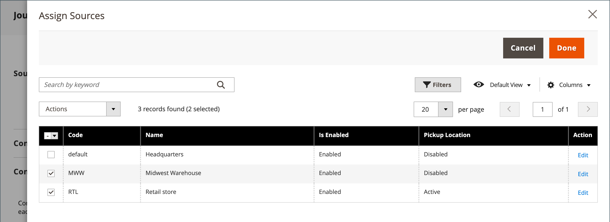
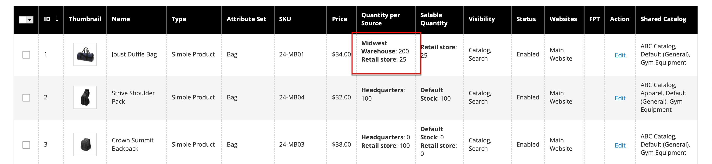

# 在庫 – ソースと数量の割り当て

[[!DNL Inventory Management]](../inventory-management/introduction.md)を使用しているマルチソースマーチャントの場合は、**ソース** セクションまでスクロールして、ソースと数量を割り当てます。

1. ソースを追加するには、**[!UICONTROL Assign Sources]**&#x200B;をクリックします。

1. ソースを参照または検索し、製品に追加するソースの横にあるチェックボックスを選択します。

   {width="600" zoomable="yes"}

1. **[!UICONTROL Done]**&#x200B;をクリックしてソースを追加します。

1. ソースの数量とステータスを管理するには、**[!UICONTROL Advanced Inventory]**&#x200B;をクリックし、**[!UICONTROL Manage Stock]**&#x200B;を`Yes`に設定します。

1. **[!UICONTROL Source Item Status]**&#x200B;を`In Stock`に設定します。

1. 手持在庫の&#x200B;**[!UICONTROL Qty]**&#x200B;の金額を入力して更新します。

1. 在庫量の通知を設定するには、次のいずれかの操作を行います。

   - _カスタム通知数量_ - **[!UICONTROL Notify Quantity Use Default]** チェックボックスをオフにして、**[!UICONTROL Notify Quantity]**&#x200B;に金額を入力します。

   - _既定の通知量_ - 「**[!UICONTROL Notify Quantity Use Default]**」チェックボックスを選択します。 Commerceは、[!UICONTROL Advanced Inventory]またはグローバルストア設定の設定を確認して使用します。

   {width="600" zoomable="yes"}
