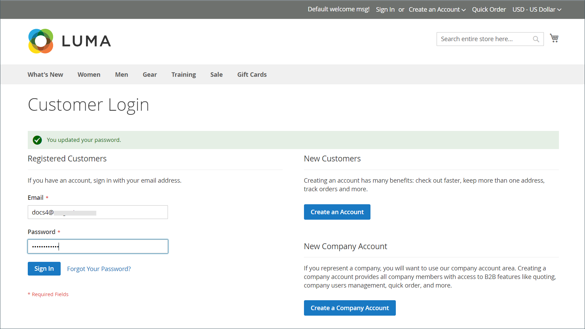
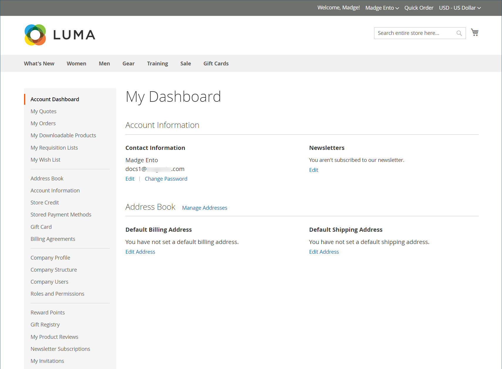

# 企業アカウント

B2B企業アカウントをストアに組み込む場合、組織でのユーザーの役割に基づいて、柔軟な権限を持つ複数のサブアカウントを作成できるため、企業のショッピング体験を簡素化できます。

企業によっては、実店舗の管理者がニーズに合わせてプロモーションや価格を調整し、買い物客の要求に応じて高度にカスタマイズされたオファーを作成して注文を増やすことができます。

標準[個人](../customers/account-create.md)に会社アカウントの関連付けを追加すると、お客様は会社に定義された特定の購入ワークフローを使用できます。

会社アカウントの利点：

- 無制限の[企業ユーザー](account-company-users.md)と追加アカウントの作成を提供し、企業での購入を簡素化します。

- 異なる[役割と権限](account-company-roles-permissions.md)を持つ&#x200B;_smart_&#x200B;会社アカウント階層のサポートが含まれています。注文を行うことができます。

- 支払い方法として[法人店舗クレジット ](credit-company.md)を提供することで、加盟店が収入を増やす仕組みを提供します。

- 管理者のすべての会社アカウントの[管理](account-company-manage.md)をサポートします。

## 会社アカウントの表示

_会社_ グリッドには、ステータス設定に関係なく、アクティブな会社アカウントと保留中のリクエストがすべて一覧表示されます。 また、[作成](account-company-create.md)および[管理](account-company-manage.md)会社アカウントの作成と管理のためのツールも提供します。 標準グリッドコントロールを使用して、リストをフィルタリングし、列レイアウトを調整します。 列の説明のリストについては、[会社アカウントの管理](account-company-manage.md)の「_列の説明_」セクションを参照してください。

顧客はストアフロントから会社アカウントを作成することも、マーチャントは管理者から会社アカウントを作成することもできます。 デフォルトでは、ストアフロントから会社アカウントを作成する機能が有効になっています。 設定で許可されている場合、ストアへの訪問者は会社アカウントの開設をリクエストできます。 会社アカウントが承認されると、会社の管理者は、様々なレベルの権限を持つ会社構造とユーザーを設定できます。

_管理者_ サイドバーで、**[!UICONTROL Customers]** > **[!UICONTROL Companies]**&#x200B;に移動します。

{width="700" zoomable="yes"}

[!UICONTROL Companies] グリッドには、ステータスに関係なくすべての会社が一覧表示されます。 会社リストは、会社が[会社階層](manage-company-hierarchy.md)に関連付けられているかどうかを示し、会社、会社管理者、その他の情報に関する[詳細情報](/help/b2b/account-company-manage.md#company-options-and-columns)を提供します。 [管理者グリッドコントロール ](../getting-started/admin-grid-controls.md)を使用して、フィルター、列表示オプションなどを設定し、ビューをカスタマイズします。

## 会社の管理者

次の例は、最初の会社管理者アカウントを含む&#x200B;_Customers_ グリッドを示しています。

{width="700" zoomable="yes"}

各会社には、アカウントの電子メールアドレスと管理者の姓で識別される1人の会社管理者がいます。 管理者は、ユーザーとして他の会社に割り当てることができますが、1つの会社の管理者にすることができます。

アカウントの作成後、会社管理者は[teams](account-company-structure.md)の会社構造を定義し、[会社ユーザー](account-company-users.md)を設定し、それぞれに[役割と権限](account-company-roles-permissions.md)を設定します。

### 最初のサインイン前に会社管理者のパスワードを設定

1. 会社の管理者は、店舗からウェルカムメールを見つけます。

   {width="500"}

   >[!NOTE]
   >
   >電子メールの電子メールアドレスのターゲットとコンテンツは、[会社の電子メールオプション ](email-company-configuration.md)設定で指定されたオプションによって決まります。

1. 手順に従い、[!UICONTROL **link**]&#x200B;をクリックしてパスワードを設定します。

1. アカウントの&#x200B;[!UICONTROL **新しいパスワード**]&#x200B;とパスワード確認を入力します。

   パスワードには、次の3つ以上の文字タイプを含める必要があります。

   - 小文字（abc...）
   - 大文字（ABC...）
   - 数値（1234567890）
   - 特殊文字（!@#$...）

1. [!UICONTROL **新しいパスワードを設定**]&#x200B;をクリックします。

   {width="700" zoomable="yes"}

1. [!UICONTROL Customer Login] ページが表示されると、お客様は&#x200B;[!UICONTROL **電子メール**]&#x200B;と&#x200B;[!UICONTROL **パスワード**]&#x200B;を入力します。

1. 「[!UICONTROL **ログイン**]」をクリックして、アカウントダッシュボードにアクセスします。

   {width="700" zoomable="yes"}

## 企業構造

企業アカウントは、ビジネスの構造を反映するように設定できます。 当初、企業構造には企業管理者のみが含まれますが、ユーザーのチームを含めるように拡張できます。 ユーザーは、チームに関連付けることも、企業内の部門や部門の階層内で整理することもできます。 この構造は、会社アカウントに関連付けられた[発注](purchase-order-flow.md) （PO）に対する[承認ルール ](account-dashboard-approval-rules.md)の使用をサポートするように設計されています。

{width="450"}

会社管理者のアカウントダッシュボードでは、会社構造はツリーとして表され、最初は会社管理者のみで構成されます。

{width="600"}

アカウントが作成されると、会社の管理者は会社の電子メールアドレスを使用するか、別の電子メールアドレスを割り当てることができます。

次の例では、最初の会社構造には、会社管理者と会社管理者の名前に個人用ユーザーアカウントが含まれています。 ただし、会社の管理者機能（会社構造や承認ルールなど）は、会社の管理者として指定されたユーザーアカウントにログインしている場合にのみ使用できます。

{width="600"}
