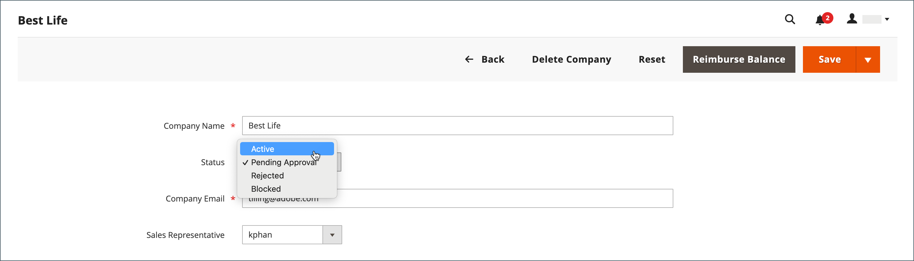

# 会社アカウントを承認

会社を作成するためにストアフロントから受け取ったリクエストのステータスは、ストア管理者がリクエストを確認し、承認または拒否するまで `Pending Approval` 定されます。 会社アカウントのステータスは、次のいずれかに設定される場合があります。

- [!UICONTROL Active]
- [!UICONTROL Pending Approval]
- [!UICONTROL Rejected]
- [!UICONTROL Blocked]

[&#x200B; アクションコントロール &#x200B;](account-company-manage.md) を使用して、複数の会社リクエストを承認することもできます。

{width="700" zoomable="yes"}

## 保留中の会社アカウントを承認

1. _管理者_ サイドバーで、**[!UICONTROL Customers]**/**[!UICONTROL Companies]** に移動します。

   グリッドの上にある _[!UICONTROL Columns]_&#x200B;セレクターを使用して、**[!UICONTROL Status]**&#x200B;の列を表示できます。

1. 「_[!UICONTROL Action]_」列で「**[!UICONTROL Edit]**」をクリックします。

1. **[!UICONTROL Company Status]** を `Active` に設定します。

   {width="700" zoomable="yes"}

1. 確認を求めるメッセージが表示されたら、「**[!UICONTROL Change status]**」をクリックします。

   会社の管理者に、会社がアクティブになったというメール通知が届きます。

1. 該当する場合、**[!UICONTROL Sales Representative]** を特定の管理者ユーザーアカウントに設定します。

1. 「**[!UICONTROL Account Information]**」セクションを展開し、「**[!UICONTROL Comment]**」フィールドを使用して、アカウントに関するメモを入力します。

   コメントはストアフロントからは表示されません。

1. 完了したら、「**[!UICONTROL Save]**」をクリックします。

   会社アカウントが承認されたことを示す確認メールが会社と会社の管理者に送信されます。

## 会社ステータス

| ステータス | 説明 |
|------------------|--------------------------------------------------------------------------------------------------------------------------------------------|
| [!UICONTROL Active] | 会社は承認され、会社管理者がストアフロントから管理できます。 |
| [!UICONTROL Pending Approval] | 会社アカウントを作成するリクエストがストアフロントから送信されましたが、まだレビューされていません。 |
| [!UICONTROL Rejected] | 会社アカウントを作成するリクエストは、ストア管理者によって拒否されました。 |
| [!UICONTROL Blocked] | 会社の帳簿は調わなくなった。 顧客はストアフロントからアカウントにアクセスできますが、購入することはできません。 |

{style="table-layout:auto"}
