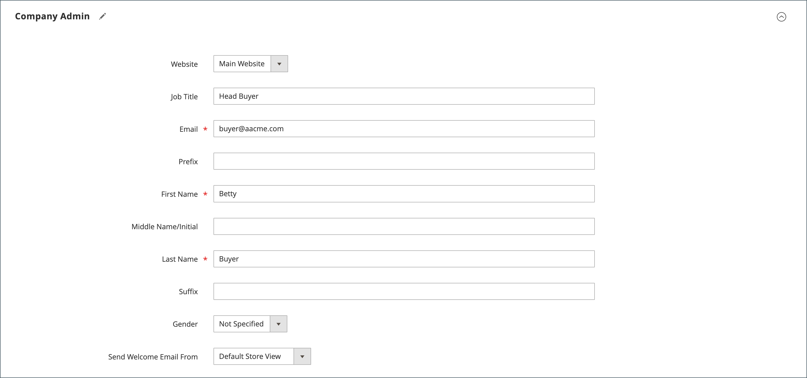

# 会社アカウントの作成

会社アカウントを使用すると、B2B 企業はAdobe Commerce内で購入、ユーザー、クレジットを管理できます。 このトピックでは、会社アカウントを作成、設定およびアクティブ化する完全なプロセスについて説明します。

## 会社アカウント作成の概要

会社アカウントは、それぞれ異なるビジネスシナリオに適した、次の 2 つの方法で作成できます。

* **ストアフロント登録** - ビジネス別のセルフサービスアカウントのリクエスト
* **Admin Creation**：事前に構成された詳細を使用したセールス支援アカウントの設定

すべての会社アカウントは、アクティブになる前に管理者の承認が必要で、適切な検証と設定が行われます。

## 前提条件

会社アカウントを作成する前に、次の要件が満たされていることを確認します。

* **必要システム構成：**
   * Adobe Commerceのインストールで [B2B 機能が有効になっている &#x200B;](enable-basic-features.md)
   * ストアフロントの作成に対して会社登録が有効になっています
   * 承認ワークフロー用にメール通知が設定されます

* **ビジネス要件：**
   * 承認プロセスとポリシーが確立されます
   * 営業担当者が割り当てられている（管理者が作成したアカウントの場合）
   * 信用ポリシーが定義されている（会社の信用を使用する場合）
   * 顧客グループと共有カタログが設定されます

* **管理アクセス：**
   * 会社管理のための適切な権限
   * 顧客および会社の管理セクションへのアクセス

システムは、ストアフロントから会社アカウントを設定したユーザーに [&#x200B; 会社管理者 &#x200B;](account-company-admin.md) の役割を割り当てます。 ストア管理者が管理者で会社アカウントの作成リクエストを承認すると、会社の管理者はアカウントのパスワードを設定し、アカウントにログインできます。

## 方法 1：顧客がストアフロントからアカウントを作成する

**このメソッドを使用するタイミング：**

* セルフサービスのビジネス登録をお勧めします
* お客様は、必要なビジネス情報をすべて容易に入手できます
* 標準の承認ワークフローで十分です
* 特別な設定や事前母集団は必要ありません

>[!IMPORTANT]
>
>この方法をサポートするには（顧客がストアフロントから会社を登録できるようにします）、[B2B 機能 &#x200B;](enable-basic-features.md) が有効になっていることを確認します。

1. ストアフロントヘッダーの右上隅で、顧客が「**[!UICONTROL Create an Account]**」をクリックして **[!UICONTROL Create New Company Account]** を選択します。

   {width="700" zoomable="yes"}

   >[!NOTE]
   >
   >訪問者が登録済みユーザーアカウントにログインしている場合は、_[!UICONTROL Customer Profile]_/**[!UICONTROL Company Structure]**/**[!UICONTROL Create a Company Account]**&#x200B;に移動して、会社アカウントを作成できます。

1. _[!UICONTROL Company Information]_&#x200B;のセクションでは、顧客は次の操作を行います。

   * 必須フィールドに入力します。

      * **[!UICONTROL Company Name]**
      * **[!UICONTROL Company Email]**

   * 必要に応じて、残りのフィールドに入力します。

      * **[!UICONTROL Company Legal Name]**
      * **[!UICONTROL VAT/TAX ID]**
      * **[!UICONTROL Reseller ID]**

   {width="700" zoomable="yes"}

1. _[!UICONTROL Legal Address]_&#x200B;セクションの必須フィールドに入力します。

   * **[!UICONTROL Street Address]**
   * **[!UICONTROL City]**
   * **[!UICONTROL Country]**
   * **[!UICONTROL State/Province]**
   * **[!UICONTROL ZIP/Postal Code]**
   * **[!UICONTROL Phone Number]**

   {width="700" zoomable="yes"}

1. _[!UICONTROL Company Administrator]_&#x200B;セクションでは、は次の操作を実行します。

   * 会社管理者の **[!UICONTROL Email address]** を入力します。

     会社管理者のメールアドレスは、会社のメールアドレスと同じでも、別のメールアドレスでもかまいません。 別のメールアドレスを入力すると、会社管理者アカウントに加えて、会社のユーザーアカウントが作成されます。

   * 会社管理者の **[!UICONTROL First Name]** と **[!UICONTROL Last Name]** を入力します。

   * 必要に応じて、次のフィールドに入力します。

      * **[!UICONTROL Job Title]**
      * **[!UICONTROL Work Phone Number]**
      * **[!UICONTROL Gender]**

   

1. このストアフロント関数で reCAPTCHA が有効になっている場合、検証を完了します。

1. 情報が完成したら、「**[!UICONTROL Submit]**」を選択します。

   マーチャントが会社アカウントの作成要求を承認すると、システムから会社管理者にメール通知が送信されます。

   {width="500"}

   パスワードを設定すると、会社の管理者はアカウントに [&#x200B; ログイン &#x200B;](../customers/customer-sign-in.md) できます。

## 方法 2：マーチャントが管理者からアカウントを作成します

**このメソッドを使用するタイミング：**

* セールス支援アカウントの作成をお勧めします
* 既存のビジネス関係からのアカウント詳細の事前入力
* カスタム設定が必要です（与信限度額、特別価格）
* 承認ワークフローなしですぐにアクティベートする必要がある

管理者から会社を作成するプロセスは、基本的にストアフロントからのプロセスと同じですが、フィールドが追加されます。

{width="700" zoomable="yes"}

1. _管理者_ サイドバーで、**[!UICONTROL Customers]**/**[!UICONTROL Companies]** に移動します。

1. 「**[!UICONTROL Add New Company]**」をクリックして、次の操作を実行します。

   * 次の必須フィールドに入力します。

      * **[!UICONTROL Company Name]**
      * **[!UICONTROL Company Email]**

   * アカウントを運用する準備が整っていない場合は、**[!UICONTROL Status]** を `Pending Approval` に設定します。 （デフォルトで `Active` に設定されています）。

   * 該当する場合は、アカウントを管理する **[!UICONTROL Sales Representative]** の管理者アカウントを選択します。

1. _[!UICONTROL Account Information]_&#x200B;セクションで、次の操作を行います。

   * 必要に応じて、次のフィールドに入力します。

      * **[!UICONTROL Company Legal Name]**
      * **[!UICONTROL VAT/TAX ID]**
      * **[!UICONTROL Reseller ID]**

   * **[!UICONTROL Comment]**：必要になる可能性のある顧客に関する追加情報を入力します。

     コメントは、管理者からのみ表示されます。

   {width="700" zoomable="yes"}

1. 最初に会社を作成すると、会社を展開したときに _[!UICONTROL Company Hierarchy]_&#x200B;のグリッドは空で表示されます。 会社を保存したら、その会社を会社階層に含めることができます。 [&#x200B; 会社管理 &#x200B;](manage-companies.md) を参照してください。

1. 「_[!UICONTROL Legal Address]_」セクションで、次の必須フィールドに入力します。

   * **[!UICONTROL Street Address]**
   * **[!UICONTROL City]**
   * **[!UICONTROL Country]**
   * **[!UICONTROL ZIP/Postal Code]**
   * **[!UICONTROL Phone Number]**

1. _[!UICONTROL Company Admin]_&#x200B;セクションで、次の操作を行います。

   * 次の必須フィールドに入力します。

      * **[!UICONTROL Email]**
      * **[!UICONTROL First Name]**
      * **[!UICONTROL Last Name]**

   * 一部のお客様の名前に他よりも多く適用される可能性があり、お客様の裁量で使用できる次のオプションの部分に名前を入力します。

      * **[!UICONTROL Prefix]**
      * **[!UICONTROL Middle Name/Initial]**
      * **[!UICONTROL Suffix]**

   * 情報が使用可能な場合は、残りのフィールドに入力して、会社管理者について説明します。

      * **[!UICONTROL Website]**
      * **[!UICONTROL Job Title]**
      * **[!UICONTROL Work Phone Number]**
      * **[!UICONTROL Gender]**
      * **[!UICONTROL Send Welcome Email From]**

   {width="700" zoomable="yes"}

1. 顧客の与信アクティビティの要約を表示する「_[!UICONTROL Company Credit]_」セクションでは、セクション下部の多数のフィールドに適宜入力します。

   * **[!UICONTROL Credit Currency]**
   * **[!UICONTROL Credit Limit]**
   * **[!UICONTROL Allow to Exceed Credit Limit]**
   * **[!UICONTROL Reason for Change]**

   {width="700" zoomable="yes"}

1. _[!UICONTROL Advanced Settings]_&#x200B;セクションで、次の操作を行います。

   >[!NOTE]
   >
   >顧客グループ割り当てによって、会社とその従業員が使用できる共有カタログが決まります。 デフォルトでは、会社は、デフォルトとして設定された顧客グループに割り当てられます。

   * 会社とその従業員の **[!UICONTROL Customer Group]** 割り当てを、別の共有カタログまたは標準の顧客グループへのアクセス権を持つグループに変更できます。 グループを変更する前に確認を求められます。

     {width="600"}

   * 会社の従業員が自分のアカウントから見積もりを生成できるようにする場合は、**[!UICONTROL Allow Quotes]** を `Yes` に設定します。

   * 会社の従業員が自分のアカウントから発注書を作成して使用できるようにする場合は、**[!UICONTROL Enable Purchase Orders]** を `Yes` に設定します。

   * 会社で使用可能な **[!UICONTROL Applicable Payment Methods]** を変更するには、「**[!UICONTROL Use config settings]**」チェックボックスをオフにして、次のいずれかを選択します。

     | オプション | 説明 |
     |-------------------------------|-----------------------------------------------------------------------------------------------------------------------------------------------------------------------------------------------------------------------------------------|
     | `B2B Payment Methods` | （デフォルト） B2B 注文に対して、すべての [&#x200B; デフォルトとして設定された支払方法 &#x200B;](../configuration-reference/general/b2b-features.md#default-b2b-payment-methods) を有効にします。 |
     | `All Enabled Payment Methods` | 会社コードに関連付けられている顧客コードに対して、すべての [&#x200B; 有効な支払い方法 &#x200B;](../configuration-reference/sales/payment-methods.md) を使用できるようにします。 |
     | `Selected Payment Methods` | 会社アカウントに関連付けられた顧客アカウントに使用できる支払い方法を選択できます。 複数の支払い方法を選択するには、Ctrl キー（PC）または Command キー（Mac）を押しながら、各オプションを選択します。 |

     {style="table-layout:auto"}

   * 会社で使用可能な **[!UICONTROL Applicable Shipping Methods]** を変更するには、「**[!UICONTROL Use config settings]**」チェックボックスをオフにして、次のいずれかを選択します。

     | オプション | 説明 |
     |--------------------------------|----------------------------------------------------------------------------------------------------------------------------------------------------------------------------------------------------------------------------------------------------|
     | `B2B Shipping Methods` | （デフォルト） B2B 注文に対して、すべての [&#x200B; デフォルトとして設定された発送方法 &#x200B;](../configuration-reference/general/b2b-features.md#default-b2b-shipping-methods) を有効にします。 |
     | `All Enabled Shipping Methods` | 会社アカウントに関連付けられた顧客アカウントで [&#x200B; 有効な配送方法」をすべて使用できるようにします &#x200B;](../configuration-reference/sales/delivery-methods.md) |
     | `Selected Shipping Methods` | 会社アカウントに関連付けられている顧客アカウントで使用できる発送方法を選択できます。 複数の配送方法を選択するには、Ctrl キー（PC）または Command キー（Mac）を押しながら、各オプションを選択します。 |

     {style="table-layout:auto"}

1. 完了したら、「**[!UICONTROL Save]**」を選択します。

   会社のアカウントを作成するリクエストがマーチャントによって承認されると、メール通知が会社の管理者のメールアドレスに送信されます。

   パスワードを設定すると、会社の管理者はアカウントに [&#x200B; ログイン &#x200B;](../customers/customer-sign-in.md) できます。

## アカウント作成後

会社アカウントを作成すると、次のプロセスが発生します。

### 1.承認ワークフロー

* **ステータスを保留中** – 新しいアカウントは管理者によるレビューを待機します
* **レビュー・プロセス**：ストア管理者がビジネス情報を確認し、リクエストを承認/却下
* **ステータスの更新** – 会社は、承認ステータスの変更に関するメール通知を受信します

### &#x200B;2. アカウントの有効化

* **ようこそメール** – 承認済みの会社管理者に設定手順が送信されます
* **パスワード設定** – 管理者は、アカウント・アクセス用の安全なパスワードを作成します
* **最初のログイン** – 会社のダッシュボードおよび機能への初回アクセス

### 3.会社管理者の次のステップ

アクティブ化後、会社管理者は次の操作を行う必要があります。

* **[会社構造の設定](account-company-structure.md)** – 部門とユーザー階層を設定します
* **[会社ユーザーの管理](account-company-users.md)** – 従業員の追加と役割の割り当て
* **[発注書の設定](purchase-order-flow.md)** – 必要に応じて承認ワークフローを設定します
* **[与信設定の確認](credit-company.md)** – 会社の与信を理解し管理します（有効な場合）。

## よくある問題とトラブルシューティング

### アカウント作成の問題

**登録フォームの送信失敗**

* すべての必須フィールドが正しく入力されていることを確認します。
* メールアドレスが有効で一意であることを確認します
* B2B 機能が有効になっていて、会社登録が許可されていることを確認します
* ブラウザーキャッシュをクリアして、もう一度試してください

**会社名は既に存在します**

* 一意の会社名を選択してください
* これがエラーであると思われる場合は、管理者にお問い合わせください
* 場所またはビジネスユニットの識別子の追加を検討

**メールアドレスに関する問題**

* 個人のメールアドレスではなく、ビジネス用のメールアドレスを使用する
* 会社管理者のメールにアクセスできることを確認します
* ドメインがメールフィルターでブロックされていないことを確認します

### 承認と有効化の問題

**承認メールを受信していません**

* スパム/迷惑メールフォルダーの確認
* 登録時にメールアドレスが正しく入力されたことを確認します
* 店舗の管理者に問い合わせて、手動で承認の状態を確認してください
* 営業日の間は 24 ～ 48 時間処理を許可

**承認後にパスワードを設定できない**

* 承認メールに記載されている正確なリンクを使用します
* アクティベーションリンクの有効期限が切れているかどうかを確認します
* 新しいアクティベーションメールを管理者にリクエストする

**アクティベーション後のアクセスの問題**

* 正しい会社アカウント ポータルからログインしていることを確認してください
* アカウントステータスが「アクティブ」であることを確認
* 会社管理者の資格情報を使用していることを確認します
* 権限が正しくない場合は、サポートにお問い合わせください

## セキュリティのベストプラクティス

会社アカウントを作成および管理する場合：

* **強力なパスワードの使用** – 会社の管理者に複雑なパスワードを要求する
* **ビジネス情報の検証** – 承認プロセス中に会社の詳細を検証します
* **アカウントアクティビティの監視** – 会社のユーザーアクセスおよび権限を定期的に確認します
* **機密データの保護**：クレジットおよび財務情報を適切に保護

## 会社アカウントのユーザーインターフェイスのリファレンス

### ボタンバー

| ボタン | 説明 |
|---------------------------|------------------------------------------------------------------|
| [!UICONTROL Back] | 変更を保存せずに会社ページに戻ります。 |
| [!UICONTROL Reset] | 変更が保存されていないすべてのフィールドに元の値を復元します。 |
| [!UICONTROL Save] | 会社への変更を保存し、プロファイルを開いたままにします。 |
| [!UICONTROL Save & Close] | 会社への変更を保存し、プロファイルを閉じます。 |

{style="table-layout:auto"}

### フィールドの説明

| フィールド | 説明 |
|-----------------------------------|---------------------------------------------------------------------------------------------------------------------------------------------------------------------------------------------------------------------------------------------------------------------------------------------------------------------------------------------------------------------------------------------------------------------------------------------------------------------------------------------------------------------------------------------------------------------------------------------------------------------------------------------------------------------------------------------------------------------------------------------------------------------------------------------------------------------------------------------------------------------------------------------------------------------------------|
| [!UICONTROL Company Name] | 会社名は、会社アカウントが最初に作成されたときに入力され、完全な法的名の短縮バージョンにすることができます。 |
| [!UICONTROL Status] | （管理者のみ）会社アカウントの現在の状態を示します。 オプション： **[!UICONTROL Active]**– 会社アカウントはストア管理者によって承認されています。 会社の管理者と関連するメンバーは、ストアフロントからアカウントにログインして購入することができます。 **[!UICONTROL Pending Approval]** – 会社アカウントを開くリクエストが送信されましたが、ストア管理者によってはまだ承認されていません。  **[!UICONTROL Rejected]**– 会社のアカウントを開く要求が送信されましたが、ストア管理者によって承認されませんでした。 リクエストの送信に使用された初期ログイン資格情報はブロックされます。 **&#x200B; ブロック &#x200B;**– 会社のメンバーはログインしてカタログにアクセスできますが、購入することはできません。 ストア管理者が、状態の良くない会社アカウントをブロックしている可能性があります。 アカウントのブロックは、ストア管理者がいつでも削除できます。 |
| [!UICONTROL Company Email] | 会社アカウントに関連付けられているメールアドレス。 |
| [!UICONTROL Sales Representative] | （管理者のみ）会社アカウントの主要連絡先である管理者ユーザー。 |

{style="table-layout:auto"}

#### [!UICONTROL Account Information]

| フィールド | 説明 |
|---------------------------------|-----------------------------------------------------------------------------------------------------------------------------------------------------------------------------------------------------------------------------------------------------------------------------------------------------------------------------------------------------------------------------------------------------------------------------------------------------------------|
| [!UICONTROL Company Legal Name] | 会社の正式名称。 |
| [!UICONTROL VAT / TAX ID] | 税金レポートの目的で、一部の管轄区域によって会社に割り当てられた [&#x200B; 付加価値税 &#x200B;](../stores-purchase/vat.md) 番号。 ストアフロントに表示される顧客の VAT/TAX ID を設定するには、[&#x200B; 新しいアカウントオプションの作成 &#x200B;](../configuration-reference/customers/customer-configuration.md) を参照してください。  **_注意:_** 会社管理者とその他の会社ユーザーは、顧客アカウントに個別の VAT/TAX ID 番号を持っていません。 |
| [!UICONTROL Reseller ID] | 税金レポート目的で会社に割り当てられる転売番号。 |
| [!UICONTROL Comment] | （管理者のみ）会社アカウントに関するこれらのメモは参照用で、管理者にのみ表示されます。 |

{style="table-layout:auto"}

#### [!UICONTROL Company Hierarchy]

| フィールド | 説明 |
|-----------------------------------|------------------------------------------------------------------------------------------------------------------------------------------------------|
| [!UICONTROL Company ID] | 会社の ID 番号。 |
| [!UICONTROL Company Name] | 会社の正式名称。   編集中の会社行に `current company indicator` が表示されます。 |
| [!UICONTROL Company Email] | 会社アカウントに関連付けられているメールアドレス。 |
| [!UICONTROL Phone Number] | 会社の主要電話番号。 |
| [!UICONTROL Country] | 会社がビジネスを行うための登録が行われている国。 |
| [!UICONTROL State/Province] | 会社が事業を行うために登録されている州または都道府県。 |
| [!UICONTROL City] | 会社が営業を行うための登録が行われている市区町村。 |
| [!UICONTROL Group/Shared Catalog] | （管理者のみ）会社に割り当てられている [&#x200B; 顧客グループ &#x200B;](../customers/customer-groups.md) または [&#x200B; 共有カタログ &#x200B;](catalog-shared.md) を表示します。 |
| [!UICONTROL Company Admin] | 会社の管理者の氏名。 |
| [!UICONTROL Action] | その会社ラインで可能なアクションのリスト。 |

{style="table-layout:auto"}

#### [!UICONTROL Legal Address]

| フィールド | 説明 |
|------------------------------|-----------------------------------------------------------------------------|
| [!UICONTROL Street Address] | 会社が事業を行うために登録されている住所。 |
| [!UICONTROL City] | 会社が営業を行うための登録が行われている市区町村。 |
| [!UICONTROL Country] | 会社がビジネスを行うための登録が行われている国。 |
| [!UICONTROL State/Province] | 会社が事業を行うために登録されている州または都道府県。 |
| [!UICONTROL ZIP/Postal Code] | 会社が営業を登録する郵便番号。 |
| [!UICONTROL Phone Number] | 会社の主要電話番号。 |

{style="table-layout:auto"}

#### [!UICONTROL Company Admin]

| フィールド | 説明 |
|--------------------------------------|---------------------------------------------------------------------------------------------------------------------------------------------------------------------------------------------------------------------------------------------------|
| [!UICONTROL Website] | 会社管理者が属する web サイトを決定します。 |
| [!UICONTROL Job Title] | 会社アカウントを管理する会社管理者の役職。 |
| [!UICONTROL Work Phone Number] | 会社アカウントを管理する会社管理者の電話番号。 |
| [!UICONTROL Email] | 会社の管理者のメールアドレスは、会社のメールアドレスと同じにすることができます。 別のメールアドレスを入力すると、会社のアカウントに加えて、会社管理者の個別のアカウントが作成されます。 |
| [!UICONTROL Prefix] | 該当する場合、会社の管理者の名前に関連付けられたプレフィックス （`Mr.`、`Ms.`、`Mrs.`、`Dr.` など）。 設定に応じて、入力フィールドはテキストフィールドまたはリストになります。 |
| [!UICONTROL First Name] | 会社の管理者の名。 |
| [!UICONTROL Middle Name/Initial] | 会社の管理者のミドルネームまたはイニシャル。 |
| [!UICONTROL Last Name] | 会社の管理者の姓。 |
| [!UICONTROL Suffix] | 該当する場合、会社の管理者の名前に関連付けられたサフィックス （`Jr.`、`Sr.`、`III.` など）。 設定に応じて、入力フィールドはテキストフィールドまたはリストになります。 |
| [!UICONTROL Gender] | 会社の管理者の性別。 オプション：`Male`/`Female`/`Not Specified` |
| [!UICONTROL Send Welcome Email From] | システムが「ようこそ」のメールを送信するストア表示。 |

{style="table-layout:auto"}

#### [!UICONTROL Company Credit]

| フィールド | 説明 |
|-------------------------------------------|-----------------------------------------------------------------------------------------------------------------------------------------------------------------------------------------|
| [!UICONTROL Credit Currency] | （管理者のみ）企業クレジットでの購入に対してストアが受け入れる通貨。 |
| [!UICONTROL Credit Limit] | （管理者のみ）会社アカウントに拡張されるクレジット制限。 |
| [!UICONTROL Allow to Exceed Credit Limit] | （管理者のみ）会社がクレジット制限を超える権限を持っているかどうかを示します。 オプション：`Yes` / `No` |
| [!UICONTROL Reason for Change] | （管理者のみ）会社がクレジット制限を超えることを許可または禁止する理由を説明するメモ。 このフィールドは、与信限度額を超える権限が変更された場合にのみ有効になります。 |

{style="table-layout:auto"}

#### [!UICONTROL Advanced Settings]

個々の会社に対して詳細設定を設定できます。 会社階層を作成した場合は、各子会社を個別に設定する代わりに、親会社の設定を構成し、それらの設定をすべての子会社または選択した子会社に適用することで、設定設定を効率化できます。 詳しくは、[&#x200B; 会社階層の管理 &#x200B;](manage-company-hierarchy.md) を参照してください。

| フィールド | 説明 |
|------------------------------------------|--------------------------------------------------------------------------------------------------------------------------------------------------------------------------------------------------------------------------|
| [!UICONTROL Customer Group] | （管理者のみ）会社に割り当てられている [&#x200B; 顧客グループ &#x200B;](../customers/customer-groups.md) または [&#x200B; 共有カタログ &#x200B;](catalog-shared.md) を表示します。 |
| [!UICONTROL Allow Quotes] | （管理者のみ）会社のメンバーが、会社の代わりに交渉可能な見積もりを準備して送信できるかどうかを決定します。 |
| [!UICONTROL Enable Purchase Orders] | （管理者のみ）会社のメンバーが、会社の代わりに [&#x200B; 発注書 &#x200B;](account-dashboard-my-purchase-orders.md) として注文を送信できるかどうかを決定します。 |
| 適用可能な支払い方法 | （管理者のみ）会社の購入に使用できる支払い方法を示します。 オプション：`B2B Payment Methods`/`All Enabled Payment Methods`/`Selected Payment Methods` |
| [!UICONTROL Payment Methods] | （管理者のみ）特定の支払い方法をアクティブ化すると、アクティブになります。 会社のアカウントで複数の支払い方法を使用できるようにするには、Ctrl キー（PC）または Command キー（Mac）を押しながら、各オプションを選択します。 |
| [!UICONTROL Applicable Shipping Methods] | （管理者のみ）会社の購入に使用できる発送方法を示します。 オプション：`B2B Shipping Methods`/`All Enabled Shipping Methods`/`Selected Shipping Methods` |
| [!UICONTROL Shipping Methods] | （管理者のみ）特定の発送方法をアクティブ化すると、アクティブになります。 会社アカウントで複数の配送方法を使用できるようにするには、Ctrl キー（PC）または Command キー（Mac）を押しながら、各オプションを選択します。 |

{style="table-layout:auto"}

>[!MORELIKETHIS]
>
>* [B2B 機能の有効化 &#x200B;](enable-basic-features.md) – 基本的な B2B 機能の設定
>* [&#x200B; 会社アカウント構造 &#x200B;](account-company-structure.md) - ストアフロントからユーザーおよび部門を整理します。
>* [&#x200B; 会社ユーザーの管理 &#x200B;](account-company-users.md) - ストアフロントから従業員アカウントを追加および設定します
>* [&#x200B; 会社管理者の役割 &#x200B;](account-company-admin.md) – 管理者の責任について
>* [&#x200B; 会社管理 &#x200B;](manage-companies.md) – 会社管理の概要
>* [&#x200B; 会社クレジット管理 &#x200B;](credit-company.md) – 管理者から会社クレジットを設定および管理します
>* [&#x200B; 発注書ワークフロー &#x200B;](purchase-order-flow.md) – 管理者から承認プロセスを設定します
>* [&#x200B; 会社の役割と権限 &#x200B;](account-company-roles-permissions.md) – 管理者からユーザーアクセスレベルを制御します
>* [B2B 設定リファレンス &#x200B;](../configuration-reference/general/b2b-features.md) - システム設定の詳細
