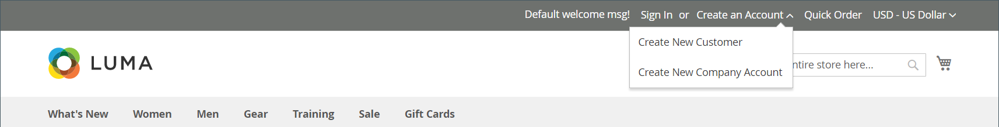
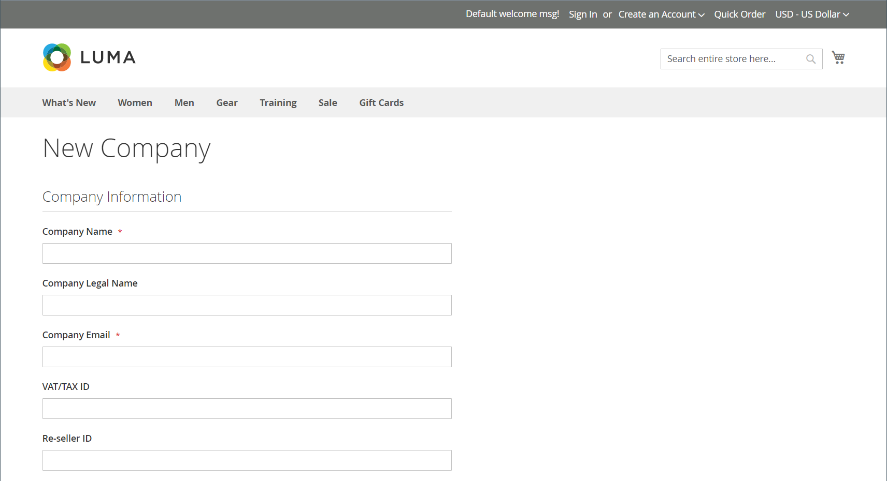
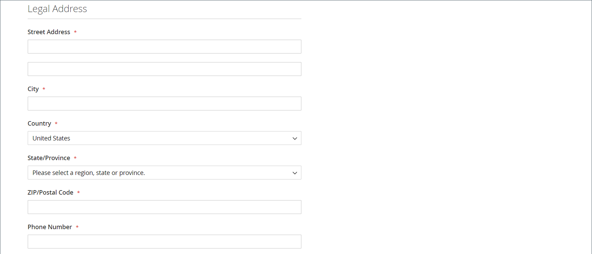
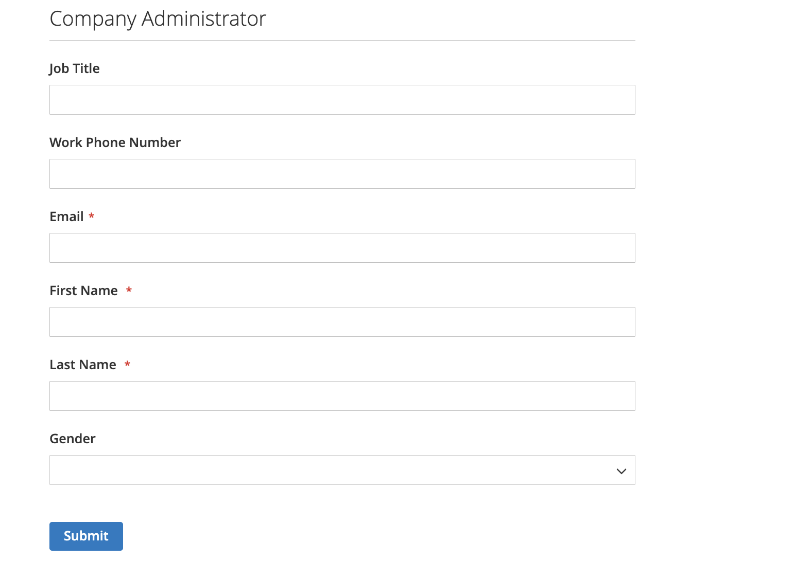
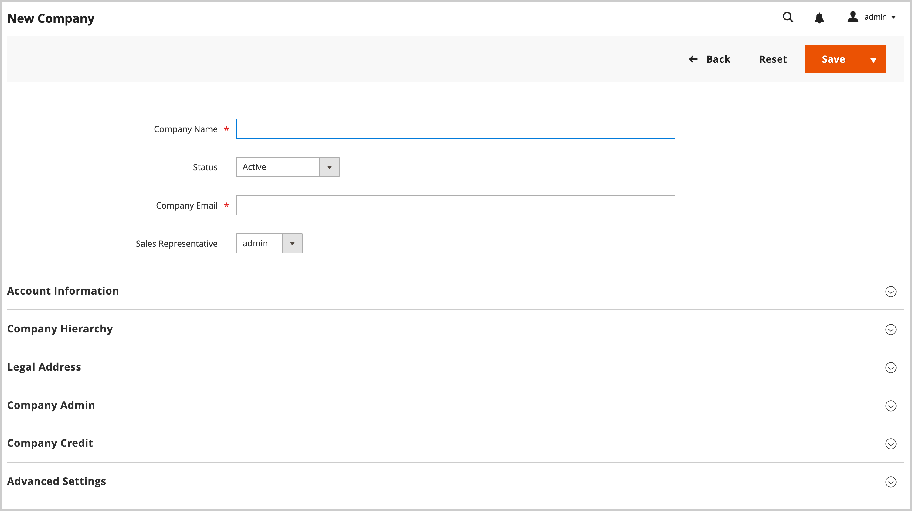
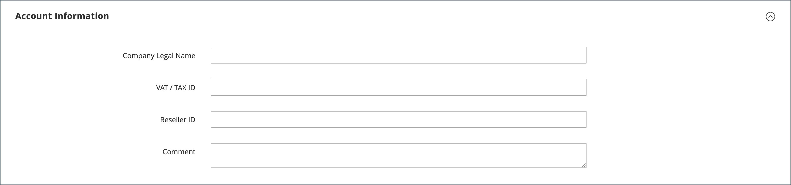

# 会社アカウントの作成

企業アカウントにより、B2B企業はAdobe Commerceで購買、ユーザー、クレジットを管理できます。 このトピックでは、企業アカウントの作成、設定、およびアクティブ化のプロセス全体について説明します。

## 企業アカウント作成の概要

企業アカウントは、それぞれ異なるビジネスシナリオに適した2つの方法で作成できます。

* **Storefront Registration** – 企業によるセルフサービスのアカウントリクエスト
* **管理者作成** – 事前設定済みの詳細を使用した営業支援アカウントの設定

すべての会社アカウントは、アクティブになる前に管理者の承認を必要とし、適切な検証と設定を確実に行います。

## 前提条件

会社アカウントを作成する前に、次の要件が満たされていることを確認します。

* **必要システム構成：**
   * [B2B機能がAdobe Commerce インストールで有効になっています](enable-basic-features.md)
   * ストアフロント作成で会社登録が有効になっている
   * メール通知は承認ワークフロー用に設定されています

* **ビジネス要件：**
   * 承認プロセスとポリシーが確立されます
   * 営業担当者が割り当てられます（管理者作成アカウントの場合）
   * クレジットポリシーが定義されています（会社のクレジットを使用している場合）
   * 顧客グループと共有カタログは

* **管理アクセス：**
   * 企業管理のための適切な権限
   * 顧客および企業の管理機能へのアクセス

システムは、ストアフロントから会社アカウントを設定するユーザーに[会社管理者](account-company-admin.md)の役割を割り当てます。 ストア管理者がAdminで会社アカウント作成リクエストを承認すると、会社の管理者はアカウントのパスワードを設定してアカウントにログインできます。

## 方法1：お客様がストアフロントからアカウントを作成する

**このメソッドを使用するタイミング：**

* セルフサービスのビジネス登録をお勧めします
* 顧客は、必要なビジネス情報をすばやく入手できます
* 標準的な承認ワークフローで十分です
* 特別な設定や事前設定は必要ありません

>[!IMPORTANT]
>
>この方法をサポートするには（お客様がストアフロントから会社を登録できるようにする）、[B2B機能](enable-basic-features.md)が有効になっていることを確認します。

1. ストアフロントヘッダーの右上隅で、顧客は&#x200B;**[!UICONTROL Create an Account]**&#x200B;をクリックし、**[!UICONTROL Create New Company Account]**&#x200B;を選択します。

   {width="700" zoomable="yes"}

   >[!NOTE]
   >
   >訪問者が登録済みのユーザーアカウントにログインしている場合は、_[!UICONTROL Customer Profile]_>**[!UICONTROL Company Structure]**>**[!UICONTROL Create a Company Account]**に移動して、会社アカウントを作成できます。

1. _[!UICONTROL Company Information]_セクションでは、お客様は次の操作を行います。

   * 必須フィールドを入力します。

      * **[!UICONTROL Company Name]**
      * **[!UICONTROL Company Email]**

   * 必要に応じて、残りのフィールドを入力します。

      * **[!UICONTROL Company Legal Name]**
      * **[!UICONTROL VAT/TAX ID]**
      * **[!UICONTROL Reseller ID]**

   {width="700" zoomable="yes"}

1. _[!UICONTROL Legal Address]_セクションの必須フィールドを入力します。

   * **[!UICONTROL Street Address]**
   * **[!UICONTROL City]**
   * **[!UICONTROL Country]**
   * **[!UICONTROL State/Province]**
   * **[!UICONTROL ZIP/Postal Code]**
   * **[!UICONTROL Phone Number]**

   {width="700" zoomable="yes"}

1. _[!UICONTROL Company Administrator]_セクションで、次の操作を行います。

   * 会社管理者の&#x200B;**[!UICONTROL Email address]**&#x200B;を入力します。

     会社の管理者の電子メールアドレスは、会社の電子メールアドレスと同じでも、別の電子メールアドレスでもかまいません。 別のメールアドレスを入力すると、システムは会社管理者アカウントに加えて、会社ユーザーアカウントを作成します。

   * 会社管理者の&#x200B;**[!UICONTROL First Name]**&#x200B;と&#x200B;**[!UICONTROL Last Name]**&#x200B;を入力します。

   * オプションで、次のフィールドを入力します。

      * **[!UICONTROL Job Title]**
      * **[!UICONTROL Work Phone Number]**
      * **[!UICONTROL Gender]**

   

1. このストアフロント機能でreCAPTCHAが有効になっている場合、検証を完了します。

1. 情報が完了したら、**[!UICONTROL Submit]**&#x200B;を選択します。

   加盟店が会社アカウントの作成リクエストを承認すると、システムは会社の管理者にメール通知を送信します。

   {width="500"}

   パスワードが設定されると、会社の管理者は[ アカウントに](../customers/customer-sign-in.md) ログインできます。

## 方法2：管理者からアカウントを作成する

**このメソッドを使用するタイミング：**

* セールス支援によるアカウント作成が推奨されます
* 既存のビジネス関係からアカウント詳細を事前入力
* カスタム設定が必要です（クレジット制限、特別価格）
* 承認ワークフローなしで、ただちにアクティベーション

管理者から会社を作成するプロセスは、基本的にストアフロントと同じですが、追加のフィールドがあります。

{width="700" zoomable="yes"}

1. _管理者_ サイドバーで、**[!UICONTROL Customers]** > **[!UICONTROL Companies]**&#x200B;に移動します。

1. **[!UICONTROL Add New Company]**&#x200B;をクリックし、次の操作を行います。

   * 次の必須フィールドに入力します。

      * **[!UICONTROL Company Name]**
      * **[!UICONTROL Company Email]**

   * アカウントを公開する準備ができていない場合は、**[!UICONTROL Status]**&#x200B;を`Pending Approval`に設定します。 （デフォルトでは`Active`に設定します）。

   * 該当する場合は、アカウントを管理する&#x200B;**[!UICONTROL Sales Representative]**&#x200B;の管理者アカウントを選択します。

1. _[!UICONTROL Account Information]_セクションで、次の操作を行います。

   * 該当する場合は、次のフィールドに入力します。

      * **[!UICONTROL Company Legal Name]**
      * **[!UICONTROL VAT/TAX ID]**
      * **[!UICONTROL Reseller ID]**

   * **[!UICONTROL Comment]**&#x200B;に、必要な可能性のあるお客様に関する追加情報を入力します。

     コメントは管理者からのみ表示されます。

   {width="700" zoomable="yes"}

1. 最初に会社を作成すると、展開すると&#x200B;_[!UICONTROL Company Hierarchy]_グリッドが空になります。 会社を保存した後、会社の階層に含めることができます。 [会社管理](manage-companies.md)を参照してください。

1. 「_[!UICONTROL Legal Address]_」セクションで、次の必須フィールドに入力します。

   * **[!UICONTROL Street Address]**
   * **[!UICONTROL City]**
   * **[!UICONTROL Country]**
   * **[!UICONTROL ZIP/Postal Code]**
   * **[!UICONTROL Phone Number]**

1. _[!UICONTROL Company Admin]_セクションで、次の操作を行います。

   * 次の必須フィールドに入力します。

      * **[!UICONTROL Email]**
      * **[!UICONTROL First Name]**
      * **[!UICONTROL Last Name]**

   * 名前の次のオプション部分を完了します。これは、一部のお客様の名前に他の名前よりも適用される場合があり、お客様の裁量で使用できます。

      * **[!UICONTROL Prefix]**
      * **[!UICONTROL Middle Name/Initial]**
      * **[!UICONTROL Suffix]**

   * 情報が使用可能な場合は、残りのフィールドに入力して、会社管理者について説明します。

      * **[!UICONTROL Website]**
      * **[!UICONTROL Job Title]**
      * **[!UICONTROL Work Phone Number]**
      * **[!UICONTROL Gender]**
      * **[!UICONTROL Send Welcome Email From]**

   {width="700" zoomable="yes"}

1. 顧客の信用活動の概要を表示する&#x200B;_[!UICONTROL Company Credit]_セクションでは、セクションの下部にあるフィールドの数だけ入力します。

   * **[!UICONTROL Credit Currency]**
   * **[!UICONTROL Credit Limit]**
   * **[!UICONTROL Allow to Exceed Credit Limit]**
   * **[!UICONTROL Reason for Change]**

   {width="700" zoomable="yes"}

1. _[!UICONTROL Advanced Settings]_セクションで、次の操作を行います。

   >[!NOTE]
   >
   >顧客グループの割り当てによって、会社とその従業員が利用できる共有カタログが決まります。 デフォルトでは、デフォルトとして設定された顧客グループに会社が割り当てられます。

   * 会社とその従業員の&#x200B;**[!UICONTROL Customer Group]**&#x200B;割り当てを、別の共有カタログまたは標準の顧客グループにアクセスできるグループに変更できます。 グループを変更する前に、確認を求めるメッセージが表示されます。

     {width="600"}

   * 会社の従業員がアカウントから見積もりを生成できるようにするには、**[!UICONTROL Allow Quotes]**&#x200B;を`Yes`に設定します。

   * 会社の従業員がアカウントから発注書を作成して使用できるようにするには、**[!UICONTROL Enable Purchase Orders]**&#x200B;を`Yes`に設定します。

   * 会社が利用できる&#x200B;**[!UICONTROL Applicable Payment Methods]**&#x200B;を変更するには、**[!UICONTROL Use config settings]** チェックボックスをオフにして、次のいずれかを選択します。

     | オプション | 説明 |
     |-------------------------------|-----------------------------------------------------------------------------------------------------------------------------------------------------------------------------------------------------------------------------------------|
     | `B2B Payment Methods` | （デフォルト） B2B注文のデフォルト ](../configuration-reference/general/b2b-features.md#default-b2b-payment-methods)として設定されているすべての[支払い方法を有効にします。 |
     | `All Enabled Payment Methods` | 会社アカウントに関連付けられている顧客アカウントに対して、すべての[有効な支払い方法](../configuration-reference/sales/payment-methods.md)を使用できるようにします。 |
     | `Selected Payment Methods` | 会社アカウントに関連付けられている顧客アカウントで使用できる支払い方法を選択できます。 複数の支払い方法を選択するには、Ctrl キー（PC）またはCommand キー（Mac）を押しながら、各オプションを選択します。 |

     {style="table-layout:auto"}

   * 会社が利用できる&#x200B;**[!UICONTROL Applicable Shipping Methods]**&#x200B;を変更するには、**[!UICONTROL Use config settings]** チェックボックスをオフにして、次のいずれかを選択します。

     | オプション | 説明 |
     |--------------------------------|----------------------------------------------------------------------------------------------------------------------------------------------------------------------------------------------------------------------------------------------------|
     | `B2B Shipping Methods` | （デフォルト） B2B注文のデフォルト ](../configuration-reference/general/b2b-features.md#default-b2b-shipping-methods)として設定されているすべての[配送方法を有効にします。 |
     | `All Enabled Shipping Methods` | 会社アカウントに関連付けられている顧客アカウントに対して有効なすべての[配送方法](../configuration-reference/sales/delivery-methods.md)を使用できるようにします。 |
     | `Selected Shipping Methods` | 会社アカウントに関連付けられている顧客アカウントで使用できる配送方法を選択できます。 複数の配送方法を選択するには、Ctrl キー（PC）またはCommand キー（Mac）を押しながら、各オプションを選択します。 |

     {style="table-layout:auto"}

1. 完了したら、**[!UICONTROL Save]**&#x200B;を選択します。

   会社アカウントの作成リクエストが加盟店によって承認されると、会社の管理者のメールアドレスにメール通知が送信されます。

   パスワードが設定されると、会社の管理者は[ アカウントに](../customers/customer-sign-in.md) ログインできます。

## アカウント作成後

会社アカウントを作成すると、次のプロセスが実行されます。

### &#x200B;1. 承認ワークフロー

* **保留中のステータス** – 新しいアカウントは管理者のレビューを待っています
* **レビュープロセス**：ストア管理者がビジネス情報を検証し、リクエストを承認/却下します
* **ステータスの更新** – 承認ステータスの変更に関するメール通知を受け取ります

### 2. Account Activation

* **ようこそメール** – 承認済み会社の管理者がセットアップ手順を受信します
* **パスワード設定** – 管理者はアカウント アクセス用の安全なパスワードを作成します
* **初回ログイン** – 会社ダッシュボードと機能への初回アクセス

### &#x200B;3. 会社管理者のための次のステップ

アクティベーション後、会社の管理者は以下を行う必要があります。

* **[会社構造の設定](account-company-structure.md)** – 部門とユーザー階層の設定
* **[会社ユーザーの管理](account-company-users.md)** – 従業員の追加と役割の割り当て
* **[発注書の設定](purchase-order-flow.md)** – 必要に応じて承認ワークフローを設定します
* **[クレジット設定の確認](credit-company.md)** – 会社クレジットの理解と管理（有効な場合）

## 一般的な問題とトラブルシューティング

### アカウント作成の問題

**登録フォームの送信に失敗しました**

* すべての必須フィールドが正しく入力されていることを確認する
* メールアドレスが有効で一意であることを確認する
* B2B機能が有効になっており、企業登録が許可されていることを確認する
* ブラウザーのキャッシュを消去して、もう一度試してください

**会社名は既に存在します**

* 一意の会社名を選択
* これがエラーだと思われる場合は、管理者に連絡してください
* 場所または事業部門の識別子の追加を検討する

**電子メールアドレスの問題**

* 個人ではなくビジネスメールアドレスを使う
* 会社管理者の電子メールにアクセスできることを確認します
* メールフィルターによってドメインがブロックされていないことを確認してください

### 承認とアクティベーションの問題

**承認メールが受信されませんでした**

* 迷惑メール/迷惑メールフォルダーを確認する
* 登録時にメールアドレスが正しく入力されたことを確認する
* 手動での承認ステータス確認については、ストア管理者にお問い合わせください
* 営業日の処理に24 ～ 48時間を許可

**承認後にパスワードを設定できません**

* 承認メールに記載されているリンクを正確に使用する
* アクティベーションリンクの有効期限が切れているかどうかを確認します
* 管理者から新しいアクティブ化メールをリクエスト

アクティブ化後の&#x200B;**アクセスの問題**

* 正しい会社アカウントポータルからログインしていることを確認します
* アカウントのステータスが「アクティブ」であることを確認します
* 会社の管理者の資格情報を使用していることを確認してください
* 権限が正しくないと思われる場合は、サポートにお問い合わせください

## セキュリティのベストプラクティス

会社アカウントを作成および管理する場合：

* **強力なパスワードを使用** – 会社の管理者に複雑なパスワードを要求する
* **ビジネス情報を確認** – 承認プロセス中に会社の詳細を検証します
* **アカウントアクティビティの監視** – 会社のユーザーアクセスと権限を定期的に確認します
* **機密データの保護** – クレジット情報と財務情報が適切に保護されていることを確認します

## 企業アカウントユーザーインターフェイスリファレンス

### ボタンバー

| ボタン | 説明 |
|---------------------------|------------------------------------------------------------------|
| [!UICONTROL Back] | 変更を保存せずに会社ページに戻ります。 |
| [!UICONTROL Reset] | 保存されていない変更を含むフィールドに、元の値を復元します。 |
| [!UICONTROL Save] | 会社への変更を保存し、プロファイルを開いたままにします。 |
| [!UICONTROL Save & Close] | 会社への変更を保存し、プロファイルを閉じます。 |

{style="table-layout:auto"}

### フィールドの説明

| フィールド | 説明 |
|-----------------------------------|---------------------------------------------------------------------------------------------------------------------------------------------------------------------------------------------------------------------------------------------------------------------------------------------------------------------------------------------------------------------------------------------------------------------------------------------------------------------------------------------------------------------------------------------------------------------------------------------------------------------------------------------------------------------------------------------------------------------------------------------------------------------------------------------------------------------------------------------------------------------------------------------------------------------------------|
| [!UICONTROL Company Name] | 会社名は、会社アカウントが最初に作成されたときに入力され、完全な法的名の短縮バージョンにすることができます。 |
| [!UICONTROL Status] | （管理者のみ）会社アカウントの現在の状態を示します。 オプション： **[!UICONTROL Active]**– 会社アカウントはストア管理者によって承認されています。 会社の管理者と関連メンバーは、ストアフロントからアカウントにログインして購入することができます。 **[!UICONTROL Pending Approval]** – 会社アカウントを開くリクエストが送信されましたが、ストア管理者によってまだ承認されていません。 **[!UICONTROL Rejected]**– 会社アカウントを開くリクエストが送信されましたが、ストア管理者によって承認されませんでした。 リクエストの送信に使用された最初のログイン資格情報はブロックされます。 ** ブロック **– 会社のメンバーはログインしてカタログにアクセスできますが、購入はできません。 ストア管理者は、適切な状態にない会社アカウントをブロックする場合があります。 アカウントのブロックは、いつでもストア管理者が削除できます。 |
| [!UICONTROL Company Email] | 会社アカウントに関連付けられている電子メールアドレス。 |
| [!UICONTROL Sales Representative] | （管理者のみ）会社アカウントのプライマリ連絡先である管理者ユーザー。 |

{style="table-layout:auto"}

#### [!UICONTROL Account Information]

| フィールド | 説明 |
|---------------------------------|-----------------------------------------------------------------------------------------------------------------------------------------------------------------------------------------------------------------------------------------------------------------------------------------------------------------------------------------------------------------------------------------------------------------------------------------------------------------|
| [!UICONTROL Company Legal Name] | 会社の正式名称。 |
| [!UICONTROL VAT / TAX ID] | 税申告のために一部の管轄区域によって会社に割り当てられた[付加価値税](../stores-purchase/vat.md)番号。 ストアフロントに表示するように顧客VAT/TAX IDを設定するには、[新しいアカウントオプションの作成](../configuration-reference/customers/customer-configuration.md)を参照してください。  **_Note:_**&#x200B;会社管理者とその他の会社ユーザーは、顧客アカウントに独自のVAT/TAX ID番号を持っていません。 |
| [!UICONTROL Reseller ID] | 税申告のために会社に割り当てられる再販番号。 |
| [!UICONTROL Comment] | （管理者のみ）会社アカウントに関するこれらのメモは参照用で、管理者からのみ表示されます。 |

{style="table-layout:auto"}

#### [!UICONTROL Company Hierarchy]

| フィールド | 説明 |
|-----------------------------------|------------------------------------------------------------------------------------------------------------------------------------------------------|
| [!UICONTROL Company ID] | 会社のID番号。 |
| [!UICONTROL Company Name] | 会社のフルネーム。  編集中の会社行に`current company indicator`が表示されます。 |
| [!UICONTROL Company Email] | 会社アカウントに関連付けられている電子メールアドレス。 |
| [!UICONTROL Phone Number] | 会社の主要な電話番号。 |
| [!UICONTROL Country] | 会社が事業を行うために登録されている国。 |
| [!UICONTROL State/Province] | 会社が事業を行うために登録されている州または州。 |
| [!UICONTROL City] | 会社が事業を行うために登録されている都市。 |
| [!UICONTROL Group/Shared Catalog] | （管理者のみ）会社に割り当てられた[顧客グループ ](../customers/customer-groups.md)または[共有カタログ ](catalog-shared.md)を表示します。 |
| [!UICONTROL Company Admin] | 会社管理者のフルネーム。 |
| [!UICONTROL Action] | その会社ラインで考えられるアクションのリスト。 |

{style="table-layout:auto"}

#### [!UICONTROL Legal Address]

| フィールド | 説明 |
|------------------------------|-----------------------------------------------------------------------------|
| [!UICONTROL Street Address] | 会社が事業を行うために登録されている住所。 |
| [!UICONTROL City] | 会社が事業を行うために登録されている都市。 |
| [!UICONTROL Country] | 会社が事業を行うために登録されている国。 |
| [!UICONTROL State/Province] | 会社が事業を行うために登録されている州または州。 |
| [!UICONTROL ZIP/Postal Code] | 会社が事業を行うために登録されている郵便番号。 |
| [!UICONTROL Phone Number] | 会社の主要な電話番号。 |

{style="table-layout:auto"}

#### [!UICONTROL Company Admin]

| フィールド | 説明 |
|--------------------------------------|---------------------------------------------------------------------------------------------------------------------------------------------------------------------------------------------------------------------------------------------------|
| [!UICONTROL Website] | 会社の管理者が属するweb サイトを指定します。 |
| [!UICONTROL Job Title] | 会社アカウントを管理する会社管理者の役職。 |
| [!UICONTROL Work Phone Number] | 会社アカウントを管理する会社管理者の電話番号。 |
| [!UICONTROL Email] | 会社の管理者のメールアドレスは、会社のメールアドレスと同じにすることができます。 別のメールアドレスを入力すると、会社アカウントに加えて、会社の管理者の個別アカウントがシステムによって作成されます。 |
| [!UICONTROL Prefix] | 該当する場合は、会社管理者の名前に関連付けられているプレフィックス（`Mr.`、`Ms.`、`Mrs.`、`Dr.`など）。 設定に応じて、入力フィールドはテキストフィールドまたはリストになります。 |
| [!UICONTROL First Name] | 会社の管理者の名前。 |
| [!UICONTROL Middle Name/Initial] | 会社管理者のミドルネームまたはイニシャル。 |
| [!UICONTROL Last Name] | 会社管理者の姓。 |
| [!UICONTROL Suffix] | 該当する場合、会社管理者の名前に関連付けられているサフィックス（`Jr.`、`Sr.`、または`III.`など）。 設定に応じて、入力フィールドはテキストフィールドまたはリストになります。 |
| [!UICONTROL Gender] | 会社の管理者の性別。 オプション：`Male` / `Female` / `Not Specified` |
| [!UICONTROL Send Welcome Email From] | システムがウェルカムメールを送信するストアビュー。 |

{style="table-layout:auto"}

#### [!UICONTROL Company Credit]

| フィールド | 説明 |
|-------------------------------------------|-----------------------------------------------------------------------------------------------------------------------------------------------------------------------------------------|
| [!UICONTROL Credit Currency] | （管理者のみ）会社のクレジットでの購入に対してストアが受け入れる通貨。 |
| [!UICONTROL Credit Limit] | （管理者のみ）会社アカウントに拡張されるクレジット制限。 |
| [!UICONTROL Allow to Exceed Credit Limit] | （管理者のみ）会社がクレジット制限を超える権限を持っているかどうかを示します。 オプション：`Yes` / `No` |
| [!UICONTROL Reason for Change] | （管理者のみ）会社がクレジット制限を超えることが許可されている、または許可されていない理由を説明するメモ。 このフィールドは、クレジット制限を超える権限が変更された場合にのみアクティブになります。 |

{style="table-layout:auto"}

#### [!UICONTROL Advanced Settings]

個々の会社の詳細設定を行うことができます。 会社階層を作成する場合は、各子会社を個別に設定するのではなく、親会社設定を設定し、それらの設定をすべての子会社または選択した子会社に適用することで、設定の設定を効率化できます。 詳しくは、[会社階層の管理](manage-company-hierarchy.md)を参照してください。

| フィールド | 説明 |
|------------------------------------------|--------------------------------------------------------------------------------------------------------------------------------------------------------------------------------------------------------------------------|
| [!UICONTROL Customer Group] | （管理者のみ）会社に割り当てられた[顧客グループ ](../customers/customer-groups.md)または[共有カタログ ](catalog-shared.md)を表示します。 |
| [!UICONTROL Allow Quotes] | （管理者のみ）会社のメンバーが会社に代わって交渉可能な見積もりを準備して提出できるかどうかを決定します。 |
| [!UICONTROL Enable Purchase Orders] | （管理者のみ）会社のメンバーが会社の代理で[発注書](account-dashboard-my-purchase-orders.md)として注文を送信できるかどうかを決定します。 |
| 適用される支払い方法 | （管理者のみ）会社の購入に使用できる支払い方法を示します。 オプション：`B2B Payment Methods` / `All Enabled Payment Methods` / `Selected Payment Methods` |
| [!UICONTROL Payment Methods] | （管理者のみ）特定の支払い方法を有効にすると、アクティブになります。 会社アカウントで複数の支払い方法を使用できるようにするには、Ctrl キー（PC）またはCommand キー（Mac）を押しながら、各オプションを選択します。 |
| [!UICONTROL Applicable Shipping Methods] | （管理者のみ）会社で購入できる配送方法を示します。 オプション：`B2B Shipping Methods` / `All Enabled Shipping Methods` / `Selected Shipping Methods` |
| [!UICONTROL Shipping Methods] | （管理者のみ）特定の配送方法を有効にすると、アクティブになります。 会社のアカウントで複数の配送方法を利用できるようにするには、Ctrl キー（PC）またはCommand キー（Mac）を押しながら、各オプションを選択します。 |

{style="table-layout:auto"}

>[!MORELIKETHIS]
>
>* [B2B機能を有効にする](enable-basic-features.md)：基盤となるB2B機能を設定します
>* [会社アカウント構造](account-company-structure.md) - ストアフロントからユーザーと部門を整理します
>* [会社ユーザーの管理](account-company-users.md) - ストアフロントから従業員アカウントを追加および設定します
>* [会社管理者の役割](account-company-admin.md) – 管理者の責任について
>* [企業管理](manage-companies.md) – 企業管理の管理概要
>* [会社クレジット管理](credit-company.md) – 管理者からの会社クレジットの設定と管理
>* [発注ワークフロー](purchase-order-flow.md) – 管理者からの承認プロセスの設定
>* [会社の役割と権限](account-company-roles-permissions.md) – 管理者からユーザーアクセスレベルを制御する
>* [B2B構成参照](../configuration-reference/general/b2b-features.md) - システム設定の詳細
