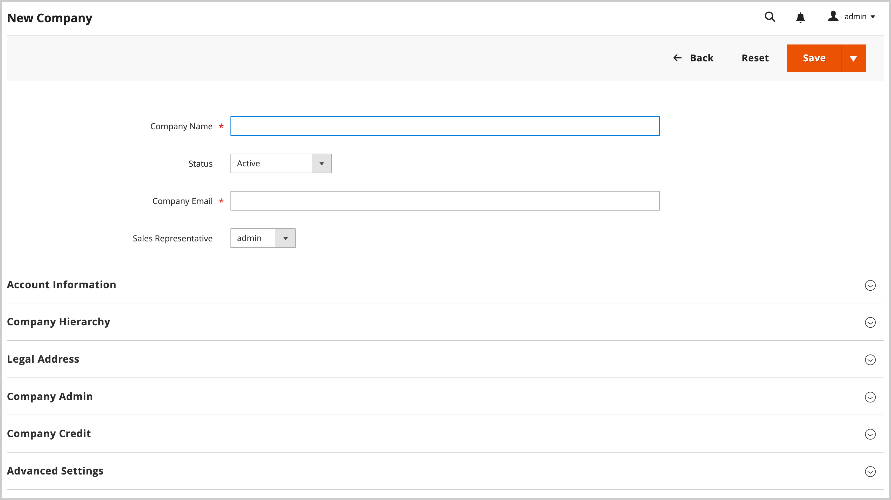
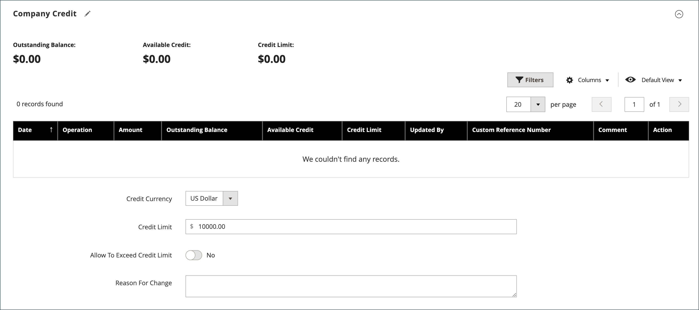

# 会社アカウントの作成

会社アカウントは、顧客がストアフロントから、または管理者から設定できます。 会社アカウントを作成するリクエストはすべて、アカウントが有効になる前に、ストア管理者の承認が必要です。

ストアフロントから会社アカウントを設定するユーザーには、 [会社管理者](account-company-admin.md). 会社アカウントを作成するリクエストが承認されると、会社の管理者はアカウントのパスワードを設定し、アカウントにログインできます。

## 方法 1：顧客がストアフロントからアカウントを作成する

>[!IMPORTANT]
>
>この方法をサポートするには（顧客がストアフロントから会社を登録できるようにする）、 [B2B の機能](enable-basic-features.md) がに設定されている **[!UICONTROL Allow Company Registration from the Storefront]** はに設定されています。 `Yes`.

1. ストアフロントヘッダーの右上隅にある「」をクリックします **[!UICONTROL Create an Account]** およびを選択 **[!UICONTROL Create New Company Account]**.

   {width="700" zoomable="yes"}

   >[!NOTE]
   >
   >訪問者が登録済みユーザーアカウントにログインしている場合は、に移動して会社アカウントを作成できます。 _[!UICONTROL Customer Profile]_>**[!UICONTROL Company Structure]**>**[!UICONTROL Create a Company Account]**. 会社アカウントの作成時に、顧客のアカウントがプライマリ連絡先として割り当てられます。 それ以外の場合、システムは顧客を作成し、この顧客はパスワードを設定するメールを受け取ります。

1. が含まれる _[!UICONTROL Company Information]_セクションでは、顧客は次の操作を行います。

   - 必須フィールドに入力します。

      - **[!UICONTROL Company Name]**
      - **[!UICONTROL Company Email]**

   - 必要に応じて、残りのフィールドに入力します。

      - **[!UICONTROL Company Legal Name]**
      - **[!UICONTROL VAT/TAX ID]**
      - **[!UICONTROL Reseller ID]**

   {width="700" zoomable="yes"}

1. の必須フィールドに入力します _[!UICONTROL Legal Address]_セクション。

   - **[!UICONTROL Street Address]**
   - **[!UICONTROL City]**
   - **[!UICONTROL Country]**
   - **[!UICONTROL State/Province]**
   - **[!UICONTROL ZIP/Postal Code]**
   - **[!UICONTROL Phone Number]**

   {width="700" zoomable="yes"}

1. が含まれる _[!UICONTROL Company Administrator]_セクションには、次の機能があります。

   - エントリ数： **[!UICONTROL Email address]** 会社管理者の場合。

     会社管理者のメールアドレスは、会社のメールアドレスと同じでも、別のメールアドレスでもかまいません。 別のメールアドレスを入力した場合は、会社管理者アカウントに加えて、会社ユーザーアカウントが作成されます。

   - エントリ数： **[!UICONTROL First Name]** および **[!UICONTROL Last Name]** 会社管理者

   - 必要に応じて、次のフィールドに入力します。

      - **[!UICONTROL Job Title]**
      - **[!UICONTROL Gender]**

   

1. このストアフロント関数で reCAPTCHA が有効になっている場合、検証を完了します。

1. 情報が完成したら、「」を選択します。 **[!UICONTROL Submit]**.

   会社のアカウントを作成するリクエストがマーチャントによって承認されると、メール通知が会社の管理者に送信されます。

   {width="500"}

   パスワードを設定すると、会社の管理者は次の操作を実行できます [ログイン](../customers/customer-sign-in.md) をアカウントに追加します。

## 方法 2：マーチャントが管理者からアカウントを作成します

管理者から会社を作成するプロセスは、基本的にストアフロントからのプロセスと同じですが、フィールドが追加されます。

{width="700" zoomable="yes"}

1. 日 _Admin_ サイドバー、に移動 **[!UICONTROL Customers]** > **[!UICONTROL Companies]**.

1. クリック **[!UICONTROL Add New Company]** 次の手順を実行します。

   - 次の必須フィールドに入力します。

      - **[!UICONTROL Company Name]**
      - **[!UICONTROL Company Email]**

   - アカウントの運用開始準備が整っていない場合は、 **[!UICONTROL Status]** 対象： `Pending Approval`. （に設定 `Active` デフォルト）。

   - 該当する場合、の管理者アカウントを選択します **[!UICONTROL Sales Representative]** アカウントを管理するユーザー。

1. が含まれる _[!UICONTROL Account Information]_セクションで、次の操作を行います。

   - 必要に応じて、次のフィールドに入力します。

      - **[!UICONTROL Company Legal Name]**
      - **[!UICONTROL VAT/TAX ID]**
      - **[!UICONTROL Reseller ID]**

   - の場合 **[!UICONTROL Comment]**&#x200B;を入力し、必要になる可能性のある顧客に関する追加情報を入力します。

     コメントは、管理者からのみ表示されます。

   {width="700" zoomable="yes"}

1. 会社の初回作成時、 _[!UICONTROL Company Hierarchy]_グリッドを展開すると、グリッドは空になります。 会社を保存したら、その会社を会社階層に含めることができます。 参照： [会社管理](manage-companies.md).

1. が含まれる _[!UICONTROL Legal Address]_セクションで、次の必須フィールドに入力します。

   - **[!UICONTROL Street Address]**
   - **[!UICONTROL City Country]**
   - **[!UICONTROL ZIP/Postal Code]**
   - **[!UICONTROL Phone Number]**

1. が含まれる _[!UICONTROL Company Admin]_セクションで、次の操作を行います。

   - 次の必須フィールドに入力します。

      - **[!UICONTROL Email]**
      - **[!UICONTROL First Name]**
      - **[!UICONTROL Last Name]**

   - 一部のお客様の名前に他よりも多く適用される可能性があり、お客様の裁量で使用できる次のオプションの部分に名前を入力します。

      - **[!UICONTROL Prefix]**
      - **[!UICONTROL Middle Name/Initial]**
      - **[!UICONTROL Suffix]**

   - 情報が使用可能な場合は、残りのフィールドに入力して、会社管理者について説明します。

      - **[!UICONTROL Website]**
      - **[!UICONTROL Job Title]**
      - **[!UICONTROL Gender]**
      - **[!UICONTROL Send Welcome Email From]**

   {width="700" zoomable="yes"}

1. が含まれる _[!UICONTROL Company Credit]_顧客の与信活動の要約を表示するセクションでは、該当する場合、セクションの下部にあるいくつかのフィールドに入力します。

   - **[!UICONTROL Credit Currency]**
   - **[!UICONTROL Credit Limit]**
   - **[!UICONTROL Allow to Exceed Credit Limit]**
   - **[!UICONTROL Reason for Change]**

   {width="700" zoomable="yes"}

1. が含まれる _[!UICONTROL Advanced Settings]_セクションで、次の操作を行います。

   >[!NOTE]
   >
   >顧客グループ割り当てによって、会社とその従業員が使用できる共有カタログが決まります。 デフォルトでは、会社は、設定でデフォルトとして設定されている顧客グループに割り当てられます。

   - を変更できます **[!UICONTROL Customer Group]** 別の共有カタログまたは標準の顧客グループへのアクセス権を持つグループに対する会社とその従業員の割り当て。 グループを変更する前に確認を求められます。

     {width="600"}

   - 会社の従業員が自分のアカウントから見積もりを生成できるようにする場合は、次のように設定します **[!UICONTROL Allow Quotes]** 対象： `Yes`.

   - 会社の従業員が自分の口座から発注書を作成して使用できるようにする場合は、次のように設定します **[!UICONTROL Enable Purchase Orders]** 対象： `Yes`.

   - を変更するには **[!UICONTROL Applicable Payment Methods]** 会社で使用可能な、をクリアします **[!UICONTROL Use config settings]** チェックボックスで、次のいずれかを選択します。

     | オプション | 説明 |
     |-------------------------------|-----------------------------------------------------------------------------------------------------------------------------------------------------------------------------------------------------------------------------------------|
     | `B2B Payment Methods` | （デフォルト）すべてを有効にします [デフォルトとして設定された支払方法](../configuration-reference/general/b2b-features.md#default-b2b-payment-methods) b2B 注文の場合。 |
     | `All Enabled Payment Methods` | すべてを作成 [有効な支払方法](../configuration-reference/sales/payment-methods.md) 会社コードに関連付けられている顧客コードで使用できます。 |
     | `Selected Payment Methods` | 会社アカウントに関連付けられた顧客アカウントに使用できる支払い方法を選択できます。 複数の支払い方法を選択するには、Ctrl キー（PC）または Command キー（Mac）を押しながら、各オプションを選択します。 |

     {style="table-layout:auto"}

   - を変更するには **[!UICONTROL Applicable Shipping Methods]** 会社で使用可能な、をクリアします **[!UICONTROL Use config settings]** チェックボックスで、次のいずれかを選択します。

     | オプション | 説明 |
     |--------------------------------|----------------------------------------------------------------------------------------------------------------------------------------------------------------------------------------------------------------------------------------------------|
     | `B2B Shipping Methods` | （デフォルト）すべてを有効にします [出荷方法が既定として設定されました](../configuration-reference/general/b2b-features.md#default-b2b-shipping-methods) b2B 注文の場合。 |
     | `All Enabled Shipping Methods` | すべてを作成 [有効な発送方法](../configuration-reference/sales/delivery-methods.md) 会社コードに関連付けられている顧客コードで使用できます。 |
     | `Selected Shipping Methods` | 会社アカウントに関連付けられている顧客アカウントで使用できる発送方法を選択できます。 複数の配送方法を選択するには、Ctrl キー（PC）または Command キー（Mac）を押しながら、各オプションを選択します。 |

     {style="table-layout:auto"}

1. 完了したら、を選択します **[!UICONTROL Save]**.

   会社のアカウントを作成するリクエストがマーチャントによって承認されると、メール通知が会社の管理者のメールアドレスに送信されます。

   パスワードを設定すると、会社の管理者は次の操作を実行できます [ログイン](../customers/customer-sign-in.md) をアカウントに追加します。

## ボタンバー

| ボタン | 説明 |
|---------------------------|------------------------------------------------------------------|
| [!UICONTROL Back] | 変更を保存せずに会社ページに戻ります。 |
| [!UICONTROL Reset] | 変更が保存されていないすべてのフィールドに元の値を復元します。 |
| [!UICONTROL Save] | 会社への変更を保存し、プロファイルを開いたままにします。 |
| [!UICONTROL Save & Close] | 会社への変更を保存し、プロファイルを閉じます。 |

{style="table-layout:auto"}

## フィールドの説明

| フィールド | 説明 |
|-----------------------------------|---------------------------------------------------------------------------------------------------------------------------------------------------------------------------------------------------------------------------------------------------------------------------------------------------------------------------------------------------------------------------------------------------------------------------------------------------------------------------------------------------------------------------------------------------------------------------------------------------------------------------------------------------------------------------------------------------------------------------------------------------------------------------------------------------------------------------------------------------------------------------------------------------------------------------------|
| [!UICONTROL Company Name] | 会社名は、会社アカウントが最初に作成されたときに入力され、完全な法的名の短縮バージョンにすることができます。 |
| [!UICONTROL Status] | （管理者のみ）会社アカウントの現在の状態を示します。 オプション：  **[!UICONTROL Active]**– 会社のアカウントが店管理者によって承認されている。 会社の管理者と関連するメンバーは、ストアフロントからアカウントにログインして購入することができます。 **[!UICONTROL Pending Approval]**  – 会社のアカウントを開く要求が送信されましたが、ストア管理者はまだ承認されていません。  **[!UICONTROL Rejected]**– 会社のアカウントを開く要求が送信されましたが、ストア管理者によって承認されませんでした。 リクエストの送信に使用された初期ログイン資格情報はブロックされます。 **&#x200B;ブロック&#x200B;**– 会社のメンバーは、ログインしてカタログにアクセスできますが、購入することはできません。 ストア管理者が、状態の良くない会社アカウントをブロックしている可能性があります。 アカウントのブロックは、ストア管理者がいつでも削除できます。 |
| [!UICONTROL Company Email] | 会社アカウントに関連付けられているメールアドレス。 |
| [!UICONTROL Sales Representative] | （管理者のみ）会社アカウントの主要連絡先である管理者ユーザー。 |

{style="table-layout:auto"}

### [!UICONTROL Account Information]

| フィールド | 説明 |
|---------------------------------|-----------------------------------------------------------------------------------------------------------------------------------------------------------------------------------------------------------------------------------------------------------------------------------------------------------------------------------------------------------------------------------------------------------------------------------------------------------------|
| [!UICONTROL Company Legal Name] | 会社の正式名称。 |
| [!UICONTROL VAT / TAX ID] | この [付加価値税](../stores-purchase/vat.md) 税金レポートの目的で、一部の管轄区域によって会社に割り当てられる番号。 ストアフロントに表示されるお客様の VAT/TAX ID を設定するには、以下を参照してください [新しいアカウントオプションを作成](../configuration-reference/customers/customer-configuration.md).   **_注意：_** 会社管理者とその他の会社ユーザーは、顧客アカウントに個別の VAT/TAX ID 番号を持っていません。 |
| [!UICONTROL Reseller ID] | 税金レポート目的で会社に割り当てられる転売番号。 |
| [!UICONTROL Comment] | （管理者のみ）会社アカウントに関するこれらのメモは参照用で、管理者にのみ表示されます。 |

{style="table-layout:auto"}

### [!UICONTROL Company Hierarchy]

| フィールド | 説明 |
|-----------------------------------|------------------------------------------------------------------------------------------------------------------------------------------------------|
| [!UICONTROL Company ID] | 会社の ID 番号。 |
| [!UICONTROL Company Name] | 会社の正式名称。  A `current company indicator` は、編集中の会社行に表示されます。 |
| [!UICONTROL Company Email] | 会社アカウントに関連付けられているメールアドレス。 |
| [!UICONTROL Phone Number] | 会社の主要電話番号。 |
| [!UICONTROL Country] | 会社がビジネスを行うための登録が行われている国。 |
| [!UICONTROL State/Province] | 会社が事業を行うために登録されている州または都道府県。 |
| [!UICONTROL City] | 会社が営業を行うための登録が行われている市区町村。 |
| [!UICONTROL Group/Shared Catalog] | （管理者のみ）次を示します [顧客グループ](../customers/customer-groups.md) または [共有カタログ](catalog-shared.md) それは会社に割り当てられています。 |
| [!UICONTROL Company Admin] | 会社の管理者の氏名。 |
| [!UICONTROL Action] | その会社ラインで可能なアクションのリスト。 |

{style="table-layout:auto"}

### [!UICONTROL Legal Address]

| フィールド | 説明 |
|------------------------------|-----------------------------------------------------------------------------|
| [!UICONTROL Street Address] | 会社が事業を行うために登録されている住所。 |
| [!UICONTROL City] | 会社が営業を行うための登録が行われている市区町村。 |
| [!UICONTROL Country] | 会社がビジネスを行うための登録が行われている国。 |
| [!UICONTROL State/Province] | 会社が事業を行うために登録されている州または都道府県。 |
| [!UICONTROL ZIP/Postal Code] | 会社が営業を登録する郵便番号。 |
| [!UICONTROL Phone Number] | 会社の主要電話番号。 |

{style="table-layout:auto"}

### [!UICONTROL Company Admin]

| フィールド | 説明 |
|--------------------------------------|---------------------------------------------------------------------------------------------------------------------------------------------------------------------------------------------------------------------------------------------------|
| [!UICONTROL Website] | 会社管理者が属する web サイトを決定します。 |
| [!UICONTROL Job Title] | 会社アカウントを管理する会社管理者の役職。 |
| [!UICONTROL Email] | 会社の管理者のメールアドレスは、会社のメールアドレスと同じにすることができます。 別のメールアドレスを入力した場合は、会社アカウントに加えて、会社管理者用に個別のアカウントが作成されます。 |
| [!UICONTROL Prefix] | 該当する場合、会社管理者の名前に関連付けられたプレフィックス（例： `Mr.`, `Ms.`, `Mrs.`、または `Dr.`）に設定します。 設定に応じて、入力フィールドはテキストフィールドまたはリストになります。 |
| [!UICONTROL First Name] | 会社の管理者の名。 |
| [!UICONTROL Middle Name/Initial] | 会社の管理者のミドルネームまたはイニシャル。 |
| [!UICONTROL Last Name] | 会社の管理者の姓。 |
| [!UICONTROL Suffix] | 該当する場合、会社管理者の名前に関連付けられるサフィックス（例： `Jr.`, `Sr.`、または `III.`）に設定します。 設定に応じて、入力フィールドはテキストフィールドまたはリストになります。 |
| [!UICONTROL Gender] | 会社の管理者の性別。 オプション： `Male` / `Female` / `Not Specified` |
| [!UICONTROL Send Welcome Email From] | お知らせメールの送信元のストア表示です。 |

{style="table-layout:auto"}

### [!UICONTROL Company Credit]

| フィールド | 説明 |
|-------------------------------------------|-----------------------------------------------------------------------------------------------------------------------------------------------------------------------------------------|
| [!UICONTROL Credit Currency] | （管理者のみ）企業クレジットでの購入に対してストアが受け入れる通貨。 |
| [!UICONTROL Credit Limit] | （管理者のみ）会社アカウントに拡張されるクレジット制限。 |
| [!UICONTROL Allow to Exceed Credit Limit] | （管理者のみ）会社がクレジット制限を超える権限を持っているかどうかを示します。 オプション： `Yes` / `No` |
| [!UICONTROL Reason for Change] | （管理者のみ）会社がクレジット制限を超えることを許可または禁止する理由を説明するメモ。 このフィールドは、与信限度額を超える権限が変更された場合にのみ有効になります。 |

{style="table-layout:auto"}

### [!UICONTROL Advanced Settings]

| フィールド | 説明 |
|------------------------------------------|--------------------------------------------------------------------------------------------------------------------------------------------------------------------------------------------------------------------------|
| [!UICONTROL Customer Group] | （管理者のみ）次を示します [顧客グループ](../customers/customer-groups.md) または [共有カタログ](catalog-shared.md) それは会社に割り当てられています。 |
| [!UICONTROL Allow Quotes] | （管理者のみ）会社のメンバーが、会社の代わりに交渉可能な見積もりを準備して送信できるかどうかを決定します。 |
| [!UICONTROL Enable Purchase Orders] | （管理者のみ）会社のメンバーが次の形式で注文を送信できるかどうかを決定します [発注書](account-dashboard-my-purchase-orders.md) 会社を代表して。 |
| 適用可能な支払い方法 | （管理者のみ）会社の購入に使用できる支払い方法を示します。 オプション： `B2B Payment Methods` / `All Enabled Payment Methods` / `Selected Payment Methods` |
| [!UICONTROL Payment Methods] | （管理者のみ）特定の支払方法が有効化されると有効化されます。 会社のアカウントで複数の支払い方法を使用できるようにするには、Ctrl キー（PC）または Command キー（Mac）を押しながら、各オプションを選択します。 |
| [!UICONTROL Applicable Shipping Methods] | （管理者のみ）会社の購入に使用できる発送方法を示します。 オプション： `B2B Shipping Methods` / `All Enabled Shipping Methods` / `Selected Shipping Methods` |
| [!UICONTROL Shipping Methods] | （管理者のみ）特定の発送方法がアクティブ化されると、アクティブになります。 会社のアカウントで複数の支払い方法を使用できるようにするには、Ctrl キー（PC）または Command キー（Mac）を押しながら、各オプションを選択します。 |

{style="table-layout:auto"}
