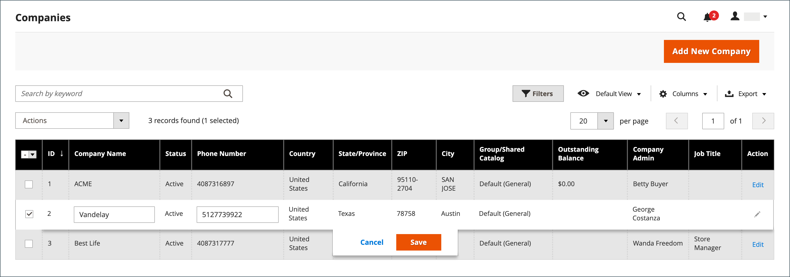

# 会社アカウントの管理

The _[!UICONTROL Companies]_ページには、ステータスに関係なく、現在のすべての会社アカウントが一覧表示されます。 承認の保留中のリクエストは、リストの上部に表示されます。 標準 [職場の統制](../getting-started/admin-workspace.md) を使用して、リストをフィルターする場合は、 [列レイアウト](../getting-started/admin-grid-controls.md)、ビューの保存、データの書き出しを行います。

The _[!UICONTROL Actions]_グリッドの上のコントロールを使用して、複数の会社レコードにアクションを適用できます。 例えば、会社のリクエストを個々に承認する代わりに、複数のリクエストを選択し、1 回のアクションでアカウントをアクティブ化することができます。 使用できるアクションは、 [権限](../systems/permissions.md) 管理者ユーザーアカウントに割り当てられているロールの

以下を使用します。 _[!UICONTROL Search]_～で会社を探す機能を持つ&#x200B;**会社**キーワード別のグリッド。 検索は、**会社名**および&#x200B;**親**列。 次の条件でフィルターできます。**会社タイプ**単一の会社、親会社のみ、または子会社のみを表示する場合。

{width="700" zoomable="yes"}

## 会社の役割のリソース

The [役割のリソース](../systems/permissions-user-roles.md#role-resources) 設定によって、次の機能が決まります。

- 会社を追加
- 会社の削除
- 残高の償還を適用する
- 会社を表示

これらの役割リソースは、 [ユーザーの役割](../systems/permissions-user-roles.md) 管理者ユーザーアカウントに割り当てられた

## アクションの適用

次のアクションは、1 つのレコードまたは複数のレコードに適用できます。

1. 次の日： _管理者_ サイドバー、移動 **[!UICONTROL Customers]** > **[!UICONTROL Companies]**.

1. グリッドの最初の列で、更新する各レコードのチェックボックスを選択し、適用するアクションの手順に従います。

### 会社アカウントの有効化

1. 次から： **[!UICONTROL Actions]** コントロール、選択 **[!UICONTROL Set Active]**.

1. 確認するメッセージが表示されたら、「 **[!UICONTROL OK]**.

### アクティブ/非アクティブを設定

非アクティブなアカウントを持つ顧客は、自分のアカウントにログインしたり、アカウントから購入したりすることはできません。 顧客アカウントをアクティブまたは非アクティブに設定する方法は 2 つあります。

メソッド 1: **顧客グリッドから**

1. 次の日： _管理者_ サイドバー、移動 [!UICONTROL **顧客**] > [!UICONTROL **すべての顧客**].

1. 次から： **[!UICONTROL Actions]** メニューで、次のいずれかを選択します。

   - **[!UICONTROL Active]**
   - **[!UICONTROL Inactive]**

1. プロンプトが表示されたら、「 」を選択します。 **[!UICONTROL OK]** 変更を適用します。

方法 2: **アカウント編集ページから**

1. 次の日： _管理者_ サイドバー、移動 [!UICONTROL **顧客**] > [!UICONTROL **すべての顧客**].

1. グリッドで、編集する顧客レコードを見つけます。

1. Adobe Analytics の _アクション_ 列の右端にある「 」を選択します。 [!UICONTROL **編集**].

1. を選択します。 [!UICONTROL **アカウント情報**] タブをクリックします。

1. 設定 [!UICONTROL **顧客アクティブ**] から `Yes` または `No`.

1. クリック [!UICONTROL **顧客を保存**].

### 会社アカウントをブロック

ブロックされた会社アカウントに関連付けられているユーザーは、カタログにログインしてアクセスできますが、購入することはできません。 不調な口座を持つ企業は、問題が解決するまで一時的にブロックされる場合があります。

1. 次から： **[!UICONTROL Actions]** コントロール、選択 **[!UICONTROL Block]**.

1. 確認するメッセージが表示されたら、「 **[!UICONTROL OK]**.

### 会社アカウントを削除

削除した会社アカウントは復元できません。 会社に関連付けられているユーザーアカウントのステータスは、 `Inactive` 会社 ID は、ユーザーアカウントのプロファイルから削除されます。 会社の活動とトランザクションに関する情報は、システムに保持されます。

1. 次から： **[!UICONTROL Actions]** コントロール、選択 **[!UICONTROL Delete]**.

1. 確認するメッセージが表示されたら、「 **[!UICONTROL OK]**.

### クレジット通貨の変換

選択した会社のアカウントのクレジットが、選択した通貨の現在のレートに変換されます。

1. 次から： **[!UICONTROL Actions]** コントロール、選択 **[!UICONTROL Convert Currency]**.

1. 確認するメッセージが表示されたら、「 **[!UICONTROL OK]**.

1. を選択します。 **[!UICONTROL Credit Currency]** 選択した会社アカウントに使用します。

   可能な場合は、現在のコンバージョン率に従って金額が再計算されます。 利用できない場合は、カスタムコンバージョン率を手動で入力できます。 選択した会社が使用するクレジット通貨に必要なコンバージョンの計算が、いくつでも表示されます。

1. クリック **[!UICONTROL Proceed]** をクリックして、変換処理を完了します。

## 会社アカウントの編集

メソッド 1: **クイック編集**

1. 1 列目で、編集する会社アカウントのチェックボックスを選択します。

1. 次から： **[!UICONTROL Actions]** コントロール、選択 **[!UICONTROL Edit]**.

   更新可能な各値がテキストボックスに表示されます。

   {width="700" zoomable="yes"}

1. 必要に応じて、次の値を更新します。

   - **[!UICONTROL Company Name]**

   - **[!UICONTROL Company Email]**

   - **[!UICONTROL Phone Number]**

1. クリック **[!UICONTROL Save]**.

方法 2: **完全な編集**

1. グリッドで、編集する会社レコードを探します。

1. 選択 **[!UICONTROL Edit]** から _[!UICONTROL Action]_列。

1. 会社情報に必要な変更を加えます。

フィールドの説明については、 [会社アカウントの作成](account-company-create.md).

1. 完了したら、「 **[!UICONTROL Save]**.

## セールス担当者の割り当て

セールス担当者は [管理者ユーザー](../systems/permissions.md) 会社アカウントの連絡先として割り当てられ、自動化されたすべての [電子メールメッセージ](../b2b/enable-basic-features.md#configure-company-email-options) 会社に関連する。 会社アカウントごとに割り当てることができるセールス担当者は 1 人だけですが、1 人のセールス担当者が複数の会社アカウントを管理できます。 別の管理者ユーザーが割り当てられていない限り、デフォルトの管理者ユーザーアカウントが営業担当者として割り当てられます。

割り当てられた営業担当者の名前とメールアドレスは、会社のメンバーが会社アカウントと見積もりページから参照できます。

1. 次の日： _管理者_ サイドバー、移動 **[!UICONTROL Customers]** > **[!UICONTROL Companies]**.

1. グリッドで会社を検索し、編集モードで開きます。

1. 設定 **[!UICONTROL Sales Representative]** を管理者ユーザーに設定します。

1. 完了したら、「 **[!UICONTROL Save]**.

   割り当てられたセールス担当者が、割り当ての電子メール通知を受け取ります。

## 会社プロファイルの更新

会社プロファイルは、会社管理者がストアフロントから、またストア管理者が管理者から保持できます。

{width="700" zoomable="yes"}

1. 次の日： _管理者_ サイドバー、移動 **[!UICONTROL Customers]** > **[!UICONTROL Companies]**.

1. グリッド内の会社を検索し、 **[!UICONTROL Edit]** （内） _[!UICONTROL Action]_列。

1. 必要に応じて、各セクションのフィールド値を更新します。それには、参照用のフィールドの説明を使用します。

1. 完了したら、「 **[!UICONTROL Save]**.

## 会社アカウントデモ

会社アカウントの管理については、次のビデオをご覧ください。

>[!VIDEO](https://video.tv.adobe.com/v/344447?quality=12)

## 会社管理

[!BADGE 1.5.0-beta]{type=Informative url="/help/b2b/release-notes.md" tooltip="ベータ版プログラム参加者のみ利用可能"}

会社を作成した後、適切な権限を持つ管理者ユーザーは、 [!UICONTROL Company Hierarchy] 」セクションを開き、指定した親会社を編集し、関連会社を割り当てて、親会社組織を構築します。

会社が階層に追加されている場合、 [!UICONTROL Company Hierarchy] grid は、親会社と、グリッドに割り当てられているすべての会社を表示します。

詳しくは、 [会社階層の管理](assign-companies.md) を参照してください。

## 会社のオプションと列

以下の節では、使用可能なアクション、オプション、会社アカウントの管理に使用できる表示情報について説明します。

### アクションコントロールオプション

| オプション | 説明 |
|-----------------------------|---------------------------------------------------------------------------------------------------------------------------------------------------------------------------------------------------------------------------------------------------------------------------------|
| [!UICONTROL Set Active] | 選択したすべての会社レコードのステータスをに設定します `Active`. 会社の管理者には、自分のアカウントにアクセスしてストアフロントで会社を管理できるように、パスワードを設定する手順が届きます。 |
| [!UICONTROL Block] | アカウントを保持しながら、不適格な企業アカウントを制限します。 会社のメンバーは、カタログにログインしてアクセスできますが、会社の代わりに注文をすることはできません。 |
| [!UICONTROL Delete] | 選択した会社アカウントを削除します。 削除された会社に関連付けられているユーザーアカウントのステータスは、 `Inactive` 会社 ID は、ユーザーアカウントのプロファイルから削除されます。 会社の活動とトランザクションに関する情報は、システムに保持されます。 |
| [!UICONTROL Edit] | 選択した会社レコードの一部の値をグリッドから編集できます。 デフォルトでは、「会社名」、「会社の電子メール」および「電話番号」の値をすばやく編集できます。 |
| [!UICONTROL Convert Credit] | 指定した通貨のレートに従って、選択した会社のクレジットを換算します。 |

{style="table-layout:auto"}

### 列の説明

#### デフォルトの列レイアウト

| 列 | 説明 |
|-----------------------------------|--------------------------------------------------------------------------------------------------------------------------------------------------------------------------------------------------------------------------------------------------------------------------------------------------------------------------------------------------------------------------------------------------------------------------------------------------------------------------|
| [!UICONTROL Select] | アクションの対象となる会社レコードを選択するためのチェックボックス、または列ヘッダーの選択コントロールを使用して、すべてを選択/選択解除します。 |
| [!UICONTROL ID] | 会社の作成リクエストが送信された際に割り当てられる一意の数値識別子。 |
| [!UICONTROL Company Name] | 会社名は、会社アカウントが最初に作成される際に入力されます。また、完全な正式名称の短縮版を使用できます。 |
| [!UICONTROL Company Type] | 次のタイプの [会社](manage-companies.md). オプション：  **[!UICONTROL Company]**— デフォルトでは、新しい会社は単一の会社として作成されます。 **[!UICONTROL Parent]** ・他社の親会社。  **[!UICONTROL Child]**— 親会社と関連しています。 |
| [!UICONTROL Parent] | この特定の会社ラインの親会社を表示します。 |
| [!UICONTROL Company Email] | 会社アカウントに関連付けられている電子メールアドレス。 |
| [!UICONTROL Phone Number] | 会社の主な電話番号。 |
| [!UICONTROL Country] | 会社が事業を行う登録を受けている国。 |
| [!UICONTROL State Province] | 会社が事業を行うために登録されている州または都道府県。 |
| [!UICONTROL City] | 会社が事業を営むために登録されている都市。 |
| [!UICONTROL Group/Shared Catalog] | 列名は、設定で共有カタログが有効になっているかどうかによって異なります。 オプション：  **[!UICONTROL Customer Group]**— 設定で「共有カタログ」が有効になっていない場合は、 [顧客グループ](../customers/customer-groups.md) 会社が属する **[!UICONTROL Shared Catalog]**  — 設定で「共有カタログ」が有効になっている場合は、顧客に割り当てられる共有カタログの名前を指定します。 |
| [!UICONTROL Outstanding Balance] | 会社口座の残高。 会社に与信履歴がなく、与信限度額がゼロの場合は、列は空白になります。 |
| [!UICONTROL Company Admin] | 会社管理者の姓名です。 |
| [!UICONTROL Job Title] | 会社管理者の職位。 |
| [!UICONTROL Email] | 会社管理者の電子メールアドレス。 |
| [!UICONTROL Action] | **[!UICONTROL Edit]**  — 会社アカウントを編集モードで開きます。 |

{style="table-layout:auto"}

#### 追加の列

次の列は、 [列レイアウト](../getting-started/admin-grid-controls.md) グリッドの。

| 列 | 説明 |
|---------------------------------|--------------------------------------------------------------------------------------------------------------------------------------------------------------------------------------------------------------------------------------------------------------------------------------------------------------------------------------------------------------------------------------------------------------------------------------------------------------------------------------------------------------------------------------------------------------------------------------------------------------------------------------------------------------------------------------------------------------------------------------------------------------------------------------------------------------------------------------------------------------------------------------------------------------------------------------------------------|
| [!UICONTROL Company Legal Name] | 会社の正式名称。 |
| [!UICONTROL Street Address] | 会社が事業を行うために登録されている住所。 |
| [!UICONTROL ZIP] | 会社が事業を行うために登録されている郵便番号。 |
| [!UICONTROL Reseller ID] | 税レポートの目的で会社に割り当てられる再販売番号。 |
| [!UICONTROL VAT/TAX ID] | The [付加価値税](../stores-purchase/vat.md) 税レポートの目的で、一部の管轄区域によって会社に割り当てられた番号。 顧客の VAT/TAX ID をストアフロントに表示するように設定するには、 [新しいアカウントオプションの作成](../configuration-reference/customers/customer-configuration.md). |
| [!UICONTROL Credit Limit] | 会社アカウントに拡張されるクレジット制限。 |
| [!UICONTROL Credit Currency] | 店舗が会社クレジットでの購入に対して受け入れる通貨。 |
| [!UICONTROL Status] | を示します。 [ステータス](account-company-approve.md) 会社アカウントの オプション：  **[!UICONTROL Active]**— 会社アカウントはストア管理者によって承認されています。 会社の管理者や関連メンバーは、ストアフロントからアカウントにログインして、購入をおこなうことができます。 **[!UICONTROL Pending Approval]**  — 会社アカウントを開くためのリクエストが送信されましたが、ストア管理者によってまだ承認されていません。  **[!UICONTROL Rejected]**— 会社アカウントを開くためのリクエストが送信されましたが、ストア管理者によって承認されていません。 リクエストの送信に使用された初期ログイン資格情報はブロックされます。 **[!UICONTROL Blocked]** ：会社のメンバーはカタログにログインしてアクセスできますが、購入することはできません。 ストア管理者は、状況が悪い会社アカウントをブロックする場合があります。 アカウントのブロックは、ストア管理者がいつでも削除できます。 |
| [!UICONTROL Gender] | 会社管理者の性別。 オプション：雄/雌/未指定 |
| [!UICONTROL Comment] | 参照用の会社アカウントに関するメモで、管理者からのみ表示されます。 |

{style="table-layout:auto"}

### ボタンバー

| ボタン | 説明 |
|--------------------------------|---------------------------------------------------------------------------------------------------------------------------------------------------------------------------------------------------------------------------------------------------------------------|
| [!UICONTROL Back] | 変更を保存せずに会社ページに戻ります。 |
| [!UICONTROL Login as Customer] | 管理者ユーザーが [顧客としてストアフロントにログイン](../customers/login-as-customer.md) そして彼らの注文を手伝う |
| [!DNL Delete Company] | 会社アカウントを削除します。 会社に関連付けられているユーザーアカウントのステータスは、 `Inactive` 会社 ID は、ユーザーアカウントのプロファイルから削除されます。 会社の活動とトランザクションに関する情報は、システムに保持されます。 |
| [!DNL Reset] | 未保存の変更を含むフィールドに元の値を復元します。 |
| [!DNL Reimburse Balance] | 管理者が店舗クレジットから残高を払い戻すことを許可します（発注番号で参照）。 |
| [!DNL Save] | 会社に対する変更を保存し、プロファイルを開いたままにします。 |
| [!UICONTROL Save & Close] | 会社に対する変更を保存し、プロファイルを閉じます。 |

{style="table-layout:auto"}

### フィールドの説明

| フィールド | 説明 |
|-----------------------------------|--------------------------------------------------------------------------------------------------------------------------------------------------------------------------------------------------------------------------------------------------------------------------------------------------------------------------------------------------------------------------------------------------------------------------------------------------------------------------------------------------------------------------------------------------------------------------------------------------------------------------------------------------------------------------------------------------------------------------------------------------------------------------------------------------------------------------------------------------------------------------------------------------------------------------------------------------------|
| [!UICONTROL Company Name] | 会社名は、会社アカウントが最初に作成される際に入力されます。また、完全な正式名称の短縮版を使用できます。 |
| [!UICONTROL Status] | を示します。 [ステータス](account-company-approve.md) 会社アカウントの オプション：  **[!UICONTROL Active]**— 会社アカウントはストア管理者によって承認されています。 会社の管理者や関連メンバーは、ストアフロントからアカウントにログインして、購入をおこなうことができます。 **[!UICONTROL Pending Approval]**  — 会社アカウントを開くためのリクエストが送信されましたが、ストア管理者によってまだ承認されていません。  **[!UICONTROL Rejected]**— 会社アカウントを開くためのリクエストが送信されましたが、ストア管理者によって承認されていません。 リクエストの送信に使用された初期ログイン資格情報はブロックされます。 **[!UICONTROL Blocked]** ：会社のメンバーはカタログにログインしてアクセスできますが、購入することはできません。 ストア管理者は、状況が悪い会社アカウントをブロックする場合があります。 アカウントのブロックは、ストア管理者がいつでも削除できます。 |
| [!UICONTROL Company Email] | 会社アカウントに関連付けられている電子メールアドレス。 |
| [!UICONTROL Sales Representative] | 会社アカウントの主要連絡先である管理者ユーザー。 |

{style="table-layout:auto"}

#### [!UICONTROL Account Information]

| フィールド | 説明 |
|---------------------------------|----------------------------------------------------------------------------------------------------------------------------|
| [!UICONTROL Company Legal Name] | 会社の正式名称。 |
| [!UICONTROL VAT / TAX ID] | 税または [付加価値税](../stores-purchase/vat.md) 税レポートの目的で会社に割り当てられる番号。 |
| [!UICONTROL Reseller ID] | 税レポートの目的で会社に割り当てられる再販売番号。 |
| [!UICONTROL Comment] | この会社アカウントに関するこれらのメモは参照用で、管理者からのみ表示されます。 |
| **[!UICONTROL Legal Address]** |                                                                                                                            |
| [!UICONTROL Street Address] | 会社が事業を行うために登録されている住所。 |
| [!UICONTROL City] | 会社が事業を営むために登録されている都市。 |
| [!UICONTROL Country] | 会社が事業を行う登録を受けている国。 |
| [!UICONTROL State/Province] | 会社が事業を行うために登録されている州または都道府県。 |
| [!UICONTROL ZIP/Postal Code] | 会社が事業を行うために登録されている郵便番号。 |
| [!UICONTROL Phone Number] | 会社の主な電話番号。 |

{style="table-layout:auto"}

#### [!UICONTROL Company Hierarchy]

[!BADGE 1.5.0-beta]{type=Informative url="/help/b2b/release-notes.md" tooltip="ベータ版プログラム参加者のみ利用可能"}

| 列 | 説明 |
|-----------------------------|------------------------------------------------------------------------------------------------------------------------------------------------------|
| [!UICONTROL Company ID] | 会社の ID 番号。 |
| [!UICONTROL Company Name] | 会社のフルネーム。  A `current company indicator` 編集中の会社行に表示されます。 |
| [!UICONTROL Company Email] | 会社アカウントに関連付けられている電子メールアドレス。 |
| [!UICONTROL Phone Number] | 会社の主な電話番号。 |
| [!UICONTROL State/Province] | 会社が事業を行うために登録されている州または都道府県。 |
| [!UICONTROL City] | 会社が事業を営むために登録されている都市。 |
| [!UICONTROL Customer Group] | （管理者のみ） [顧客グループ](../customers/customer-groups.md) または [共有カタログ](catalog-shared.md) それは会社に割り当てられています。 |
| [!UICONTROL Company Admin] | 会社管理者のフルネーム。 |
| [!UICONTROL Action] | その会社行で使用可能なアクションのリスト。 |

{style="table-layout:auto"}

#### [!UICONTROL Company Admin]

| フィールド | 説明 |
|----------------------------------|--------------------------------------------------------------------------------------------------------------------------------------------------------------------------------------------------------------------------------------------------|
| [!UICONTROL Job Title] | 会社アカウントを管理する会社管理者の役職。 |
| [!UICONTROL Email] | 会社の管理者の電子メールアドレスは、会社の電子メールアドレスと同じにすることができます。 別の電子メールアドレスを入力すると、会社アカウントに加えて、会社管理者用の個別のアカウントが作成されます。 |
| [!UICONTROL Prefix] | 該当する場合、会社管理者の名前に関連付けられたプレフィックス ( 例： `Mr.`, `Ms.`, `Mrs.`または `Dr.`) をクリックします。 設定に応じて、入力フィールドはテキストフィールドまたはリストになります。 |
| [!UICONTROL First Name] | 会社管理者の名。 |
| [!UICONTROL Middle Name/Initial] | 会社管理者のミドルネームまたはイニシャル。 |
| [!UICONTROL Last Name] | 会社管理者の姓。 |
| [!UICONTROL Suffix] | 該当する場合は、会社管理者の名前に関連付けられたサフィックス ( 例： `Jr.`, `Sr.`または `III`) をクリックします。 設定に応じて、入力フィールドはテキストフィールドまたはリストになります。 |
| [!UICONTROL Gender] | 会社管理者の性別。 オプション： `Male` / `Female` / `Not Specified` |

{style="table-layout:auto"}

#### [!UICONTROL Company Credit]

| フィールド | 説明 |
|-------------------------------------------|--------------------------------------------------------------------------------------------------------------------------------------------------------------------------------|
| [!UICONTROL Credit Currency] | 店舗が会社クレジットでの購入に対して受け入れる通貨。 |
| [!UICONTROL Credit Limit] | 会社アカウントに拡張されるクレジット制限。 |
| [!UICONTROL Allow to Exceed Credit Limit] | 会社がクレジット制限を超える権限を持っているかどうかを示します。 オプション：はい/いいえ |
| [!UICONTROL Reason for Change] | 当社が与信限度額を超えることができる状況を説明する注記。 このフィールドは、クレジット制限を超える権限が変更された場合にのみ有効です。 |

{style="table-layout:auto"}

#### [!UICONTROL Advanced Settings]

| フィールド | 説明 |
|-----------------------------------------|------------------------------------------------------------------------------------------------------------------------------------------------------------------------------------------------------|
| [!UICONTROL Customer Group] | を示します。 [顧客グループ](../customers/customer-groups.md) または [共有カタログ](catalog-shared.md) それは会社に割り当てられています。 |
| [!UICONTROL Allow Quotes] | 会社メンバーが会社に代わって有価証券を準備し、提出できるかどうかを決定します。 |
| [!UICONTROL Enable Purchase Orders] | 会社に対して発注書を許可するかどうかを指定します。 発注が会社メンバーアカウントで機能するには、会社の管理者がストアフロントでこの機能を有効にする必要があります。 |
| [!UICONTROL Applicable Payment Methods] | 会社の購入に使用できる支払い方法を示します。 オプション： `B2B Payment Methods` / `All Enabled Payment Methods` / `Specific Payment Methods` |
| [!UICONTROL Payment Methods] | （管理者のみ）特定の支払い方法が示されている場合は、有効になります。 複数の支払い方法を選択するには、Ctrl キー (PC) または Command キー (Mac) を押しながら各オプションをクリックします。 |

{style="table-layout:auto"}
