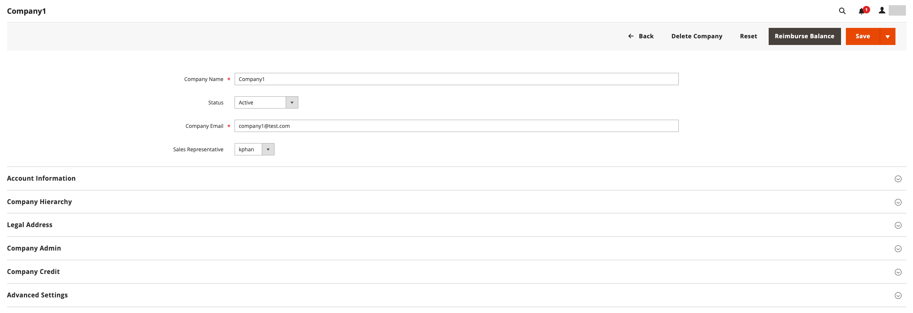

# 会社アカウントの管理

_[!UICONTROL Companies]_&#x200B;ページには、ステータスに関係なく、現在のすべての会社アカウントが一覧表示されます。 承認待ちのリクエストは、リストの上部に表示されます。

{width="700" zoomable="yes"}

*[!UICONTROL Columns]* コントロールを使用して、グリッドに表示される列をカスタマイズします。 検索およびフィルター機能を使用して、ビューに表示される会社をカスタマイズします。

- _[!UICONTROL Search]_&#x200B;を使用して、**Companies**&#x200B;グリッド内の会社を検索します。 検索では、**会社名**&#x200B;列と&#x200B;**親**&#x200B;列にインデックスが付けられます。

- [!UICONTROL Filter]を使用して、特定の条件を満たすレコードを含めるようにビューをカスタマイズします。 例えば、B2B サイトが単一の会社アカウントと[会社階層](manage-companies.md)の両方を管理するように設定されている場合、1つの会社のみを表示するように`[!UICONTROL Company Type - Company]`でフィルタリングしたり、各階層の親会社のみを表示するように`[!UICONTROL Company Type - Parent]`でフィルタリングしたりできます。

グリッドの上にある&#x200B;_[!UICONTROL Actions]_&#x200B;コントロールを使用して、複数の会社レコードにアクションを適用します。 例えば、企業の個別のリクエストを承認するのではなく、複数のリクエストを選択して、1回のアクションでアカウントをアクティベートできます。 使用可能なアクションは、管理者ユーザーアカウントに割り当てられた役割の[権限](../systems/permissions.md)によって異なります。

## 企業の役割に関するリソース

[役割リソース &#x200B;](../systems/permissions-user-roles.md#role-resources)の設定によって、次の機能が決定されます。

- 会社を追加
- 会社の削除
- 残高払い戻しの適用
- 企業を見る

これらの役割リソースは、管理者ユーザーアカウントに割り当てられている[&#x200B; ユーザー役割](../systems/permissions-user-roles.md)に設定する必要があります。

## 会社グリッドから会社アカウントを管理

**[!UICONTROL Customers]** > **[!UICONTROL Companies]**&#x200B;を選択して&#x200B;*[!UICONTROL Companies]* ページを開き、管理メニューから会社のユーザーアカウントを表示および管理します。

アカウントは個別またはグループで管理できます。

- 会社アカウントレコードの&#x200B;**[!UICONTROL Action]**&#x200B;列の&#x200B;**[!UICONTROL Edit]**&#x200B;を選択して、個々の会社アカウントの構成設定を表示または変更します。

  {width="675" zoomable="yes"}

- グリッドの上にある[!UICONTROL Actions]** コントロールから使用可能なオプションを使用して、選択した会社アカウントのグループを表示または変更します。

  {width="675" zoomable="yes"}

各アクションを適用する手順については、次の節を参照してください。

### 会社アカウントをアクティブ化

1. **[!UICONTROL Actions]** コントロールから、**[!UICONTROL Set Active]**&#x200B;を選択します。

1. 確認を求められたら、**[!UICONTROL OK]**&#x200B;をクリックします。

### アクティブ/非アクティブの設定

非アクティブなアカウントを持つお客様は、ログインしたり、アカウントから購入したりすることはできません。 顧客アカウントをアクティブまたは非アクティブに設定するには、次の2つの方法があります。

方法1: **顧客グリッドから**

1. _管理者_ サイドバーで、[!UICONTROL **顧客**] > [!UICONTROL **すべての顧客**]&#x200B;に移動します。

1. **[!UICONTROL Actions]** メニューから、次のいずれかを選択します。

   - **[!UICONTROL Active]**
   - **[!UICONTROL Inactive]**

1. プロンプトが表示されたら、**[!UICONTROL OK]**&#x200B;を選択して変更を適用します。

方法2: **アカウント編集ページから**

1. _管理者_ サイドバーで、[!UICONTROL **顧客**] > [!UICONTROL **すべての顧客**]&#x200B;に移動します。

1. グリッドで、編集する顧客レコードを見つけます。

1. 右端の&#x200B;_アクション_&#x200B;列で、[!UICONTROL **編集**]&#x200B;を選択します。

1. 「[!UICONTROL **アカウント情報**]」タブを選択します。

1. [!UICONTROL **Customer Active**]&#x200B;を`Yes`または`No`に設定します。

1. 「[!UICONTROL **お客様を保存**]」をクリックします。

### 会社アカウントをブロック

ブロックされた会社アカウントに関連付けられているユーザーは、ログインしてカタログにアクセスできますが、購入はできません。 アカウントが適切に管理されていない企業は、問題が解決するまで一時的にブロックされる可能性があります。

1. **[!UICONTROL Actions]** コントロールから、**[!UICONTROL Block]**&#x200B;を選択します。

1. 確認を求められたら、**[!UICONTROL OK]**&#x200B;をクリックします。

### 会社アカウントの削除

削除された会社アカウントは復元できません。 会社に関連付けられているユーザーアカウントのステータスが`Inactive`に設定され、会社IDがユーザーアカウントのプロファイルから削除されます。 企業の活動や取引に関する情報は、システムに保持されます。

1. **[!UICONTROL Actions]** コントロールから、**[!UICONTROL Delete]**&#x200B;を選択します。

1. 確認を求められたら、**[!UICONTROL OK]**&#x200B;をクリックします。

### 会社の設定の変更

[詳細設定](account-company-create.md#advanced-settings)設定を更新して、*会社グリッド*&#x200B;で選択した複数の会社に同じ設定を適用します。

>[!NOTE]
>
>親および関連する子会社を持つ会社組織の詳細設定を[会社階層ビュー](manage-company-hierarchy.md#change-company-settings)から管理します。

1. **[!UICONTROL Actions]** コントロールから、**[!UICONTROL Change company settings]**&#x200B;を選択します。

   *[!UICONTROL Change company settings]* フォームでは、初期設定設定がデフォルト値に設定されます。

1. 設定を変更する各設定について、**[!UICONTROL Change]** チェックボックスを選択して設定を有効にします。 次に、必要に応じて設定を更新します。

   {width="675" zoomable="yes"}

1. 設定設定を更新したら、**[!UICONTROL Apply Changes]**&#x200B;を選択します。

1. プロンプトが表示されたら、**[!UICONTROL Change settings]**&#x200B;を選択して、選択した会社の設定を更新します。

>[!TIP]
>
>会社アカウントレコードの&#x200B;**[!UICONTROL Action]**&#x200B;列の&#x200B;**[!UICONTROL Edit]**&#x200B;を選択すると、1つの会社の詳細設定の設定を変更できます。

### クレジット通貨の変換

選択した会社のアカウントのクレジットは、選択した通貨の現在のレートに変換されます。

1. **[!UICONTROL Actions]** コントロールから、**[!UICONTROL Convert Currency]**&#x200B;を選択します。

1. 確認を求められたら、**[!UICONTROL OK]**&#x200B;をクリックします。

1. 選択した会社アカウントに使用する&#x200B;**[!UICONTROL Credit Currency]**&#x200B;を選択します。

   金額は、現在のコンバージョン率（利用可能な場合）に応じて再計算されます。 利用できない場合は、カスタムコンバージョン率を手動で入力できます。 選択した会社で使用されるクレジット通貨に必要なコンバージョン計算の数が表示されます。

1. **[!UICONTROL Proceed]**&#x200B;をクリックして変換を完了します。

## 会社アカウントの編集

方法1: **クイック編集**

1. 最初の列で、編集する会社アカウントのチェックボックスを選択します。

1. **[!UICONTROL Actions]** コントロールから、**[!UICONTROL Edit]**&#x200B;を選択します。

   更新できる各値は、テキストボックスに表示されます。

   {width="675" zoomable="yes"}

1. 必要に応じて、次のいずれかの値を更新します。

   - **[!UICONTROL Company Name]**

   - **[!UICONTROL Company Email]**

   - **[!UICONTROL Phone Number]**

1. **[!UICONTROL Save]**&#x200B;をクリックします。

方法2: **完全編集**

1. グリッドで、編集する会社レコードを見つけます。

1. _[!UICONTROL Action]_&#x200B;列から&#x200B;**[!UICONTROL Edit]**&#x200B;を選択します。

1. 会社情報に必要な変更を加えます。

   フィールドの説明については、[会社アカウントの作成](account-company-create.md)を参照してください。

1. 完了したら、**[!UICONTROL Save]**&#x200B;をクリックします。

## 営業担当者の割り当て

営業担当者は[管理者ユーザー](../systems/permissions.md)で、会社アカウントの連絡先として割り当てられ、会社に関連するすべての自動[&#x200B; メールメッセージ &#x200B;](../b2b/enable-basic-features.md#configure-company-email-options)を受け取ります。 会社アカウントごとに1人の営業担当者のみを割り当てることができますが、1人の営業担当者が複数の会社アカウントを管理できます。 デフォルトの管理者ユーザーアカウントは、別の管理者ユーザーが割り当てられていない限り、営業担当者として割り当てられます。

割り当てられた営業担当者の名前とメールアドレスは、会社アカウントと見積もりページから会社メンバーに表示されます。

1. _管理者_ サイドバーで、**[!UICONTROL Customers]** > **[!UICONTROL Companies]**&#x200B;に移動します。

1. グリッドで会社を見つけ、編集モードで開きます。

1. 会社の連絡先として割り当てる管理者ユーザーに&#x200B;**[!UICONTROL Sales Representative]**&#x200B;を設定します。

1. 完了したら、**[!UICONTROL Save]**&#x200B;をクリックします。

   割り当てられた営業担当者は、割り当ての通知を電子メールで受け取ります。

## 会社プロファイルの更新

会社プロファイルは、会社の管理者がストアフロントから、およびストアの管理者が管理者から管理できます。

{width="700" zoomable="yes"}

1. _管理者_ サイドバーで、**[!UICONTROL Customers]** > **[!UICONTROL Companies]**&#x200B;に移動します。

1. グリッドで会社を見つけ、_[!UICONTROL Action]_&#x200B;列の&#x200B;**[!UICONTROL Edit]**&#x200B;をクリックします。

1. 参照するフィールドの説明を使用して、必要に応じて各セクションのフィールド値を更新します。

1. 完了したら、**[!UICONTROL Save]**&#x200B;をクリックします。

## 企業アカウントのデモ

このビデオを見て、会社アカウントの管理について学ぶことができます。

>[!VIDEO](https://video.tv.adobe.com/v/344447?quality=12&learn=on)

## 企業管理

会社を作成した後、適切な権限を持つ管理者ユーザーは、[!UICONTROL Company Hierarchy] セクションを使用して、指定された親会社を編集し、関連会社を割り当てることで、親会社組織を構築できます。

会社が階層に追加された場合、[!UICONTROL Company Hierarchy] グリッドには親会社と割り当てられたすべての会社がグリッドに表示されます。

詳しくは、[会社階層の管理](manage-company-hierarchy.md)を参照してください。

## 会社のオプションと列

次の節では、会社アカウントの管理に使用できるアクション、オプション、および表示される情報に関するリファレンスを示します。

### アクション制御オプション

| オプション | 説明 |
|--------------------------------------|---------------------------------------------------------------------------------------------------------------------------------------------------------------------------------------------------------------------------------------------------------------------------------|
| [!UICONTROL Set Active] | 選択したすべての会社レコードのステータスを`Active`に設定します。 会社の管理者は、ストアフロントからアカウントにアクセスし、会社を管理できるように、パスワードを設定する手順を受け取ります。 |
| [!UICONTROL Block] | アカウントを保持しながら、ステータスが良くない企業アカウントを制限します。 会社のメンバーはログインしてカタログにアクセスできますが、会社の代理で注文することはできません。 |
| [!UICONTROL Delete] | 選択した会社アカウントを削除します。 削除された会社に関連付けられているユーザーアカウントのステータスが`Inactive`に設定され、会社IDがユーザーアカウントのプロファイルから削除されます。 企業の活動や取引に関する情報は、システムに保持されます。 |
| [!UICONTROL Edit] | 選択した会社レコードの一部の値をグリッドから編集できるようにします。 デフォルトでは、「会社名」、「会社の電子メール」および「電話番号」の値を使用して、簡単に編集できます。 |
| [!UICONTROL Change company settings] | *会社設定の変更* フォームを開いて、[詳細設定](account-company-create.md#advanced-settings)設定を更新し、選択した会社に変更を適用します。 |
| [!UICONTROL Convert Credit] | 指定した通貨のレートに従って、選択した会社のアカウントに対するクレジットを変換します。 |

{style="table-layout:auto"}

### 列の説明

#### デフォルトの列レイアウト

| 列 | 説明 |
|-----------------------------------|--------------------------------------------------------------------------------------------------------------------------------------------------------------------------------------------------------------------------------------------------------------------------------------------------------------------------------------------------------------------------------------------------------------------------------------------------------------------------|
| [!UICONTROL Select] | アクションの対象となる会社レコードを選択するために使用されるチェックボックス、または列ヘッダーの選択コントロールを使用してすべてを選択/選択解除するために使用されるチェックボックス。 |
| [!UICONTROL ID] | 会社を作成する要求が送信されたときに割り当てられる一意の数値識別子。 |
| [!UICONTROL Company Name] | 会社名は、会社アカウントが最初に作成されたときに入力され、完全な法的名の短縮バージョンにすることができます。 |
| [!UICONTROL Company Type] | [company](manage-companies.md)の種類。 オプション： **[!UICONTROL Company]**– 既定では、新しい会社は単一の会社として作成されます。 **[!UICONTROL Parent]** – 会社は他社の親会社です。 **[!UICONTROL Child]**– この会社は親会社に関連しています。 |
| [!UICONTROL Parent] | この特定の会社ラインの親会社を表示します。 |
| [!UICONTROL Company Email] | 会社アカウントに関連付けられている電子メールアドレス。 |
| [!UICONTROL Phone Number] | 会社の主要な電話番号。 |
| [!UICONTROL Country] | 会社が事業を行うために登録されている国。 |
| [!UICONTROL State Province] | 会社が事業を行うために登録されている州または州。 |
| [!UICONTROL City] | 会社が事業を行うために登録されている都市。 |
| [!UICONTROL Group/Shared Catalog] | 列名は、設定で共有カタログを有効にするかどうかに応じて異なります。 オプション： **[!UICONTROL Customer Group]**– 共有カタログが設定で有効になっていない場合は、会社が属する[顧客グループ &#x200B;](../customers/customer-groups.md)の名前を指定します。 **[!UICONTROL Shared Catalog]** – 設定で共有カタログが有効になっている場合は、顧客に割り当てられている共有カタログの名前を指定します。 |
| [!UICONTROL Outstanding Balance] | 会社アカウントの未払い残高。 会社に信用履歴がなく、信用制限がゼロの場合、列は空白になります。 |
| [!UICONTROL Company Admin] | 会社管理者の姓と名。 |
| [!UICONTROL Job Title] | 会社管理者の役職名。 |
| [!UICONTROL Work Phone Number] | 会社の管理者の勤務先電話番号。 |
| [!UICONTROL Email] | 会社の管理者の電子メールアドレス。 |
| [!UICONTROL Action] | **[!UICONTROL Edit]** – 会社アカウントを編集モードで開きます。 |

{style="table-layout:auto"}

#### その他の列

グリッドの[列レイアウト &#x200B;](../getting-started/admin-grid-controls.md)を変更すると、次の列を使用できます。

| 列 | 説明 |
|---------------------------------|--------------------------------------------------------------------------------------------------------------------------------------------------------------------------------------------------------------------------------------------------------------------------------------------------------------------------------------------------------------------------------------------------------------------------------------------------------------------------------------------------------------------------------------------------------------------------------------------------------------------------------------------------------------------------------------------------------------------------------------------------------------------------------------------------------------------------------------------------------------------------------------------------------------------------------------------------------|
| [!UICONTROL Company Legal Name] | 会社の正式名称。 |
| [!UICONTROL Street Address] | 会社が事業を行うために登録されている住所。 |
| [!UICONTROL ZIP] | 会社が事業を行うために登録されている郵便番号。 |
| [!UICONTROL Reseller ID] | 税申告のために会社に割り当てられる再販番号。 |
| [!UICONTROL VAT/TAX ID] | 税申告のために一部の管轄区域によって会社に割り当てられた[付加価値税](../stores-purchase/vat.md)番号。 ストアフロントに表示するように顧客VAT/TAX IDを設定するには、[新しいアカウントオプションの作成](../configuration-reference/customers/customer-configuration.md)を参照してください。 |
| [!UICONTROL Credit Limit] | 会社アカウントに拡張されるクレジット制限。 |
| [!UICONTROL Credit Currency] | 会社のクレジットで購入するために店舗で受け入れられる通貨。 |
| [!UICONTROL Status] | 会社アカウントの[status](account-company-approve.md)を示します。 オプション： **[!UICONTROL Active]**– 会社アカウントはストア管理者によって承認されています。 会社の管理者と関連メンバーは、ストアフロントからアカウントにログインして購入することができます。 **[!UICONTROL Pending Approval]** – 会社アカウントを開くリクエストが送信されましたが、ストア管理者によってまだ承認されていません。 **[!UICONTROL Rejected]**– 会社アカウントを開くリクエストが送信されましたが、ストア管理者によって承認されませんでした。 リクエストの送信に使用された最初のログイン資格情報はブロックされます。 **[!UICONTROL Blocked]** – 会社のメンバーはログインしてカタログにアクセスできますが、購入はできません。 ストア管理者は、適切な状態にない会社アカウントをブロックする場合があります。 アカウントのブロックは、いつでもストア管理者が削除できます。 |
| [!UICONTROL Gender] | 会社の管理者の性別。 オプション：男性/女性/指定なし |
| [!UICONTROL Comment] | 会社アカウントに関するメモを参照し、管理者からのみ表示できます。 |

{style="table-layout:auto"}

### ボタンバー

| ボタン | 説明 |
|--------------------------------|---------------------------------------------------------------------------------------------------------------------------------------------------------------------------------------------------------------------------------------------------------------------|
| [!UICONTROL Back] | 変更を保存せずに会社ページに戻ります。 |
| [!DNL Delete Company] | 会社アカウントを削除します。 会社に関連付けられているユーザーアカウントのステータスが`Inactive`に設定され、会社IDがユーザーアカウントのプロファイルから削除されます。 企業の活動や取引に関する情報は、システムに保持されます。 |
| [!DNL Reset] | 保存されていない変更を含むフィールドに、元の値を復元します。 |
| [!DNL Reimburse Balance] | 発注番号で参照されるストアのクレジットから残高を払い戻すことができます。 |
| [!DNL Save] | 会社への変更を保存し、プロファイルをオープンに保ちます。 |
| [!UICONTROL Save & Close] | 会社への変更を保存し、プロファイルを閉じます。 |

{style="table-layout:auto"}

### フィールドの説明

| フィールド | 説明 |
|-----------------------------------|--------------------------------------------------------------------------------------------------------------------------------------------------------------------------------------------------------------------------------------------------------------------------------------------------------------------------------------------------------------------------------------------------------------------------------------------------------------------------------------------------------------------------------------------------------------------------------------------------------------------------------------------------------------------------------------------------------------------------------------------------------------------------------------------------------------------------------------------------------------------------------------------------------------------------------------------------------|
| [!UICONTROL Company Name] | 会社名は、会社アカウントが最初に作成されたときに入力され、完全な法的名の短縮バージョンにすることができます。 |
| [!UICONTROL Status] | 会社アカウントの[status](account-company-approve.md)を示します。 オプション： **[!UICONTROL Active]**– 会社アカウントはストア管理者によって承認されています。 会社の管理者と関連メンバーは、ストアフロントからアカウントにログインして購入することができます。 **[!UICONTROL Pending Approval]** – 会社アカウントを開くリクエストが送信されましたが、ストア管理者によってまだ承認されていません。 **[!UICONTROL Rejected]**– 会社アカウントを開くリクエストが送信されましたが、ストア管理者によって承認されませんでした。 リクエストの送信に使用された最初のログイン資格情報はブロックされます。 **[!UICONTROL Blocked]** – 会社のメンバーはログインしてカタログにアクセスできますが、購入はできません。 ストア管理者は、適切な状態にない会社アカウントをブロックする場合があります。 アカウントのブロックは、いつでもストア管理者が削除できます。 |
| [!UICONTROL Company Email] | 会社アカウントに関連付けられている電子メールアドレス。 |
| [!UICONTROL Sales Representative] | 会社アカウントのプライマリ連絡先である管理者ユーザー。 |

{style="table-layout:auto"}

#### [!UICONTROL Account Information]

| フィールド | 説明 |
|---------------------------------|----------------------------------------------------------------------------------------------------------------------------|
| [!UICONTROL Company Legal Name] | 会社の正式名称。 |
| [!UICONTROL VAT / TAX ID] | 税レポート用に会社に割り当てられている税金または[付加価値税](../stores-purchase/vat.md)番号。 |
| [!UICONTROL Reseller ID] | 税申告のために会社に割り当てられる再販番号。 |
| [!UICONTROL Comment] | 会社アカウントに関するこれらのメモは参照用で、管理者からのみ表示されます。 |

{style="table-layout:auto"}

#### [!UICONTROL Company Hierarchy]

| 列 | 説明 |
|-----------------------------|------------------------------------------------------------------------------------------------------------------------------------------------------|
| [!UICONTROL Company ID] | 会社のID番号。 |
| [!UICONTROL Company Name] | 会社のフルネーム。  編集中の会社行に`current company indicator`が表示されます。 |
| [!UICONTROL Company Email] | 会社アカウントに関連付けられている電子メールアドレス。 |
| [!UICONTROL Phone Number] | 会社の主要な電話番号。 |
| [!UICONTROL State/Province] | 会社が事業を行うために登録されている州または州。 |
| [!UICONTROL City] | 会社が事業を行うために登録されている都市。 |
| [!UICONTROL Customer Group] | （管理者のみ）会社に割り当てられている[顧客グループ &#x200B;](../customers/customer-groups.md)または[共有カタログ &#x200B;](catalog-shared.md)を示します。 |
| [!UICONTROL Company Admin] | 会社管理者のフルネーム。 |
| [!UICONTROL Action] | その会社ラインで考えられるアクションのリスト。 |

{style="table-layout:auto"}

#### [!UICONTROL Legal Address]

| 列 | 説明 |
|-----------------------------|------------------------------------------------------------------------------------------------------------------------------------------------------|
| [!UICONTROL Street Address] | 会社が事業を行うために登録されている住所。 |
| [!UICONTROL City] | 会社が事業を行うために登録されている都市。 |
| [!UICONTROL Country] | 会社が事業を行うために登録されている国。 |
| [!UICONTROL State/Province] | 会社が事業を行うために登録されている州または州。 |
| [!UICONTROL ZIP/Postal Code] | 会社が事業を行うために登録されている郵便番号。 |
| [!UICONTROL Phone Number] | 会社の主要な電話番号。 |

{style="table-layout:auto"}

#### [!UICONTROL Company Admin]

| フィールド | 説明 |
|--------------------------------------|--------------------------------------------------------------------------------------------------------------------------------------------------------------------------------------------------------------------------------------------------|
| [!UICONTROL Website] | 会社アカウントの[web サイト スコープ &#x200B;](../getting-started/websites-stores-views.md)を設定します。 デフォルトは&#x200B;*[!UICONTROL Main Website]*&#x200B;です。 |
| [!UICONTROL Job Title] | 会社アカウントを管理する会社管理者の役職。 |
| [!UICONTROL Work Phone Number] | 会社アカウントを管理する会社管理者の電話番号。 |
| [!UICONTROL Email] | 会社の管理者のメールアドレスは、会社のメールアドレスと同じにすることができます。 別のメールアドレスを入力すると、会社アカウントに加えて、会社の管理者に対して個別のアカウントが作成されます。 |
| [!UICONTROL Prefix] | 該当する場合、会社管理者の名前に関連付けられているプレフィックス（`Mr.`、`Ms.`、`Mrs.`、`Dr.`など）。 設定に応じて、入力フィールドはテキストフィールドまたはリストになります。 |
| [!UICONTROL First Name] | 会社の管理者の名前。 |
| [!UICONTROL Middle Name/Initial] | 会社管理者のミドルネームまたはイニシャル。 |
| [!UICONTROL Last Name] | 会社管理者の姓。 |
| [!UICONTROL Suffix] | 該当する場合、会社管理者の名前に関連付けられているサフィックス（`Jr.`、`Sr.`、または`III`など）。 設定に応じて、入力フィールドはテキストフィールドまたはリストになります。 |
| [!UICONTROL Gender] | 会社の管理者の性別。 オプション：`Male` / `Female` / `Not Specified` |
| [!UICONTROL Send Welcome Email From] | *[!UICONTROL Default Store View]*&#x200B;を使用しない場合は、新しい会社管理者にウェルカムメールを送信するときに使用するストアビューを設定します。 |

{style="table-layout:auto"}

#### [!UICONTROL Company Credit]

| フィールド | 説明 |
|-------------------------------------------|--------------------------------------------------------------------------------------------------------------------------------------------------------------------------------|
| [!UICONTROL Credit Currency] | 会社のクレジットで購入するために店舗で受け入れられる通貨。 |
| [!UICONTROL Credit Limit] | 会社アカウントに拡張されるクレジット制限。 |
| [!UICONTROL Allow to Exceed Credit Limit] | 会社がクレジット制限を超える権限を持っているかどうかを示します。 オプション：はい/いいえ |
| [!UICONTROL Reason for Change] | 会社がクレジット制限を超えることができる、または超えることができない状況を説明するメモ。 このフィールドは、クレジット制限を超える権限が変更された場合にのみアクティブになります。 |

{style="table-layout:auto"}

#### [!UICONTROL Advanced Settings]

| フィールド | 説明 |
|-----------------------------------------|------------------------------------------------------------------------------------------------------------------------------------------------------------------------------------------------------|
| [!UICONTROL Customer Group] | 会社に割り当てられている[顧客グループ &#x200B;](../customers/customer-groups.md)または[共有カタログ &#x200B;](catalog-shared.md)を示します。 |
| [!UICONTROL Allow Quotes] | 会社のメンバーが会社の代理として交渉可能な見積もりを準備して提出できるかどうかを指定します。 |
| [!UICONTROL Enable Purchase Orders] | 発注書が会社に対して許可されているかどうかを判断します。 会社メンバーアカウントで発注書を機能させるには、会社の管理者がストアフロントでこの機能を有効にする必要があります。 |
| [!UICONTROL Applicable Payment Methods] | 会社の購入に使用できる支払い方法を示します。 オプション：`B2B Payment Methods` / `All Enabled Payment Methods` / `Specific Payment Methods` |
| [!UICONTROL Payment Methods] | （管理者のみ）特定の支払い方法が指定されている場合にアクティブになります。 複数の支払い方法を選択するには、Ctrl キー（PC）またはCommand キー（Mac）を押しながら、各オプションをクリックします。 |

{style="table-layout:auto"}
