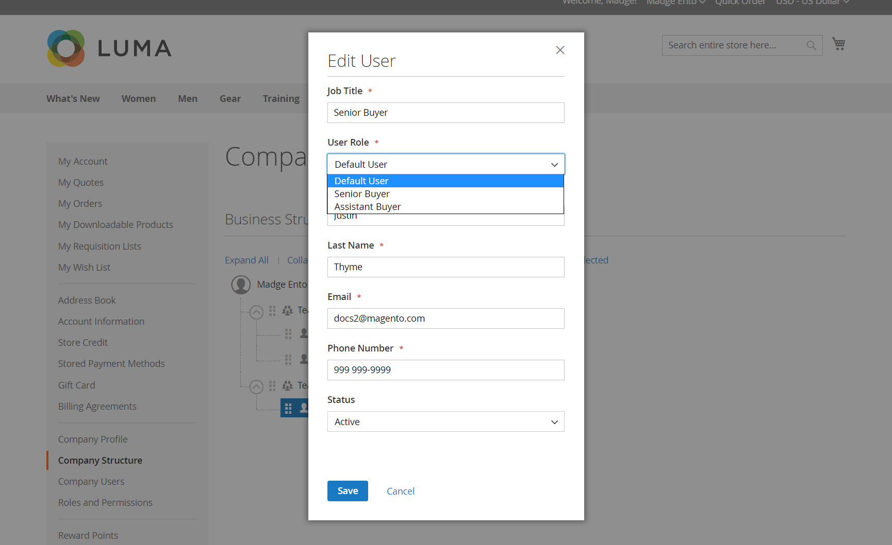

# 企業の役割と権限

営業情報やリソースにアクセスするための権限のレベルが異なる企業ユーザーに対して、役割を設定します。 デフォルトでは、会社管理者は完全な権限を持つ&#x200B;*スーパーユーザー*&#x200B;です。 ユーザーがページにアクセスする権限を持っていない場合、[&#x200B; アクセス拒否](../content-design/pages.md#access-denied) ページが表示されます。

デフォルトの役割{width="700" zoomable="yes"}を持つ役割と権限ページ

システムには、事前に定義されたデフォルトのユーザー役割が1つあり、*を*&#x200B;として使用したり、ニーズに合わせて変更したりできます。 企業構造や組織の責任に合わせて、必要な数の役割を作成できます。

- **既定のユーザー** – 既定のユーザーは、販売と見積りに関連するアクティビティに完全にアクセスでき、会社のプロファイルとクレジット情報には表示専用のアクセス権があります。

- **シニアバイヤー** – シニアバイヤーは、すべてのセールスおよび見積リソースにアクセスでき、会社プロファイル、ユーザーおよびチーム、支払い情報、会社クレジットに対する表示専用の権限を持っている場合があります。

- **アシスタント バイヤー** — アシスタント バイヤーは、**[!UICONTROL Checkout with quote]**&#x200B;を使用して注文を行い、会社プロファイルで注文、見積、情報を表示する権限を持っている場合があります。

## 役割と権限の管理

会社の管理者のストアフロントアカウントから会社の役割を管理します。

**役割と権限を開くには：**

1. 会社の管理者としてストアフロントにログインします。

1. 左側のパネルで、**[!UICONTROL Roles and Permissions]**&#x200B;を選択します。

1. 次のいずれかのタスクを実行します。

### 役割の作成

1. **[!UICONTROL Add New Role]**&#x200B;をクリックします。

   {width="600" zoomable="yes"}

1. わかりやすい&#x200B;**[!UICONTROL Role Name]**&#x200B;を入力します。

1. **[!UICONTROL Role Permissions]**&#x200B;で、次のいずれかの操作を行います。

   - 役割に割り当てられたユーザーがアクセス権を持つ各リソースまたはアクティビティのチェックボックスを選択します。

   - **[!UICONTROL All]** チェックボックスを選択し、役割に割り当てられたユーザーがアクセス権限を持たない各リソースまたはアクティビティのチェックボックスをオフにします。

1. **[!UICONTROL Save Role]**&#x200B;をクリックします。

1. これらの手順を繰り返して、必要な数の役割を作成します。

### 役割の変更

1. 変更する役割を見つけ、**[!UICONTROL Actions]**&#x200B;列の&#x200B;**[!UICONTROL Edit]**&#x200B;をクリックします。

1. 名前と権限の設定に必要な変更を加えます。

1. 終了したら、**[!UICONTROL Save Role]**&#x200B;をクリックします。

### 役割の複製

1. 複製する役割を見つけ、**[!UICONTROL Actions]**&#x200B;列の&#x200B;**[!UICONTROL Duplicate]**&#x200B;をクリックします。

1. 名前と権限の設定に必要な変更を加えます。

1. 終了したら、**[!UICONTROL Save Role]**&#x200B;をクリックします。

### 役割の削除

1. 役割のリストで、削除する役割を見つけます。

   割り当てられたユーザーを持たない役割のみを削除できます。

1. **[!UICONTROL Actions]**&#x200B;列の&#x200B;**[!UICONTROL Delete]**&#x200B;をクリックします。

1. 確認を求められたら、**[!UICONTROL OK]**&#x200B;をクリックします。

## 役割リストアクション {#actions}

| アクション | 説明 |
| --- | --- |
| [!UICONTROL Duplicate] | 選択した役割のコピーを作成します。 重複する役割の名前の末尾に`- Duplicated`が追加されました。 |
| [!UICONTROL Edit] | 名前と権限セットを変更します。 |
| [!UICONTROL Delete] | 役割を削除します。 割り当てられたユーザーを持たない役割のみを削除できます。 |

{style="table-layout:auto"}

## 役割の権限

B2B機能は、**権限** （ACL リソース）によってゲートされます。 企業ユーザーがストアフロントでページを開いたり、アクションを実行したりすると、アプリケーションは役割に必要な権限が含まれているかどうかを確認します。

会社の管理者は、**[!UICONTROL Edit]**&#x200B;を選択し、**[!UICONTROL Role Permissions]** リストで権限を選択または消去することで、役割の権限設定を更新できます。

{width="700" zoomable="yes"}

会社アカウントで&#x200B;**会社の役割**&#x200B;を作成または編集する際に、これらのリソースを割り当てます。 役割を管理する権限を持つユーザーは、役割フォームを開いて権限ツリーを設定できます。

役割の権限は、メインのオプションと下位のオプションを含むツリー構造で構成されています。 メインオプションを選択すると、すべての下位オプションが自動的に選択されます。 メインオプションをクリアすると、すべての下位オプションが自動的にクリアされます。 下位オプションを個別に選択または消去することもできます。

### すべての権限

| 権限ラベル | 説明 |
| --- | --- |
| すべて | このストアフロントの役割に割り当てられた&#x200B;**all**&#x200B;権限のルートノード。 |

### 営業権限

| 権限ラベル | 説明 |
| --- | --- |
| 営業担当者 | チェックアウト用の親ページと、企業ユーザー向けの注文情報ページ。 |
| チェックアウトを許可 | チェックアウト時に注文。 |
| Pay On Account メソッドを使用 | チェックアウト時に&#x200B;**Pay on Account** （会社のクレジット）を使用すると、利用可能になります。 |
| 注文の表示 | ユーザー自身の注文を表示します。 |
| 下位ユーザーの順序の表示 | このユーザーより下のユーザーが階層内に配置した注文を表示します。 |

### 見積もり権限

会社の権限ツリーの親ノード：**見積**。

| 権限ラベル | 説明 |
| --- | --- |
| 見積もり | ストアフロント交渉可能な見積もりアクションの親。 |
| ビュー（引用符） | 交渉可能な引用符を表示します。 |
| 要求、編集、削除 | ビジネスルールに従って、新しい見積もりをリクエストし、見積もりを編集し、見積もりを削除できます。 |
| 見積もり付きのチェックアウト | 承認済みの見積もりを使用してチェックアウトを完了。 |
| 下位ユーザーの見積の管理 | 部下の引用符に対するアクションの親。 |
| 表示（部下の引用符） | 部下の見積もりを表示します。 |
| 編集（部下の引用符） | 部下の引用符を編集します。 |
| 削除（部下の引用符） | 部下の引用符を削除します。 |

### 見積もりテンプレート

親ノード：**見積もりテンプレート** （会社ツリーの&#x200B;**見積**&#x200B;の下）。

| 権限ラベル | 説明 |
| --- | --- |
| 見積もりテンプレート | ストアフロントの引用テンプレート機能の親。 |
| ビュー（テンプレート） | 見積もりテンプレートの表示。 |
| 要求、編集、削除 | 見積テンプレートを作成、更新、キャンセルおよび管理します。 |
| テンプレートから引用符を生成 | テンプレートから交渉可能な引用符を生成します。 |
| 下位ユーザーの見積テンプレートの管理 | 下位テンプレートアクションの親。 |
| ビュー（部下のテンプレート） | 部下の見積テンプレートを表示します。 |
| 編集（部下のテンプレート） | 部下の見積もりテンプレートを編集します。 |
| 削除（部下のテンプレート） | 部下の見積テンプレートを削除します。 |

### 注文の承認

親ノード：**注文承認**。 発注および承認ルールの権限は、ツリーのこのブランチの下にネストされます。

### 発注

| 権限ラベル | 説明 |
| --- | --- |
| 注文の承認 | 発注書と承認機能の親。 |
| 自分の発注の表示 | このユーザーが作成した発注書を表示します。 |
| 部下の表示 | このユーザーより下のユーザーの発注書を階層で表示します。 |
| すべての会社を表示 | 会社全体の発注書を表示します。 |
| この役割で作成されたPOを自動承認 | ルールで許可されている場合、この役割のユーザーが作成した発注を自動的に承認します。 |

### 発注ルール

| 権限ラベル | 説明 |
| --- | --- |
| 他の承認なしで発注を承認 | 他の承認が通常必要な場合でも、発注を承認します（承認ルールごとに）。 |
| 承認ルールの表示 | 発注書の承認ルールを表示します。 |
| 作成、編集、削除 | 承認ルールを作成、編集、削除します。 |

### 企業プロファイルと連絡先

会社プロファイルセクションのストアフロント権限。 ネストされた&#x200B;**編集**&#x200B;個のエントリは、ロールツリーの上位&#x200B;**表示**&#x200B;権限でのみ適用されます。

| 権限ラベル | 説明 |
| --- | --- |
| Company Profile | 企業のプロファイルエリアにグループでアクセスします。 |
| アカウント情報（ビュー） | 会社のアカウント情報を表示します。 |
| Edit | 会社のアカウント情報を編集します（アカウント情報の下）。 |
| 法的住所（ビュー） | 会社の法的住所を表示します。 |
| Edit | 会社の法的住所を編集します（法的住所の下）。 |
| 連絡先（ビュー） | 会社の連絡先を表示します。 |
| お支払い情報（ビュー） | 会社プロファイルに支払い情報を表示します。 |
| 出荷情報（ビュー） | 会社プロファイルに出荷情報を表示します。 |

## 企業ユーザー管理

| 権限ラベル | 説明 |
| --- | --- |
| 企業ユーザー管理 | 役割とユーザーまたはチームの親。 |
| 役割と権限の表示 | 企業の役割とその権限を表示します。 |
| 役割と権限の管理 | 役割を作成または編集し、権限を割り当てます。 |
| ユーザーとチームの表示 | 企業ユーザーとチームの表示。 |
| ユーザーとチームの管理 | ユーザーとチームを追加、編集、または削除します。 |

## 会社クレジット

| 権限ラベル | 説明 |
| --- | --- |
| 会社クレジット | 会社のクレジットエリアにアクセスします。 |
| 表示（クレジット履歴） | 会社の信用履歴と関連する残高情報を表示します。 |

## 会社ユーザーへの役割の割り当て

必要な役割を定義したら、企業の各ユーザーに役割を割り当てます。

**役割を割り当てるには：**

1. 会社の管理者としてストアフロントにログインします。

1. 左側のパネルで、**[!UICONTROL Company Users]**&#x200B;を選択します。

   {width="700" zoomable="yes"}

1. リストでユーザーを見つけ、**[!UICONTROL Edit]**&#x200B;をクリックします。

1. ユーザーに適した&#x200B;**[!UICONTROL User Role]**&#x200B;を選択します。

   {width="700" zoomable="yes"}

1. **[!UICONTROL Save]**&#x200B;をクリックします。

>[!MORELIKETHIS]
>
>- [会社ユーザーの管理](account-company-users.md)
>- [会社アカウント構造](account-company-structure.md)
>- [会社管理者の役割](account-company-admin.md)
>- [会社の管理](manage-companies.md)
>- [B2B機能を有効にする](enable-basic-features.md)
