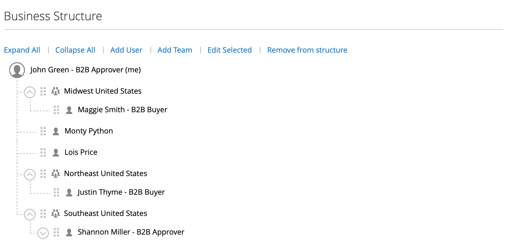
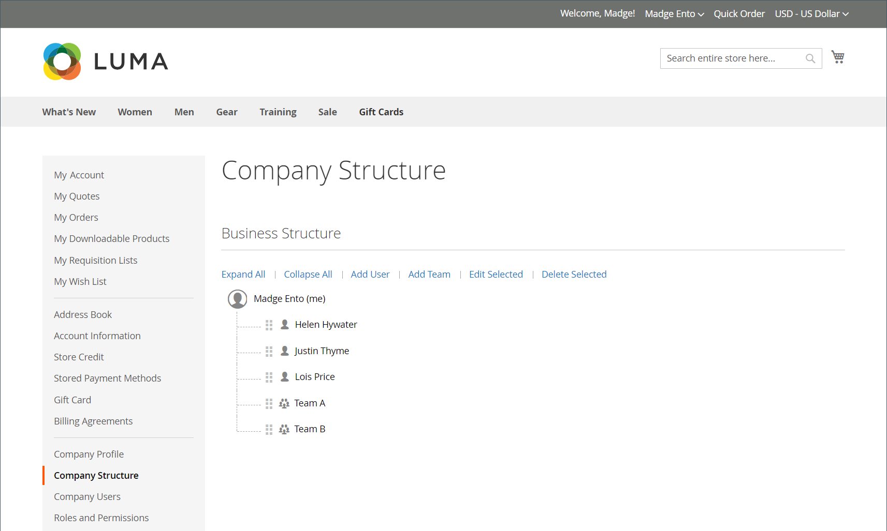
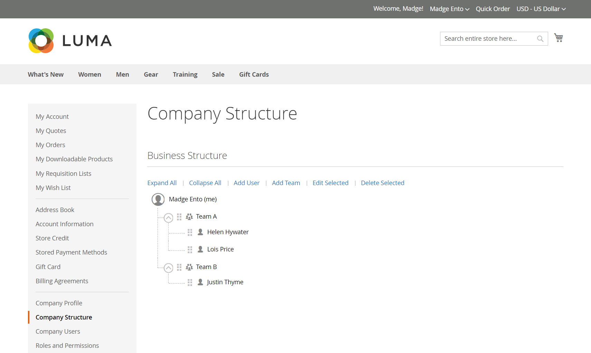

# 企業のアカウント構造

企業アカウントは、ビジネスの構造を反映するように設定できます。 当初、企業構造には企業管理者のみが含まれますが、ユーザーのチームを含めるように拡張できます。 ユーザーは、チームに関連付けることも、企業内の部門や部門の階層内で整理することもできます。

{width="500"}

ストアフロントの会社管理者のアカウントダッシュボードでは、会社構造はツリーとして表され、最初は会社管理者のみで構成されます。

{width="700" zoomable="yes"}

マーチャントの場合、完全な会社構造は、管理者内の&#x200B;_会社_&#x200B;および&#x200B;_顧客_ グリッドに反映されます。 「会社」グリッドには、ステータスに関係なくすべての会社が一覧表示されます。

{width="700" zoomable="yes"}

次の例は、各会社の初回会社管理者アカウントを含む[!UICONTROL Customers] グリッドを示しています。

{width="700" zoomable="yes"}

アカウントを作成した後、会社管理者は[teams](account-company-structure.md)の会社構造を定義し、[会社ユーザー](account-company-users.md)を設定し、それぞれに[役割と権限](account-company-roles-permissions.md)を設定できます。

>[!NOTE]
>
>会社ユーザーが追加されると、会社ユーザーは最初に、会社管理者に従うルート会社構造に追加されます。 会社の管理者が社内で複数の役割を実行する場合は、役割ごとに異なるメールアドレスを持つ個別の会社ユーザーアカウントを作成します。

## 会社構造のアイコン

| アイコン | 説明 |
| ---- | ----------------- |
|  | 会社構造の会社管理者を表します。 |
|  | 会社構造のチームを表します。 |
|  | 会社構造内のユーザーを表します。 |
|  | チームを組織内の別のポジションに移動します。 |
|  | 社内のチームを拡大。 |
|  | 会社構造のチームを折りたたみます。 |

{style="table-layout:auto"}

## 企業チームの作成

企業アカウントの構造は、シンプルでフラットな購買組織であれ、企業の各部門や部門ごとに異なるチームを持つ複雑な組織であれ、購買組織を反映している必要があります。

会社が自分のアカウントを管理できるようにストアが[構成](enable-basic-features.md)されている場合、会社の構造の設定は、アカウントが承認された後に会社の管理者が最初に完了するタスクの1つです。 会社アカウントでは、会社の構造は会社の管理者が上部にあるツリーとして表されます。

{width="450"}

1. 会社の管理者が自分のアカウントにログインします。

1. 左側のパネルで、**[!UICONTROL Company Structure]**&#x200B;を選択します。

1. **[!UICONTROL Business Structure]**&#x200B;で、**[!UICONTROL Add Team]**&#x200B;をクリックし、次の操作を行います。

   - **[!UICONTROL Team Title]**&#x200B;と&#x200B;**[!UICONTROL Description]**&#x200B;を入力します。

     チームタイトルは、社内のチーム、オフィス、部門など、社内の構造を表すあらゆる種類にすることができます

     {width="700" zoomable="yes"}

   - 完了したら、**[!UICONTROL Save]**&#x200B;をクリックします。

   - 必要なだけチームを作成します。

1. チームの階層を作成するには、管理者は次の操作を行います。

   - 親チームを選択し、**[!UICONTROL Add Team]**&#x200B;をクリックします。

     {width="600" zoomable="yes"}

   - **[!UICONTROL Team Title]**&#x200B;と&#x200B;**[!UICONTROL Description]**&#x200B;を入力します。

   - **[!UICONTROL Save]**&#x200B;をクリックします。

1. この手順を繰り返して、必要な数のチーム、または必要に応じて部門とサブディビジョンを作成します。

   {width="600" zoomable="yes"}

## チームを移動

会社の管理者が会社の構造を操作すると、チームまたは部門を組織内の他の場所にドラッグできます。

1. 会社の管理者が移動するチームを見つけます。

1. クリックして、チームを会社構造の新しい位置にドラッグします。

## チームの削除

>[!NOTE]
>
>チームを削除する前に、正しいチームが選択されていることを確認することをお勧めします。削除されたチームは復元できません。

1. 会社の管理者は、削除するチームを選択します。

1. **[!UICONTROL Delete Selected]**&#x200B;をクリックします。

1. 確認を求められたら、**[!UICONTROL Delete]**&#x200B;をクリックします。

## チーム構造の展開または折りたたみ

会社の管理者が会社の構造を操作すると、ツリーを折りたたんだり展開したりできます。

- **[!UICONTROL Collapse All]**&#x200B;または&#x200B;**[!UICONTROL Expand All]**&#x200B;をクリックします。

- をクリックしてチームを折りたたむか、をクリックしてチームを展開します。

## グループへのユーザーの割り当て

チームとユーザーが最初に[会社構造](account-company-structure.md)に追加されると、会社の管理者下の同じレベルに配置されます。

{width="700" zoomable="yes"}

| 制御 | 説明 |
|--- |--- |
| [!UICONTROL Collapse All / Expand All] | ビジネス構造ツリーを折りたたむか展開します |
| [!UICONTROL Add User] | 現在のチームの下にユーザーを作成します |
| [!UICONTROL Add Team] | チームを作成します |
| [!UICONTROL Edit Selected / Remove from Structure] | ユーザー情報を編集するか、ユーザーをビジネス ツリーから削除します。 詳しくは、[会社ユーザーアカウントの管理](account-company-users.md)を参照してください。 |

{style="table-layout:auto"}

1. 左側のパネルで、会社管理者が&#x200B;**[!UICONTROL Company Structure]**&#x200B;を選択します。

1. ユーザーを既存のチームに割り当てるには、ユーザーを適切なチームの下にドラッグ（）します。

   {width="700" zoomable="yes"}
