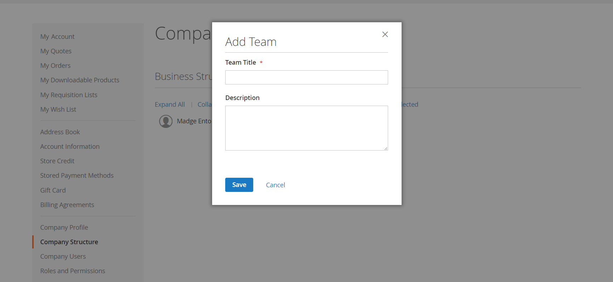

# 会社のアカウント構造

会社アカウントは、ビジネスの構造を反映するように設定できます。 最初は、会社の管理者のみが会社の構造に含まれますが、ユーザーのチームを含めるように拡張できます。 ユーザーは、チームに関連付けることも、社内の部署や部門の階層内で整理することもできます。

{width="500"}

会社管理者のアカウントダッシュボードでは、会社構造はツリーとして表され、最初は会社管理者のみで構成されます。

{width="600" zoomable="yes"}

アカウントを作成して承認すると、会社の管理者は、会社の電子メールアドレスを使用したり、別の電子メールアドレスを割り当てたりできます。

会社の管理者としての役割を持つ人物が社内で複数の役割を持つ可能性があります。 会社管理者用に別の電子メールアドレスを入力した場合、初期の会社構造には、会社管理者と、会社管理者名の個々のユーザーアカウントが含まれます。 この場合、会社の管理者は、会社または個々のユーザーとしてアカウントにログインできます。

{width="600" zoomable="yes"}

商人の場合、会社の構造全体が _会社_ および _顧客_ グリッドを管理内に追加します。 会社グリッドには、ステータスに関係なく、すべての会社が表示されます。 次の例は、2 つの会社のアカウントを示しています。 _ACME_ 会社と _Vendelay_ 会社名。

{width="700" zoomable="yes"}

次の例は、 [!UICONTROL Customers] これらの会社の最初の会社管理者アカウントとのグリッド。

{width="700" zoomable="yes"}

アカウントの作成後、会社の管理者は、 [チーム](account-company-structure.md)を設定し、 [会社のユーザー](account-company-users.md)を設定します。 [役割と権限](account-company-roles-permissions.md) を設定します。

## 会社構造のアイコン

| アイコン | 説明 |
| ---- | ----------------- |
|  | 会社構造の会社管理者を表します。 |
|  | 会社構造内のチームを表します。 |
|  | 会社構造内のユーザーを表します。 |
|  | チームを会社構造内の別の位置に移動します。 |
|  | 会社構造内のチームを拡張します。 |
|  | 会社構造内のチームを折りたたみます。 |

{style="table-layout:auto"}

## 会社チームの作成

会社アカウントの構造は、単純でフラットか、会社の部門や部門ごとに異なるチームを持つ複雑な組織かに関わらず、購入組織を反映する必要があります。

ストアが [設定済み](enable-basic-features.md) 会社が独自のアカウントを管理できるようにするには、会社の管理者がアカウントの承認後に最初に完了するタスクの 1 つとして、会社構造の設定が挙げられます。 会社アカウントでは、会社の構造がツリーとして表され、上部に会社管理者が表示されます。

{width="450"}

1. 会社の管理者が自分のアカウントにサインインします。

1. 左側のパネルで、を選択します。 **[!UICONTROL Company Structure]**.

1. の下 **[!UICONTROL Business Structure]**、クリック **[!UICONTROL Add Team]** は次の操作を実行します。

   - 次に入る **[!UICONTROL Team Title]** および **[!UICONTROL Description]**.

     チームタイトルには、会社の構造を表す任意のタイトルを指定できます（例：会社内のチーム、オフィス、部門）。

     {width="700" zoomable="yes"}

   - 完了したら、「 」をクリックします **[!UICONTROL Save]**.

   - 必要な数のチームを作成します。

     {width="600" zoomable="yes"}

1. チームの階層を作成するには、次の操作を実行します。

   - 親チームを選択し、 **[!UICONTROL Add Team]**.

     {width="600" zoomable="yes"}

   - 次に入る **[!UICONTROL Team Title]** および **[!UICONTROL Description]**.

   - クリック数 **[!UICONTROL Save]**.

1. これらの手順を繰り返して、必要な数のチーム、または部門と部門を作成します。

   {width="600" zoomable="yes"}

## チームを移動

会社の管理者が会社の構造を操作する際に、チームや部門を構造内の他の場所にドラッグできます。

1. 会社の管理者が、移動するチームを特定します。

1. チームをクリックし、会社構造の新しい位置にドラッグします。

## チームの削除

>[!NOTE]
>
>チームを削除する前に、正しいチームが選択されていることを確認することをお勧めします。削除したチームは復元できません。

1. 会社管理者が削除するチームを選択します。

1. クリック数 **[!UICONTROL Delete Selected]**.

1. 確認を求められたら、「 」をクリックします **[!UICONTROL Delete]**.

## チーム構造を展開または折りたたむ

会社の管理者が会社の構造を操作する際に、ツリーを折りたたんだり展開したりできます。

- クリック数 **[!UICONTROL Collapse All]** または **[!UICONTROL Expand All]**.

- クリック数  チームを倒す  チームを拡大する。

## ユーザーをチームに割り当て

チームやユーザーが最初に [会社構造](account-company-structure.md)の場合、これらは会社管理者の同じレベルに配置されます。

{width="700" zoomable="yes"}

| 制御 | 説明 |
|--- |--- |
| [!UICONTROL Collapse All / Expand All] | ビジネス構造ツリーを折りたたむか、展開します |
| [!UICONTROL Add User] | 現在のチームの下にユーザーを作成します |
| [!UICONTROL Add Team] | チームを作成 |
| [!UICONTROL Edit Selected / Delete Selected] | ビジネスツリーのユーザーを編集または削除します |

{style="table-layout:auto"}

1. 左側のパネルで、会社の管理者が **[!UICONTROL Company Structure]**.

1. ユーザーを既存のチームに割り当てるには、ユーザーが () を適切なチームの下に配置します。

   {width="700" zoomable="yes"}
