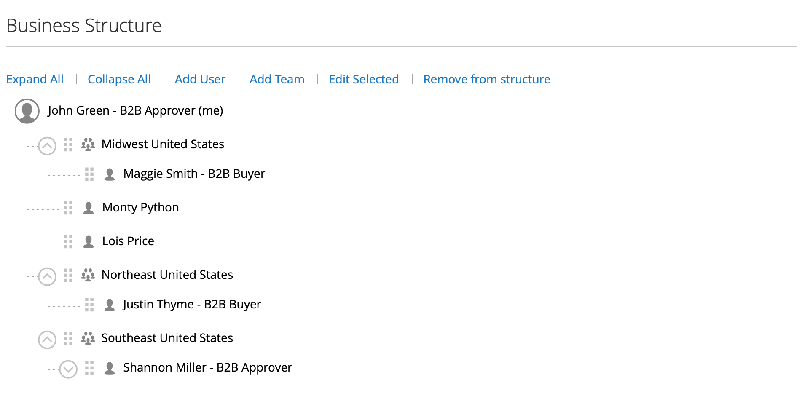

# 会社アカウント構造

会社アカウントを設定して、ビジネスの構造を反映させることができます。 最初は、会社の構造には会社の管理者のみが含まれていますが、ユーザーのチームを含めるように拡張できます。 ユーザーは、チームに関連付けたり、会社内の部門や下位部門の階層内で整理したりできます。

{width="500"}

会社管理者のアカウントダッシュボードでは、会社構造はツリーで表され、最初は会社管理者のみで構成されます。

{width="600" zoomable="yes"}

アカウントを作成して承認すると、会社の管理者は会社のメールアドレスを使用したり、別のメールアドレスを割り当てたりできます。

会社管理者となるユーザーは、会社内で複数の役割を持つ可能性があります。 会社管理者のメールアドレスを別途入力した場合、最初の会社構造には、会社管理者と、会社管理者の名前に個々のユーザーアカウントが含まれます。 この場合、会社の管理者は、会社または個人ユーザーとしてアカウントにログインできます。

{width="600" zoomable="yes"}

マーチャントの場合、会社全体の構造が管理画面の _会社_ グリッドと _顧客_ グリッドに反映されます。 会社グリッドには、ステータスに関係なくすべての会社が一覧表示されます。 次の例は、2 つの会社（_ACME_ 会社と _Vendelay_ 会社）のアカウントを示しています。

{width="700" zoomable="yes"}

次の例は、これらの会社の最初の会社管理者アカウントを持つ [!UICONTROL Customers] グリッドを示しています。

{width="700" zoomable="yes"}

アカウントを作成したら、会社の管理者は、会社の構造 [ チーム ](account-company-structure.md) を定義し、[ 会社のユーザー ](account-company-users.md) を設定して、それぞれに [ 役割と権限 ](account-company-roles-permissions.md) を設定する必要があります。

## 会社構造アイコン

| アイコン | 説明 |
| ---- | ----------------- |
|  | 会社構造内の会社管理者を表します。 |
|  | 会社構造内のチームを表します。 |
|  | 会社構造内のユーザーを表します。 |
|  | チームを会社構造内の別の位置に移動します。 |
|  | 会社構造でチームを展開します。 |
|  | 会社構造内のチームを折りたたみます。 |

{style="table-layout:auto"}

## 会社チームの作成

会社のアカウントの構造は、シンプルでフラットな組織か、会社の下位区分や部署ごとに異なるチームを持つ複雑な組織かに関わらず、購買組織を反映する必要があります。

会社が独自のアカウントを管理できるようにストアが [ 設定 ](enable-basic-features.md) されている場合、アカウントの承認後、会社の管理者が最初に完了するタスクの 1 つは、会社構造の設定です。 会社アカウントでは、会社の構造はツリーとして表され、会社の管理者が最上位に表示されます。

{width="450"}

1. 会社の管理者が自分のアカウントにログインします。

1. 左側のパネルで、「**[!UICONTROL Company Structure]**」を選択します。

1. **[!UICONTROL Business Structure]** で **[!UICONTROL Add Team]** をクリックし、次の操作を実行します。

   - **[!UICONTROL Team Title]** および **[!UICONTROL Description]** を入力します。

     チームのタイトルには、チーム、オフィス、会社内の部署など、会社の構造を表すものを使用できます

     {width="700" zoomable="yes"}

   - 完了したら、「**[!UICONTROL Save]**」をクリックします。

   - 必要な数のチームを作成します。

     {width="600" zoomable="yes"}

1. チームの階層を作成するには、次の操作を実行します。

   - 親チームを選択し、[**[!UICONTROL Add Team]**] をクリックします。

     {width="600" zoomable="yes"}

   - **[!UICONTROL Team Title]** および **[!UICONTROL Description]** を入力します。

   - **[!UICONTROL Save]** をクリックします。

1. これらの手順を繰り返して、必要な数のチーム、または必要な数の分割と分割を作成します。

   {width="600" zoomable="yes"}

## チームの移動

会社の管理者は、会社の構造を操作する際に、チームや部門を構造内の他の場所にドラッグできます。

1. 会社管理者が移動するチームを見つけます。

1. チームをクリックして、会社構造内の新しい位置にドラッグします。

## チームの削除

>[!NOTE]
>
>チームを削除する前に、正しいチームが選択されていることを確認することをお勧めします。削除されたチームは復元できません。

1. 会社の管理者が、削除するチームを選択します。

1. **[!UICONTROL Delete Selected]** をクリックします。

1. 確認を求めるメッセージが表示されたら、「**[!UICONTROL Delete]**」をクリックします。

## チーム構造を展開または折りたたむ

会社の管理者は、会社の構造を操作する際に、ツリーを折りたたんだり展開したりできます。

- **[!UICONTROL Collapse All]** または **[!UICONTROL Expand All]** をクリックします。

- チームを折りたたむには  をクリックし、チームを展開するには  をクリックします。

## チームへのユーザーの割り当て

チームとユーザーが最初に [ 会社構造 ](account-company-structure.md) に追加されると、それらは会社管理者の下の同じレベルに配置されます。

{width="700" zoomable="yes"}

| 制御 | 説明 |
|--- |--- |
| [!UICONTROL Collapse All / Expand All] | ビジネス構造ツリーを折りたたむか展開します |
| [!UICONTROL Add User] | 現在のチームの下にユーザーを作成します |
| [!UICONTROL Add Team] | チームを作成します |
| [!UICONTROL Edit Selected / Delete Selected] | ビジネス ツリーのユーザーを編集または削除します |

{style="table-layout:auto"}

1. 左側のパネルでは、会社の管理者が **[!UICONTROL Company Structure]** を選択します。

1. 既存のチームにユーザーを割り当てるには、ユーザーを適切なチームの下にドラッグ（）します。

   {width="700" zoomable="yes"}
