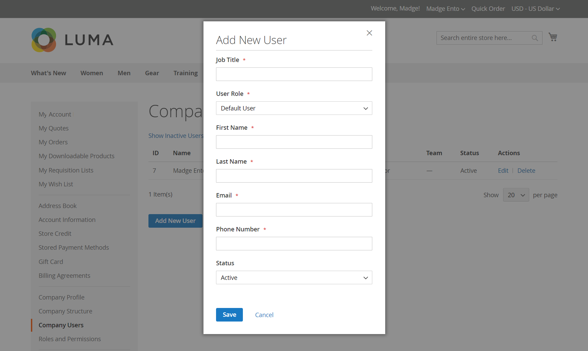

# 会社ユーザーアカウントの管理

ストアフロントでは、会社ユーザーは会社の管理者によって割り当てられ、_[!UICONTROL Company Users]_ページから表示されます。 これらの個人は通常、店舗のサービスやリソースにアクセスする権限のレベルにばらつきがある購入者です。

会社管理者は、まず[会社構造](account-company-structure.md)を設定し、必要に応じて次のタスクを完了します。

- 会社ユーザーの作成とチームへのユーザーの割り当て

- 役割と権限を定義し、ユーザーを役割に割り当てます

会社ユーザーは、会社の管理者のみが追加、編集、非アクティブ化、または削除できます。

- ユーザーが削除されると、アカウントのステータスが&#x200B;*非アクティブ*&#x200B;に変更され、お客様は会社にログインできなくなります。 管理者は、引き続き、ユーザーに関連付けられたすべてのコンテンツにアクセスできます。 アカウント管理者は、[!UICONTROL Company Users] ページからアカウントステータスを&#x200B;*[!UICONTROL Active]*&#x200B;に変更することで、アクセスを復元できます。

- ユーザーアカウントが削除されると、アカウントと関連するコンテンツがストアフロントから削除されます。 このアクションは元に戻せません。

## 会社ユーザーを追加

1. ストアフロントから、会社の管理者は自分のアカウントにログインします。

1. 左側のパネルで、**[!UICONTROL Company Users]**&#x200B;を選択します。

   {width="700" zoomable="yes"}

1. **[!UICONTROL Add New User]**&#x200B;をクリックし、次の操作を行います。

   - 新しいユーザーの&#x200B;**[!UICONTROL Job Title]**&#x200B;を入力します。

   - 役割と権限が定義されている場合は、適切な&#x200B;**[!UICONTROL User Role]**&#x200B;を選択します。 それ以外の場合は、後で戻って役割を割り当てることができます。

     {width="700" zoomable="yes"}

   - 残りのフィールドにユーザー情報を追加します。
      - **[!UICONTROL First Name]**&#x200B;と&#x200B;**[!UICONTROL Last Name]**
      - **[!UICONTROL Email]**
      - **[!UICONTROL Work Phone Number]**

   デフォルトでは、アカウントの&#x200B;**[!UICONTROL Status]**&#x200B;は`Active`です。

1. 完了したら、**[!UICONTROL Save]**&#x200B;をクリックします。

1. このプロセスを繰り返して、必要な数の企業ユーザーを作成します。

   新しいユーザーは、会社管理者と共に会社ユーザーリストに表示されます。

最初の注文時の時間を節約するために、会社の管理者は、各会社のユーザーにデフォルトの会社の請求先住所と配送先住所を[ アドレス帳](../customers/account-dashboard-address-book.md)に追加するように促すことができます。

## ユーザーを[!UICONTROL Company structure]から削除

会社の管理者は、[!UICONTROL Company Structure]からユーザーを削除できます。

アカウントが削除されると、ユーザーアカウントのステータスが&#x200B;*非アクティブ*に変更され、ユーザーはストアフロントにログインできなくなります。
管理者は、会社のユーザーページからユーザーアカウント情報を編集して、アカウントを再アクティブ化できます。

1. ストアフロントから、会社の管理者は自分のアカウントにログインします。

1. 左側のパネルで、**[!UICONTROL Company Structure]**&#x200B;を選択します。

1. 会社構造内の会社ユーザーを選択します。

1. **[!UICONTROL Remove from Structure]**&#x200B;をクリックします。

   {width="600" zoomable="yes"}

1. 確認を求められたら、**[!UICONTROL Remove]**&#x200B;をクリックします。

   管理者では、会社ユーザーは[顧客](../customers/customers-all.md) グリッドに表示されますが、`Inactive`のステータスが表示されます。

## 会社のユーザーアカウントの表示と管理

会社の管理者は、[!UICONTROL Company Users] ページの表示フィルターを使用して、会社のユーザーアカウントを表示および管理できます。

{width="700" zoomable="yes"}

- **[!UICONTROL Show Inactive Users]**&#x200B;を選択して、非アクティブなユーザーのみを表示します。
- **[!UICONTROL Show Active Users]**&#x200B;を選択して、アクティブなユーザーのみを表示します。
- **[!UICONTROL Show All Users]**&#x200B;を選択してすべてのユーザーを表示します。

会社の管理者は、行項目&#x200B;*[!UICONTROL Actions]*&#x200B;を使用して個々のアカウントを管理し、アカウント情報の編集、アカウントのステータスの管理、アカウントの削除を行うことができます。

### 会社のユーザーアカウント情報を編集

会社の管理者は、ユーザーアカウントのプロファイル情報を更新し、アカウントステータスを変更できます。

1. [!UICONTROL Company Users] ページで、更新するユーザーアカウントを見つけます。 **[!UICONTROL Edit]**&#x200B;をクリックします。

1. アカウントステータスの変更など、ユーザーアカウント情報に必要な変更を加えます。

1. **[!UICONTROL Save]**&#x200B;をクリックして変更を適用します。

>[!NOTE]
>
>会社のユーザーアカウントを編集し、役職や勤務先の電話番号などの必須アカウント情報がプロファイルに欠けていることに気付いた場合は、そのアカウントがCommerce サイト管理者によって追加されたことを示します。 これらのアカウントはストアフロントから編集できません。 情報の更新やアカウントステータスの変更を行うには、サイト管理者にお問い合わせください。

### アクティブなアカウントの非アクティブ化または削除

1. [!UICONTROL Company Users] ページで、更新するユーザーアカウントを見つけます。 **[!UICONTROL Manage]**&#x200B;をクリックします。

   {width="600" zoomable="yes"}

1. プロンプトが表示されたら、必要に応じてユーザーアカウントを非アクティブ化または削除します。

>[!IMPORTANT]
>
>会社のユーザーアカウントを削除すると、アカウントと関連するすべてのコンテンツがシステムから削除されます。 このアクションは元に戻せません。

## 会社ユーザーアカウントプロファイルフィールドの説明

| フィールド | 説明 |
|--------------------------------|---------------|
| [!UICONTROL Job Title] | 会社ユーザーの役職名。 |
| [!UICONTROL User Role] | 会社ユーザーに割り当てられた[役割](account-company-roles-permissions.md)。 オプション：`Default User` / （その他の役割） |
| [!UICONTROL First Name] | 会社ユーザーの名前。 |
| [!UICONTROL Last Name] | 会社ユーザーの姓。 |
| [!UICONTROL Email] | 会社ユーザーの電子メールアドレス。 |
| [!UICONTROL Work Phone Number] | 会社ユーザーの勤務先電話番号。 |
| [!UICONTROL Status] | 会社のユーザーアカウントのステータス。 オプション：`Active` / `Inactive` |

{style="table-layout:auto"}
