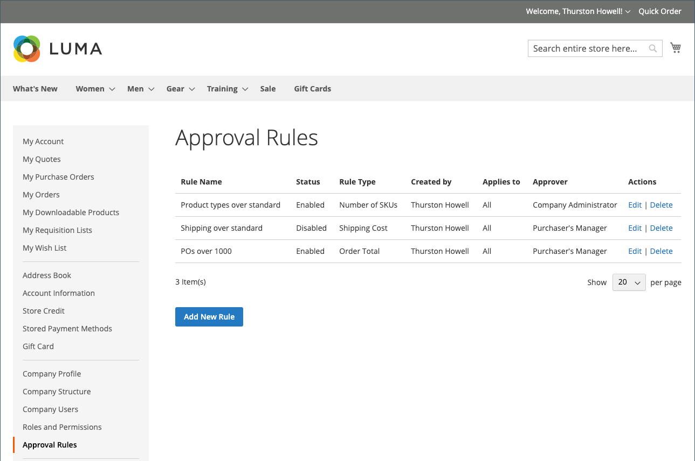
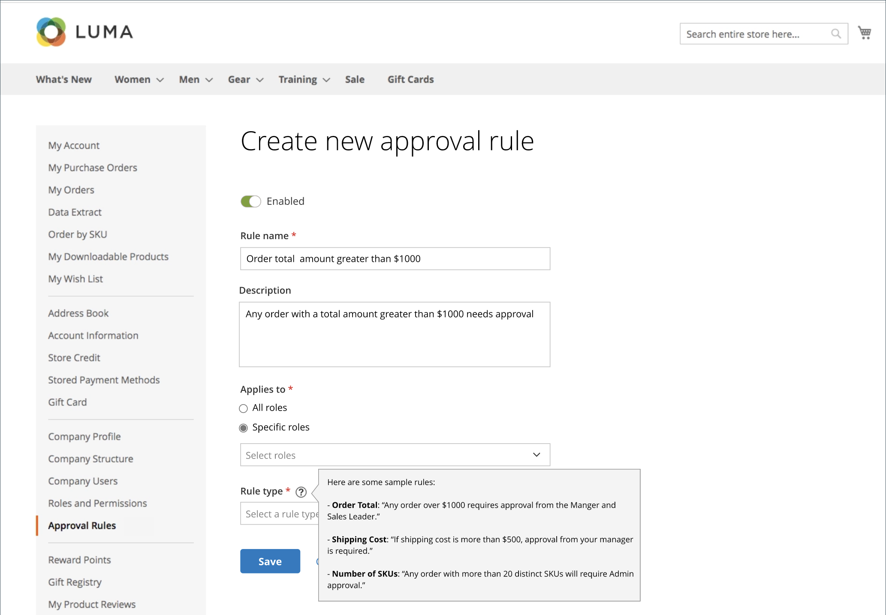
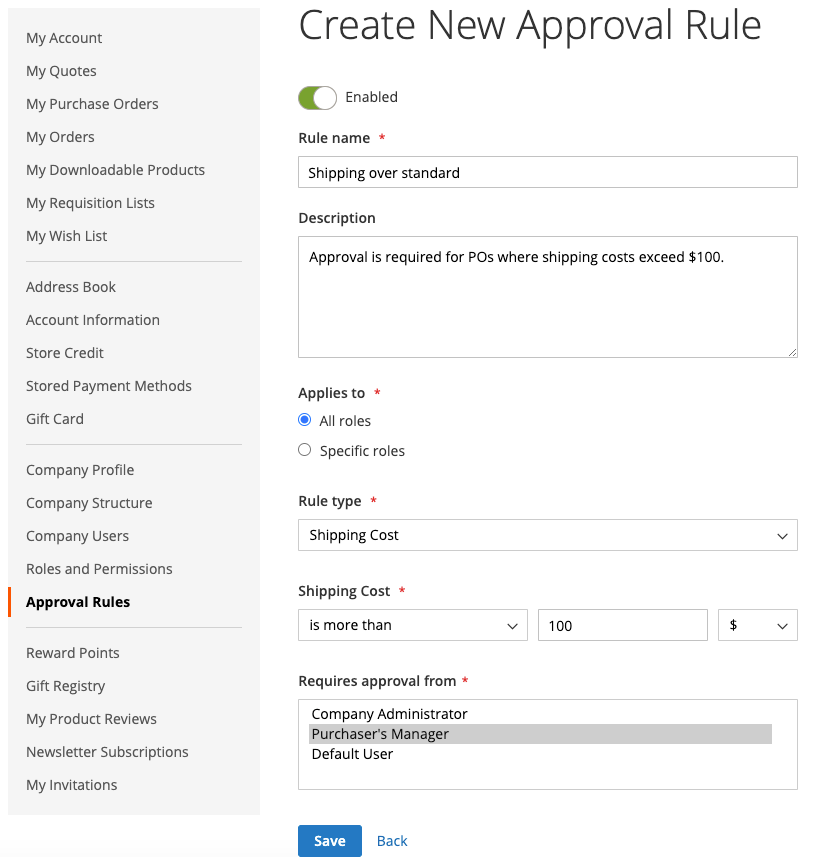
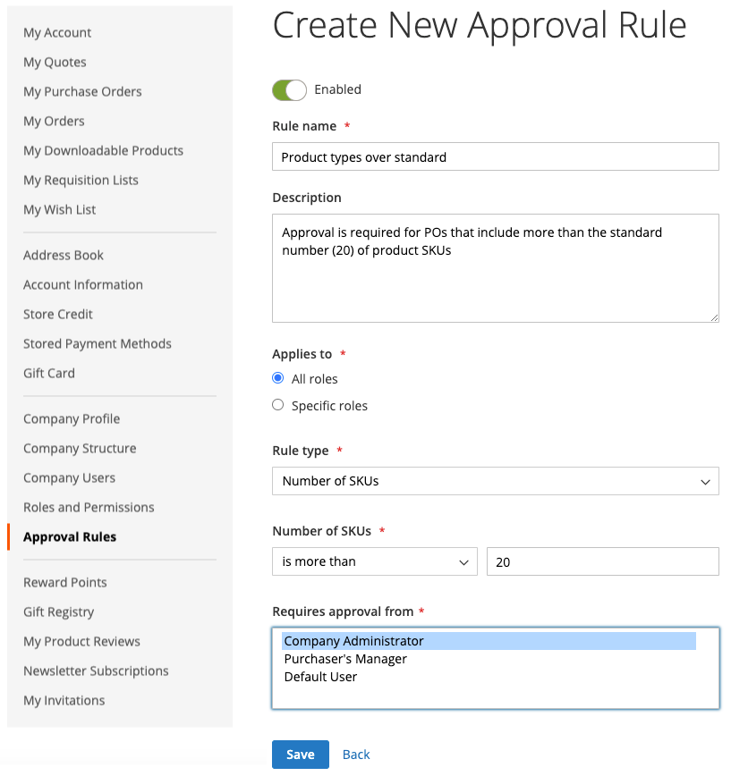

# 発注書の承認ルール

ほとんどの企業では、発注に注文承認が必要です。 会社アカウントに承認ルールを追加することで、発注書を作成できるユーザーと費用を管理できます。 例：

* X値より小さいPOは自動的に承認されます。
* X値を超えてQ未満のPOは、Yによって承認される必要があります。
* X値を超えるPOは、YおよびZによって承認される必要があります。
* ディレクターレベル以上のユーザーが作成したPOは自動的に承認されます。

会社の役割と権限に応じて、ユーザーは承認ルールを作成、編集、削除、表示できます。

>[!IMPORTANT]
>
>購入のお客様のマネージャーによる承認を指定するには、承認ルールの設定に定義された[会社構造](account-company-structure.md)が必要です。

## 支払い方法

発注の承認フローは、オンラインとオフラインの両方の支払い方法をサポートしています。 発注の承認では、デフォルトのすべてのオフライン支払い方法がサポートされています。 オンライン決済では、次の方法がサポートされています。

* PayPal Express
* Braintree決済

## 承認ルールの設定

役割](account-company-roles-permissions.md)に必要な[権限を使用して、B2Bのお客様は、お客様アカウントの左側のパネルの&#x200B;**[!UICONTROL Approval Rules]**&#x200B;をクリックして、会社のポリシーを適用するための承認ルールを設定できます。

{width="700" zoomable="yes"}

承認ルールを作成するには、お客様は次の手順を実行します。

1. **[!UICONTROL Add New Rule]**&#x200B;をクリックしてルールを作成します。

1. 必要に応じて、ルールを&#x200B;**[!UICONTROL Enabled]**&#x200B;から&#x200B;**[!UICONTROL Disabled]**&#x200B;に変更します。

   ルールはデフォルトと同様に有効ですが、お客様は無効な設定を使用してルールを作成し、後でルールを適用する準備ができたときにルールを有効にすることができます。

1. **[!UICONTROL Rule name]**&#x200B;に、`Orders less than $100`など、短くわかりやすいルール名を入力します。

   ルール名は一意である必要があります。

1. **[!UICONTROL Description]**&#x200B;に対して、ルールの長い説明を入力します。

1. **[!UICONTROL Applies to]**&#x200B;の場合、ルールの適用に使用する1つ以上の会社の役割を選択します。

1. **[!UICONTROL Rule Type]**&#x200B;を選択し、ルールを定義します。

   以下の節では、各ルールタイプの詳細な説明と例を示します。

   {width="700" zoomable="yes"}

1. **[!UICONTROL Requires approval from]**&#x200B;の場合、承認のタイプに応じて、1人以上の必要な承認者を選択します。

   >[!NOTE]
   >
   >* 承認者として役割を割り当てる場合は、その役割に少なくとも1人のユーザーがいることを確認します。
   >* 同じ承認者の役割を持つユーザーが2人以上いる場合、発注の作成者は承認できません。 この場合、この承認者の役割を持つ他のユーザーが手動で承認する必要があります。 ただし、[役割の権限](account-company-roles-permissions.md)で`Auto-approve POs created within this role` オプションが設定されている場合、発注書は自動的に承認されます。
   >* 承認者の役割を持つユーザーが1人だけで、そのユーザーが作成者である場合、発注は常に自動的に承認されます（`Auto-approve POs created within this role`権限の設定は無視されます）。

1. **[!UICONTROL Save]**&#x200B;をクリックします。

### [!UICONTROL Order Total]

このルール・タイプは、税金を含むオーダー合計に基づいてPO承認を要求するために使用されます。

1. **[!UICONTROL Order Total amount]** オプションを選択します：

   * `is more than`
   * `is less than`
   * `is more than or equal to`
   * `is less than or equal to`

1. 通貨タイプを選択し、金額を入力します。

{width="600" zoomable="yes"}

### [!UICONTROL Shipping Cost]

このルールタイプは、多くの企業が必要とする送料に基づくPO承認を必要とするために使用されます。

1. **[!UICONTROL Shipping cost value]**&#x200B;を設定します。

   * `is more than`
   * `is less than`
   * `is more than or equal to`
   * `is less than or equal to`

1. 必要な配送金額を設定します。

{width="600" zoomable="yes"}

### [!UICONTROL Number of SKUs]

このルールタイプは、注文のSKU数または一意の製品数に基づいてPO承認を必要とするために使用されます。 注文されるアイテムの数ではなく、異なるアイテムタイプの数を制御します。 例えば、POには次の情報が含まれます。

* 2枚の大きな白いシャツ
* 3つのミディアムホワイトシャツ

この例では、5つの項目を指定しますが、2つの異なるSKUを指定します。

1. **[!UICONTROL Number of SKUs]**&#x200B;値を設定します。

   * `is more than`
   * `is less than`
   * `is more than or equal to`
   * `is less than or equal to`

1. SKUの数量を設定します。

{width="600" zoomable="yes"}

## 承認ルールの編集

既存の承認ルールを変更するには、次の手順を実行します。

1. アカウントのサイドバーで、お客様が&#x200B;**[!UICONTROL Approval Rules]**&#x200B;を選択します。

1. 編集する承認ルールエントリを検索します。

1. **[!UICONTROL Edit]**&#x200B;をクリックします。

1. 必要なすべての変更を行い、**[!UICONTROL Save]**&#x200B;をクリックします。

## 承認ルールの削除

既存の承認ルールを削除するには、次の手順を実行します。

1. アカウントのサイドバーで、**[!UICONTROL Approval Rules]**&#x200B;を選択します。

1. 削除する承認ルールエントリを検索します。

1. **[!UICONTROL Delete]**&#x200B;をクリックします。

1. アクションを確認するには、**[!UICONTROL OK]**&#x200B;をクリックします。

## 発注書の承認のデモ

このビデオでは、発注書の承認について説明します。

>[!VIDEO](https://video.tv.adobe.com/v/344450?quality=12&learn=on)
