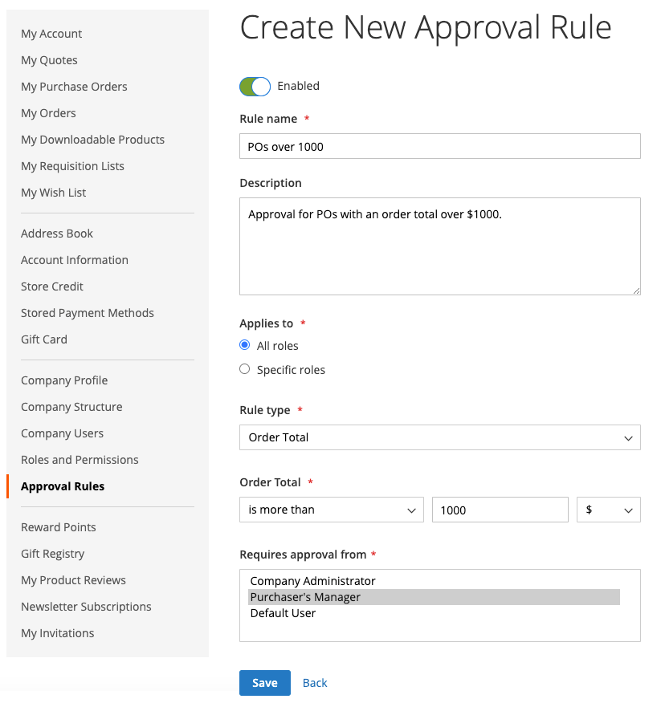

# 発注書承認ルール

ほとんどの会社では、発注書に対して注文の承認が必要です。 会社アカウントに承認ルールを追加することで、発注書を作成できるユーザーと、発注書に使用できる金額を制御できます。 例：

* X 値未満の発注は自動的に承認されます。
* X 値を超え、Q 値未満の発注は、Y によって承認される必要があります。
* X 値を超える PO は、Y と Z によって承認される必要があります。
* Directorレベル以上のユーザーが作成した発注書は、自動的に承認されます。

会社の役割と権限に応じて、ユーザーは承認ルールを作成、編集、削除または表示できます。

>[!IMPORTANT]
>
>承認ルールの設定には、定義済みの [会社構造](account-company-structure.md) 購入顧客のマネージャーの承認を指定するために使用されます。

## 支払い方法

発注書の承認フローは、オンラインとオフラインの両方の支払い方法をサポートします。 すべてのデフォルトのオフライン支払い方法は、発注書承認でサポートされます。 オンライン支払いの場合、次の方法がサポートされます。

* PayPal Express
* Braintree支払

## 承認ルールの設定

必要に応じて [役割に対する権限](account-company-roles-permissions.md)を設定すると、B2B のお客様は、 **[!UICONTROL Approval Rules]** （顧客アカウントの左側のパネル）

{width="700" zoomable="yes"}

承認ルールを作成するには、顧客は次の手順を実行します。

1. クリック数 **[!UICONTROL Add New Rule]** をクリックして、ルールを作成します。

1. 必要に応じて、ルールを次のように変更します。 **[!UICONTROL Enabled]** から **[!UICONTROL Disabled]**.

   ルールはデフォルトとして有効になっていますが、お客様は無効設定を使用してルールを作成し、後でそのルールを適用する準備が整ったら有効にすることができます。

1. の場合 **[!UICONTROL Rule name]**&#x200B;では、ルールの短いわかりやすい名前 ( 例： `Orders less than $100`.

   ルール名は一意である必要があります。

1. の場合 **[!UICONTROL Description]**」を使用すると、ルールの詳細な説明が入力されます。

1. の場合 **[!UICONTROL Applies to]**：ルールの適用に使用する 1 つ以上の会社の役割を選択します。

1. を選択します。 **[!UICONTROL Rule Type]** ルールを定義します。

   以下の節では、各ルールタイプの詳細な説明と例を示します。

   {width="700" zoomable="yes"}

1. の場合 **[!UICONTROL Requires approval from]**&#x200B;は、承認のタイプに従って、1 つ以上の必要な承認者を選択します。

   >[!NOTE]
   >
   >* 承認者として役割を割り当てる場合は、その役割に少なくとも 1 人のユーザーがいることを確認します。
   >* 同じ承認者の役割を持つユーザーが複数いる場合、発注書の作成者は、承認できません。 この場合、この承認者の役割を持つ他のユーザーは手動で承認する必要があります。 ただし、 `Auto-approve POs created within this role` オプションが [ロールの権限](account-company-roles-permissions.md)に設定されている場合、発注書は自動的に承認されます。
   >* 承認者の役割を持つユーザーが 1 人だけで、そのユーザーが作成者の場合、発注書は常に自動的に承認されます。 `Auto-approve POs created within this role` 権限設定は無視されます。

1. クリック **[!UICONTROL Save]**.

### [!UICONTROL Order Total]

このルール・タイプは、税金を含む受注合計に基づいて発注承認を要求する場合に使用します。

1. を選択します。 **[!UICONTROL Order Total amount]** オプション：

   * `is more than`
   * `is less than`
   * `is more than or equal to`
   * `is less than or equal to`

1. 通貨タイプを選択し、金額を入力します。

{width="600" zoomable="yes"}

### [!UICONTROL Shipping Cost]

このルールタイプは、配送料に基づいて発注の承認を要求する場合に使用しますが、多くの企業で必要となるものです。

1. を設定します。 **[!UICONTROL Shipping cost value]**:

   * `is more than`
   * `is less than`
   * `is more than or equal to`
   * `is less than or equal to`

1. 希望する送料を設定します。

{width="600" zoomable="yes"}

### [!UICONTROL Number of SKUs]

このルールタイプは、注文内の SKU 数または個別製品数に基づいて発注承認を要求する場合に使用します。 順序付ける項目の数ではなく、個別の項目タイプの数を制御します。 例えば、発注書には次の情報を含めることができます。

* 大きい白いシャツ 2 枚
* ミディアムホワイトシャツ 3 枚

この例では 5 つの項目を指定していますが、2 つの異なる SKU が指定されています。

1. を設定します。 **[!UICONTROL Number of SKUs]** 値：

   * `is more than`
   * `is less than`
   * `is more than or equal to`
   * `is less than or equal to`

1. SKU の数を設定します。

{width="600" zoomable="yes"}

## 承認ルールを編集

既存の承認ルールを変更するには、顧客は次の手順を実行できます。

1. 顧客がアカウントのサイドバーで **[!UICONTROL Approval Rules]**.

1. 編集する承認ルールエントリを検索します。

1. クリック数 **[!UICONTROL Edit]**.

1. 必要な変更とクリックをすべて行います。 **[!UICONTROL Save]**.

## 承認ルールを削除

既存の承認ルールを削除するには、顧客は次の手順を実行できます。

1. アカウントのサイドバーで、を選択します。 **[!UICONTROL Approval Rules]**.

1. 削除する承認ルールエントリを検索します。

1. クリック数 **[!UICONTROL Delete]**.

1. アクションを確定するには、「 」をクリックします。 **[!UICONTROL OK]**.

## 発注書承認デモ

このビデオでは、発注書の承認について説明します。

>[!VIDEO](https://video.tv.adobe.com/v/344450?quality=12)
