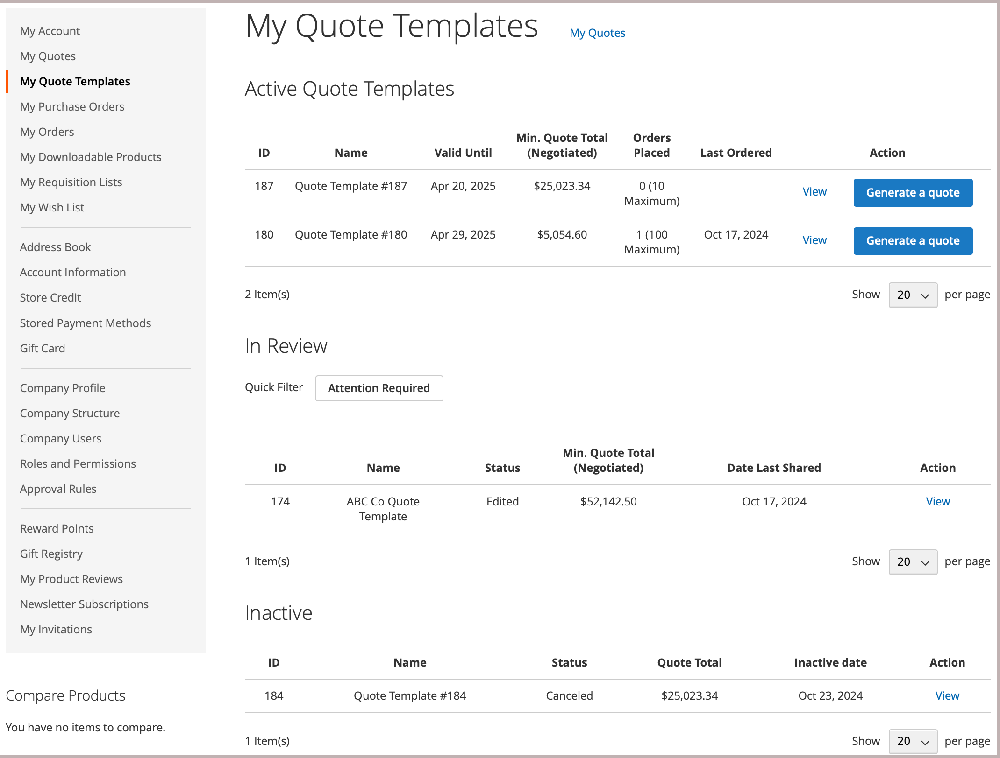
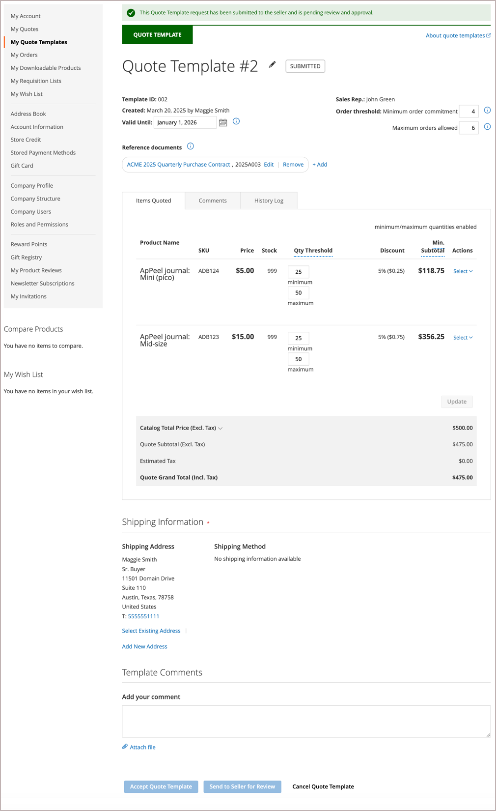
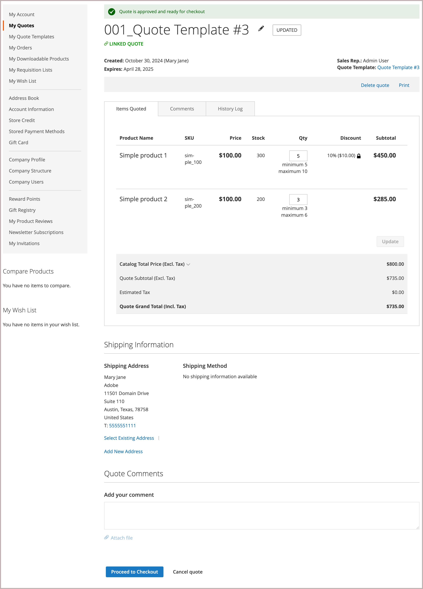

# [!UICONTROL My Quote Templates]

見積もりが有効になっている場合、顧客アカウントダッシュボードの&#x200B;_[!UICONTROL My Quotes Template]_セクションには、顧客アカウントに関連付けられているすべての見積もりテンプレートが一覧表示されます。 権限に応じて、企業の代理で購入するバイヤーのみが見積もりテンプレートをリクエストし、定期的な注文に対して見積もり価格や条件を交渉できます。

{width="700" zoomable="yes"}

見積もりテンプレートリストは、テンプレートをステータス別に整理します。

- **[!UICONTROL Active Quote Templates]**&#x200B;には、ネゴシエーションされ、使用が承認されたテンプレートが一覧表示されます。 情報には、最小見積もり合計と、これらのオプションが交渉過程で設定された場合の注文が含まれます。 購入者は、テンプレートからリンクされた見積もりを生成し、見積もり条件に基づいて注文を送信できます。

- **[!UICONTROL In Review]**&#x200B;は、現在のステータスを表示し、テンプレートを開くためのリンクを提供するネゴシエーション プロセスのテンプレートを一覧表示します。

- **[!UICONTROL Inactive]**&#x200B;には、購入者が許可された確約注文の数を使い切ったため、有効期限が切れた、キャンセルされた、または無効になったテンプレートが一覧表示されます。

購入者にとって、*[!UICONTROL My Quotes Templates]* ページは、交渉プロセス中の購入者と販売者の間のすべてのコミュニケーションの中心です。

販売者が提供する交渉済みの条件に同意した購入者は、テンプレートを受け入れ、それを使用して注文に使用できる事前承認済みのリンクされた見積もりを生成できます。

- 見積テンプレートの管理に関連するアクション：

   - テンプレートのキャンセル
   - 売り手にレビューを依頼
   - 見積もりテンプレートの承認
   - 見積テンプレートの有効期限の変更
   - 配送先住所を追加
   - 参照ドキュメントリンクの管理

- 交渉プロセス中に見積テンプレートの詳細を更新するためのアクション：

   - 各項目の価格とアップデートを確認する。
   - 見積テンプレートに数量しきい値が設定されている場合は、最小値と最大値を調整します。
   - [!UICONTROL Comments]および[!UICONTROL History]のセクションから交渉処理を追跡します。
   - まだレビュー中のテンプレートの場合、購入者はアイテムを削除して見積もりテンプレートを変更できます。
   - 行項目および見積レベルでメモを追加することで、販売者とコミュニケーションを取り、交渉します。
   - 外部契約書や契約書への参照ドキュメントリンクを追加、編集、または削除します。

  変更を加えると、購入者はレビューのためにテンプレートを売り手に返します。

- 交渉中の一般的なアクション：

   - 見積テンプレートを販売者に送信してレビューする
   - 見積もりテンプレートの承認
   - キャンセルして交渉を終了し、見積をクローズします

次の例は、購入者によって更新され、レビューのために販売者に返送された見積もりテンプレートを示しています。

{width="700" zoomable="yes"}

`Submitted` ステータスのテンプレートは、販売者がテンプレートをレビューして更新し、購入者に返すまでロックされます。

## 見積もりテンプレートの作成

バイヤーは、次のいずれかの方法を使用して、見積テンプレートの交渉プロセスを開始できます。

- **[!UICONTROL Create quote template]** アクションをクリックして、既存の見積もりからテンプレートを作成します。

- ストアフロントから見積もり依頼を送信し、営業担当者に見積もり依頼から見積もりテンプレートを作成するよう依頼するコメントを追加します。

## 見積もりテンプレートの表示

1. 購入者はアカウントにログインします。

1. 左側のパネルで、**[!UICONTROL My Quote Templates]**&#x200B;を選択します。

1. リスト内の見積もりテンプレートを検索し、_[!UICONTROL Action]_列の&#x200B;**[!UICONTROL View]**をクリックします。

## 配送先住所を追加

顧客が見積テンプレートを受け入れるには、輸送先住所が必要です。

1. 購入者はアカウントにログインします。

1. 左側のパネルで、**[!UICONTROL My Quote Templates]**&#x200B;を選択します。

1. 目的の見積テンプレートを選択します。

1. **[!UICONTROL Shipping Information]** セクションで、**[!UICONTROL Add New Address]**&#x200B;をクリックします。

1. 新しい住所の詳細を入力します。

1. **[!UICONTROL Save Address]**&#x200B;をクリックします。

購入者が住所を追加したら、テンプレートをレビューのために販売者に送り返します。 売り手は配送オプションと配達オプションを提供します。 これらの更新は、交渉された見積もりの価格に影響を与える可能性があります。 配送オプションはチェックアウト時にロックされます。

## リンクされた見積の生成

購入者が見積もりテンプレートを受け入れた後、それを使用して、*[!UICONTROL My Quote Templates dashboard]*&#x200B;から、または&#x200B;**[!UICONTROL Generate a quote]** アクションを使用して見積もりテンプレートから、事前承認済みのリンクされた見積を生成できます。

リンクされた見積もりには、承認され、チェックアウトの準備ができていることを示す通知が含まれています。 また、ヘッダー情報の引用符テンプレートへのリンクも提供されます。

{width="700" zoomable="yes"}

見積テンプレートが注文しきい値で設定されている場合、リンクされた見積が生成されるときにカウントが増分されます。

購入者は、リンクされた見積から次のアクションを実行できます。

- 見積が数量しきい値で設定されている場合は、行項目の注文数量を調整します。
- チェックアウトに進み、注文を送信します。
- 見積書を削除または印刷します。
- 見積の生成に使用した見積テンプレートを開きます。

## 見積テンプレートのキャンセル

見積もりテンプレートページで、**[!UICONTROL Cancel Quote Template]**&#x200B;をクリックします。

見積テンプレートがキャンセルされ、見積の状態が`Closed`に変わります。 クローズした見積は、*[!UICONTROL Inactive]*&#x200B;個の見積もりのリストに残り、管理画面の&#x200B;_[!UICONTROL Quote Templates]_グリッドに表示されます。

## 参照ドキュメントリンクの管理

参照ドキュメントリンク機能を使用すると、購入者と販売者は、見積もりテンプレートプロセス中に外部ドキュメント（契約、契約書、仕様など）へのリンクを追加、編集、管理できます。

### 参照ドキュメントリンクの追加

1. 見積もりテンプレートを開きます。

1. **[!UICONTROL Reference Documents]** セクションで、**[!UICONTROL Add]**&#x200B;をクリックします。

1. ドキュメント情報ダイアログで、次の操作を行います。
   - **[!UICONTROL Document Name]**&#x200B;を入力してください（必須）
   - **[!UICONTROL Document Identifier]**&#x200B;を入力してください（オプション）
   - **[!UICONTROL Reference Document URL]**&#x200B;を入力してください（必須）

1. **[!UICONTROL Add to Quote Template]**&#x200B;をクリックします。

   参照ドキュメントリンクは、次の形式で見積テンプレートに追加されます。
   `Document Name, Document Identifier https://document-url`

### 参照ドキュメントリンクの編集

1. 見積もりテンプレートを開きます。

1. **[!UICONTROL Reference Documents]** セクションで、変更するドキュメントリンクの横にある&#x200B;**[!UICONTROL Edit]**&#x200B;をクリックします。

1. ダイアログで文書情報を更新します。
   - 文書名
   - 文書識別子
   - 参照ドキュメント URL

1. **[!UICONTROL Add to Quote Template]**&#x200B;をクリックします。

### 参照ドキュメントリンクの削除

1. 見積もりテンプレートを開きます。

1. 「**[!UICONTROL Reference Documents]**」セクションで、削除するドキュメントリンクの横にある「**[!UICONTROL Remove]**」をクリックします。

### 参照文書の表示

1. 見積もりテンプレートを開きます。

1. 「**[!UICONTROL Reference Documents]**」セクションで、ドキュメント名リンクをクリックします。

   ドキュメントが新しいブラウザーウィンドウで開きます。

### 参照ドキュメントリンクの制限

- 参照ドキュメントリンクは、引用テンプレートが編集可能な状態にある場合にのみ、追加、編集、または削除できます。
- 見積テンプレートがレビュー用に送信されるか、承認されると、参照ドキュメントのリンクは読み取り専用になります。
- 参照ドキュメントリンクを追加または編集する場合は、「ドキュメント名」フィールドが必須です。
- 引用テンプレートが承認または完了した後でも、参照ドキュメントのリンクにアクセスできます。
