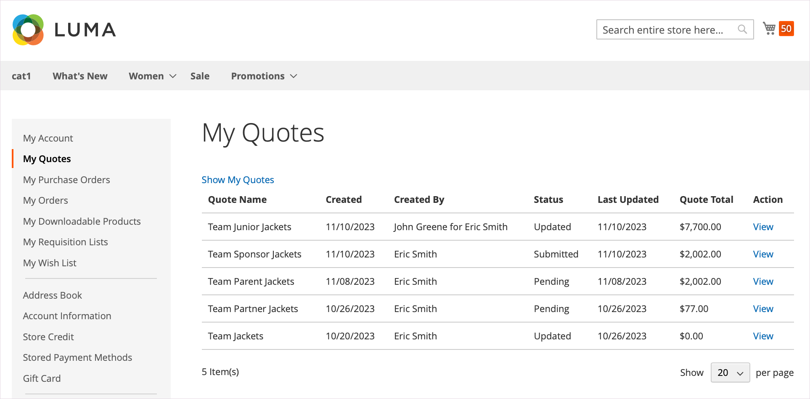

# [!UICONTROL My Quotes]

見積が有効になっている場合、顧客アカウント・ダッシュボードの「_[!UICONTROL My Quotes]_」セクションには、顧客によって発行されたすべての見積がリストされます。 権限に応じて、会社の代わりに購入を行う購入者のみが、購入の価格を交渉するリクエストを送信できます。

{width="700" zoomable="yes"}

購買担当は、ショッピング・カートから見積を [ 要求を発行 ](quote-request.md) することで、この処理を開始します。 電子メールは、[ 交渉プロセス ](quote-price-negotiation.md) 中に買い手と売り手の間で交換されます。 買い手にとって、[!UICONTROL My Quotes] ページは、ネゴシエートプロセス中の買い手と売り手の間のすべての通信の焦点です。 売り手が提供する交渉された価格を受け入れた買い手は、見積もりからチェックアウトページに直接進むことができます。 交渉済の見積には、追加の割引を追加できません。

見積を交渉する際、バイヤーには、見積を管理するか、見積の詳細を更新するかをいくつかのオプションがあります。

* 見積の管理に関連するアクション：

   * 見積もりのコピーを作成します
   * 見積もりを閉じる
   * 見積もりを削除します
   * 引用符名の変更
   * 見積もりを印刷します
   * テンプレートの作成

* 見積もりの詳細を更新するためのアクション：

   * 品目の価格と更新を確認します
   * [!UICONTROL Comments] セクションおよび [!UICONTROL History] セクションからのネゴシエーション・プロセスの追跡
   * 見積を変更して品目を削除します
   * 品目レベルおよび見積レベルでメモを追加して、販売者と連絡を取り、交渉します
   * 配送先住所を追加
   * 要求リストへの品目の移動
   * 条件が受け入れられる場合は、見積もりを注文に変換します

* ネゴシエーション中の一般的なアクション：

   * 確認のために販売者に見積もりを送信
   * チェックアウトに進む

次の例は、購入者によって更新され、レビューのために販売者に送り返された見積もりを示しています。

{width="700" zoomable="yes"}

`Updated` ステータスの見積は、販売者が見積を返すまでロックされます。

## 見積もりを表示

必要な [ 自分の役割に対する権限 ](account-company-roles-permissions.md) を使用すると、会社アカウントに関連付けられた購入者は、[ 下位ユーザー ](account-company-structure.md) からリクエストされた見積もりを確認できます。 会社管理者は、会社アカウントのすべての見積もりを表示できます。

1. 購入者は、ストアフロントの自分のアカウントにログインします。

1. 左側のナビゲ **[!UICONTROL My Quotes]** ションの「」をクリックします。

1. 作成したすべての見積もりを表示するには、**[!UICONTROL Show My Quotes]** のリンク（会社の管理者または下位ユーザーを持つアカウントにのみ表示）をクリックします。

1. すべての会社ユーザーのすべての見積を表示するには、**[!UICONTROL Show All Quotes]** をクリックします。

## 見積もりを表示する

1. 購入者が自分のアカウントにログインします。

1. 左側のパネルで、「**[!UICONTROL My Quotes]**」を選択します。

1. リストで引用符を検索し、_[!UICONTROL Action]_&#x200B;列の&#x200B;**[!UICONTROL View]**&#x200B;をクリックします。

## 見積もりのコピー

1. 購入者は、ストアフロントの会社アカウントにログインします。

1. 左側のパネルで、「**[!UICONTROL My Quotes]**」を選択します。

1. リスト内の目的の見積を検索してアクセスし、元の見積から **[!UICONTROL Create Copy]** をクリックします。

## テンプレートを作成

1. 購入者が自分のアカウントにログインします。

1. 左側のパネルで、「**[!UICONTROL My Quote Templates]**」を選択します。

1. **[!UICONTROL My Quotes]** リストで引用符を検索し、_[!UICONTROL Action]_&#x200B;列の&#x200B;**[!UICONTROL Create Quote Template]**&#x200B;をクリックします。

## 見積から購買依頼リストへの明細品目の移動

1. 購入者が自分のアカウントにログインします。

1. 左側のパネルで、「**[!UICONTROL My Quotes]**」を選択します。

1. リストで目的の見積もりを見つけてアクセスします。

1. ライン項目を選択します。

1. _[!UICONTROL Actions]_&#x200B;ドロップダウンで「**[!UICONTROL Move to Requisition list]**」をクリックします。

1. 既存の購買依頼リストを選択し、選択した品目を移動します。

1. 「**[!UICONTROL Move item]**」をクリックします。

このプロセスについて詳しくは、[ 購買依頼リストへの製品の追加 ](requisition-lists.md) を参照してください。

>[!NOTE]
>
> 品目を移動する際に、新規購買依頼リストを作成することはできません。 品目は、既存の購買依頼リストにのみ移動できます。

## 行項目を新しい見積もりに移動

1. 購入者が自分のアカウントにログインします。

1. 左側のパネルで、「**[!UICONTROL My Quotes]**」を選択します。

1. リストで目的の見積もりを見つけてアクセスします。

1. ライン項目を選択します。

1. _[!UICONTROL Actions]_&#x200B;ドロップダウンで「**[!UICONTROL Move item to new quote]**」をクリックします。

1. モーダルで新しい引用符に名前を付けます。

1. **[!UICONTROL Move to quote]** を選択して、選択した項目を新しい見積もりに移動します。

>[!NOTE]
>
> 複数の項目を選択すると、モーダルが **[!UICONTROL Move selected items to new quote]** として表示されます。

## 配送先住所の追加

1. 購入者が自分のアカウントにログインします。

1. 左側のパネルで、「**[!UICONTROL My Quotes]**」を選択します。

1. 必要な引用符を選択します。

1. 「**[!UICONTROL Shipping Information]**」セクションで、「**[!UICONTROL Add New Address]**」をクリックします。

1. 新しいアドレスの詳細を入力します。

1. **[!UICONTROL Save Address]** をクリックします。

買い手が住所を追加すると、売り手は出荷と配信のオプションを提供します。 これらの更新は、交渉された見積もり価格に影響を与える可能性があります。 配送オプションはチェックアウト時にロックされます。

## 見積もりを印刷する

1. _[!UICONTROL Items Quoted]_&#x200B;のセクションの右側にある開始引用符で、購入者は「**[!UICONTROL Print]**」をクリックします。

1. **[!UICONTROL Destination]** がプリンタかPDFかを確認します。

1. **[!UICONTROL Print]** をクリックします。

## 見積もり依頼のキャンセル

1. 「引用項目」セクションのすぐ上にある開始引用符で、「**[!UICONTROL Close quote]**」をクリックします。

   リクエストがキャンセルされ、見積もりステータスが `Closed` に変わります。 クローズド引用符は引用符のリストに残り、管理者から _[!UICONTROL Quotes]_&#x200B;グリッドにリストされたままになります。

1. キャンセルした見積を見積の一覧から削除するには、[**[!UICONTROL Delete]**] をクリックします。

1. 確認を求めるメッセージが表示されたら、「**[!UICONTROL OK]**」をクリックします。

   クローズした見積は、見積のリストから削除されます。 ただし、管理者の _[!UICONTROL Quotes]_&#x200B;グリッドには `Closed` ステータスで表示されたままになります。

## 見積もりアクション

| アクション | 説明 |
|---------------|------------------------------------------------------------------------------------------------------------------------------------------------------------------------------------------------------------------------------|
| 名前を変更 | 見積もりの名前を変更する |
| コピーを作成 | 購入者は、現在の見積もりをコピーして名前を変更することで、現在の見積もりから見積もりを作成できます。 |
| クローズクォート | 購買担当が見積をクローズした後は、その見積を再オープンできません。 必要に応じて、購入者は [!UICONTROL Create Copy] のアクションを使用して再作成できます。 このオプションは、見積もりの状態が `Draft` の場合は使用できません。 |
| テンプレートを作成 | 現在の見積もりに基づいて見積もりテンプレートを作成します。 見積テンプレートを使用すると、複数の見積に適用できる契約条件と価格条件について購買担当と販売担当が合意できるので、見積ネゴシエーションが合理化されます。  購買担当は、契約時に見積依頼（RFQ）プロセスを再開する代わりに、後続の受注に対してテンプレートから事前承認済のリンクされた見積を生成できます。 |
| 見積もりを削除 | バイヤーが見積を削除すると、見積はシステムから削除され、使用できなくなります。 |
| 印刷 | 印刷フォームを開いて、見積もりをPDF、ファイルとして保存するか、設定済みのプリンタに印刷します。 |

## 列の説明

| 列 | 説明 |
|-------------------------|-------------------------------------------------------------------------------------------------------------------------------------------------------------------------------------------------------------------------------------------------------------------------------------------------------------------------------------------------------------------------------------------------------------------------------------------------------------------------------------------------------------------------------------------------------------------------------------------------------------------------------------------------------------------------------------------------------------------------------------------------------------------------------------------------------------------------------------------------------------------------------------------------------------------------------------------------------------------------------------------------------------------------------------------------------------------------------------------------------------------------------------------------------------------------------------------------------------------------------------------------------------------------------------------------------------------------------------------------------------------------------------------------------------------------------------------------------------------------------------------------------------------------------------------------------------------------------------------------------------------------------------------------------------------------------------------------------------------------------------------------------------------------------------------------------------------------------------------------------------------------------------------------------------------------------------------------------------------------------------------------------------------------------------------------------------------------------------------------------------------------------------------------------------------------------------------------------------------------------------------------------------------------------------------------------------------------------------------------------------------------------------------------------------------------------------------------------------------------------------------------------------------------------------------|
| [!UICONTROL Quote Name] | 購買担当によって見積依頼に割り当てられた名前。 |
| [!UICONTROL Created] | 見積もり依頼が最初に送信された日付。 |
| [!UICONTROL Created By] | 見積依頼を送信した購買担当の氏名。 |
| [!UICONTROL Status] | 見積もりの状態を示します。 見積もりのステータスは、買い手または売り手の側の行動によってのみ変更できます。  **[!UICONTROL Submitted]**– 見積もりに対する購入者の要求が販売者によって開かれていません。 この状態でも、購買担当は見積依頼を変更できます。 使用可能なアクション：`View` / `Close` / `Edit Quantity` / `Delete SKU` / `Add Comments` / `Edit Shipping Address` **[!UICONTROL Pending]** – 販売者がリクエストを開き、リクエストを確認して応答を準備する処理中です。 使用可能なアクション：`View` / `Close`  **[!UICONTROL Updated]**– 売り手は買い手に応答を送信し、_[!UICONTROL Proceed to Checkout]_&#x200B;ボタンが有効になっています。 この状態の間、購入者は引き続き見積もりを変更できます。 使用可能な処理：`View`/`Send for Review`/`Proceed to Checkout`/`Delete Quote`/`Close`/`Edit Quantity`/`Delete SKU`/`Add comments`/`Edit Shipping Address` **[!UICONTROL Open]**– 購買担当は引き続き見積を更新中で、「_[!UICONTROL Proceed to Checkout]_」ボタンは無効化されています。 使用可能な処理：`View`/`Send for Review`/`Delete Quote`/`Edit quantity`/`Delete SKU`/`Add Comments`/`Edit Shipping Address` **[!UICONTROL Ordered]**：購買担当は、交渉済の見積に基づいて受注を発行しました。 見積もりはロックされており、編集できません。 使用可能な処理：表示 **[!UICONTROL Closed]**：購買担当がネゴシエーションを終了し、見積を取り消します。 見積もりはロックされており、購入者または販売者が編集することはできません。 使用可能な処理：`View` / `Delete`  **[!UICONTROL Declined]**– 売主が見積の要求を拒否したか、ネゴシエーション・プロセス中に提案された変更を行います。 見積もりは、ワークフローのどの段階でも却下できます。 カスタム価格はすべて見積りから削除されます。 買い手は見積もりを編集し続けて再発行するか、標準のカタログ価格で購入できます。 使用可能なアクション：`View` / `Send for Review` / `Delete Quote` / `Edit Quantity` / `Delete SKU` / `Add Comments` / `Edit Shipping Address` **[!UICONTROL Expired]** – 見積もりの有効期限が切れています。 提案された価格はすべてリセットされます。 バイヤーは、標準カタログ価格に基づいて購入を完了するか、別の交渉ラウンドを開始できます。 使用可能なアクション：`View` / `Send for Review` / `Delete Quote` / `Edit Quantity` / `Delete SKU` / `Add Comments` / `Edit Shipping Address` |

{style="table-layout:auto"}
