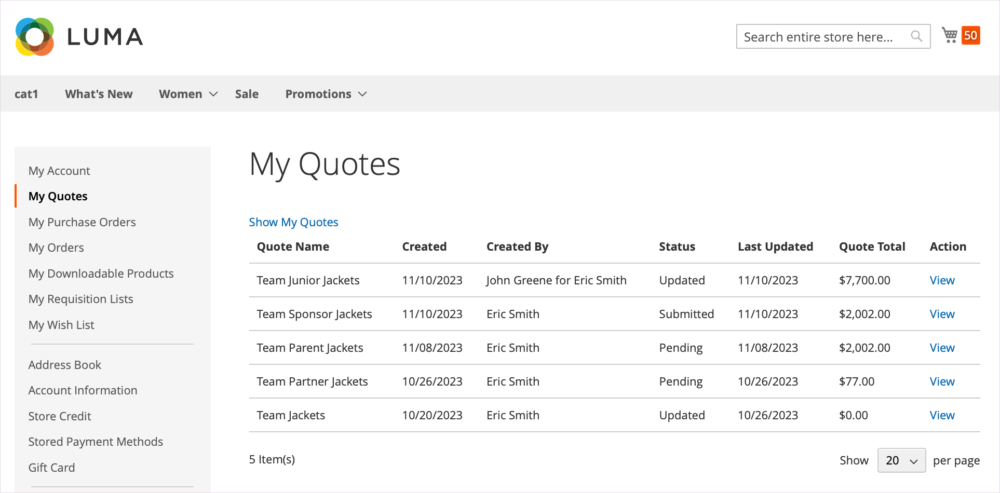
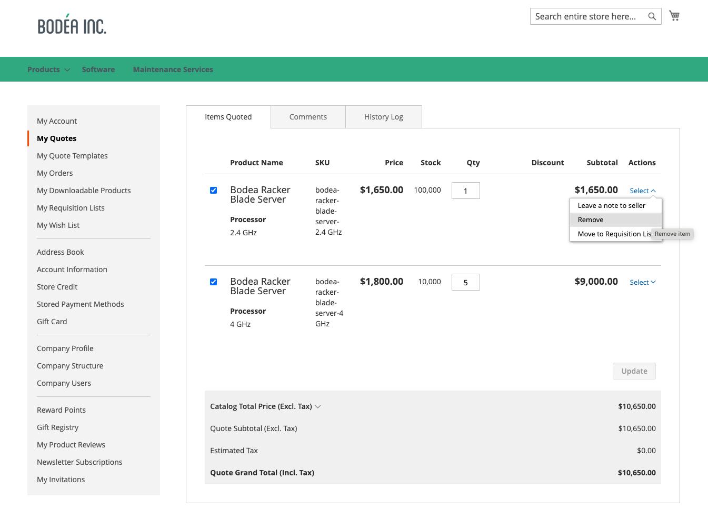

# [!UICONTROL My Quotes]

見積もりが有効になっている場合、顧客アカウントダッシュボードの&#x200B;_[!UICONTROL My Quotes]_&#x200B;セクションには、顧客によって送信されたすべての見積もりが一覧表示されます。 権限に応じて、企業の代理で購入を行うバイヤーのみが、購入の価格を交渉するリクエストを送信できます。

{width="700" zoomable="yes"}

購入者は、ショッピングカートからの見積もりに対して[&#x200B; リクエストを送信](quote-request.md)することで、プロセスを開始します。 [交渉プロセス &#x200B;](quote-price-negotiation.md)中に、購入者と販売者の間でメールが交換されます。 購入者にとって、[!UICONTROL My Quotes] ページは、交渉プロセス中の購入者と販売者の間のすべてのコミュニケーションの中心です。 売り手が提供する交渉された価格を受け入れた買い手は、見積もりからチェックアウトページに直接進むことができます。 交渉済みの見積もりに追加の割引を追加することはできません。

見積もりを交渉する際、バイヤーには、見積もりを管理するか、見積もりの詳細を更新するにはいくつかのオプションがあります。

* 見積の管理に関連するアクション：

   * 見積のコピーを作成
   * 見積を閉じる
   * 見積の削除
   * 引用符の名前を変更
   * 見積の印刷
   * テンプレートの作成

* 見積の詳細を更新するためのアクション：

   * 価格とアップデートの確認
   * [!UICONTROL Comments]および[!UICONTROL History] セクションからの交渉処理を追跡します
   * 見積を変更して項目を削除する
   * 行項目および見積レベルでメモを追加することで、販売者とコミュニケーションを取り、交渉します
   * 配送先住所を追加
   * 品目を購買リストに移動
   * 条件が許容可能な場合は、見積もりを注文に変換します

* 交渉中の一般的なアクション：

   * 販売者に見積もりを送信してレビューする
   * チェックアウトに進む

次の例は、購入者によって更新され、レビューのために販売者に返送された見積もりを示しています。

{width="700" zoomable="yes"}

`Updated` ステータスの見積は、販売者が見積を返すまでロックされます。

## 引用符を表示

役割[&#128279;](account-company-roles-permissions.md)に必要な権限を持つ会社アカウントに関連付けられたバイヤーは、[下位ユーザー](account-company-structure.md)が要求した見積もりを表示できます。 会社の管理者は、会社アカウントのすべての見積もりを表示できます。

1. 購入者はストアフロントのアカウントにログインします。

1. 左側のナビゲーションで&#x200B;**[!UICONTROL My Quotes]**&#x200B;をクリックします。

1. 作成したすべての見積もりを表示するには、**[!UICONTROL Show My Quotes]** リンクをクリックします（会社管理者または下位ユーザーを含むアカウントにのみ表示されます）。

1. すべての会社ユーザーの見積もりを表示するには、**[!UICONTROL Show All Quotes]**&#x200B;をクリックします。

## 見積の表示

1. 購入者はアカウントにログインします。

1. 左側のパネルで、**[!UICONTROL My Quotes]**&#x200B;を選択します。

1. リスト内の見積もりを検索し、_[!UICONTROL Action]_&#x200B;列の&#x200B;**[!UICONTROL View]**&#x200B;をクリックします。

## 見積のコピー

1. 購入者はストアフロントの自社アカウントにログインします。

1. 左側のパネルで、**[!UICONTROL My Quotes]**&#x200B;を選択します。

1. リスト内の目的の見積もりを検索してアクセスし、元の見積もりから&#x200B;**[!UICONTROL Create Copy]**&#x200B;をクリックします。

## テンプレートを作成

1. 購入者はアカウントにログインします。

1. 左側のパネルで、**[!UICONTROL My Quote Templates]**&#x200B;を選択します。

1. **[!UICONTROL My Quotes]** リストで見積もりを検索し、_[!UICONTROL Action]_&#x200B;列の&#x200B;**[!UICONTROL Create Quote Template]**&#x200B;をクリックします。

## 見積書から購買リストへの行項目の移動

1. 購入者はアカウントにログインします。

1. 左側のパネルで、**[!UICONTROL My Quotes]**&#x200B;を選択します。

1. リスト内の目的の見積もりを検索してアクセスします。

1. 行項目を選択します。

1. _[!UICONTROL Actions]_&#x200B;ドロップダウンで「**[!UICONTROL Move to Requisition list]**」をクリックします。

1. 既存の購買依頼リストを選択して、選択した品目を移動します。

1. **[!UICONTROL Move item]**&#x200B;をクリックします。

このプロセスについて詳しくは、[商品を購買リストに追加](requisition-lists.md)を参照してください。

>[!NOTE]
>
> アイテムを移動する際に、新しい購買グループを作成することはできません。 アイテムは、既存の購買リストにのみ移動できます。

## 行項目を新しい見積もりに移動

1. 購入者はアカウントにログインします。

1. 左側のパネルで、**[!UICONTROL My Quotes]**&#x200B;を選択します。

1. リスト内の目的の見積もりを検索してアクセスします。

1. 行項目を選択します。

1. _[!UICONTROL Actions]_&#x200B;ドロップダウンで「**[!UICONTROL Move item to new quote]**」をクリックします。

1. モーダルで新しい引用符に名前を付けます。

1. 選択した項目を新しい見積に移動するには、**[!UICONTROL Move to quote]**&#x200B;を選択します。

>[!NOTE]
>
> 複数の項目を選択すると、モーダルは&#x200B;**[!UICONTROL Move selected items to new quote]**&#x200B;として表示されます。

## 配送先住所の追加

1. 購入者はアカウントにログインします。

1. 左側のパネルで、**[!UICONTROL My Quotes]**&#x200B;を選択します。

1. 目的の引用符を選択します。

1. **[!UICONTROL Shipping Information]** セクションで、**[!UICONTROL Add New Address]**&#x200B;をクリックします。

1. 新しい住所の詳細を入力します。

1. **[!UICONTROL Save Address]**&#x200B;をクリックします。

バイヤーが住所を追加すると、売り手は配送オプションと配達オプションを提供します。 これらの更新は、交渉された見積もりの価格に影響を与える可能性があります。 配送オプションはチェックアウト時にロックされます。

## 見積の印刷

1. _[!UICONTROL Items Quoted]_&#x200B;セクションの右側にあるオープン見積もりで、購入者は&#x200B;**[!UICONTROL Print]**&#x200B;をクリックします。

1. **[!UICONTROL Destination]**&#x200B;をプリンターまたはPDFとして確認します。

1. **[!UICONTROL Print]**&#x200B;をクリックします。

## 見積もり依頼のキャンセル

1. 「見積もり項目」セクションのすぐ上の開いた見積もりで、「**[!UICONTROL Close quote]**」をクリックします。

   リクエストがキャンセルされ、見積もりステータスが`Closed`に変わります。 クローズした見積は引用符のリストに残り、管理者の&#x200B;_[!UICONTROL Quotes]_&#x200B;グリッドに表示されます。

1. 引用符のリストからキャンセルされた引用符を削除するには、**[!UICONTROL Delete]**&#x200B;をクリックします。

1. 確認を求められたら、**[!UICONTROL OK]**&#x200B;をクリックします。

   クローズした見積が引用符のリストから削除されます。 ただし、管理画面の&#x200B;_[!UICONTROL Quotes]_&#x200B;グリッドには`Closed` ステータスで表示されたままになります。

## 見積もりアクション

| アクション | 説明 |
|---------------|------------------------------------------------------------------------------------------------------------------------------------------------------------------------------------------------------------------------------|
| 名前を変更 | 見積の名前を変更 |
| コピーを作成 | 購入者は、コピーして名前を変更することで、現在の見積もりから見積もりを作成できます。 |
| 見積を閉じる | バイヤーが見積もりをクローズした後、それを再度開くことはできません。 必要に応じて、購入者は[!UICONTROL Create Copy] アクションを使用して再作成できます。 見積もり状態が`Draft`の場合、このオプションは使用できません。 |
| テンプレートを作成 | 現在の見積もりに基づいて見積テンプレートを作成します。 見積テンプレート複数の見積に適用できる契約条件と価格条件に関して、購入者と販売者が合意できるようにすることで、見積もり交渉を合理化します。  契約書では、見積もり依頼（RFQ）プロセスを再開する代わりに、後続の注文に対して、テンプレートから事前承認済みのリンクされた見積もりを生成できます。 |
| 見積の削除 | 購入者が見積もりを削除すると、見積もりはシステムから削除され、使用できなくなります。 |
| 印刷 | 見積書をPDFとして保存する印刷フォームを開くか、設定したプリンタに印刷します。 |

## 列の説明

| 列 | 説明 |
|-------------------------|-------------------------------------------------------------------------------------------------------------------------------------------------------------------------------------------------------------------------------------------------------------------------------------------------------------------------------------------------------------------------------------------------------------------------------------------------------------------------------------------------------------------------------------------------------------------------------------------------------------------------------------------------------------------------------------------------------------------------------------------------------------------------------------------------------------------------------------------------------------------------------------------------------------------------------------------------------------------------------------------------------------------------------------------------------------------------------------------------------------------------------------------------------------------------------------------------------------------------------------------------------------------------------------------------------------------------------------------------------------------------------------------------------------------------------------------------------------------------------------------------------------------------------------------------------------------------------------------------------------------------------------------------------------------------------------------------------------------------------------------------------------------------------------------------------------------------------------------------------------------------------------------------------------------------------------------------------------------------------------------------------------------------------------------------------------------------------------------------------------------------------------------------------------------------------------------------------------------------------------------------------------------------------------------------------------------------------------------------------------------------------------------------------------------------------------------------------------------------------------------------------------------------------------------|
| [!UICONTROL Quote Name] | 購入者が見積もり依頼に割り当てた名前。 |
| [!UICONTROL Created] | 見積もり依頼が最初に送信された日付。 |
| [!UICONTROL Created By] | 見積もり要求を送信した購入者の姓と名。 |
| [!UICONTROL Status] | 見積のステータスを示します。 見積もりのステータスは、購入者または販売者の行動によってのみ変更できます。 **[!UICONTROL Submitted]**– 見積の購入者の要求は、まだ販売者によって開かれていません。 この状態でも、バイヤーは見積もり依頼を変更できます。 使用可能なアクション：`View` / `Close` / `Edit Quantity` / `Delete SKU` / `Add Comments` / `Edit Shipping Address` **[!UICONTROL Pending]** – 販売者はリクエストを開き、それを確認して応答を準備しています。 使用可能なアクション：`View` / `Close`  **[!UICONTROL Updated]**– 販売者が購入者に応答を送信し、_[!UICONTROL Proceed to Checkout]_&#x200B;ボタンが有効になっています。 この状態でも、バイヤーは見積もりを変更し続けることができます。 使用可能なアクション：`View` / `Send for Review` / `Proceed to Checkout` / `Delete Quote` / `Close` / `Edit Quantity` / `Delete SKU` / `Add comments` / `Edit Shipping Address` **[!UICONTROL Open]**– 購入者は引き続き見積もりを更新しており、_[!UICONTROL Proceed to Checkout]_ ボタンは無効になっています。 使用可能なアクション：`View` / `Send for Review` / `Delete Quote` / `Edit quantity` / `Delete SKU` / `Add Comments` / `Edit Shipping Address`  **[!UICONTROL Ordered]**– 購入者は交渉済みの見積もりに基づいて注文を送信しました。 見積書はロックされており、編集できません。 使用可能なアクション：ビュー **[!UICONTROL Closed]** – 購入者は交渉を終了し、見積もりをキャンセルしました。 見積はロックされ、買い手または売り手によって編集することはできません。 使用可能なアクション：`View` / `Delete`  **[!UICONTROL Declined]**– 販売者は、見積もりの要求を拒否したか、交渉中に変更を提案しました。 見積もりは、ワークフローのどの段階でも辞退することができます。 任意のカスタム価格設定は見積もりから削除されます。 バイヤーは、見積もりの編集を続行して再送信したり、標準カタログ価格で購入したりできます。 使用可能なアクション：`View` / `Send for Review` / `Delete Quote` / `Edit Quantity` / `Delete SKU` / `Add Comments` / `Edit Shipping Address` **[!UICONTROL Expired]** – 見積もりの有効期間が終了しました。 提案された価格はリセットされます。 バイヤーは、標準的なカタログ価格にもとづいて購入を完了するか、別のラウンド交渉を開始することができます。 使用可能なアクション：`View` / `Send for Review` / `Delete Quote` / `Edit Quantity` / `Delete SKU` / `Add Comments` / `Edit Shipping Address` |

{style="table-layout:auto"}
