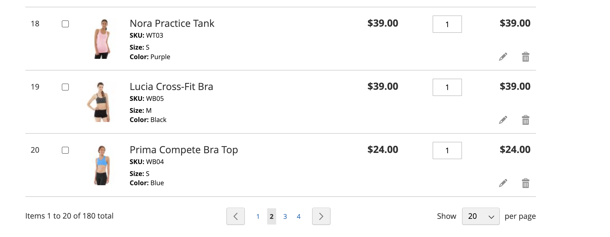
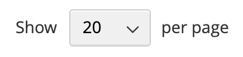

# [!UICONTROL My Requisition Lists]

商品リストを管理する主な理由は、商品を容易に再注文できるようにすることです。 許可された顧客は、ショッピングカートに追加することで、商品リストから簡単に商品を再注文したり、商品をリストから別のリストに移動したりコピーしたりできます。

{width="700" zoomable="yes"}

## 購買グループを開く

1. 顧客は、アカウント ダッシュボードから&#x200B;**[!UICONTROL My Requisition Lists]**&#x200B;を選択します。

1. 開く購買リストを探し、**[!UICONTROL View]**&#x200B;をクリックして、次のいずれかの操作を行います。

### 商品をカートに追加

1. お客様は、次のいずれかの操作を行って、追加する製品を選択します。

   - 各項目のチェックボックスを選択します。
   - **[!UICONTROL Select All]**&#x200B;をクリックします。

1. 買い物かごに追加する&#x200B;**[!UICONTROL Qty]**&#x200B;を入力します。

1. 製品オプションを変更するには、次の操作を行います。

   - 行項目で、_編集_ （）アイコンをクリックします。
   - 必要なオプションを変更します。
   - **[!UICONTROL Update Requisition List]**&#x200B;をクリックします。

1. **[!UICONTROL Add to Cart]**&#x200B;をクリックします。

   {width="700" zoomable="yes"}

### 項目を別のリストにコピー

1. お客様は、移動する各アイテムのチェックボックスを選択します。

1. **[!UICONTROL Copy Selected]**&#x200B;をクリックし、次のいずれかの操作を行います。

   - 既存の購買リストを選択します。
   - **[!UICONTROL Create New Requisition List]**&#x200B;をクリックします。

### リストの書き出し

1. お客様は、書き出す購買リストを開きます。

1. **[!UICONTROL Export]** リンクをクリックします。

Adobe Commerceは、`sku`および`qty`個の値を含むCSV リストを生成してダウンロードします。

### 項目を別のリストに移動

1. お客様は、移動する各アイテムのチェックボックスを選択します。

1. **[!UICONTROL Move Selected]**&#x200B;をクリックし、次のいずれかの操作を行います。

   - 既存の購買リストを選択します。
   - **[!UICONTROL Create New Requisition List]**&#x200B;をクリックします。

### リストを印刷

1. リストの右上隅で、顧客は&#x200B;**[!UICONTROL Print]**&#x200B;をクリックします。

1. 出力デバイスを確認し、**[!UICONTROL Print]**&#x200B;をクリックします。

   {width="500" zoomable="yes"}

### 製品オプションの編集

リスト内の製品オプションを編集するには、お客様は次の操作を行います。

1. _鉛筆_ （）アイコンをクリックして、製品ページを開きます。

1. 必要なオプションを変更します。

1. **[!UICONTROL Update Requisition List]**&#x200B;をクリックします。

   {width="700" zoomable="yes"}

購買リストの製品は、次の場合に編集できます。

- 製品には&#x200B;**[!UICONTROL all options set]**&#x200B;が含まれています（この製品が購買リストの[設定済み製品](../catalog/product-create-configurable.md)の場合）。

  製品は&#x200B;**[!UICONTROL added to this Requisition List]**&#x200B;です。

- 製品は[&#x200B; オプション付きのシンプルな製品](../catalog/settings-advanced-custom-options.md)です

- 製品タイプでは編集が許可されています。

### 項目を削除

1. お客様は、削除する各アイテムのチェックボックスを選択します。

1. **[!UICONTROL Remove Selected]**&#x200B;をクリックします。

1. 確認を求められたら、**[!UICONTROL Delete]**&#x200B;をクリックします。

### リスト名の変更

1. リストのタイトルの後、顧客は&#x200B;**[!UICONTROL Rename]**&#x200B;をクリックします。

1. 別の&#x200B;**[!UICONTROL Requisition List Name]**&#x200B;を入力します。

1. **[!UICONTROL Save]**&#x200B;をクリックします。

   {width="300"}

### 購買リストの削除

1. お客様は、削除する購買グループを開きます。

1. **[!UICONTROL Delete Requisition List]**&#x200B;をクリックします。

1. 確認を求められたら、**[!UICONTROL Delete]**&#x200B;をクリックします。

>[!NOTE]
>
>この操作は元に戻せません。

## アクション

| アクション | 説明 |
|--- |--- |
| [!UICONTROL Rename] | 購買リストの名前を変更し、説明を更新できます。 |
| [!UICONTROL Export] | 要求リストをCSV ファイルに書き出します。 |
| [!UICONTROL Print] | 現在の購買リストを印刷します。 |
| [!UICONTROL Select] | アクションの対象となる項目の選択を管理します。 **[!UICONTROL Select All]**– 購買リストのすべての項目を選択します。 **[!UICONTROL Remove Selected]** – 選択したすべての項目を購買リストから削除します。 **[!UICONTROL Copy Selected]**– 選択したすべての項目を別の購買リストにコピーします。 |
| [!UICONTROL Add to Cart] | 選択したアイテムをショッピングカートに追加します。 |
| [!UICONTROL Update List] | 数量の変更を反映するために小計を再計算します。 |
| [!UICONTROL Delete Requisition List] | 会社ユーザーのアカウントから購買リストを削除します。 |

{style="table-layout:auto"}

## ページネーション制御

ページ管理は、購買リストのアイテムの合計数が、ページごとに選択したアイテム数を超えると、リストの下部に表示されます。

{width="700" zoomable="yes"}

>[!NOTE]
>
> 注意が必要な製品（在庫切れなど）がページネーションの現在のページ内に含まれる場合は、リストの上部に表示されます。注意が必要な製品の数は、リストの上に表示されます。
> {width="500"}

### ストアフロントのページネーション制御

| 制御 | 説明 |
|----------------------------------------------------------------|----------------------------------------------------------------------------------------------------------------------------------------------------------------------------------|
|  | [!UICONTROL Show Per Page] - 1 ページあたりの購買リスト項目の数を指定します。 20、50、100、500、または1000の購買リスト項目を選択して、ページに表示できます。 |
|  | [!UICONTROL Pagination links] – 他のページへのナビゲーションリンクを提供します。 |