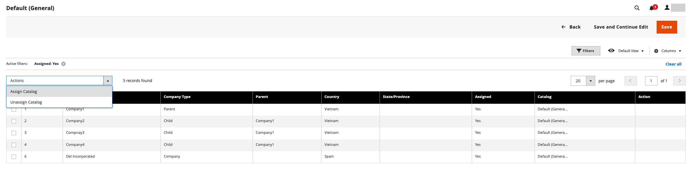

# 共有カタログへの会社の割り当て

会社を共有カタログに割り当てる方法は 2 つあります。 _[!UICONTROL Shared Catalogs]_&#x200B;グリッドから割り当てを行うか、顧客グループを選択する場合と同様に会社を編集して共有カタログを割り当てることができます。

{width="700" zoomable="yes"}

## 方法 1：共有カタログから会社を割り当てる

1. _管理者_ サイドバーで、**[!UICONTROL Catalog]**/**[!UICONTROL Shared Catalogs]** に移動します。

1. 会社を割り当てるグリッド内の共有カタログについて、「**[!UICONTROL Action]**」列に移動して「**[!UICONTROL Assign Companies]**」を選択します。

   使用可能な会社のリストがグリッドに表示されます。

1. 共有カタログに割り当てる会社を選択し、[**[!UICONTROL Actions]**] メニューをクリックして [**[!UICONTROL Assign Catalog]**] を選択します。

   {width="700" zoomable="yes"}

   または、カタログに割り当てられていない会社の「**[!UICONTROL Action]**」列の **[!UICONTROL Assign]** をクリックすることもできます。

1. 共有カタログに割り当てる会社ごとに繰り返します。

   会社が共有カタログに割り当てられます。

1. 完了したら、「**[!UICONTROL Save]**」をクリックします。

## 方法 2：会社を編集する

1. _管理者_ サイドバーで、**[!UICONTROL Customers]**/**[!UICONTROL Companies]** に移動します。

1. グリッドに表示される会社について、「**[!UICONTROL Action]**」列に移動し、「**[!UICONTROL Edit]**」をクリックします。

   {width="700" zoomable="yes"}

1. 会社ページで、下にスクロールして「**[!UICONTROL Advanced Settings]**」セクションの  を展開します。

1. **[!UICONTROL Customer Group]** を適切な共有カタログに設定します。

   共有カタログの割り当てを変更すると、すべての会社メンバーの顧客グループの割り当ても変更されます。

   {width="600"}

1. 確認を求めるメッセージが表示されたら、「**[!UICONTROL Proceed]**」をクリックし、**[!UICONTROL Save]** をクリックします。
