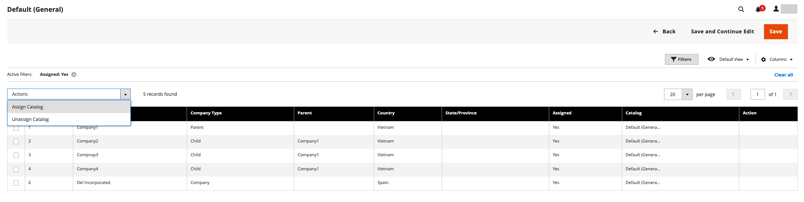

# 共有カタログへの会社の割り当て

共有カタログに会社を割り当てる方法は2つあります。 _[!UICONTROL Shared Catalogs]_グリッドから割り当てをおこなうか、会社を編集して、顧客グループを選択する際に共有カタログを割り当てることができます。

{width="700" zoomable="yes"}

## 方法1：共有カタログから会社を割り当てる

1. _管理者_ サイドバーで、**[!UICONTROL Catalog]** > **[!UICONTROL Shared Catalogs]**&#x200B;に移動します。

1. 会社を割り当てるグリッド内の共有カタログの場合は、**[!UICONTROL Action]**&#x200B;列に移動し、**[!UICONTROL Assign Companies]**&#x200B;を選択します。

   使用可能な会社のリストがグリッドに表示されます。

1. 共有カタログに割り当てる会社を選択し、**[!UICONTROL Actions]** メニューをクリックして、**[!UICONTROL Assign Catalog]**&#x200B;を選択します。

   {width="700" zoomable="yes"}

   別の方法として、カタログに割り当てられていない会社の&#x200B;**[!UICONTROL Action]**&#x200B;列の&#x200B;**[!UICONTROL Assign]**&#x200B;をクリックできます。

1. 共有カタログに割り当てる各会社に対して、この手順を繰り返します。

   会社は共有カタログに割り当てられます。

1. 完了したら、**[!UICONTROL Save]**&#x200B;をクリックします。

## 方法2：会社を編集する

1. _管理者_ サイドバーで、**[!UICONTROL Customers]** > **[!UICONTROL Companies]**&#x200B;に移動します。

1. グリッドに表示されている会社の場合は、**[!UICONTROL Action]**&#x200B;列に移動し、**[!UICONTROL Edit]**&#x200B;をクリックします。

   {width="700" zoomable="yes"}

1. 会社ページで、下にスクロールして、**[!UICONTROL Advanced Settings]** セクションを展開します。

1. **[!UICONTROL Customer Group]**&#x200B;を適切な共有カタログに設定します。

   共有カタログの割り当てを変更すると、すべての会社メンバーに対する顧客グループの割り当ても変更されます。

   {width="600"}

1. 確認を求められたら、**[!UICONTROL Proceed]**&#x200B;をクリックし、**[!UICONTROL Save]**&#x200B;をクリックします。
