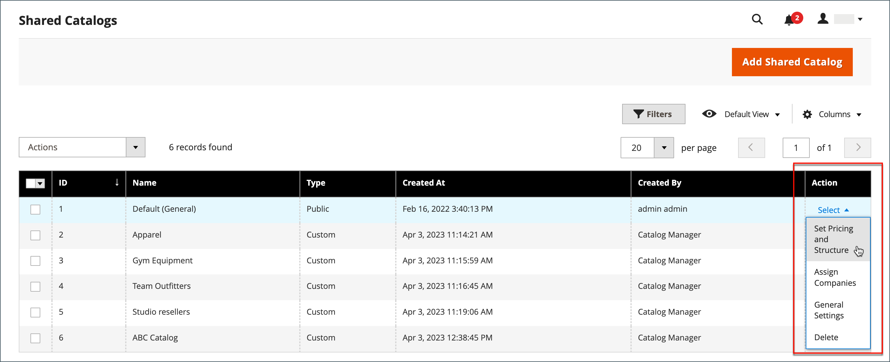
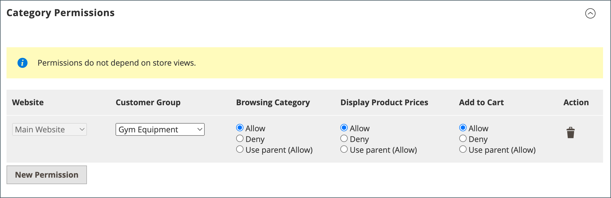
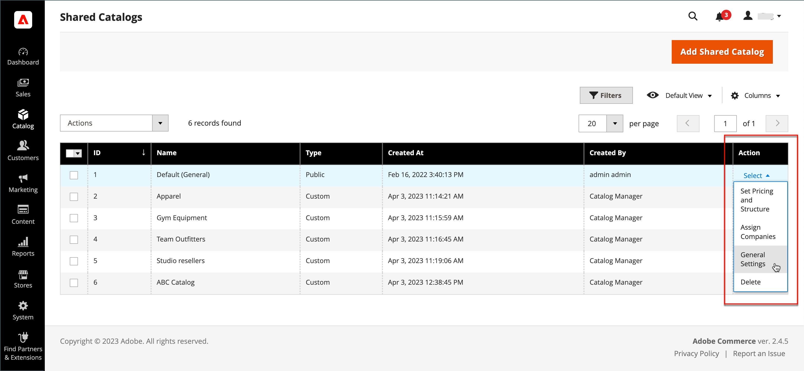
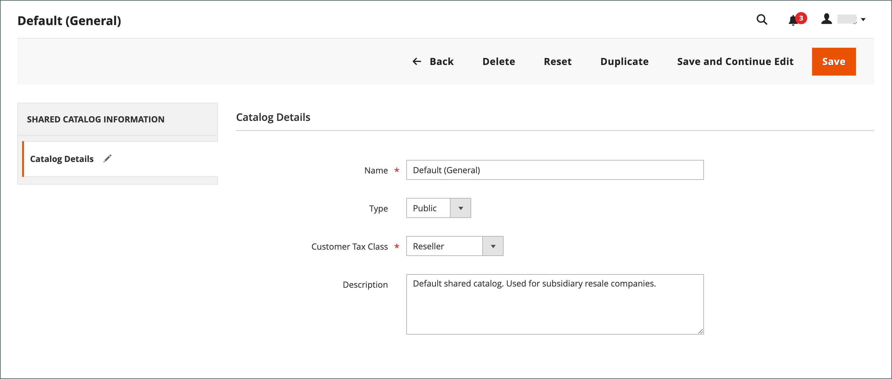

# 共有カタログの管理

_[!UICONTROL Shared Catalogs]_ページでは、共有カタログの管理に必要なツールにアクセスできます。 このページは、フィルターとアクションコントロールを備えた標準的な管理者ワークスペースに似ています。 グリッドには、デフォルトのパブリック共有カタログを含むすべての共有カタログと、設定したカスタムカタログが一覧表示されます。

## 製品の選択を更新

共有カタログ内の商品の選択は、共有カタロググリッドの&#x200B;_[!UICONTROL Action]_列から簡単に更新できます。 変更は、関連する会社アカウントのメンバーに対して表示されます。 このプロセスは、設定の範囲を変更できないという点を除いて、基本的に、新しい[ カタログ構造](catalog-shared-pricing-structure.md)の製品を選択する場合と同じです。

1. _管理者_ サイドバーで、**[!UICONTROL Catalog]** > **[!UICONTROL Shared Catalogs]**&#x200B;に移動します。

1. グリッド内の共有カタログの場合は、**[!UICONTROL Action]**&#x200B;列に移動し、**[!UICONTROL Set Pricing and Structure]**&#x200B;を選択します。

   {width="700" zoomable="yes"}

1. [手順2：製品を選択](catalog-shared-pricing-structure.md#step-2-choose-the-products)の指示に従います。

   最初のアイテムはスキップできます。共有カタログの範囲は、初めて保存した後に変更できません。

特定の製品を使用している場合、_[!UICONTROL Products In Shared Catalog]_セクションには、製品が使用可能な各共有カタログが一覧表示されます。 詳しくは、[共有カタログに商品を追加](catalog-shared-product-add.md)を参照してください。

共有カタログ内の{width="600" zoomable="yes"}

## カスタム価格の更新

共有カタログ内の製品のカスタム価格は、共有カタログ グリッドの「アクション」列から簡単に更新できます。 変更は、関連する会社または顧客グループのメンバーに対して、ストアフロントで表示されます。 このプロセスは、設定の範囲を変更できないことを除いて、新しい[共有カタログ ](catalog-shared-pricing-structure.md)のカスタム価格の設定と基本的に同じです。

1. _管理者_ サイドバーで、**[!UICONTROL Catalog]** > **[!UICONTROL Shared Catalogs]**&#x200B;に移動します。

1. 更新するグリッド内の共有カタログの場合は、**[!UICONTROL Action]**&#x200B;列に移動し、**[!UICONTROL Set Pricing and Structure]**&#x200B;を選択します。

1. _[!UICONTROL Catalog Structure]_ページで、**[!UICONTROL Configure]**をクリックし、次のいずれかの操作を行います。

   - ページの上部にある進行状況インジケーターで、**[!UICONTROL Pricing]**&#x200B;をクリックします。
   - 右上隅の「**[!UICONTROL Next]**」をクリックします。

1. [手順3: カスタム価格を設定](catalog-shared-pricing-structure.md#step-3-set-custom-prices)の手順に従います。

## カテゴリ権限の更新

カテゴリ ツリーから共有カタログに追加された製品の[ カテゴリ権限](../catalog/category-permissions.md)は、自動的に`Allow`に設定されます。 必要に応じて、後で権限を調整したり、追加のルールを作成したりできます。

>[!NOTE]
>
>**[B2B リリース 1.3.0](release-notes.md#b2b-v130)以降** – 共有カタログを作成する場合、カタログの各[ カテゴリ権限](../catalog/category-permissions.md)は、カタログ権限設定でこのアクセスが割り当てられている顧客グループの&#x200B;_[!UICONTROL Display Product Prices]_および_[!UICONTROL Add to Cart]_&#x200B;に対して`Allow`に設定されます。 以前は、カタログ権限が`Allow`に設定されていても、これらの設定は自動的に`Deny`に設定されていました。

>[!IMPORTANT]
>
>**_[!UICONTROL Shared Catalog]_**&#x200B;機能が有効になっている場合、既存の[ グループ権限設定](../configuration-reference/catalog/catalog.md#category-permissions)はすべて、カタログ内の&#x200B;**_すべての_** カテゴリーで無視されます。 [!UICONTROL Shared Catalog]は、カタログが有効になっている場合に、カタログ内のすべてのカテゴリ権限を完全に制御します。

1. _管理者_ サイドバーで、**[!UICONTROL Catalog]** > **[!UICONTROL Categories]**&#x200B;に移動します。

1. カテゴリーツリーで、更新する製品のカテゴリを選択します。

   すべての製品を含めるには、ツリーの最上位カテゴリを選択します。

1. 下にスクロールして、**[!UICONTROL Category Permissions]** セクションのを展開します。

1. **[!UICONTROL New Permission]**&#x200B;をクリックし、次の操作を行います。

   {width="600" zoomable="yes"}

   - 共有カタログに対応する&#x200B;**[!UICONTROL Customer Group]**&#x200B;を選択し、必要に応じて権限設定を変更します。

     {width="600" zoomable="yes"}

   - 別の顧客グループの権限ルールを作成するには、**[!UICONTROL New Permissions]**&#x200B;をクリックして、プロセスを繰り返します。

   - 権限ルールを削除するには、_削除_  アイコンをクリックします。

1. 完了したら、**[!UICONTROL Save]**&#x200B;をクリックします。

## カタログの詳細を更新

共有カタログの詳細情報は、共有カタログ グリッドの「アクション」列から簡単に更新できます。 変更は、関連する会社アカウントに反映されます。

{width="700" zoomable="yes"}

1. _管理者_ サイドバーで、**[!UICONTROL Catalog]** > **[!UICONTROL Shared Catalogs]**&#x200B;に移動します。

1. 更新する共有カタログの場合は、**[!UICONTROL Action]**&#x200B;列に移動し、**[!UICONTROL General Settings]**&#x200B;を選択します。

   {width="600" zoomable="yes"}

1. 必要に応じて、カタログの詳細情報を更新します。

   - 共有カタログの名前を変更すると、対応する顧客グループの名前も変更されます。
   - カタログの種類を`Custom`から`Public`に変更すると、既存のパブリック カタログがカスタム カタログに変換されます。 元の公開カタログに関連付けられている会社は、置き換えに再割り当てされます。 パブリックカタログをカスタムカタログに変換することはできません。

1. 完了したら、**[!UICONTROL Save]**&#x200B;をクリックします。

## 共有カタログページ参照

### ボタンバー

| ボタン | 説明 |
|--- |--- |
| [!UICONTROL Back] | 新しい共有カタログを保存せずに、共有カタログページに戻ります。 |
| [!UICONTROL Delete] | カタログを削除し、関連する会社とそのメンバーをパブリック共有カタログに再割り当てします。 |
| [!UICONTROL Reset] | 保存されていない変更のフォームを消去し、元のカタログの詳細情報を復元します。 |
| [!UICONTROL Duplicate] | カタログの[複製コピー](catalog-shared-create.md)を作成します。 カスタムカタログの場合は、元の価格設定モデルと構造が使用されますが、会社の関連付けはありません。 公開されている共有カタログが複製されると、複製されたカタログの種類は`custom`に変更されます。 対応する顧客グループも、重複カタログと同じ名前で作成されます。 デフォルトでは、重複したカタログには、元のカタログの&#x200B;_個の_&#x200B;重複という名前が付けられます。 |
| [!UICONTROL Save and Continue Edit] | すべての変更を保存し、フォームを編集モードで開いたままにします。 |
| [!UICONTROL Save] | 変更を保存し、フォームを閉じて、共有カタログ ページに戻ります。 |

{style="table-layout:auto"}

### カタログの詳細

| フィールド | 説明 |
|--- |--- |
| [!UICONTROL Name] | 管理者全体および利用可能な顧客アカウント内の共有カタログを識別します。 カタログ名は説明的で、32文字以下にする必要があります。 同じ名前の2つの共有カタログを持つことはできません。 最大文字数：32 |
| [!UICONTROL Type] | **[!UICONTROL Custom]** – 割り当てられた特定の企業のみが利用できるカスタム価格設定のカタログを識別します。 **[!UICONTROL Public]**– すべてのゲスト訪問者と、会社に関連付けられていないログイン顧客が利用できる共有カタログを識別します。 「デフォルト」の公開共有カタログは、Adobe Commerce B2Bのインストール時に作成されますが、管理者が設定する必要があります。 一度に存在できる公開共有カタログは1つだけです。 |
| [!UICONTROL Customer Tax Class] | カタログから作成された購入に使用される税区分を指定します。 オプションには、使用可能なすべての税区分が含まれます。 |
| [!UICONTROL Description] | カタログの使用方法を簡単に説明します。 |

{style="table-layout:auto"}
