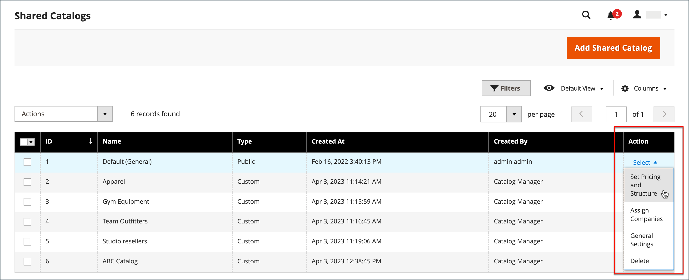

# 共有カタログの管理

この _[!UICONTROL Shared Catalogs]_ページでは、共有カタログの管理に必要なツールにアクセスできます。 このページは、フィルターとアクションコントロールを備えた、標準の管理ワークスペースに似ています。 グリッドには、既定のパブリック共有カタログを含むすべての共有カタログと、設定したカスタム カタログが一覧表示されます。

## 製品選択を更新

任意の共有カタログ内の製品の選択は、から簡単に更新できます _[!UICONTROL Action]_共有カタログ グリッドの列。 加えた変更は、関連する会社アカウントのメンバーに表示されます。 このプロセスは、基本的に、新しい製品を選択するのと同じです [カタログの構造](catalog-shared-pricing-structure.md)ただし、設定の範囲は変更できません。

1. 日 _Admin_ サイドバー、に移動 **[!UICONTROL Catalog]** > **[!UICONTROL Shared Catalogs]**.

1. グリッド内の共有カタログについては、 **[!UICONTROL Action]** 列と選択 **[!UICONTROL Set Pricing and Structure]**.

   {width="700" zoomable="yes"}

1. の指示に従います。 [手順 2：製品の選択](catalog-shared-pricing-structure.md#step-2-choose-the-products).

   共有カタログの範囲は、最初に保存した後は変更できないので、最初の項目はスキップできます。

特定の製品を使用している場合、 _[!UICONTROL Products In Shared Catalog]_「」に、製品を使用できる各共有カタログのリストを示します。 詳しくは、 [共有カタログへの製品の追加](catalog-shared-product-add.md).

{width="600" zoomable="yes"}

## カスタム価格の更新

任意の共有カタログ内の製品のカスタム価格は、共有カタロググリッドの「アクション」列から簡単に更新できます。 加えた変更は、関連する会社または顧客グループのメンバーに対して、ストアフロントのに表示されます。 このプロセスは、基本的に、新しいのカスタム価格を設定するのと同じです [共有カタログ](catalog-shared-pricing-structure.md)ただし、設定の範囲は変更できません。

1. 日 _Admin_ サイドバー、に移動 **[!UICONTROL Catalog]** > **[!UICONTROL Shared Catalogs]**.

1. 更新するグリッド内の共有カタログについて、 **[!UICONTROL Action]** 列と選択 **[!UICONTROL Set Pricing and Structure]**.

1. 日 _[!UICONTROL Catalog Structure]_ページ、クリック&#x200B;**[!UICONTROL Configure]**次のいずれかの操作を行います。

   - ページ上部の進捗状況インジケーターで、 **[!UICONTROL Pricing]**.
   - 右上隅のをクリックします。 **[!UICONTROL Next]**.

1. の指示に従います。 [手順 3：カスタム価格の設定](catalog-shared-pricing-structure.md#step-3-set-custom-prices).

## カテゴリ権限の更新

[カテゴリ権限](../catalog/category-permissions.md) は自動的にに設定されます。 `Allow` カテゴリツリーから共有カタログに追加された製品の場合。 必要に応じて、後で権限を調整したり、追加のルールを作成したりできます。

>[!NOTE]
>
>**[B2B リリース 1.3.0](release-notes.md#b2b-v130) 以降**  – 共有カタログを作成する場合、次の各項目 [カテゴリ権限](../catalog/category-permissions.md) カタログがに設定されている場合 `Allow` の場合 _[!UICONTROL Display Product Prices]_および_[!UICONTROL Add to Cart]_ カタログ権限設定でこのアクセス権が割り当てられている顧客グループの場合。 以前は、これらの設定は、自動的にに設定されていました `Deny` カタログの権限がに設定されている場合でも `Allow`.

>[!IMPORTANT]
>
>既存のすべて [グループ権限設定](../configuration-reference/catalog/catalog.md#category-permissions) は無視されます **_all_** 次の場合にカタログのカテゴリ **_[!UICONTROL Shared Catalog]_** この機能は有効です。 [!UICONTROL Shared Catalog] カタログが有効な場合、カタログのすべてのカテゴリ権限を完全に制御します。

1. 日 _Admin_ サイドバー、に移動 **[!UICONTROL Catalog]** > **[!UICONTROL Categories]**.

1. カテゴリツリーで、更新する製品のカテゴリを選択します。

   すべての製品を含めるには、ツリーの最上位カテゴリを選択します。

1. 下にスクロールして展開  この **[!UICONTROL Category Permissions]** セクション。

1. クリック **[!UICONTROL New Permission]** 次の手順を実行します。

   {width="600" zoomable="yes"}

   - を選択します。 **[!UICONTROL Customer Group]** これは共有カタログに対応し、必要に応じて権限設定を変更します。

     {width="600" zoomable="yes"}

   - 別の顧客グループの権限ルールを作成するには、 **[!UICONTROL New Permissions]** そしてプロセスを繰り返します。

   - 権限ルールを削除するには、 _削除_  アイコン。

1. 完了したら、 **[!UICONTROL Save]**.

## カタログの詳細を更新

共有カタログの詳細情報は、共有カタログ グリッドの [ アクション ] 列から簡単に更新できます。 加えた変更は、関連するすべての会社アカウントに反映されます。

{width="700" zoomable="yes"}

1. 日 _Admin_ サイドバー、に移動 **[!UICONTROL Catalog]** > **[!UICONTROL Shared Catalogs]**.

1. 更新する共有カタログについて、 **[!UICONTROL Action]** 列と選択 **[!UICONTROL General Settings]**.

   {width="600" zoomable="yes"}

1. 必要に応じて、カタログの詳細情報を更新します。

   - 共有カタログの名前を変更すると、対応する顧客グループの名前も変更されます。
   - カタログのタイプをから変更しています `Custom` 対象： `Public` 既存の公開カタログをカスタムカタログに変換します。 元の公開カタログに関連付けられているすべての会社が、置き換え後のカタログに再割り当てされます。 公開カタログをカスタムカタログに変換することはできません。

1. 完了したら、 **[!UICONTROL Save]**.

## 共有カタログページの参照

### ボタンバー

| ボタン | 説明 |
|--- |--- |
| [!UICONTROL Back] | 新しい共有カタログを保存せずに、共有カタログ ページに戻ります。 |
| [!UICONTROL Delete] | カタログを削除し、関連付けられている会社とそのメンバーを公開共有カタログに再割り当てします。 |
| [!UICONTROL Reset] | 未保存の変更のフォームをクリアし、元のカタログの詳細情報を復元します。 |
| [!UICONTROL Duplicate] | を作成 [カタログのコピーを複製](catalog-shared-create.md). カスタムカタログの場合、元のカタログの価格モデルと構造（ただし会社の関連付けはありません）。 公開共有カタログが複製されると、複製されたカタログのタイプがに変わります。 `custom`. 対応する顧客グループも、重複するカタログと同じ名前で作成されます。 デフォルトでは、重複するカタログの名前はです _次の重複_ 元のカタログ。 |
| [!UICONTROL Save and Continue Edit] | すべての変更を保存し、フォームを編集モードで開いたままにします。 |
| [!UICONTROL Save] | 変更を保存し、フォームを閉じて、共有カタログ ページに戻ります。 |

{style="table-layout:auto"}

### カタログの詳細

| フィールド | 説明 |
|--- |--- |
| [!UICONTROL Name] | 管理者全体、および共有カタログが使用可能な顧客アカウントで共有カタログを識別します。 カタログ名は、説明的で 32 文字以下にする必要があります。 同じ名前の 2 つの共有カタログを持つことはできません。 最大文字数：32 |
| [!UICONTROL Type] | **[!UICONTROL Custom]**  – 割り当てられている特定の会社のみが使用できるカスタム価格のカタログを識別します。 **[!UICONTROL Public]**– すべてのゲスト訪問者と、ログインした企業に関連付けられていない顧客が使用できる共有カタログを識別します。 「デフォルト」の公開共有カタログは、Adobe Commerce用 B2B のインストール時に作成されますが、管理者による設定が必要です。 一度に存在できる公開共有カタログは 1 つだけです。 |
| [!UICONTROL Customer Tax Class] | カタログから行われた購入に使用する税クラスを決定します。 オプションには、使用可能なすべての税金クラスが含まれます。 |
| [!UICONTROL Description] | カタログの使用方法の簡単な説明。 |

{style="table-layout:auto"}
