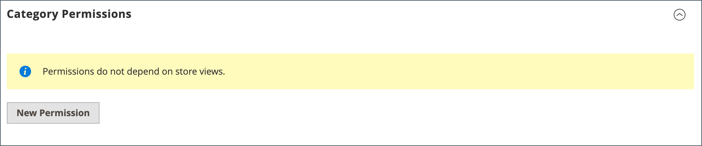

# 共有カタログの管理

_[!UICONTROL Shared Catalogs]_&#x200B;ページでは、共有カタログの管理に必要なツールにアクセスできます。 このページは、フィルターとアクションコントロールを備えた、標準の管理ワークスペースに似ています。 グリッドには、既定のパブリック共有カタログを含むすべての共有カタログと、設定したカスタム カタログが一覧表示されます。

## 製品選択を更新

任意の共有カタログ内の製品の選択は、共有カタログ グリッドの _[!UICONTROL Action]_&#x200B;列から簡単に更新できます。 加えた変更は、関連する会社アカウントのメンバーに表示されます。 このプロセスは、設定の範囲を変更できないことを除いて、基本的に、新しい [ カタログ構造 ](catalog-shared-pricing-structure.md) の製品を選択する場合と同じです。

1. _管理者_ サイドバーで、**[!UICONTROL Catalog]**/**[!UICONTROL Shared Catalogs]** に移動します。

1. グリッド内の共有カタログの場合は、[**[!UICONTROL Action]**] 列に移動して [**[!UICONTROL Set Pricing and Structure]**] を選択します。

   {width="700" zoomable="yes"}

1. [ 手順 2：製品を選択 ](catalog-shared-pricing-structure.md#step-2-choose-the-products) の指示に従います。

   共有カタログの範囲は、最初に保存した後は変更できないので、最初の項目はスキップできます。

特定の製品を使用している場合は、_[!UICONTROL Products In Shared Catalog]_&#x200B;のセクションに製品が使用可能な各共有カタログのリストが表示されます。 詳しくは、[ 共有カタログへの製品の追加 ](catalog-shared-product-add.md) を参照してください。

{width="600" zoomable="yes"}

## カスタム価格の更新

任意の共有カタログ内の製品のカスタム価格は、共有カタロググリッドの「アクション」列から簡単に更新できます。 加えた変更は、関連する会社または顧客グループのメンバーに対して、ストアフロントのに表示されます。 このプロセスは、設定の範囲を変更できないことを除けば、基本的に新しい [ 共有カタログ ](catalog-shared-pricing-structure.md) のカスタム価格を設定するのと同じです。

1. _管理者_ サイドバーで、**[!UICONTROL Catalog]**/**[!UICONTROL Shared Catalogs]** に移動します。

1. 更新するグリッド内の共有カタログについて、「**[!UICONTROL Action]**」列に移動して「**[!UICONTROL Set Pricing and Structure]**」を選択します。

1. _[!UICONTROL Catalog Structure]_&#x200B;ページで「**[!UICONTROL Configure]**」をクリックし、次のいずれかの操作を行います。

   - ページ上部の進行状況インジケーターで、[**[!UICONTROL Pricing]**] をクリックします。
   - 右上隅の「**[!UICONTROL Next]**」をクリックします。

1. [ 手順 3：カスタム価格の設定 ](catalog-shared-pricing-structure.md#step-3-set-custom-prices) の手順に従います。

## カテゴリ権限の更新

カテゴリツリーから共有カタログに追加された製品については、[ カテゴリ権限 ](../catalog/category-permissions.md) が自動的に `Allow` に設定されます。 必要に応じて、後で権限を調整したり、追加のルールを作成したりできます。

>[!NOTE]
>
>**[B2B リリース 1.3.0](release-notes.md#b2b-v130) 以降** – 共有カタログを作成すると、カタログの各 [ カテゴリ権限 ](../catalog/category-permissions.md) は、_[!UICONTROL Display Product Prices]_&#x200B;の `Allow` に設定され、カタログ権限設定でこのアクセス権が割り当てられた顧客グループの&#x200B;_[!UICONTROL Add to Cart]_ に設定されます。 以前は、カタログ権限が `Deny` に設定されている場合でも、これらの設定は自動的に `Allow` に設定されていました。

>[!IMPORTANT]
>
>**_[!UICONTROL Shared Catalog]_** 機能が有効な場合、既存のすべての [ グループ権限設定 ](../configuration-reference/catalog/catalog.md#category-permissions) は、カタログ内の **_すべて_** カテゴリで無視されます。 カタログ [!UICONTROL Shared Catalog] 有効にすると、カタログのすべてのカテゴリ権限が完全に制御されます。

1. _管理者_ サイドバーで、**[!UICONTROL Catalog]**/**[!UICONTROL Categories]** に移動します。

1. カテゴリツリーで、更新する製品のカテゴリを選択します。

   すべての製品を含めるには、ツリーの最上位カテゴリを選択します。

1. 下にスクロールして、「**[!UICONTROL Category Permissions]**」セクションの  を展開します。

1. 「**[!UICONTROL New Permission]**」をクリックして、次の操作を実行します。

   {width="600" zoomable="yes"}

   - 共有カタログに対応する **[!UICONTROL Customer Group]** を選択し、必要に応じて権限設定を変更します。

     {width="600" zoomable="yes"}

   - 別の顧客グループの権限ルールを作成するには、「**[!UICONTROL New Permissions]**」をクリックして手順を繰り返します。

   - 権限ルールを削除するには、「_削除_ アイコンをクリックします。

1. 完了したら、「**[!UICONTROL Save]**」をクリックします。

## カタログの詳細を更新

共有カタログの詳細情報は、共有カタログ グリッドの [ アクション ] 列から簡単に更新できます。 加えた変更は、関連するすべての会社アカウントに反映されます。

{width="700" zoomable="yes"}

1. _管理者_ サイドバーで、**[!UICONTROL Catalog]**/**[!UICONTROL Shared Catalogs]** に移動します。

1. 更新する共有カタログについて、「**[!UICONTROL Action]**」列に移動して「**[!UICONTROL General Settings]**」を選択します。

   {width="600" zoomable="yes"}

1. 必要に応じて、カタログの詳細情報を更新します。

   - 共有カタログの名前を変更すると、対応する顧客グループの名前も変更されます。
   - カタログタイプを `Custom` から `Public` に変更すると、既存の公開カタログがカスタムカタログに変換されます。 元の公開カタログに関連付けられているすべての会社が、置き換え後のカタログに再割り当てされます。 公開カタログをカスタムカタログに変換することはできません。

1. 完了したら、「**[!UICONTROL Save]**」をクリックします。

## 共有カタログページの参照

### ボタンバー

| ボタン | 説明 |
|--- |--- |
| [!UICONTROL Back] | 新しい共有カタログを保存せずに、共有カタログ ページに戻ります。 |
| [!UICONTROL Delete] | カタログを削除し、関連付けられている会社とそのメンバーを公開共有カタログに再割り当てします。 |
| [!UICONTROL Reset] | 未保存の変更のフォームをクリアし、元のカタログの詳細情報を復元します。 |
| [!UICONTROL Duplicate] | [ カタログの複製コピー ](catalog-shared-create.md) を作成します。 カスタムカタログの場合、元のカタログの価格モデルと構造（ただし会社の関連付けはありません）。 公開共有カタログが複製されると、複製されたカタログのタイプが `custom` に変わります。 対応する顧客グループも、重複するカタログと同じ名前で作成されます。 デフォルトでは、複製したカタログの名前は元のカタログの _複製_ になります。 |
| [!UICONTROL Save and Continue Edit] | すべての変更を保存し、フォームを編集モードで開いたままにします。 |
| [!UICONTROL Save] | 変更を保存し、フォームを閉じて、共有カタログ ページに戻ります。 |

{style="table-layout:auto"}

### カタログの詳細

| フィールド | 説明 |
|--- |--- |
| [!UICONTROL Name] | 管理者全体、および共有カタログが使用可能な顧客アカウントで共有カタログを識別します。 カタログ名は、説明的で 32 文字以下にする必要があります。 同じ名前の 2 つの共有カタログを持つことはできません。 最大文字数：32 |
| [!UICONTROL Type] | **[!UICONTROL Custom]** – 割り当てられている特定の会社のみが使用できるカスタム価格のカタログを識別します。 **[!UICONTROL Public]**– すべてのゲスト訪問者と、ログインした企業に関連付けられていない顧客が使用できる共有カタログを識別します。 「デフォルト」の公開共有カタログは、Adobe Commerce B2B のインストール時に作成されますが、管理者による設定が必要です。 一度に存在できる公開共有カタログは 1 つだけです。 |
| [!UICONTROL Customer Tax Class] | カタログから行われた購入に使用する税クラスを決定します。 オプションには、使用可能なすべての税金クラスが含まれます。 |
| [!UICONTROL Description] | カタログの使用方法の簡単な説明。 |

{style="table-layout:auto"}
