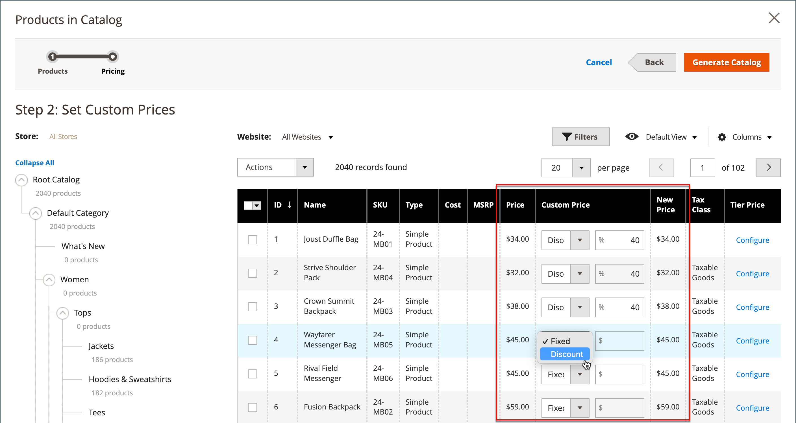
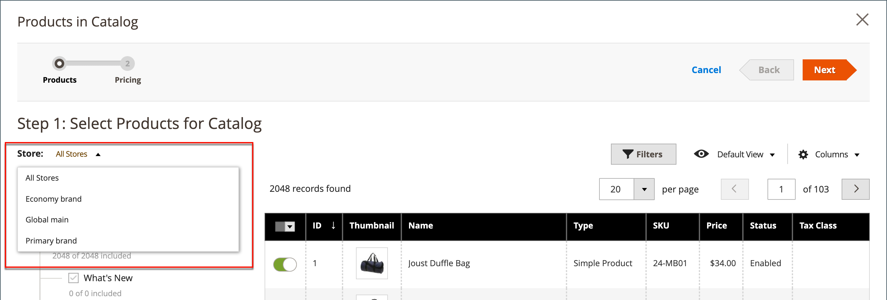
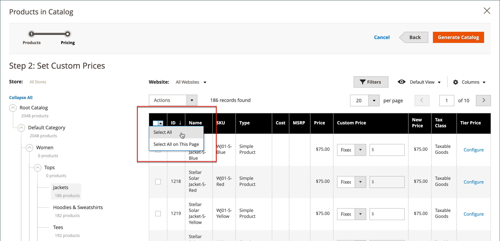
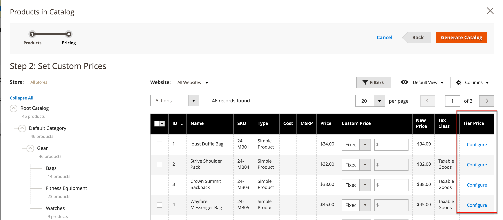
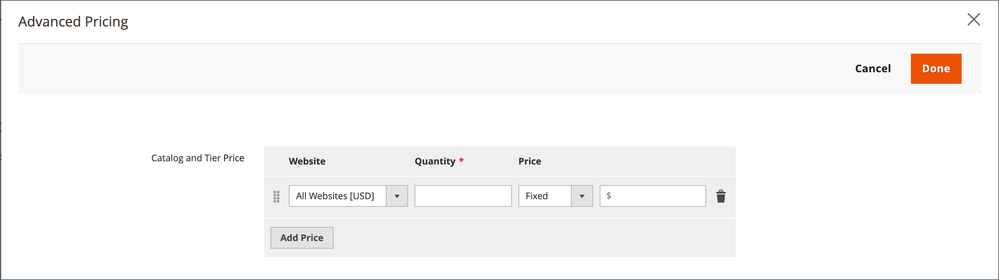

# 共有カタログの価格と構造を設定

共有カタログの価格設定と構造を設定するには、2つの手順を踏みます。 プロセス内の現在の場所は、ページ上部のプログレスバーに番号が表示されてハイライト表示されます。 進行状況バーをクリックすると、いつでもプロセスの他の手順を表示できます。 例えば、価格設定をカスタマイズする場合は、商品選択ページに戻って参照することができます。 ページの上部にある進行状況バーの「**[!UICONTROL Products]**」をクリックし、「**[!UICONTROL Pricing]**」をクリックしてカスタム価格ページに戻ります。 作業はこのプロセスで失われることはありません。

カタログ内の{width="700" zoomable="yes"}

標準カテゴリーツリーでは、ルートカテゴリが最も上位のコンテナであり、サンプルデータでは&#x200B;_デフォルトのカテゴリ_&#x200B;と呼ばれます。 ただし、共有カタログが有効になっている場合、カテゴリーツリーには&#x200B;_ルートカタログ_&#x200B;という外部コンテナがあります。 ルートカタログには、システム内に存在するその他すべてのカテゴリ構造が含まれます。 詳しくは、[&#x200B; カタログ スコープ &#x200B;](../catalog/introduction.md#catalog-scope)を参照してください。

## 手順1：共有カタログの価格と構造の設定を開く

1. _管理者_ サイドバーで、**[!UICONTROL Catalog]** > **[!UICONTROL Shared Catalogs]**&#x200B;に移動します

1. グリッド内の共有カタログの場合は、_[!UICONTROL Action]_&#x200B;列に移動し、**[!UICONTROL Set Pricing and Structure]**&#x200B;をクリックします。

   {width="700" zoomable="yes"}

1. 共有カタログを初めて設定する場合は、**[!UICONTROL Configure]**&#x200B;をクリックして次の手順に進みます。

## ステップ 2：製品の選択

このプロセスの最初の手順は、共有カタログに含める製品を選択することです。 製品選択ページの左側には[&#x200B; カテゴリツリー](../catalog/category-create.md)が表示され、右側には製品グリッドが同期されています。 ツリー内のカテゴリをクリックすると、カテゴリ内の商品がグリッドに表示されます。

共有カタログをストアフロントから表示すると、選択した製品を持つカテゴリのみが[&#x200B; トップナビゲーション &#x200B;](../catalog/navigation-top.md)に表示されます。 デフォルトでは、ストアフロントナビゲーションには最初の3つのカテゴリーレベルのみが含まれ、ルートカテゴリは含まれません。

1. **ストア**&#x200B;の選択ツールを使用して、設定の[&#x200B; スコープ &#x200B;](../catalog/introduction.md#product-scope)を設定します。

   設定の範囲は、共有カタログを初めて保存する前にのみ設定できます。 後で製品選択を編集する場合は、ストア選択ツールは使用できません。

   {width="600" zoomable="yes"}

1. カテゴリーツリーで、次のいずれかの操作を行います。

   - すべての製品を含めるには、**[!UICONTROL Select all]**&#x200B;をクリックするか、親カテゴリのチェックボックスを選択します。
   - 特定の商品カテゴリを含めるには、含める各カテゴリのチェックボックスを選択します。
   - 個々の製品を含めるまたは除外するには、製品のチェックボックスを選択または選択解除します。

   ツリー内の各カテゴリの下の表記法には、共有カタログに現在含まれているカテゴリの製品数が表示されます。 [&#x200B; ルートカテゴリ &#x200B;](../catalog/category-root.md)の下の表記法には、共有カタログに現在選択されているすべてのカテゴリの製品の合計数が表示されます。

1. カテゴリ製品をグリッドで表示するには、ツリー内のカテゴリの名前をクリックします。 カテゴリを選択すると、次のことが発生します。

   - グリッドの最初の列の切り替えスイッチは、選択した製品ごとに緑色の&#x200B;_On_&#x200B;の位置に設定されます。
   - 製品が複数のカテゴリに割り当てられていて、いずれかのカテゴリで選択されていない場合、その製品は他のカテゴリを通じて引き続き利用でき、[&#x200B; カタログ検索](../catalog/search.md)を使用する場合も利用できます。
   - 選択した製品に対して[&#x200B; カテゴリ権限](../catalog/category-permissions.md)から`Allow`が自動的に設定されます。

1. 必要に応じて、フィルターとその他のグリッドコントロールを使用して、共有カタログに含める商品を見つけます。

   最初の列の切替スイッチをクリックして、個々の製品を個別に選択または省略できます。

   CMS コンテンツまたは外部リンクにリンクされている商品がないカテゴリを選択した場合、そのカテゴリはストアフロントの上部ナビゲーションに表示されます。

   設定を保存するまで、カテゴリ設定はデータベースに永続的に記録されません。 ただし、構造と価格設定に関する作業を行うと、一時的に保存されます。

1. **[!UICONTROL Next]**&#x200B;をクリックします。

   {width="600" zoomable="yes"}

## ステップ 3：カスタム価格の設定

製品ごとにカスタム価格を個別に設定することも、_[!UICONTROL Action]_&#x200B;コントロールを使用して、複数の製品レコードに対して固定額または割合としてカスタム価格を設定することもできます。

- **[!UICONTROL Fixed]**：最終製品価格を指定します。 例えば、10.00 ドルの固定価格を入力した場合、対応する会社のストアフロントの価格は10.00 ドルになります。

  >[!NOTE]
  >
  >基本価格と入力された固定値の間の最小値は、最終製品価格として使用されます。

  >[!NOTE]
  >
  >**_固定価格_**&#x200B;製品のカスタマイズ可能なオプションは、グループ価格、階層価格、特別価格、カタログ価格のルールの影響を受ける&#x200B;_not_&#x200B;です。

- **[!UICONTROL Percentage]**：割引率に基づいてカスタム価格を決定します。 例えば、10%の割引を提供するには、カスタム価格タイプを`Percentage`に設定し、`10`と入力します。 割引価格のカスタムプライスは、元の製品価格の90%。

次の製品タイプの割引を固定額または割合に設定するには、グリッドの&#x200B;_[!UICONTROL Custom Price]_&#x200B;列を使用します。

- [&#x200B; シンプル &#x200B;](../catalog/product-create-simple.md) （設定可能な製品バリエーションを含む）
- [バンドル](../catalog/product-create-bundle.md)
- [ダウンロード可能](../catalog/product-create-downloadable.md)
- [バーチャル](../catalog/product-create-virtual.md)

[&#x200B; コンフィグ可能](../catalog/product-create-configurable.md)および[&#x200B; グループ化](../catalog/product-create-grouped.md)製品タイプと[&#x200B; ギフトカード &#x200B;](../catalog/product-gift-card-create.md)の場合、カスタム価格列は空白です。

グリッド内の商品の選択を&#x200B;_カスタム価格_ ページから変更することはできません。 ただし、ページの上部にある進行状況インジケーターを使用して、前の手順に戻り、製品の選択を変更することができます。

{width="600" zoomable="yes"}

### カスタム価格の適用

1. マルチサイト インストールの場合は、カスタム価格が適用されるweb サイトに&#x200B;**[!UICONTROL Website]**&#x200B;を設定します。

   {width="600" zoomable="yes"}

1. 次のいずれかの方法を使用して、カスタム価格が適用される製品を選択します。

   - カテゴリーツリーを使用して、特定のカテゴリのすべての製品を選択します。
   - ヘッダーの&#x200B;_[!UICONTROL Mass Actions]_&#x200B;コントロールを`Select All`に設定します。
   - 個々の製品のチェックボックスを選択します。

   グリッドには現在選択されているカテゴリの製品が表示され、標準コントロールを使用して製品を検索し、リストをフィルタリングできます。

   {width="600" zoomable="yes"}

1. **[!UICONTROL Actions]**&#x200B;を次のいずれかに設定します：

   - `Set Discount` – 選択したすべての製品に割引率を適用します。 影響を受ける各製品価格は、**_割引_**&#x200B;価格として表示されます。
   - `Adjust Fixed Price` – 選択したすべての製品に固定価格割引率を適用します。 影響を受ける各製品価格は、**_調整済み固定価格_**&#x200B;として表示されます。

   {width="600" zoomable="yes"}

1. プロンプトが表示されたら、割引または価格調整を入力し、**[!UICONTROL Apply]**&#x200B;をクリックします。

   {width="400"} 

   {width="400"}

   選択したすべての商品に割引が適用され、_カスタム価格_&#x200B;列には、適用された割引と金額の種類が反映されます。

   {width="600" zoomable="yes"}

### 価格の適用

[階層の価格設定](../catalog/product-price-tier.md)では、共有カタログ内の商品に対して数量割引を提供できます。 グリッドの&#x200B;_階層の価格_&#x200B;列には、共有カタログに特に適用される&#x200B;_詳細な価格_ オプションへのリンクが含まれています。 製品に価格設定が既に含まれている場合、既存の階層の数は、リンクの後の括弧内に表示されます。

次の手順では、1つの製品に階層価格を適用する方法を示します。 複数の製品に価格設定を適用するには、[価格設定の読み込み](../systems/data-import-price-tier.md)を参照してください。

1. グリッド内の商品について、_階層の価格_&#x200B;列に移動し、**[!UICONTROL Configure]**&#x200B;をクリックします。

   {width="600" zoomable="yes"}

1. _詳細価格_ ページで、**[!UICONTROL Add Price]**&#x200B;をクリックし、次の操作を行います。

   {width="600" zoomable="yes"}

   - **[!UICONTROL Website]**&#x200B;を階層価格が適用されるweb サイトに設定します。
   - 割引を受けるために購入する必要がある製品の数量を入力します。
   - **[!UICONTROL Price]**&#x200B;を次のいずれかの割引タイプに設定します。
      - `Fixed`
      - `Discount`
   - 割引額を入力します。
   - 別の階層を入力するには、**価格を追加**&#x200B;をクリックし、このプロセスを繰り返して次の階層を定義します。

   {width="600" zoomable="yes"}

1. 完了したら、**[!UICONTROL Done]**&#x200B;をクリックします。

   グリッドでは、階層の数が&#x200B;_[!UICONTROL Tier Price]_&#x200B;列の括弧内に表示されます。

   {width="600" zoomable="yes"}

## 構造と価格を保存

カスタム価格が完了したら、**[!UICONTROL Generate Catalog]**、**[!UICONTROL Save]**&#x200B;の順にクリックします。

共有カタログがデータベースに保存されます。 その名前は、_[!UICONTROL Products]_&#x200B;グリッドの&#x200B;_[!UICONTROL Shared Catalog]_&#x200B;列に表示されます。 次の手順は、[共有カタログを会社](./catalog-shared-assign-companies.md)に割り当てることです。
