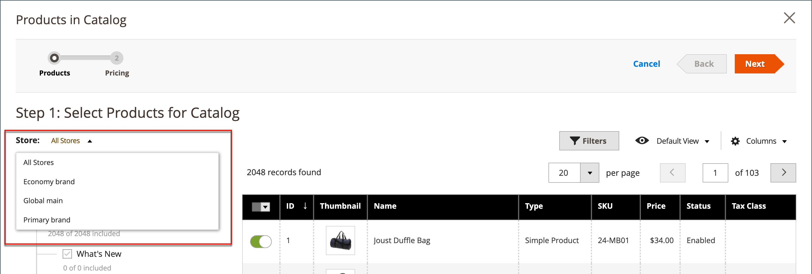

# 共有カタログの価格と構造の設定

共有カタログの価格と構造を設定するには、次の 2 つの手順があります。 プロセス内の現在の場所がハイライト表示され、ページ上部のプログレスバーに数字が表示されます。 進行状況バーをクリックすると、プロセスの他のステップをいつでも表示できます。 例えば、カスタム価格を設定している場合は、製品選択ページに戻って参照することができます。 ページ上部のプログレスバーで **[!UICONTROL Products]** をクリックし、**[!UICONTROL Pricing]** をクリックしてカスタム価格ページに戻ります。 このプロセスではあなたの仕事は失われません。

{width="700" zoomable="yes"}

標準のカテゴリツリーでは、ルートカテゴリが最上位のコンテナであり、サンプルデータでは _デフォルトカテゴリ_ と呼ばれます。 ただし、共有カタログが有効な場合、カテゴリ ツリーには &lbrack; ルート カタログ _という外側のコンテナが_ ります。 ルート カタログには、システムに存在するその他すべてのカテゴリ構造が含まれます。 詳しくは、[ カタログ範囲 ](../catalog/introduction.md#catalog-scope) を参照してください。

## 手順 1：共有カタログの価格と構造の設定を開く

1. _管理者_ サイドバーで、**[!UICONTROL Catalog]**/**[!UICONTROL Shared Catalogs]** に移動します。

1. グリッド内の共有カタログの場合は、_[!UICONTROL Action]_&#x200B;の列に移動して [**[!UICONTROL Set Pricing and Structure]**] をクリックします。

   {width="700" zoomable="yes"}

1. 共有カタログを初めて設定するときは、「**[!UICONTROL Configure]**」をクリックして次の手順を続行します。

## 手順 2：製品を選択する

プロセスの最初の手順は、共有カタログに含める製品を選択することです。 製品選択ページでは、左側に [ カテゴリツリー ](../catalog/category-create.md)、右側に同期済み製品グリッドが表示されます。 ツリーでカテゴリをクリックすると、カテゴリ内の製品がグリッドに表示されます。

共有カタログをストアフロントから表示した場合、選択された製品を含むカテゴリのみが [ 上部のナビゲーション ](../catalog/navigation-top.md) に表示されます。 デフォルトでは、ストアフロントナビゲーションには最初の 3 つのカテゴリレベルのみが含まれ、ルートカテゴリは含まれません。

1. **ストア** 選択を使用して、設定の [ スコープ ](../catalog/introduction.md#product-scope) を設定します。

   設定の範囲は、共有カタログが初めて保存される前にのみ設定できます。 後で製品の選択を編集する場合、ストアの選択は使用できません。

   {width="600" zoomable="yes"}

1. カテゴリ ツリーで、次のいずれかの操作を行います。

   - すべての製品を含めるには、**[!UICONTROL Select all]** をクリックするか、親カテゴリのチェックボックスをオンにします。
   - 製品の特定のカテゴリを含めるには、含める各カテゴリのチェックボックスをオンにします。
   - 個々の製品を含めるか除外するには、製品のチェックボックスを選択または選択解除します。

   ツリーの各カテゴリの下の表記は、共有カタログに現在含まれているカテゴリの製品数を示しています。 [ ルートカテゴリ ](../catalog/category-root.md) の下の表記には、共有カタログに対して現在選択されているすべてのカテゴリの製品の合計数が表示されます。

1. グリッドにカテゴリ製品を表示するには、ツリーでカテゴリの名前をクリックします。 カテゴリを選択すると、次の処理が行われます。

   - グリッドの最初の列の切替スイッチは、選択した各製品の緑の _オン_ 位置に設定されます。
   - 製品が複数のカテゴリに割り当てられ、そのいずれかで選択されていない場合、他のカテゴリからも、また [ カタログ検索 ](../catalog/search.md) を使用しても、その製品を使用できます。
   - 選択した製品の [ カテゴリ権限 ](../catalog/category-permissions.md) が自動的に `Allow` に設定されます。

1. 必要に応じて、フィルターやその他のグリッド コントロールを使用して、共有カタログに含める製品を検索します。

   最初の列の切り替えをクリックして、個々の製品を個別に選択または除外できます。

   製品を持たないが、CMS コンテンツまたは外部リンクにリンクされているカテゴリを選択した場合、そのカテゴリはストアフロントの上部のナビゲーションに表示されます。

   作成したカテゴリ設定は、設定が保存されるまで、永続的にはデータベースに記録されません。 ただし、構造と価格を操作する際には、これらは一時的に保存されます。

1. 「**[!UICONTROL Next]**」をクリックします。

   {width="600" zoomable="yes"}

## 手順 3：カスタム価格の設定

各製品に対して個別にカスタム価格を設定するか、_[!UICONTROL Action]_&#x200B;のコントロールを使用して、複数の製品レコードに対して固定金額または割合でカスタム価格を設定できます。

- **[!UICONTROL Fixed]**：最終製品価格を指定します。 例えば、$10.00 の固定価格を入力した場合、対応する会社のストアフロントの価格は$10.00 です。

  >[!NOTE]
  >
  >基本価格と入力された固定値の間の最小値が、最終製品価格として使用されます。

  >[!NOTE]
  >
  >**_固定価格_** 製品カスタマイズ可能なオプションは、グループ価格、階層価格、特別価格、カタログ価格ルールの影響を _受けません_。

- **[!UICONTROL Percentage]**：割引率に基づいてカスタム価格を決定します。 例えば、10% の割引を提供するには、カスタム価格タイプを `Percentage` に設定して `10` と入力します。 値引きされるカスタム価格は、元の製品価格の 90% です。

次の商品タイプについて割引額を固定金額またはパーセンテージに設定するには、グリッドの _[!UICONTROL Custom Price]_&#x200B;列を使用します。

- [ シンプル ](../catalog/product-create-simple.md) （設定可能な製品バリエーションを含む）
- [バンドル](../catalog/product-create-bundle.md)
- [ダウンロード可能](../catalog/product-create-downloadable.md)
- [仮想](../catalog/product-create-virtual.md)

[ 設定可能 ](../catalog/product-create-configurable.md) および [ グループ化 ](../catalog/product-create-grouped.md) 製品タイプの場合や、[ ギフトカード ](../catalog/product-gift-card-create.md) の場合、「カスタム価格」列は空白になります。

グリッド内の製品の選択を _カスタム価格_ ページから変更することはできません。 ただし、ページの上部にある進行状況インジケーターを使用して、前のステップに戻り、製品の選択を変更することができます。

{width="600" zoomable="yes"}

### カスタム価格を適用

1. マルチサイトインストールの場合は、カスタムの価格が適用される web サイトの **[!UICONTROL Website]** を設定します。

   {width="600" zoomable="yes"}

1. 次のいずれかの方法を使用して、カスタム価格を適用する製品を選択します。

   - カテゴリツリーを使用して、特定のカテゴリに含まれるすべての製品を選択します。
   - ヘッダーの _[!UICONTROL Mass Actions]_&#x200B;コントロールを `Select All` に設定します。
   - 個々の製品のチェックボックスを選択します。

   グリッドには、現在選択されているカテゴリの製品が表示されます。標準のコントロールを使用して、製品を検索したり、リストをフィルタしたりできます。

   {width="600" zoomable="yes"}

1. **[!UICONTROL Actions]** を次のいずれかに設定します。

   - `Set Discount` – 選択したすべての製品に割引率を適用します。 影響を受ける各製品価格は、**_割引_** 価格として表示されます。
   - `Adjust Fixed Price` – 選択したすべての製品に固定価格割引率を適用します。 影響を受ける各製品価格は、**_調整済み固定_** 価格として表示されます。

   {width="600" zoomable="yes"}

1. プロンプトが表示されたら、割引または価格調整を入力し、「**[!UICONTROL Apply]**」をクリックします。

   {width="400"} 

   {width="400"}

   割引は選択したすべての製品に適用され、_カスタム価格_ 列は適用された割引のタイプと金額を反映します。

   {width="600" zoomable="yes"}

### 階層価格を適用

[ 階層の価格設定 ](../catalog/product-price-tier.md) を使用すると、共有カタログの製品に対して数量割引を提供できます。 グリッドの _階層価格_ 列には、共有カタログに特別に適用される _詳細価格_ オプションへのリンクが含まれています。 製品に既に階層の価格が含まれている場合、既存の階層の数がリンクの後の括弧内に表示されます。

次の手順は、1 つの製品に階層価格を適用する方法を示しています。 複数の製品に階層価格を適用するには、[ 階層価格のインポート ](../systems/data-import-price-tier.md) を参照してください。

1. グリッド内の製品について、「_Tier Price_」列に移動し、「**[!UICONTROL Configure]**」をクリックします。

   {width="600" zoomable="yes"}

1. _Advanced Pricing_ ページで「**[!UICONTROL Add Price]**」をクリックし、次の手順を実行します。

   {width="600" zoomable="yes"}

   - 階層価格が適用される web サイトに **[!UICONTROL Website]** を設定します。
   - 割引を受けるために購入する必要がある商品の数量を入力します。
   - 次のいずれかの割引タイプに **[!UICONTROL Price]** を設定します。
      - `Fixed`
      - `Discount`
   - 割引額を入力します。
   - 別の階層を入力するには、「**価格を追加**」をクリックし、手順を繰り返して次の階層を定義します。

   {width="600" zoomable="yes"}

1. 完了したら、「**[!UICONTROL Done]**」をクリックします。

   グリッドでは、階層の数が _[!UICONTROL Tier Price]_&#x200B;列の括弧内に表示されます。

   {width="600" zoomable="yes"}

## 構造と価格の保存

カスタム価格が設定されたら、**[!UICONTROL Generate Catalog]** をクリックして **[!UICONTROL Save]** をクリックします。

これで、共有カタログがデータベースに保存されました。 その名前は、_[!UICONTROL Products]_&#x200B;グリッドの&#x200B;_[!UICONTROL Shared Catalog]_ 列に表示されます。 次の手順は、[ 共有カタログを会社に割り当てる ](./catalog-shared-assign-companies.md) ことです。
