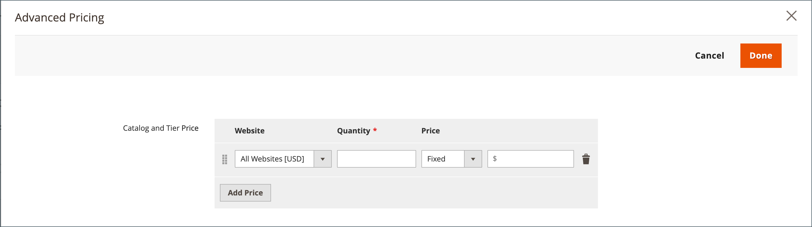

# 共有カタログの価格と構造を設定

共有カタログの価格と構造の設定は、2 段階のプロセスで行います。 プロセスの現在の場所が、ページ上部のプログレスバーに数字で強調表示されます。 進行状況バーをクリックすると、プロセス内の他のステップをいつでも表示できます。 例えば、カスタム価格を使用している場合は、参照用に製品選択ページに戻ることができます。 クリックするだけで **[!UICONTROL Products]** ページ上部のプログレスバーで、 **[!UICONTROL Pricing]** をクリックして、カスタム価格設定ページに戻ります。 このプロセスでは作業内容が失われません。

{width="700" zoomable="yes"}

標準カテゴリツリーでは、ルートカテゴリは最上位のコンテナで、 _デフォルトのカテゴリ_ をサンプルデータに含めます。 ただし、共有カタログを有効にすると、カテゴリツリーには、 _ルートカタログ_. ルートカタログには、システムに存在するその他すべてのカテゴリ構造が含まれます。 詳しくは、 [カタログの範囲](../catalog/introduction.md#catalog-scope).

## 手順 1：共有カタログの価格と構造の設定を開く

1. 次の日： _管理者_ サイドバー、移動 **[!UICONTROL Catalog]** > **[!UICONTROL Shared Catalogs]**

1. グリッド内の共有カタログについて、 _[!UICONTROL Action]_列とクリック&#x200B;**[!UICONTROL Set Pricing and Structure]**.

   {width="700" zoomable="yes"}

1. 共有カタログを初めて設定する場合は、「 **[!UICONTROL Configure]** をクリックして、次の手順に進みます。

## 手順 2：製品の選択

プロセスの最初の手順は、共有カタログに含める製品を選択することです。 製品選択ページには、 [カテゴリツリー](../catalog/category-create.md) 左側に、右側に同期された製品グリッドが表示されます。 ツリー内のカテゴリをクリックすると、そのカテゴリの製品がグリッドに表示されます。

選択した製品を含むカテゴリのみが [上部ナビゲーション](../catalog/navigation-top.md) 共有カタログがストアフロントから表示されたとき。 デフォルトでは、ストアフロントナビゲーションには、最初の 3 つのカテゴリレベルのみが含まれ、ルートカテゴリは含まれません。

1. 以下を使用します。 **ストア** 選択： [範囲](../catalog/introduction.md#product-scope) 設定の。

   設定の範囲は、共有カタログが初めて保存される前にのみ設定できます。 後で製品選択を編集した場合、ストア選択は使用できません。

   {width="600" zoomable="yes"}

1. カテゴリツリーで、次のいずれかの操作を行います。

   - すべての製品を含めるには、 **[!UICONTROL Select all]** または親カテゴリのチェックボックスをオンにします。
   - 特定の商品カテゴリを含めるには、含める各カテゴリのチェックボックスをオンにします。
   - 個々の製品を含めるか除外するには、製品のチェックボックスをオンまたはオフにします。

   ツリー内の各カテゴリの下の表記は、共有カタログに現在含まれているカテゴリの製品数を示します。 以下の表記 [ルートカテゴリ](../catalog/category-root.md) 共有カタログに対して現在選択されているすべてのカテゴリの製品の合計数を表示します。

1. グリッドにカテゴリ商品を表示するには、ツリーのカテゴリ名をクリックします。 カテゴリを選択すると、次のことが発生します。

   - グリッドの最初の列の切り替えは、緑に設定されます _オン_ 選択した各製品の位置。
   - 製品が複数のカテゴリに割り当てられ、いずれかで選択されていない場合、他のカテゴリからも使用でき、また、 [カタログ検索](../catalog/search.md).
   - システムが自動的にを設定 [カテゴリ権限](../catalog/category-permissions.md) から `Allow` 選択した製品の

1. 必要に応じて、フィルタや他のグリッドコントロールを使用して、共有カタログに含める商品を検索します。

   最初の列の切り替えをクリックして、個々の製品を個別に選択または省略できます。

   製品を含まないが CMS コンテンツや外部リンクにリンクされているカテゴリを選択した場合は、ストアフロントの上部のナビゲーションに表示されます。

   作成したカテゴリ設定は、設定が保存されるまで、データベースに永久に記録されません。 ただし、構造と価格設定の作業時に一時的に保存されます。

1. クリック **[!UICONTROL Next]**.

   {width="600" zoomable="yes"}

## 手順 3：カスタム価格を設定する

各製品に対して個別にカスタム価格を設定するか、 _[!UICONTROL Action]_複数の製品レコードに対する固定金額またはパーセンテージをカスタム価格に設定するコントロール。

- **[!UICONTROL Fixed]**：最終製品価格を指定します。 例えば、固定価格を$10.00 と入力した場合、対応する会社のストアフロントの価格は$10.00 になります。

  >[!NOTE]
  >
  >基本価格と入力した固定値との間の最小値が最終製品価格として使用されます。

  >[!NOTE]
  >
  >**_固定価格_** 製品のカスタマイズ可能なオプションは次のとおりです。 _not_ グループ価格、Tier Price、特別価格、またはカタログ価格のルールの影響を受けます。

- **[!UICONTROL Percentage]**：割引率に基づいてカスタム価格を決定します。 例えば、10%の割引をオファーするには、カスタム価格タイプをに設定します。 `Percentage` と入力します。 `10`. 割引のカスタム価格は、元の製品価格の 90%です。

次の製品タイプに対する割引を固定金額またはパーセンテージに設定するには、 _[!UICONTROL Custom Price]_グリッドの列：

- [シンプル](../catalog/product-create-simple.md) （設定可能な製品バリエーションを含む）
- [バンドル](../catalog/product-create-bundle.md)
- [ダウンロード可能](../catalog/product-create-downloadable.md)
- [仮想](../catalog/product-create-virtual.md)

カスタム価格の列は、 [設定可能](../catalog/product-create-configurable.md) および [グループ化](../catalog/product-create-grouped.md) 製品のタイプと [ギフトカード](../catalog/product-gift-card-create.md).

グリッド内の製品の選択は、 _カスタム価格_ ページに貼り付けます。 ただし、ページ上部の進行状況インジケーターを使用して前の手順に戻り、製品の選択を変更することはできます。

{width="600" zoomable="yes"}

### カスタム価格の適用

1. マルチサイトインストールの場合は、 **[!UICONTROL Website]** カスタム価格が適用される Web サイトに追加します。

   {width="600" zoomable="yes"}

1. 次のいずれかの方法を使用して、カスタム価格が適用される製品を選択します。

   - カテゴリツリーを使用して、特定のカテゴリ内のすべての製品を選択します。
   - を設定します。 _[!UICONTROL Mass Actions]_ヘッダー内で次の操作を行う `Select All`.
   - 個々の製品のチェックボックスを選択します。

   グリッドには、現在選択されているカテゴリの製品が表示され、標準のコントロールを使用して製品を検索し、リストをフィルタリングできます。

   {width="600" zoomable="yes"}

1. 設定 **[!UICONTROL Actions]** を次のいずれかに変更します。

   - `Set Discount`  — 選択したすべての製品に割引率を適用します。 影響を受ける各製品価格は、 **_割引_** 価格。
   - `Adjust Fixed Price`  — 選択したすべての製品に固定価格の割引率を適用します。 影響を受ける各製品価格は、 **_固定調整済み_** 価格。

   {width="600" zoomable="yes"}

1. プロンプトが表示されたら、割引または価格調整を入力し、 **[!UICONTROL Apply]**.

   {width="400"} 

   {width="400"}

   割引は、選択したすべての製品に適用され、 _カスタム価格_ 列には、適用された割引のタイプと金額が反映されます。

   {width="600" zoomable="yes"}

### 階層価格を適用

[価格帯](../catalog/product-price-tier.md) 共有カタログ内の製品に対して数量の割引を提供できます。 The _価格帯_ グリッドの列には、 _高度な価格_ 特に共有カタログに適用されるオプション。 製品に階層価格が既に含まれている場合は、既存の階層の数がリンク後の括弧内に表示されます。

次の手順は、単一の製品に階層価格を適用する方法を示しています。 複数の製品に階層価格を適用するには、 [輸入階層価格](../systems/data-import-price-tier.md).

1. グリッド内の製品について、 _価格帯_ 列とクリック **[!UICONTROL Configure]**.

   {width="600" zoomable="yes"}

1. 次の日： _高度な価格_ ページ、クリック **[!UICONTROL Add Price]** 次の操作を実行します。

   {width="600" zoomable="yes"}

   - 設定 **[!UICONTROL Website]** 階層価格が適用される web サイトに追加します。
   - 割引を受け取るために購入する必要がある製品の数量を入力します。
   - 設定 **[!UICONTROL Price]** を次のいずれかの割引タイプに変更します。
      - `Fixed`
      - `Discount`
   - 割引額を入力します。
   - 別の層に入るには、 **価格を追加** 次の層を定義するには、この手順を繰り返します。

   {width="600" zoomable="yes"}

1. 完了したら、「 **[!UICONTROL Done]**.

   グリッドでは、階層の数は _[!UICONTROL Tier Price]_列。

   {width="600" zoomable="yes"}

## 構造と価格設定の保存

カスタム価格設定が完了したら、 **[!UICONTROL Generate Catalog]** その後 **[!UICONTROL Save]**.

これで、共有カタログがデータベースに保存されます。 名前は、 _[!UICONTROL Shared Catalog]_列_[!UICONTROL Products]_ グリッド。 次の手順は、 [共有カタログを会社に割り当てる](./catalog-shared-assign-companies.md).
