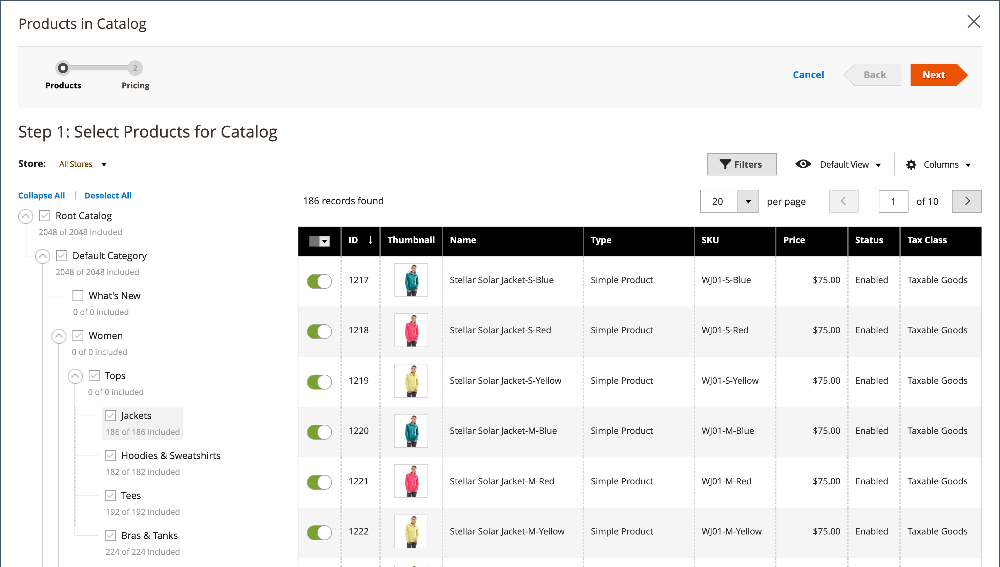

# 共有カタログへの商品の追加

製品は、個別に、またはカテゴリ別に複数の製品のグループで、共有カタログに追加できます。

共有カタログでストアフロントから表示するには、複雑な製品（バンドル、グループ化、設定可能など）に対して、次の要件を満たす必要があります。

- すべての[関連する製品](../catalog/product-configurations.md)とオプションは、同じ共有カタログに割り当てられ、プライマリカタログで有効にする必要があります。
- [構成可能](../catalog/product-create-configurable.md)および[ グループ化](../catalog/product-create-grouped.md)製品の場合、有効な関連製品のみが表示されます。
- [ バンドル ](../catalog/product-create-bundle.md)製品の場合、すべてのオプションを共有カタログに含める必要があります。

  {width="600" zoomable="yes"}

## 方法1：単一の製品を追加する

1. _管理者_ サイドバーで、**[!UICONTROL Catalog]** > **[!UICONTROL Products]**&#x200B;に移動します。

1. 追加するグリッド内の商品について、_[!UICONTROL Action]_列に移動し、**[!UICONTROL Edit]**をクリックします。

1. 下にスクロールして、_[!UICONTROL Product in Shared Catalogs]_セクションのを展開し、次の操作を行います。

   - 製品が表示される各共有カタログのチェックボックスを選択します。 すべてのカタログを選択するには、**[!UICONTROL Select all]**&#x200B;をクリックします。

     共有カタログ内の{width="600" zoomable="yes"}

     選択した各カタログの名前が&#x200B;_[!UICONTROL Shared Catalogs]_フィールドに表示されます。

     {width="600" zoomable="yes"}

   - **[!UICONTROL Done]**&#x200B;をクリックして設定を保存します。

1. 完了したら、**[!UICONTROL Save]**&#x200B;をクリックします。

## 方法2：複数の製品を追加する

1. _管理者_ サイドバーで、**[!UICONTROL Catalog]** > **[!UICONTROL Shared Catalogs]**&#x200B;に移動します。

1. グリッド内の共有カタログの場合は、_[!UICONTROL Action]_列に移動し、**[!UICONTROL Set Pricing and Structure]**を選択します。

1. カテゴリーツリーで、次のいずれかの操作を行います。

   - すべての製品を含めるには、**[!UICONTROL Select all]**&#x200B;をクリックするか、親カテゴリのチェックボックスを選択します。
   - 特定の商品カテゴリを含めるには、含める各カテゴリのチェックボックスを選択します。
   - 個々の製品を含めるまたは除外するには、製品のチェックボックスを選択または選択解除します。

   ツリー内の各カテゴリの下の表記法には、共有カタログに現在含まれているカテゴリの製品数が表示されます。 [ ルートカテゴリ ](../catalog/category-root.md)の下の表記法には、共有カタログに現在選択されているすべてのカテゴリの製品の合計数が表示されます。

1. カテゴリ製品をグリッドで表示するには、ツリー内のカテゴリの名前をクリックします。

   カテゴリを選択すると、次のことが発生します。

   - グリッドの最初の列の切替スイッチは、選択した製品ごとに`On`に設定されます。
   - 製品が複数のカテゴリに割り当てられ、いずれかのカテゴリで省略された場合、その製品は他のカテゴリおよび[ カタログ検索](../catalog/search.md)を通じて引き続き利用できます。
   - 選択した製品に対して[ カテゴリ権限](../catalog/category-permissions.md)から`Allow`が自動的に設定されます。
