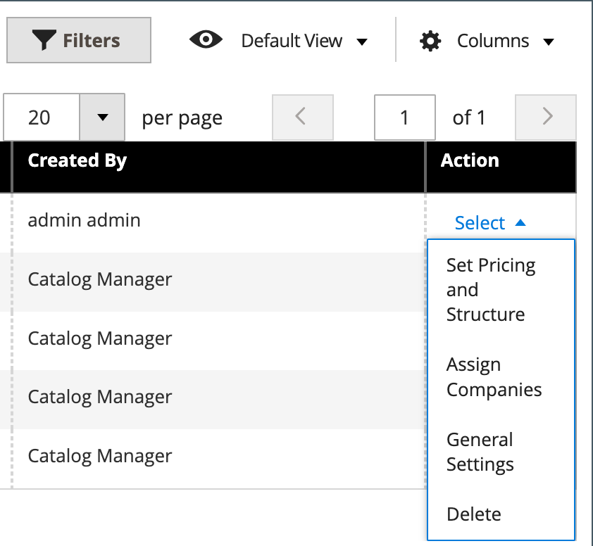

# 共有カタログの概要

Adobe Commerce B2Bでは、様々な企業向けにカスタマイズされた価格設定の&#x200B;_共有_ カタログを管理できます。 標準の&#x200B;_primary_、製品カタログに加えて、価格構造が異なる2種類の共有カタログに顧客がアクセスできます。

設定で[共有カタログ機能](enable-basic-features.md)が有効になっている場合、元のプライマリカタログは管理者から表示されたままですが、ストアフロントからはデフォルト（一般）のパブリック共有カタログのみが表示されます。 さらに、特定の[会社](account-companies.md) アカウントのメンバーにのみ表示されるカスタムカタログを作成できます。

`Default (General)`公開の共有カタログの場合、ストアフロントにカタログを表示するように製品を割り当てる必要があります。 デフォルトでは空で、商品は含まれません。

>[!NOTE]
>
>**[B2B リリース 1.3.0](release-notes.md#b2b-v130)以降** – 共有カタログを作成する場合、カタログの各[ カテゴリ権限](../catalog/category-permissions.md)は、カタログ権限設定でこのアクセスが割り当てられている顧客グループに対して&#x200B;_[!UICONTROL Allow for the Display Product Prices]_および_[!UICONTROL Add to Cart]_&#x200B;に設定されます。 以前は、カタログ権限が`Allow`に設定されていても、これらの設定は自動的に`Deny`に設定されていました。

>[!IMPORTANT]
>
>**_[!UICONTROL Shared Catalog]_**&#x200B;機能が有効になっている場合、既存の[ グループ権限設定](../configuration-reference/catalog/catalog.md#category-permissions)はすべて、カタログ内の&#x200B;**_すべての_** カテゴリーで無視されます。 [!UICONTROL Shared Catalog]は、カタログが有効になっている場合に、カタログ内のすべてのカテゴリ権限を完全に制御します。

_[!UICONTROL Shared Catalogs]_ページでは、共有カタログの管理に使用するツールにアクセスできます。 このページは、標準の[管理者ワークスペース ](../getting-started/admin-workspace.md)と似ており、フィルターとアクションコントロールが含まれています。 グリッドには、デフォルトのパブリック共有カタログを含むすべての共有カタログと、設定したカスタムカタログが一覧表示されます。

{width="700" zoomable="yes"}

## [!UICONTROL Shared Catalogs] ページへのアクセス

_管理者_ サイドバーで、**[!UICONTROL Catalog]** > **[!UICONTROL Shared Catalogs]**&#x200B;に移動します。

## アクション制御

左上隅の[ アクションコントロール ](../getting-started/admin-actions-control.md)は、一括操作コントロールと共に使用して、不要になった選択した共有カタログを削除できます。 グリッドの&#x200B;_[!UICONTROL Actions]_列には、共有カタログを管理するためのツールの全範囲が含まれています。

{width="350"}

| 制御 | 説明 |
|------|-----------|
| [[!UICONTROL Set Pricing and Structure]](catalog-shared-pricing-structure.md) | 共有カタログで使用できる製品の選択とカスタム価格を決定します。 |
| [[!UICONTROL Assign Companies]](catalog-shared-assign-companies.md) | 共有カタログにアクセスできる企業を指定します。 |
| [[!UICONTROL General Settings]](catalog-shared-manage.md) | 名前、カタログの種類、顧客税区分、説明などのカタログの詳細情報を指定します。 |
| [!UICONTROL Delete] | 選択した共有カタログを削除します。 |

{style="table-layout:auto"}

## 列の説明

| 見出し | 説明 |
|--- |--- |
| [!UICONTROL Select] | アクションを適用するための共有カタログレコードを選択します。 ヘッダーのコントロールを使用して、グリッド内のすべての共有カタログレコードを選択または選択解除できます。 個々の共有カタログを選択するには、チェックボックスをオンにします。 |
| [!UICONTROL ID] | カタログの作成時に順番に割り当てられる一意の数値識別子。 |
| [!UICONTROL Name] | 共有カタログの名前。 デフォルトでは、デフォルトの（一般）共有カタログを使用できます。 |
| [!UICONTROL Type] | 共有カタログの種類を次のように指定します。 **[!UICONTROL Public]**- Adobe Commerce B2Bがインストールされると、デフォルトのパブリック共有カタログが自動的に作成されます。 最初に`General`および`Not Logged In`の顧客グループに割り当てられ、会社に関連付けられていないゲストおよび個々のログイン顧客に表示されます。 システムは、一度に1つの公開共有カタログのみをサポートします。 **[!UICONTROL Custom]** - カスタム共有カタログには、割り当てられた会社アカウントのログイン担当者にのみ表示される価格が含まれています。 カスタム共有カタログは必要な数だけ作成できます。 |
| [!UICONTROL Customer Tax Class] | 対応する顧客グループに割り当てられる税区分。 この列はデフォルトのグリッドには表示されませんが、列レイアウトを変更することで追加できます。 |
| [!UICONTROL Created At] | 共有カタログが作成された日時。 |
| [!UICONTROL Created By] | 共有カタログを作成したストア管理者の姓と名。 |
| [!UICONTROL Action] | 選択したカタログに適用されるアクションを一覧表示します。 オプション：`Set Pricing and Structure` / `Assign Companies` / `General Settings` / `Delete` |

{style="table-layout:auto"}
