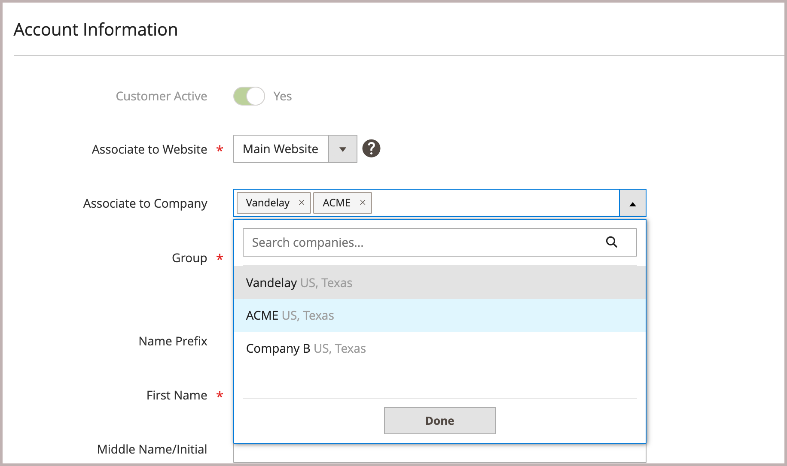

# 会社アカウントにユーザーを追加

設定で有効にすると、会社の管理者はストアフロントから会社ユーザーを追加および管理します。 ただし、会社のユーザーアカウントは、管理者から追加および管理することもできます。

必要であれば、1人のユーザーを複数の企業に割り当てることができます。 例えば、B2B バイヤーが複数の企業をサポートしている場合、取引先企業すべてにユーザーアカウントを追加できます。 ストアフロントでは、複数の会社に割り当てられているバイヤーは、*[!UICONTROL Company]* メニューで利用可能な会社から選択して、会社アカウントを切り替えることができます。

{width="700"}

>[!NOTE]
>
>個人が既にストアの個人アカウントを持っていて、後で会社で働く場合は、その個人の個人アカウントを会社に割り当てないでください。 代わりに、会社の電子メールアドレスを持つユーザーの会社ユーザーアカウントを作成します。

## 会社ユーザーの追加

会社ユーザーを追加する場合、ユーザーアカウントに関連付ける最初の会社がデフォルトの会社になります。

1. 管理者サイドバーで、**[!UICONTROL Customers > All Customers]**&#x200B;に移動します。

1. **[!UICONTROL Add new customer]**&#x200B;をクリックします。

1. 新しいアカウントを設定します。

   1. **[!UICONTROL Customer Active]** トグルを設定して、初期アカウントの状態を指定します。

      このオプションをオンにすると、すぐにアカウントがアクティブになります。無効にすると、非アクティブなアカウントが作成されます。

   1. **[!UICONTROL Associate to Website]** リストからweb サイトの範囲を選択します。

   1. 使用可能な会社を表示するには、**[!UICONTROL Associate to Company]**&#x200B;をクリックします。

      {width="675"}

      必要に応じて、入力ボックスに会社名の最初の数文字を入力して、リストをフィルタリングします。

   1. リストで、顧客を割り当てる1つ以上の会社を選択し、**[!UICONTROL Done]**&#x200B;をクリックします。

      会社ユーザーは、アカウントに関連付けられている各会社の顧客グループ（または[共有カタログ &#x200B;](catalog-shared.md)）に自動的に追加されます。

   1. 必要なユーザーアカウント情報を入力してください：**[!UICONTROL First Name]**、**[!UICONTROL Last Name]**、および&#x200B;**[!UICONTROL Email]**。

   1. **[!UICONTROL Allow remote shopping assistance]**&#x200B;を有効にして、営業担当者がお客様の代わりにストアフロントにログインできるようにします。

   1. **[!UICONTROL Save Customer]**&#x200B;をクリックして変更を適用します。

      {width="675"}

[!UICONTROL Customers grid]には、ユーザーが割り当てられている会社ごとに別の行が表示されます。 次の列が更新されます。

- _[!UICONTROL Customer Type]_&#x200B;列が更新され、ユーザーに割り当てられた役割が表示されます。

  顧客が会社に割り当てられたのは初めてである場合、_[!UICONTROL Customer Type]_&#x200B;列が&#x200B;_[!UICONTROL Individual user]_&#x200B;から&#x200B;_[!UICONTROL Company User]_&#x200B;に更新されます。

- _[!UICONTROL Group]_&#x200B;列は、会社に割り当てられている顧客グループ（または共有カタログ）の名前に変更されます。

- _[!UICONTROL Company]_&#x200B;列には、顧客プロファイルが関連付けられている会社の名前が表示されます。

## ユーザーを1つ以上の会社アカウントに割り当てる

新しいユーザーを割り当てる場合、ユーザーアカウントに最初に関連付ける会社がデフォルトの会社になります。

1. _管理者_ サイドバーで、**[!UICONTROL Customers]** > **[!UICONTROL All Customers]**&#x200B;に移動します。

1. グリッドで顧客を見つけ、_[!UICONTROL Action]_&#x200B;列の&#x200B;**[!UICONTROL Edit]**&#x200B;をクリックします。

1. 左側のパネルで、**[!UICONTROL Account Information]**&#x200B;を選択します。

1. **[!UICONTROL Associate to Company]** リストから、会社ユーザーに割り当てる1つ以上の会社を選択し、**[!UICONTROL Done]**&#x200B;をクリックします。

1. **[!UICONTROL Save Customer]**&#x200B;をクリックして変更を適用します。

## ユーザーアカウントから会社の割り当てを削除

ユーザープロファイルから会社を削除すると、その会社へのユーザーアクセス権が取り消されます。 ユーザーデータは管理画面から引き続きアクセスできます。 会社の割り当てをすべて削除すると、アカウントのB2B機能を無効にする&#x200B;_[!UICONTROL Customer Type]_&#x200B;が&#x200B;*[!UICONTROL Individual user]*&#x200B;に変更されます。

1. 管理者の顧客グリッドから、更新する顧客プロファイルを編集します。

1. *[!UICONTROL Account Information] セクションで、会社名ラベルの&#x200B;**[!UICONTROL X]**&#x200B;をクリックして、**[!UICONTROL Associate to Company]** フィールドから割り当てられた会社を削除します。

1. **[!UICONTROL Save Customer]**&#x200B;をクリックして変更を適用します。

>[!NOTE]
>
>会社ユーザーが会社管理者として割り当てられている場合は、会社アカウントを更新して新しい会社管理者を割り当てるまで、このユーザーから会社関連付けを行うことはできません。
