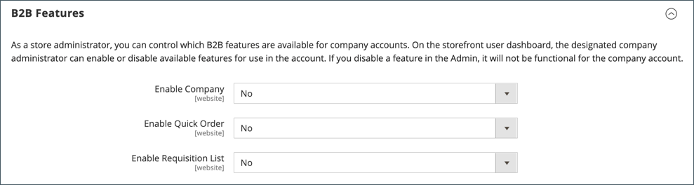
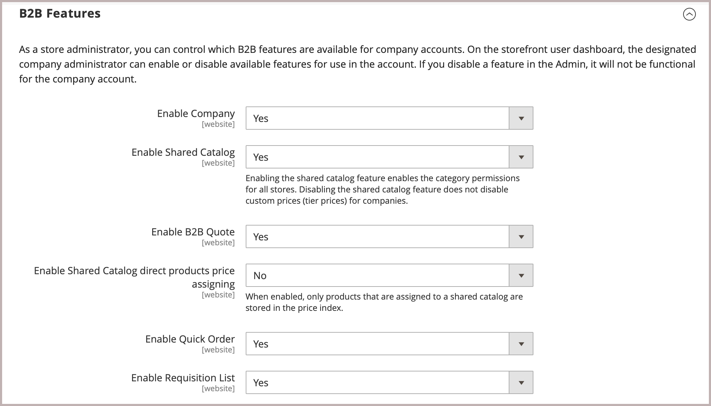
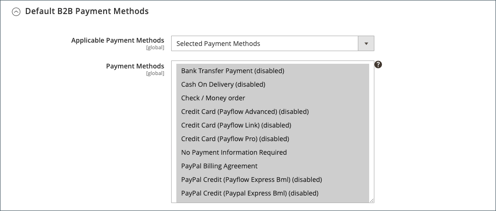
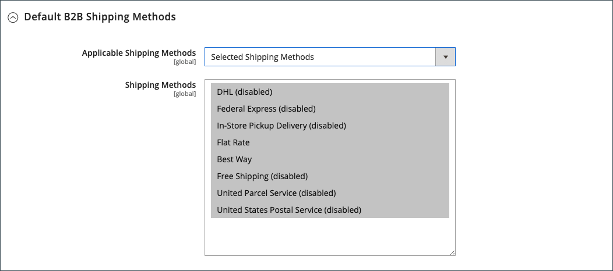
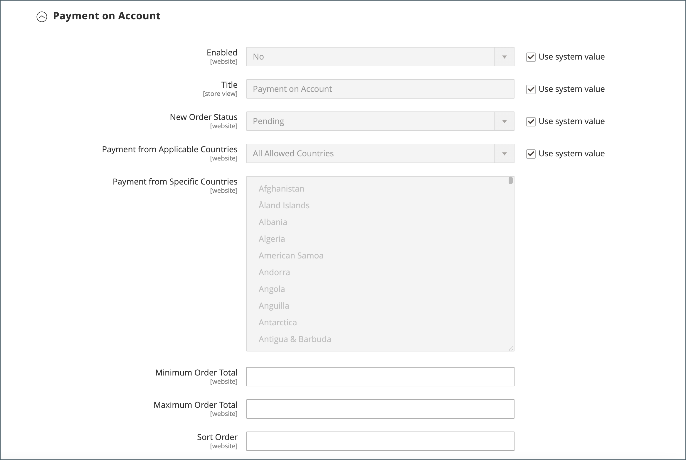

# B2B機能を有効にする

デフォルトでは、すべてのB2B機能は最初は無効になっています。 ストア管理者は、Commerce ストアの必要に応じて、B2B機能を有効または無効にできます。 B2B設定の完全なリストについては、[B2B機能設定リファレンス ](../configuration-reference/general/b2b-features.md)を参照してください。

顧客企業のサポートを有効にすると、追加のB2B機能が自動的に有効になります。

- [[!DNL Shared Catalog]](catalog-shared.md)

  様々な企業のカスタム価格設定をサポートし、すべてのストアのカテゴリ権限を有効にします。

- [!DNL Enable Shared Catalog direct products price assigning]

  価格インデックスの共有カタログに割り当てられている製品のみを保存することで、サイトパフォーマンスを向上させます。 この機能を有効にすることは、多数の共有カタログを持つマーチャントが様々な企業向けのカスタム価格を管理する際のベストプラクティスです。

- [[!DNL B2B Quotes]](quotes.md)

  販売者と企業購入者が価格について交渉できるようにします。

- [!DNL B2B default payment and shipping methods]

  ストアフロントのB2B バイヤーが利用できる支払い方法と配送オプションの選択を決定します。

これらの機能の設定設定は、[!DNL Enable Company]が`Yes`に設定されている場合にのみ表示されます。

B2B [[!DNL Quick Order]](quick-order.md)および[[!DNL Requisition List]](requisition-lists.md)機能は、個別に有効または無効にできます。

## B2B機能の設定

Adobe Commerce B2B機能を設定するオプションは、[Adobe Commerce B2B拡張機能がインストールされているCommerce プロジェクトでのみ使用できます](install.md)。

1. _管理者_ サイドバーで、**[!UICONTROL Stores]** > _[!UICONTROL Settings]_>**[!UICONTROL Configuration]**に移動します。

   マルチサイト インストールがある場合は、左上隅の&#x200B;**[!UICONTROL Store View]** コントロールを、設定が適用されるweb サイトに設定します。

1. _[!UICONTROL General]_の下の左側のパネルで、**[!UICONTROL B2B Features]**を選択します。

   {width="600"}

   - **[!UICONTROL Enable Company]**&#x200B;を`Yes`に設定することで、お客様が自分の会社アカウントを管理し、追加のB2B機能のサポートを有効にできるようにします。

     企業サポートを有効にすると、共有カタログ、B2B見積もり、B2B支払い方法、B2B配送方法が自動的に有効になります。

     {width="600"}

   - 顧客とゲストがSKUまたは製品名に基づいて素早く注文できるようにするには、**[!UICONTROL Enable Quick Order]**&#x200B;を`Yes`に設定します。

   - 顧客がアカウントダッシュボードから購買リストを作成および管理できるようにするには、**[!UICONTROL Enable Requisition List]**&#x200B;を`Yes`に設定します。

     顧客がアカウントに持つことができるリストの最大数](configure-requisition-lists.md)を[設定することもできます。

1. 完了したら、**[!UICONTROL Save Config]**&#x200B;をクリックします。

## デフォルトのB2B支払いと配送方法の設定

1. **[!UICONTROL Default B2B Payment Methods]** セクションのを展開します。

1. B2B注文のデフォルトの支払い方法を確立するには、**[!UICONTROL Applicable Payment Methods]**&#x200B;を次のいずれかに設定します。

   - `All Payment Methods`

   - `Selected Payment Methods`

     特定のオプションについては、Ctrl キー（PC）またはCommand キー（Mac）を押しながら各オプションをクリックして、お客様が利用できるようにする&#x200B;**[!UICONTROL Payment Methods]**&#x200B;を選択します。

   [支払い方法](../configuration-reference/sales/payment-methods.md)のリストには、ストアで現在有効または無効になっているオプションが表示されます。 標準的な支払い方法に加えて、リストには次のものも含まれています。

   - 支払い情報は必要ありません
   - [アカウント決済](#configure-payment-on-account)
   - 保存アカウント
   - ストアドカード

   {width="600"}

1. **[!UICONTROL Default B2B Shipping Methods]** セクションのを展開します。

1. B2B注文のデフォルトの配送方法を指定するには、**[!UICONTROL Applicable Shipping Methods]**&#x200B;を次のいずれかに設定します。

   - `All Shipping Methods`
   - `Selected Shipping Methods`

     特定のオプションについては、Ctrl キー（PC）またはCommand キー（Mac）を押しながら各オプションをクリックして、お客様が利用できるようにする&#x200B;**[!UICONTROL Shipping Methods]**&#x200B;を選択します。

     配送方法のリストに、現在[有効または無効になっている](../configuration-reference/sales/delivery-methods.md)の配送方法が表示されます。

   {width="600"}

1. 完了したら、**[!UICONTROL Save Config]**&#x200B;をクリックします。

## 会社のメールオプションの設定

会社のプライマリコンタクトとして割り当てられた[営業担当者](account-company-manage.md#assign-a-sales-representative)は、デフォルトで、会社に送信される多くの自動メールメッセージの送信者として設定されます。

1. _管理者_ サイドバーで、**[!UICONTROL Stores]** > _[!UICONTROL Settings]_>**[!UICONTROL Configuration]**に移動します。

1. 左側のパネルで、**[!UICONTROL Customers]**&#x200B;を展開し、**[!UICONTROL Company Configuration]**&#x200B;を選択します。

1. 必要に応じて、**[!UICONTROL Store View]**&#x200B;をストアビューに設定し、設定の[ スコープ ](../getting-started/websites-stores-views.md#scope-settings)を定義します。

1. **[!UICONTROL Company Registration]** セクションを完了します。

   >[!NOTE]
   >
   >フィールドを編集可能にするには、**[!UICONTROL Use system value]** チェックボックスをオフにします。

   - 新しい会社登録リクエストを受信したときに通知される[ ストア連絡先](../getting-started/store-details.md#store-email-addresses)に&#x200B;**[!UICONTROL Company Registration Email Recipient]**&#x200B;を設定します。

   - **[!UICONTROL Send Company Registration Email Copy To]**&#x200B;に、登録通知のコピーを受け取る各人物の電子メールアドレスを入力します。 複数のメールアドレスをコンマで区切ります。

   - 通知のコピーの送信方法を決定するには、**電子メールのコピー方法**&#x200B;を次のいずれかに設定します。

      - `Bcc` – お客様に送信するのと同じメールのヘッダーに受信者を含めることで、_ブラインドの表敬文_&#x200B;を送信します。 BCC受信者は、お客様には表示されません。
      - `Separate Email` - コピーを別の電子メールとして送信します。

   - デフォルトの代わりに使用するメールテンプレートを準備している場合は、**[!UICONTROL Default Company Registration Email]**&#x200B;をテンプレートの名前に設定します。 デフォルトでは、`Company Registration Request` テンプレートが使用されます。

     {width="600"}

1. **[!UICONTROL Customer-Related Emails]** セクションを完了します。

   デフォルトの代わりに使用する代替メールテンプレートを準備している場合は、次のそれぞれに使用するテンプレートを選択します。

   - **[!UICONTROL Default 'Sales Rep Assigned' Email]**
   - **[!UICONTROL Default 'Assign Company to Customer' Email]**
   - **[!UICONTROL Default 'Assign Company Admin' Email]**
   - **[!UICONTROL Default 'Company Admin Inactive' Email]**
   - **[!UICONTROL Default 'Company Admin Changed to Member' Email]**
   - **[!UICONTROL Default 'Customer Status Active' Email]**
   - **[!UICONTROL Default 'Customer Status Inactive' Email]**

   {width="600"}

1. **[!UICONTROL Company Status Change]** セクションを完了します。

   - **[!UICONTROL Send Company Status Change Email Copy To]**&#x200B;に、ステータス変更通知のコピーを受け取る各人物の電子メールアドレスを入力します。 複数のメールアドレスをコンマで区切ります。

   - 通知のコピーの送信方法を決定するには、**電子メールのコピー方法**&#x200B;を次のいずれかに設定します。

      - `Bcc` – お客様に送信するのと同じメールのヘッダーに受信者を含めることで、_ブラインドの表敬文_&#x200B;を送信します。 BCC受信者は、お客様には表示されません。
      - `Separate Email` - コピーを別の電子メールとして送信します。

   - 会社のステータスが`Pending Approval`から`Active`に変更されたときに使用するメールテンプレートを準備した場合は、**[!UICONTROL Default 'Company Status Change to Active 1' Email]**&#x200B;をテンプレートの名前に設定します。 デフォルトでは、`Company Status Active 1` テンプレートが使用されます。

   - 会社のステータスが`Rejected`または`Blocked`から`Active`に変更されたときに使用するメールテンプレートを準備している場合は、**[!UICONTROL Default 'Company Status Change to Active 2' Email]**&#x200B;をテンプレートの名前に設定します。 デフォルトでは、`Company Status Active 2` テンプレートが使用されます。

   - 会社のステータスが`Rejected`に変更されたときに使用する電子メールテンプレートを準備した場合は、**[!UICONTROL Default 'Company Status Change to Rejected' Email]**&#x200B;をテンプレートの名前に設定します。 デフォルトでは、`Company Status Rejected` テンプレートが使用されます。

   - 会社のステータスが`Blocked`に変更されたときに使用する電子メールテンプレートを準備した場合は、**[!UICONTROL Default 'Company Status Change to Blocked' Email]**&#x200B;をテンプレートの名前に設定します。 デフォルトでは、`Company Status Blocked` テンプレートが使用されます。

   - 会社のステータスが`Pending Approval`に変更されたときに使用する電子メールテンプレートを準備した場合は、**[!UICONTROL Default 'Company Status Change to Pending Approval' Email]**&#x200B;をテンプレートの名前に設定します。 デフォルトでは、`Company Status Pending Approval` テンプレートが使用されます。

   {width="600"}

1. **[!UICONTROL Company Credit Emails]** セクションを完了します。

   - 会社に割り当てられているクレジット制限に変更が加えられたときに通知される[ ストアコンタクト ](../getting-started/store-details.md#store-email-addresses)に&#x200B;**[!UICONTROL Company Credit Change Email Sender]**&#x200B;を設定します。 デフォルトでは、通知は&#x200B;_営業担当者_&#x200B;に送信されます。

   - **[!UICONTROL Send Company Credit Change Email Copy To]**&#x200B;に、クレジット変更通知のコピーを受け取る各人物の電子メールアドレスを入力します。 複数のメールアドレスをコンマで区切ります。

   - 通知のコピーの送信方法を決定するには、**電子メールのコピー方法**&#x200B;を次のいずれかに設定します。

      - `Bcc` – お客様に送信するのと同じメールのヘッダーに受信者を含めることで、_ブラインドの表敬文_&#x200B;を送信します。 BCC受信者は、お客様には表示されません。
      - `Separate Email` - コピーを別の電子メールとして送信します。

   - デフォルトの代わりにメールテンプレートを使用するように準備している場合は、会社管理者に送信される次の各通知のテンプレートを選択します。

      - **[!UICONTROL Allocated Email Template]**
      - **[!UICONTROL Updated Email Template]**
      - **[!UICONTROL Reimbursed Email Template]**
      - **[!UICONTROL Refunded Email Template]**
      - **[!UICONTROL Reverted Email Template]**

   {width="600"}

1. 完了したら、**[!UICONTROL Save Config]**&#x200B;をクリックします。

## 注文承認の設定

注文処理と発注を追跡する機能により、企業の管理者は企業のバイヤーの行動を管理できます。 注文承認機能は、ストア管理者が発注機能を有効にしている場合に使用できます。

1. _管理者_ サイドバーで、**[!UICONTROL Stores]** > _[!UICONTROL Settings]_>**[!UICONTROL Configuration]**に移動します。

1. 左側のパネルで、**[!UICONTROL General]**&#x200B;を展開し、**[!UICONTROL B2B Features]**&#x200B;を選択します。

1. **[!UICONTROL Order Approval Configuration]** セクションのを展開します。

   {width="600"}

1. 会社が独自の発注を作成できるようにするには、**[!UICONTROL Enable Purchase Orders]**&#x200B;を`Yes`に設定します。

1. 完了したら、**[!UICONTROL Save Config]**&#x200B;をクリックします。

   発注機能は、web サイトレベルで有効になります。 この種類の注文を会社に対して有効にするには、各[会社プロファイル ](account-company-manage.md)で適切な設定を行います。

## 発注の設定

1. _管理者_ サイドバーで、**[!UICONTROL Customers]** > **[!UICONTROL Companies]**&#x200B;に移動します。

1. リスト内の会社を見つけて、**[!UICONTROL Edit]**&#x200B;をクリックします。

1. **[!UICONTROL Advanced Settings]** セクションのを展開します。

1. **[!UICONTROL Enable Purchase Orders]**&#x200B;を`Yes`に設定します。

1. 完了したら、**[!UICONTROL Save]**&#x200B;をクリックします。

アクティブ化後、**[!UICONTROL Approval Rules]** セクションは、会社管理者のストアフロント [ アカウントダッシュボード ](../customers/account-dashboard.md)に表示されます。

>[!NOTE]
>
>ストアフロントでの発注アクセスは、[会社ユーザーの役割の権限](account-company-roles-permissions.md)に基づいて、会社管理者によって許可される必要があります。

## アカウントでの支払いを設定

Payment on Accountは、企業がプロファイルで指定されたクレジット制限まで購入できるオフラインの支払い方法です。 「アカウントでのお支払い」は、グローバルまたは企業ごとに有効にでき、チェックアウト時に有効な場合にのみ表示されます。 _アカウントでの支払い_&#x200B;が支払い方法として使用されている場合、アカウントのステータスを示すメッセージが注文の上部に表示されます。 この支払い方法を特定の会社に設定するには、[会社アカウントの管理](account-company-manage.md)を参照してください。

>[!NOTE]
>
>アカウントでの支払いは、[複数の配送先住所](../stores-purchase/shipping-settings.md#multiple-addresses)を持つ注文ではサポートされておらず、これらの注文の支払いオプションには表示されません。

ストアのアカウントでの支払いを有効にするには：

1. _管理者_ サイドバーで、**[!UICONTROL Stores]** > _[!UICONTROL Settings]_>**[!UICONTROL Configuration]**に移動します。

1. 左側のパネルで、**[!UICONTROL Sales]**&#x200B;を展開し、**[!UICONTROL Payment Methods]**&#x200B;を選択します。

1. **[!UICONTROL Payment on Account]** セクションのを展開します。

   {width="600"}

   >[!NOTE]
   >
   >必要に応じて、まず&#x200B;**[!UICONTROL Use system value]** チェックボックスの選択を解除して、これらの設定を変更します。

1. アカウントでの支払いを許可するには、**[!UICONTROL Enabled]**&#x200B;を`Yes`に設定します。

1. チェックアウト時に支払い方法を特定する&#x200B;**[!UICONTROL Title]**&#x200B;を入力するか、`Payment on Account`の既定のタイトルを受け入れることができます。

1. 注文が通常、承認を待っている場合は、承認されるまでデフォルトの&#x200B;**[!UICONTROL New Order Status]**&#x200B;を`Pending`として受け入れます。

   ご希望の場合は、この支払い方法で`Processing`または`Suspected Fraud`のステータスを新しい注文に使用できます。

1. **[!UICONTROL Payment from Applicable Countries]**&#x200B;を次のいずれかに設定します：

   - `All Allowed Countries` - ストア設定で指定されたすべての[国](../getting-started/store-details.md#country-options)のお客様は、この支払い方法を使用できます。
   - `Specific Countries` – このオプションを選択すると、_[!UICONTROL Payment from Specific Countries]_リストが表示されます。 複数の国を選択するには、Ctrl キー（PC）またはCommand キー（Mac）を押しながら、各オプションをクリックします。

1. **[!UICONTROL Minimum Order Total]**&#x200B;と&#x200B;**[!UICONTROL Maximum Order Total]**&#x200B;を、この支払い方法の対象に必要な注文金額に設定します。

   >[!NOTE]
   >
   >注文は、合計が最小値と最大値の間に収まるか、正確に一致するかを判断します。

1. チェックアウト時に表示される支払い方法のリストに、この項目の位置を設定する&#x200B;**[!UICONTROL Sort Order]**&#x200B;番号を入力します。

   値は、他の支払い方法に関連しています。 （`0` = first, `1` = second, `2` = thirdなど）

1. 完了したら、**[!UICONTROL Save Config]**&#x200B;をクリックします。
