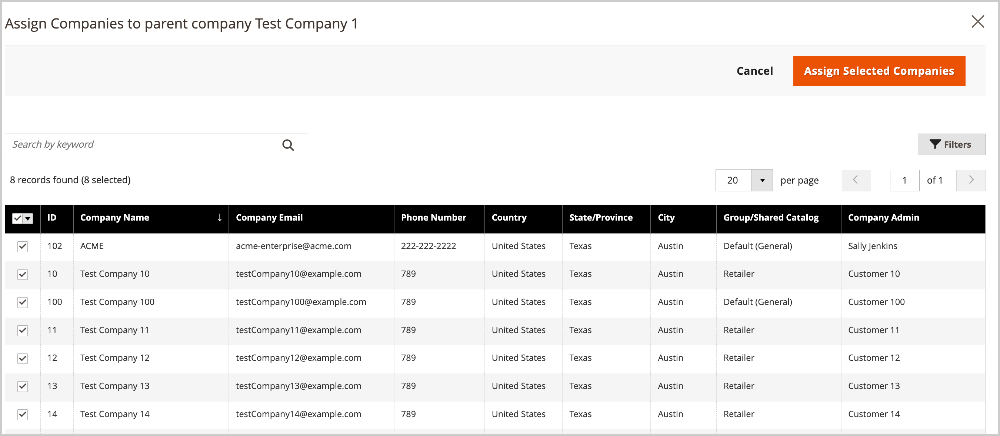

# 会社階層の管理

[!UICONTROL Company Hierarchy] 機能を使用すると、複数の関連会社を 1 つの親会社構造の下に整理できます。 これは、子会社、フランチャイズ、複数の場所、または個々の会社 ID を維持しながら一元管理する必要がある複雑な組織構造を持つ企業に最適です。

## ユースケース

* **管理の一元化**:1 つの親会社から複数の会社間で設定と構成を適用
* **構造の維持** - ビジネス組織を反映した論理的な階層で会社を整理します
* **オペレーションの合理化**：組織全体の見積もり、発注、支払い方法、出荷設定を管理します
* **自律性の維持**：共有構成のメリットを享受しながら、個々の企業のアイデンティティを維持

## 前提条件

会社階層を作成する前に、次のことを確認します。

* B2B 機能は、Commerceのインストールで有効になっています
* 会社を管理するための管理者アクセス権があります
* 親および子の会社は既に個別会社として作成されています
* 親設定を適用すると、既存の子会社設定が上書きされることを理解しています

## 仕組み

管理者は、関連会社を指定の親会社（組織階層の最上位にある会社）に割り当てることにより、会社の階層を構築できます。

管理者から、`[!UICONTROL Company Type] = Company` 設定で個々の会社（[!UICONTROL Company Hierarchy]）を編集して関連会社を割り当てることにより、親会社を作成します。

{width="700"}

>[!NOTE]
>
>[!UICONTROL Company Hierarchy] グリッドについて詳しくは、「[ 会社階層 ](account-company-create.md#company-hierarchy) フィールドの説明を参照してください。

親会社を編集し、*[!UICONTROL Company Hierarchy]* グリッドを使用して会社を追加または削除することで、会社の割り当てを管理します。 *[!UICONTROL Actions]* コントロールを使用して、組織内の会社の [ 詳細設定の構成 ](#change-company-settings) を管理します。

## 親会社への会社の割り当て

1. _管理者_ サイドバーで、**[!UICONTROL Customers]**/**[!UICONTROL Companies]** に移動します。

   {width="700" zoomable="yes"}

1. [!UICONTROL Companies] グリッドから、会社の詳細ページを開いて割り当てを作成します。

   * 既存の親会社に追加の会社を割り当てるには、親会社の **[!UICONTROL Edit]** のアクションを選択します。
   * 親会社を作成するには、親として指定した会社の **[!UICONTROL Edit]** のアクションを選択します。

     既存の親会社または子会社から新しい親会社を作成することはできません。

1. 会社の詳細ページで、「**[!UICONTROL Company Hierarchy]**」を展開し、「**[!UICONTROL Assign Companies]**」を選択します。

   {width="675" zoomable="yes"}

1. 使用可能な会社のリストから、割り当てる会社を選択し、「**[!UICONTROL Assign Selected Companies]**」を選択します。

   {width="675" zoomable="yes"}

1. プロンプトが表示されたら、「**[!UICONTROL Assign]**」を選択して会社の割り当てを完了します。

## 親会社からの会社の割り当て解除

1. 会社ページで、**[!UICONTROL Edit]** のアクションを選択して、親会社の会社の詳細ページを開きます。

   {width="700" zoomable="yes"}

1. **[!UICONTROL Company Hierarchy]** を展開すると、割り当てられている会社のリストを表示できます。

1. 組織から会社を削除します。

   * 削除する会社の [!UICONTROL Action] 列で、**[!UICONTROL Select]**/**[!UICONTROL Unassign from parent]** を選択します。

     {width="640" zoomable="yes"}

   * プロンプトが表示されたら、「**[!UICONTROL Unassign]**」を選択して、割り当てられた会社を階層から削除します。

## 組織の会社設定の管理

組織の [ 詳細設定 ](account-company-create.md#advanced-settings) 設定を更新します。 次の操作を実行できます。

* すべての子会社に親構成設定を適用
* 組織内の選択した会社に同じ設定を適用します

次のいずれかの設定を適用できます。

* **見積管理** – 企業が見積を要求および管理する機能を有効または無効にします
* **発注書** – 会社が発注書を作成および管理できるかどうかを制御します
* **支払い方法の設定** – 会社が使用できる支払い方法を定義します
* **支払い方法の設定** – 特定の支払い方法のパラメータと制限を設定します
* **発送方法の可用性** – 会社が使用できる発送方法を設定します
* **出荷方法の構成** – 出荷方法の設定と制限を定義します。

更新プロセス中、初期設定値はデフォルトで、親会社に設定されている現在の値になります。 選択した会社に設定を適用するには、少なくとも 1 つの設定の [ 変更 ] チェックボックスをオンにする必要があります。 変更を適用する前に、各設定のデフォルト値を更新することもできます。

>[!WARNING]
>
>親会社設定を適用すると、与信限度額、支払方法、出荷設定、カスタム制限など、既存の子会社設定が置き換えられます。 設定を適用した後でも、会社の行項目を編集することで、個々の親子会社の詳細設定を管理およびカスタマイズできます。

### ベストプラクティス

親会社設定を子会社に適用する場合は、次のベストプラクティスを考慮してください。

* 親設定を適用する前に、既存の子会社設定を確認してください
* 最初に、単一の子会社の設定の変更をテストします
* 影響を受ける可能性のある会社の管理者に変更を伝える

### 子会社への親構成設定の適用

1. _管理者_ サイドバーで、**[!UICONTROL Customers]**/**[!UICONTROL Companies]** に移動します。

1. [!UICONTROL Companies] のグリッドで、**[!UICONTROL Edit]** の列から **[!UICONTROL Action]** を選択して親会社を編集します。

1. 親会社の詳細ページで、「」セクション **[!UICONTROL Company Hierarchy]** 展開して、組織に含まれる会社を表示します。

1. 設定する会社を選択します。

   {width="675" zoomable="yes"}

1. グリッドの上にある **[!UICONTROL Actions]** コントロールから、[**[!UICONTROL Change company settings]**] を選択します。

   {width="675" zoomable="yes"}

1. 設定の構成を変更します。

   * [!UICONTROL Change company settings] ページで、変更する設定を見つけます。

   * 「**[!UICONTROL Change]**」チェックボックスをオンにして、設定を有効にします。

   * 必要に応じて、値を更新します。

     {width="575" zoomable="yes"}

1. 設定を更新したら、「**[!UICONTROL Apply Changes]**」を選択します。

1. プロンプトが表示されたら、「**[!UICONTROL Change settings]**」を選択して、選択した会社の設定を更新します。

>[!MORELIKETHIS]
>
>* [ 会社アカウントの作成 ](account-company-create.md) – 階層を構築する前に、個々の会社を作成する方法を説明します
>* [ 会社の役割と権限 ](account-company-roles-permissions.md) – 会社構造内のユーザーアクセスについて
>* [ 会社の与信管理 ](credit-company.md) – 会社の与信限度額と支払条件を設定します
>* [ 会社の管理 ](manage-companies.md) – 会社管理機能の概要
>* [B2B 機能の有効化 ](enable-basic-features.md) - B2B 機能を有効にして設定します
