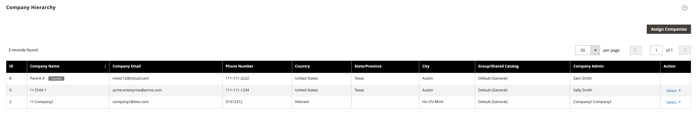
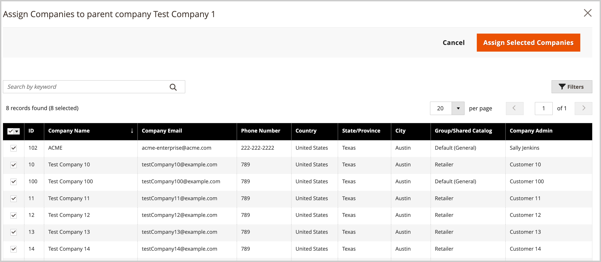
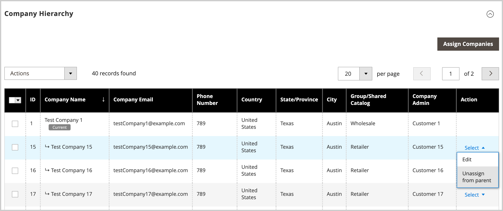
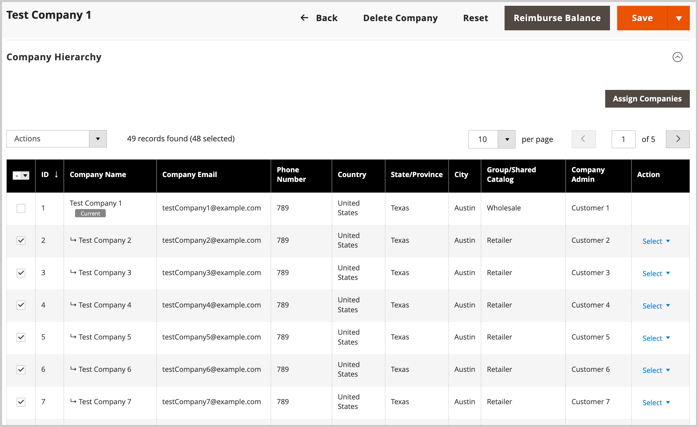
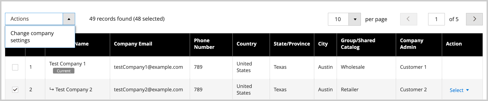
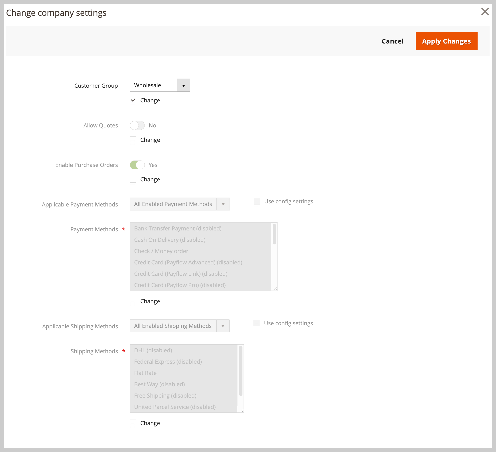

# 会社の階層の管理

[!UICONTROL Company Hierarchy]機能を使用すると、1つの親会社構造の下に複数の関連会社を整理できます。 これは、子会社、フランチャイズ、複数の拠点、または個々の企業IDを維持しながら一元管理を必要とする複雑な組織構造を持つ企業に最適です。

## ユースケース

* **一元管理** – 単一の親会社から複数の会社に設定と設定を適用します
* **組織の維持** – ビジネス組織を反映する論理階層で企業を整理します
* **業務の合理化** – 組織全体の見積もり、発注書、支払い方法、配送設定を管理します
* **自律性の維持** – 個人企業は、共有設定の恩恵を受けながらアイデンティティを維持します

## 前提条件

企業階層を作成する前に、次のことを確認します。

* B2B機能は、Commerce インストールで有効になります
* 会社を管理するための管理者アクセス権があります
* 親子企業は、既に個別企業として作成されています
* 親の設定を適用すると、既存の子会社設定が上書きされます

## 仕組み

管理者は、関連会社を指定された親会社（組織階層の最上位にある会社）に割り当てることで、会社階層を構築できます。

管理者から、個人会社（`[!UICONTROL Company Type] = Company`）を編集し、[!UICONTROL Company Hierarchy]設定で関連会社を割り当てることで、親会社を作成します。

{width="700"}

>[!NOTE]
>
>[!UICONTROL Company Hierarchy] グリッドについて詳しくは、[会社階層](account-company-create.md#company-hierarchy) フィールドの説明を参照してください。

親会社を編集し、*[!UICONTROL Company Hierarchy]* グリッドを使用して会社を追加または削除することで、会社の割り当てを管理します。 *[!UICONTROL Actions]* コントロールを使用して、組織内の企業の[詳細設定](#change-company-settings)を管理します。

## 会社を親会社に割り当てる

1. _管理者_ サイドバーで、**[!UICONTROL Customers]** > **[!UICONTROL Companies]**&#x200B;に移動します。

   {width="700" zoomable="yes"}

1. [!UICONTROL Companies] グリッドから、会社詳細ページを開いて割り当てを作成します。

   * 既存の親会社に追加の会社を割り当てるには、親会社の&#x200B;**[!UICONTROL Edit]** アクションを選択します。
   * 親会社を作成するには、親として指定された会社の&#x200B;**[!UICONTROL Edit]** アクションを選択します。

     既存の親会社または子会社から新しい親会社を作成することはできません。

1. 会社の詳細ページで「**[!UICONTROL Company Hierarchy]**」を展開し、「**[!UICONTROL Assign Companies]**」を選択します。

   {width="675" zoomable="yes"}

1. 使用可能な会社のリストから、割り当てる会社を選択し、**[!UICONTROL Assign Selected Companies]**&#x200B;を選択します。

   {width="675" zoomable="yes"}

1. プロンプトが表示されたら、**[!UICONTROL Assign]**&#x200B;を選択して、会社の割り当てを完了します。

## 親会社からの会社の割り当て解除

1. 会社ページで、**[!UICONTROL Edit]** アクションを選択して、親会社の会社詳細ページを開きます。

   {width="700" zoomable="yes"}

1. **[!UICONTROL Company Hierarchy]**&#x200B;を展開して、割り当てられた会社のリストを表示します。

1. 会社を組織から削除します。

   * 会社が削除する[!UICONTROL Action]列の&#x200B;**[!UICONTROL Select]** > **[!UICONTROL Unassign from parent]**。

     {width="640" zoomable="yes"}

   * プロンプトが表示されたら、**[!UICONTROL Unassign]**&#x200B;を選択して、割り当てられた会社を階層から削除します。

## 組織の会社設定の管理

組織の[詳細設定](account-company-create.md#advanced-settings)設定を更新します。 次の操作を実行できます。

* すべての子会社に親設定を適用する
* 組織内の選択した会社に同じ設定を適用する

次のいずれかの設定を適用できます。

* **見積もり管理** – 企業が見積もりを要求および管理する機能を有効または無効にします
* **発注書** – 会社が発注書を作成および管理できるかどうかを制御します
* **支払い方法の設定** – 企業が利用できる支払い方法を定義します
* **支払い方法の設定** – 特定の支払い方法のパラメーターと制限を設定します
* **配送方法の可用性** – 会社が使用できる配送方法を設定します
* **配送方法の設定** – 配送方法の設定と制限を定義します

更新プロセス中、初期設定値は、親会社用に設定された現在の値にデフォルトで設定されます。 選択した会社に設定を適用するには、少なくとも1つの設定の「変更」チェックボックスを選択する必要があります。 変更を適用する前に、各設定のデフォルト値を更新することもできます。

>[!WARNING]
>
>親会社設定を適用すると、クレジット制限、支払い方法、配送設定、カスタム制限など、既存の子会社設定が置き換えられます。 設定を適用した後でも、会社の行項目を編集して、個々の親子会社の詳細設定を管理およびカスタマイズできます。

### ベストプラクティス

親会社設定を子会社設定に適用する場合は、次のベストプラクティスを考慮してください。

* 親設定を適用する前に、既存の子会社設定を確認します
* 最初に単一の子会社の設定の変更をテストする
* 影響を受ける可能性のある会社管理者に変更を伝える

### 子会社への親設定の適用

1. _管理者_ サイドバーで、**[!UICONTROL Customers]** > **[!UICONTROL Companies]**&#x200B;に移動します。

1. [!UICONTROL Companies] グリッドから、**[!UICONTROL Edit]**&#x200B;列から&#x200B;**[!UICONTROL Action]**&#x200B;を選択して親の会社を編集します。

1. 親会社詳細ページで、**[!UICONTROL Company Hierarchy]** セクションを展開して、組織に含まれる会社を表示します。

1. 設定する会社を選択します。

   {width="675" zoomable="yes"}

1. グリッドの上の&#x200B;**[!UICONTROL Actions]** コントロールから、**[!UICONTROL Change company settings]**&#x200B;を選択します。

   {width="675" zoomable="yes"}

1. 設定の設定を変更します。

   * [!UICONTROL Change company settings] ページで、変更する構成設定を見つけます。

   * **[!UICONTROL Change]** チェックボックスを選択して、設定を有効にします。

   * 必要に応じて値を更新します。

     {width="575" zoomable="yes"}

1. 設定を更新したら、**[!UICONTROL Apply Changes]**&#x200B;を選択します。

1. プロンプトが表示されたら、**[!UICONTROL Change settings]**&#x200B;を選択して、選択した会社の設定を更新します。

>[!MORELIKETHIS]
>
>* [会社アカウントを作成](account-company-create.md) – 階層を作成する前に個々の会社を作成する方法を説明します
>* [企業の役割と権限](account-company-roles-permissions.md) – 企業構造内のユーザーアクセスを理解する
>* [会社のクレジット管理](credit-company.md) – 会社のクレジット制限と支払い条件を設定します
>* [企業管理](manage-companies.md) – 企業管理機能の概要
>* [B2B機能の有効化](enable-basic-features.md) - B2B機能の有効化と設定
