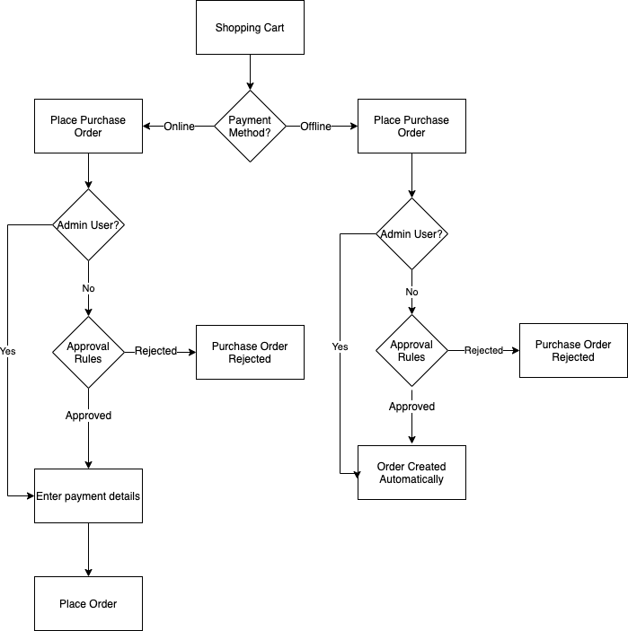

# 企業に対する発注

発注（PO）は、企業が支出を追跡、管理するための一般的な方法です。 [発注](../stores-purchase/purchase-order.md)は、Adobe CommerceおよびMagento Open Sourceでサポートされている標準のオフライン支払い方法の1つです。 Adobe CommerceのB2Bがインストールされ、法人顧客に対して&#x200B;[_発注を有効にする_](account-company-manage.md#advanced-settings)&#x200B;がアクティブ化されると、すべての注文が発注（PO）として自動的に作成されます。 必要な[権限](account-company-roles-permissions.md)を持つ会社ユーザーは、作成したPOと下位ユーザーが作成したPOを作成、編集、削除できます。

## 発注フロー

役割や順序に応じて、企業ユーザーはいくつかの承認ルールを受ける可能性があります。 また、オンラインとオフラインのどちらを利用しているかによって、流れは少し異なります。 会社の管理者は、承認ルールを無視して、注文を自動的に作成できます。 承認プロセス中にオンライン支払いの詳細を保存することはセキュリティリスクであるため、これらの詳細は承認後に追加され、その後、発注書は実際の注文に変換されます。

{width="600" zoomable="yes"}

>[!NOTE]
>
>発注書の1つ以上の商品が現在無効または在庫切れの場合、注文を行うことはできません。

企業の発注ワークフローは、いくつかの方法で異なります。

- 承認ルールが設定されていない場合は、発注を行い、注文を直接完了することができます。

  >[!NOTE]
  >
  >デフォルトでは、承認ルールが設定されていない場合でも、常に`Purchase order has been submitted for approval` メッセージが会社ユーザーに表示されます。 承認プロセスが不要な場合、注文が作成され承認されたことを知らせるメールがユーザーに自動的に送信されます。

- 会社の管理者が承認ルールを定義した場合、ユーザーは承認プロセスを実行します。
- 複数の承認ルールが発注に適用される場合、一意の必要な承認者はすべて発注を承認する必要があります。
- 発注書の作成時にオフライン支払の詳細が入力されます。
- オンライン支払の詳細は、発注書が承認された後に入力されます。

>[!NOTE]
>
>注文作成時に、商品の価格、割引、配送価格の&#x200B;_スナップショット_&#x200B;が作成されます。 POの作成後に商品の価格が変更された場合は、元の価格が使用されます。

### 基本的なワークフローの例

企業は、発注書を使用して、従業員が自社の代わりに何を購入できるかを制御し、多くの場合、社内ガイドラインを実施するために承認ルールを設定します。 承認ルールによっては、複数の関係者が注文を承認する必要がある場合があります。

1. ユーザーは、25,000 ドル相当の商品の発注書を作成します。
1. マネージャーは承認する必要があります。
1. 注文は10,000 ドル以上であるため、V.P.も承認する必要があります。
1. 支払い方法によっては、承認後、発注書が自動的に注文に変換されるか、ユーザーが戻って支払い詳細を入力します。

### 承認ルール

承認ルールは、企業のガイドラインにもとづいて支出を制御するために使用されます。 承認ルールの例は次のとおりです。

- 100 ドル以上の注文には、マネージャーの承認が必要です。
- 1000 ドルを超える注文には、マネージャーと会社の管理者の承認が必要です。
- 30を超える一意のSKUを持つ注文には、会社の管理者の承認が必要です。

これらのルールを導入すれば、注文が100 ドル未満の場合、すぐに注文を完了することができます。 承認ルールの定義については、[承認ルール ](account-dashboard-approval-rules.md)を参照してください。

### ストアユーザーの種類

また、発注のワークフローは、購買担当者によって異なる場合もあります。

- 正規従業員は、すべての承認ルールの対象となる場合があります
- マネージャーは、より多くの購買力を持ち、さまざまな承認ルールを持つことができます
- 会社の管理者は、すべての承認ルールを回避して、発注を自動的に完了させることができます。

これらすべての要因が、正確なチェックアウトプロセスに影響を与える可能性があります。

## [!UICONTROL My Purchase Orders]

会社の発注書が有効になっている場合、会社のユーザーアカウントにログインしている顧客の左側のパネルに&#x200B;**[!UICONTROL My Purchase Orders]**&#x200B;項目が表示されます。 異なる発注リストおよび機能を提供する3つのタブがあります。

- **[!UICONTROL My Purchase Orders]**：お客様が作成したPO。
- **[!UICONTROL Company Purchase Orders]**：社内の下位ユーザーが作成したPO （会社構造と役割によって異なります）。
- **[!UICONTROL Requires My Approval]**: （指定された承認者に対して表示）顧客の承認を待っているPO。 カウンターには、承認待ちの注文数が表示されます。

{width="700" zoomable="yes"}

ストアフロントの会社ユーザーが利用できるサポートされている発注書機能について詳しくは、[自分の発注書](account-dashboard-my-purchase-orders.md)を参照してください。

## オフラインとオンラインの支払い方法

ワークフローは支払い方法によって異なる場合があります。 Adobe Commerceの支払い方法について詳しくは、_販売および購入体験ガイド_&#x200B;の[支払い方法](../stores-purchase/payments.md)を参照してください。

>[!IMPORTANT]
>
>発注では、_コンテキスト内_ チェックアウトエクスペリエンスを使用する必要があります。 _コンテキスト外_&#x200B;のチェックアウトは、通常のチェックアウトフローをバイパスするため、サポートされていません。 一般的に、_インコンテキスト_&#x200B;とは、顧客がコマースサイトに滞在してプロセスを完了することを意味します。 _コンテキスト外_&#x200B;は、お客様が購入を完了するために別のサイトに移動した際のものです。

### オンライン決済

セキュリティ上の理由から、オンラインストアでは通常、承認プロセスが完了するのを待つ間、クレジットカードの詳細を収集する必要はありません。 したがって、オンライン支払いオプションが選択されている場合、発注作成者は承認後に店舗に戻り、支払い詳細を入力して注文を完了します。 オンライン決済の例は次のとおりです。

- クレジットカード/デビットカード
- ペイパル
- Braintree

>[!IMPORTANT]
>
>ギフトカード、店舗クレジット、またはオンラインでの支払い方法を伴う報酬ポイントの使用は、発注ではサポートされていません。 オンライン決済でこれらの機能を有効にすると、予期しない動作が発生する場合があります。 オンライン決済が発注に対して有効になっている場合は、ギフトカード、店舗クレジット、および報酬ポイントを無効にすることをお勧めします。

### オフライン決済

マネーオーダーなどのオフラインの支払い方法は、web サイト外で処理されるため、より安全です。 オフライン決済を伴う発注書は、承認プロセスの後に自動的に処理することができます。

オフライン決済の例は次のとおりです。

- 小切手/マネーオーダー
- アカウント決済
- 代金引換
- 銀行振込
- ストアクレジット
