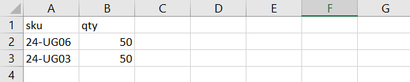

# クイックオーダー

The _クイックオーダー_ 機能により、注文プロセスを数回のクリックに短縮でき、注文する製品の製品名または SKU を把握している顧客に対して、 複数の SKU を持つ注文は、手動で入力することも、クイックオーダーフォームにインポートすることもできます。 クイックオーダーは、アカウントにログインしている顧客、およびゲストが使用できます。 有効にすると、 _クイックオーダー_ リンクは、ページ上部の顧客名の横に表示されます。

{width="700" zoomable="yes"}

## ストアのクイックオーダーを有効にする

1. 次の日： _管理者_ サイドバー、移動 **[!UICONTROL Stores]** > _[!UICONTROL Settings]_>**[!UICONTROL Configuration]**.

1. Adobe Analytics の _[!UICONTROL General]_セクションの左側のパネルで、「 」を選択します。**[!UICONTROL B2B Features]**.

1. 設定 **[!UICONTROL Enable Quick Order]** から `Yes`.

   {width="600" zoomable="yes"}

1. クリック **[!UICONTROL Save Config]**.

1. プロンプトが表示されたら、「 [キャッシュ管理](../systems/cache-management.md) 無効なキャッシュを更新します。

## クイックオーダーワークフロー

顧客は、次のいずれかの方法を使用して、クイック注文用の製品を指定できます。

### 方法 1：個々の製品を入力する

1. 顧客が **[!UICONTROL Quick Order]** リンク。

1. SKU または製品名で製品を選択します。

   を配置するには **SKU 別のクイックオーダー**&#x200B;の場合、顧客は次の操作を実行します。

   - 次に入る **[!UICONTROL SKU]**.

   - クリック数 **[!UICONTROL Add to List]**.

     SKU が入力行に表示され、製品の詳細が次に示されます。

     {width="600" zoomable="yes"}

   を配置するには **商品名別のクイックオーダー**&#x200B;の場合、顧客は次の操作を実行します。

   - 最初の数文字を入力 **[!UICONTROL Product Name]**.

     >[!NOTE]
     >
     >次を使用しない _入力_ キーを使用して製品の名前を選択します。

   - 一致のリストが表示されたら、顧客は注文する製品をクリックします。

     {width="700" zoomable="yes"}

1. 次に入る **[!UICONTROL Qty]**.

1. 次の入力行を使用して、必要な回数だけこの処理を繰り返します。

1. クリック数 **[!UICONTROL Add to Cart]**.

### 方法 2：複数の製品を入力する

1. Adobe Analytics の **[!UICONTROL Enter Multiple SKUs]** 」ボックスで、顧客が次のいずれかの操作を行います。

   - 1 行につき 1 つの SKU を入力

   - すべての SKU を同じ行に入力します（スペースを含まずにコンマで区切ります）。

     {width="600" zoomable="yes"}

1. 製品をリストに追加するには、をクリックします。 **[!UICONTROL Add to List]**.

1. 次に入る **[!UICONTROL Qty]** がリスト内の各項目に対して並べ替えられます。

   {width="600" zoomable="yes"}

   >[!NOTE]
   >
   >製品に必要なオプションがある場合は、お客様にオプションの選択を求められます。 買い物かごに到達して製品オプションを追加するまで待つことができます。

   {width="600" zoomable="yes"}

### 方法 3：製品のリストをアップロードする

1. Adobe Analytics の _[!UICONTROL Add from File]_セクションで、**[!UICONTROL Download Sample]**をクリックして、注文テンプレートをダウンロードします。

   {width="600" zoomable="yes"}

1. ダウンロードしたファイルを開きます。

1. テンプレートを使用して、クイックオーダーリスト用にアップロードする製品 SKU を追加します。

1. 完了したら、「 」をクリックします **[!UICONTROL Save]**.

   {width="400" zoomable="yes"}

1. ファイルをアップロードするには、「 」をクリックします。 **[!UICONTROL Choose]** をクリックし、システムからファイルを選択します。

   項目がクイックオーダーリストに追加されます。

1. 準備が整ったら、クリックします **[!UICONTROL Add to Cart]**.

顧客がクイックオーダーを作成したら、通常どおりチェックアウトを進めます。

{width="700" zoomable="yes"}
