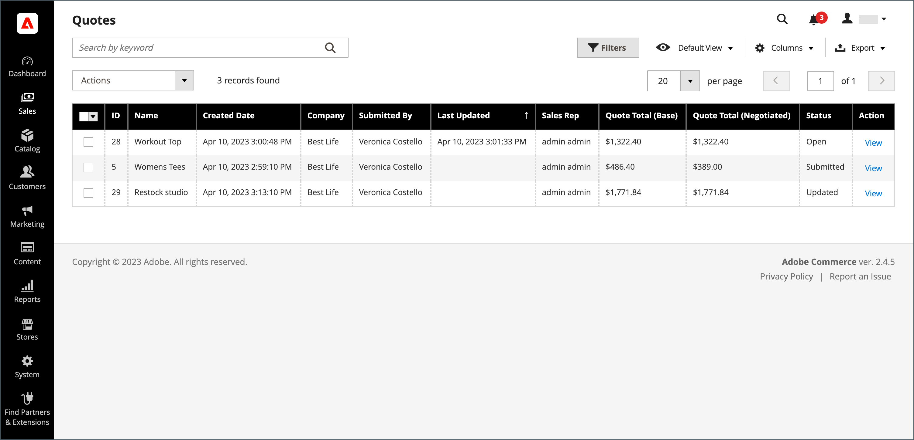
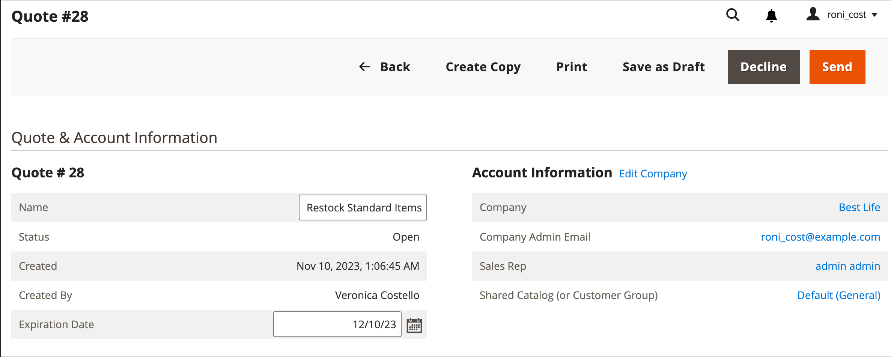
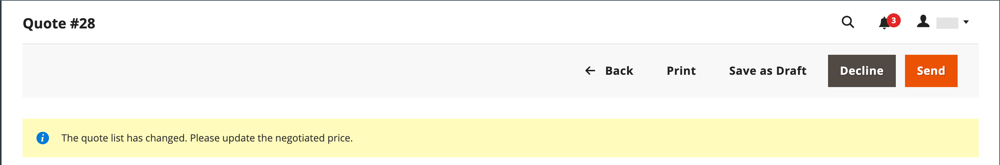
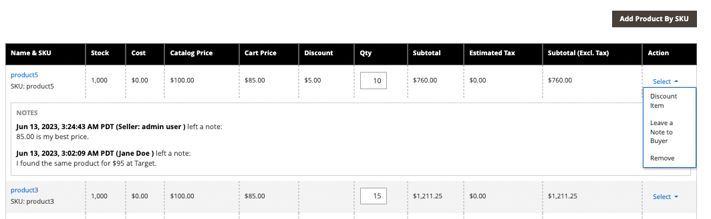
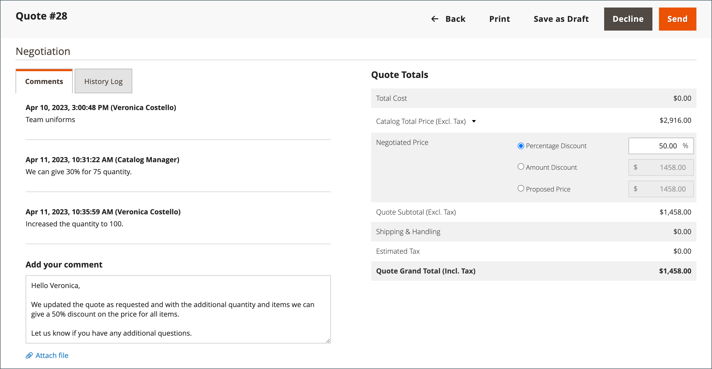

# 見積の交渉

設定で[B2B Quoteが有効になっている](configure-quotes.md)場合、会社または営業担当者の許可された購入者が価格交渉を開始できます。

購入者は、ショッピングカートから見積もりを要求する[ことで価格交渉プロセスを開始します](quote-request.md)。 営業担当者は、[購入者の見積もりドラフト &#x200B;](sales-rep-initiates-quote.md)を作成し、最初の注文項目と価格を含む見積もりを更新して、購入者に送信することで、交渉を開始できます。

価格交渉が開始されると、見積が[見積](quotes.md) グリッドに表示されます。 バイヤーとセラー間のあらゆる交渉は電子メールで行われ、見積もりの詳細ビューから開始および追跡されます。

交渉プロセス中、販売者は管理者から次の操作を実行できます。

- 商品の追加または削除
- 数量の変更
- 行項目または見積もり全体に割引を適用
- 配送方法の追加または変更
- コメントを追加
- 更新した見積もりを購入者に送信するか、下書きとして保存します

購入者は、[[!UICONTROL My Quotes]](account-dashboard-my-quotes.md)を使用して、ストアフロントから見積もり交渉プロセスを管理します。 見積がレビュー用に開いている間、購入者アカウントの状態は`Pending`に設定されています。 購入者は、見積が辞退された場合や有効期限が切れた場合でも、見積を変更して再送信できます。

## 手順1：リクエストの表示

1. 管理者サイドバーで、**[!UICONTROL Sales]** > **[!UICONTROL Quotes]**&#x200B;に移動します。

   新しいリクエストが&#x200B;_[!UICONTROL Quotes]_&#x200B;グリッドに表示されます。

1. _アクション_&#x200B;列で、**[!UICONTROL View]**&#x200B;をクリックします。

   {width="700" zoomable="yes"}

## 手順2：見積の変更

1. _[!UICONTROL Quote & Account Information]_&#x200B;で、_ カレンダー&#x200B;_（）アイコンをクリックします。

   {width="575" zoomable="yes"}

1. 見積の&#x200B;**[!UICONTROL Expiration Date]**&#x200B;を選択してください。

1. _[!UICONTROL Quote Totals]_&#x200B;セクションまで下にスクロールし、必要に応じて&#x200B;**[!UICONTROL Negotiated Price]**&#x200B;を更新します。

   {width="600" zoomable="yes"}

   バイヤーが見積もり内の品目の数量を変更した場合、見積の上部に、品目リストが変更されたことを示す通知が表示され、交渉済みの価格を更新する必要があります。

   {width="600" zoomable="yes"}

### 見積に新製品を追加

1. **[!UICONTROL Add Products by SKU]**&#x200B;をクリックします。

1. 追加する&#x200B;**[!UICONTROL SKU]**&#x200B;と&#x200B;**[!UICONTROL Qty]**&#x200B;を入力してください。

   {width="600" zoomable="yes"}による見積もりに追加

### 行項目の更新を適用

必要に応じて、_[!UICONTROL Items Quoted]_&#x200B;セクションで行アイテムの変更を適用します。

{width="600" zoomable="yes"}

- 提案価格で購入する必要がある&#x200B;**[!UICONTROL Quantity]**&#x200B;を変更します。

- **[!UICONTROL Configure]**&#x200B;を選択し、製品オプションを変更します。

  [!UICONTROL Configure] オプションは、設定可能な製品の行項目でのみ使用できます

- **[!UICONTROL Action]** メニューで、項目を更新するアクションを選択します。
   - **割引項目**&#x200B;を使用して、割引率、固定額、または優先価格で割引を適用します。
オプションで、割引額をロックして、さらなる割引を防ぐことができます。割引がロックされていない場合，
行項目の割引と見積もりレベルの割引の両方が製品価格に適用されます。
   - **購入者**&#x200B;にメモを残して、購入者に商品に関する追加情報を提供します
   - **引用符から項目を削除するには**&#x200B;を削除します。

### 変更を適用して更新

- 変更を適用するには、**[!UICONTROL Add to Quote]**&#x200B;をクリックします。

- 見積もりを更新するには、**[!UICONTROL Recalculate the Quote]**&#x200B;をクリックします。

- 変更を適用して、共有カタログと価格ルールに見積もりを更新するには、**[!UICONTROL Update Prices]**&#x200B;をクリックし、**[!UICONTROL Proceed]**&#x200B;をクリックして更新を確認します。

  {width="600" zoomable="yes"}

### 出荷情報の更新

1. 購入者が見積に&#x200B;_出荷先_&#x200B;の住所を含める場合は、**[!UICONTROL Get shipping methods and rates]**&#x200B;をクリックします。

1. 利用可能なオプションから配送方法を選択します。

1. **[!UICONTROL Proposed Shipping Price]**&#x200B;を入力します。

   _[!UICONTROL Quote Totals]_&#x200B;が更新され、提案された送料が反映されます。

### サポートドキュメントの添付

1. 「_コメントを追加_」ボックスで、**[!UICONTROL Attach file]**&#x200B;をクリックします。

   デフォルトでは、[添付ファイル &#x200B;](../configuration-reference/sales/quotes.md)は、DOC、DOCX、XLS、XLSX、PDF、TXT、JPGまたはJPEG、PNGのいずれかのファイル形式で最大2 MBになります。

1. ディレクトリからファイルを選択します。

## ステップ 3：見積もりレベルの情報を更新し、返信を送信する

1. 「_[!UICONTROL Comments]_」タブの「_[!UICONTROL Negotiation]_」セクションで、「**[!UICONTROL Add your comment]**」セクションに返信を入力します。

1. サポート文書を含めるには、**[!UICONTROL Attach file]**&#x200B;をクリックし、ディレクトリからファイルを選択します。

   添付ファイルに許可される最大ファイルサイズは2 MBです。

1. 見積に割引を適用するには：

   - _[!UICONTROL Negotiated Price]_&#x200B;セクションの&#x200B;_[!UICONTROL Quote Totals]_&#x200B;で、次のいずれかの割引タイプを選択します。

      - `Percentage Discount`: パーセンテージ割引は、元の価格を特定のパーセンテージで引き下げます。
      - `Amount Discount`：金額の割引では、固定価格引き下げが適用されます。
      - `Proposed Price`：提案された価格割引は、元の価格に関係なく、最終的な価格を特定の金額に設定します。

   - 金額をパーセントまたは定額で入力します。

     {width="600" zoomable="yes"}

   - 各行項目または見積もり全体に割引を適用できます。

      - **行項目の割引**：行項目の割引は、カート内の個々の項目に適用されます。 割引には、`percentage`、特定の`amount`、または`proposed price`を指定できます。
      - **カートレベルの割引**：カートレベルの割引は、ショッピングカート全体に適用されます。 割引は、`percentage`または特定の`amount`のいずれかであり、買い物かごの合計値に適用されます。
      - **買い物かごとラインアイテムの割引の組み合わせ**：場合によっては、買い物かごとラインアイテムの両方のレベルで割引を適用できます。 行項目の割引が最初に適用され、次に残りの合計に対するカートレベルの割引が適用されます。

1. 見積の送信または保存：

   - 見積もりが購入者に送り返す準備ができたら、**[!UICONTROL Send]**&#x200B;をクリックします。

   - 後で見積もりの作業を続行するには、**[!UICONTROL Save as Draft]**&#x200B;をクリックします。

>[!NOTE]
>
> 見積もり交渉中に、さらなる変更を防ぐために割引をロックすることができます。 見積もりがロックされると、最初に見積もりをロック解除せずに、割引タイプや金額を変更することはできません。 このロック機能により、営業担当者とバイヤー間で合意された条件が維持されます。

## ステップ 4：見積もりのフォローアップ

見積もりを送信すると、システムは企業アカウントを管理するバイヤーと営業担当者の両方に通知します。 このメールには、バイヤーアカウントの見積もりへのリンクと、見積もりの有効期限が記載されています。 バイヤーは、交渉のどの時点でも、次のことをおこなうことができます。

- 交渉された見積もりを受け入れ、購入を完了します。
- カウンターオファーで返信を送信し、交渉を続行します。
- 交渉を終了します。

ワークフロー内での位置を監視するには、メールとグリッド内の見積もりのステータスを確認します。 交渉プロセスは必要な限り続けることができます。

## ボタンバー

| ボタン | 説明 |
|----------------------------|---------------------------------------------------------------------------------------------------------------------------------------------------------------------------------------------------------------------------------------------------------------------------------------------------------------------------------------------------------------|
| [!UICONTROL Back] | 変更を保存せずに&#x200B;_[!UICONTROL Quotes]_&#x200B;ページに戻ります。 |
| [!UICONTROL Print] | 見積もりをプリンタに送るか、PDF ファイルとして保存します。 |
| [!UICONTROL Create Copy] | 現在の引用符のコピーを作成し、元の名前に`(copy)`を追加して開きます。 [!UICONTROL Name] フィールドを編集して、新しい引用符の名前を変更します。 新しい見積もりをドラフトとして保存するか、顧客に送信して、新しい見積もりを処理します。 |
| テンプレートを作成 | 現在の見積もりに基づいて見積テンプレートを作成します。 見積テンプレート複数の見積に適用できる契約条件と価格条件に関して、購入者と販売者が合意できるようにすることで、見積もり交渉を合理化します。 . 契約書では、見積もり依頼（RFQ）プロセスを再開する代わりに、後続の注文に対して、テンプレートから事前承認済みのリンクされた見積もりを生成できます。 |
| [!UICONTROL Save as Draft] | 見積もりに加えた変更を保存しますが、購入者に送り返さないでください。 |
| [!UICONTROL Decline] | 最初の問い合わせ、または進行中の交渉中に、価格を交渉する要求を拒否します。 見積もりが却下された場合、販売者は決定を説明するためにコメントを追加する必要があります。 見積もりが辞退すると、交渉されたすべての価格が元の値にリセットされます。 売り手が買い手からの返信を待っている間、このボタンは無効になります。 |
| [!UICONTROL Send] | 更新された見積もりを購入者の問い合わせへの返信として送信します。 売り手が買い手からの返信を待っている場合、このボタンは無効になります。 |

{style="table-layout:auto"}

## フィールドの説明

管理画面の見積もり情報と機能は、次のセクションに整理されています。

### [!UICONTROL Quote & Account Information]

| フィールド | 説明 |
|-------------------------------------------------|------------------------------------------------------------------------------------------------------------------------------------------------------------------------------------------------------------------------------------------------------------------------------------------------------------------------------------------------------------------------------------------------------------------------------------------------------------------------------------------------------------------------------------------------------------------------------------------------------------------------------------------------------------------------------------------------------------------------------------------------------------------------------------------------------------------------------------------------------------------------------------------------------------------------------------------------------------------------------------------------------------------------------------------------------------------------------------------------------------|
| [!UICONTROL Name] | [購入者](account-company-roles-permissions.md)によって見積もり要求に割り当てられた名前。 |
| [!UICONTROL Status] | 見積の現在の状態を示します。 見積もりのステータスは、購入者または販売者の行動によってのみ変更できます。 管理者の[&#x200B; ステータス設定](quotes.md)および[購入者アカウント &#x200B;](account-dashboard-my-quotes.md)も参照してください。 |
| [!UICONTROL Created] | 購入者が最初に見積もり依頼を送信した日時。 |
| [!UICONTROL Created By] | 見積もり依頼を提出した会社バイヤーの姓と名。 |
| [!UICONTROL Expiration Date] | 現在の見積が有効な最終日を示します。 デフォルトの有効期限は、購入者が見積もりのリクエストを送信してから30日後に設定されます。   販売者は、別の日付（MMM DD YYYY）を入力するか、カレンダーから日付を選択することで、デフォルトの有効期限を上書きできます。 フィールドが空白のままの場合、引用符は期限切れになりません。   開封済みの見積もりの場合、見積もりの有効期限が切れる48時間前に、販売者に[電子メール通知](../systems/email-templates.md)が届きます。 購入者には、有効期限の24時間前に通知されます。   見積の状態が&#x200B;_期限切れ_&#x200B;に変更され、購入者は見積もりにさらに変更を加えることができません。 見積の提案価格は、カタログの元の値に戻ります。   見積が期限切れに設定されている場合、販売者が見積もりをレビューするために開いている場合、有効期限は設定で設定されている範囲に従ってリセットされます。   有効期限は、レビュープロセス中に編集できる&#x200B;_見積とアカウント_ セクションの唯一のフィールドです。 |
| [!UICONTROL Company] | 購入者が表す[会社](account-companies.md)の法的な名前。 |
| [!UICONTROL Company Admin Email] | [会社管理者](account-company-admin.md)の電子メールアドレス。 |
| [!UICONTROL Sales Rep] | 販売者で働く[営業担当者](account-company-manage.md)が、会社アカウントに割り当てられた主要な連絡先です。 |
| [!UICONTROL Shared Catalog (or Customer Group)] | 会社が割り当てられている[共有カタログ &#x200B;](catalog-shared.md)または[顧客グループ &#x200B;](account-company-customer-group.md)。 見積には、会社に割り当てられている共有カタログのカスタム価格が含まれる場合があります。 |

{style="table-layout:auto"}

### [!UICONTROL Add to Quote by SKU]

| フィールド | 説明 |
|---------------------------|-----------------------------------------------------------|
| [!UICONTROL Enter SKU] | 見積に追加する製品のSKU。 |
| [!UICONTROL Qty] | 見積に追加されるこのSKUの項目数。 |
| [!UICONTROL Add to Quote] | 見積に指定した製品の数量を追加します。 |

{style="table-layout:auto"}

### [!UICONTROL Items Quoted]

| フィールド | 説明 |
|-----------------------------------------|---------------------------------------------------------------------------------------------------------------------------------------------------------------------------------------------------------------------------|
| [!UICONTROL Name & SKU] | リンクされた商品名と在庫保管単位（SKU）。 |
| [!UICONTROL Stock] | 現在販売可能な、このSKUの下にある製品の数。 |
| [!UICONTROL Cost] | 販売者が製品を購入するために支払った金額。 |
| [!UICONTROL Catalog Price] | バイヤーズ会社に割り当てられている顧客グループまたは共有カタログに基づく、バイヤーズカタログ内の製品の価格。 |
| [!UICONTROL Cart Price] | カート内の商品の元の価格から、カートから適用された割引を差し引きます。 購入者の顧客グループに適用される割引やカート規則がある場合、カートの価格がカタログの価格と異なる場合があります。 |
| [!UICONTROL Discount] | 品目に適用される行品目の割引。 値には、パーセント、固定額、または提案価格を指定できます。 |
| [!UICONTROL Qty] | 見積もり価格の基準となる、このSKU内のユニット数。 0より大きい正の数値のみを入力できます。 数量をゼロに変更する場合は、見積書から行項目を削除します。 |
| [!UICONTROL Subtotal] | 提案価格に注文件数を掛けた値。 |
| [!UICONTROL Estimated Tax] | 構成に従って、この品目に対して推定される税額。 税計算の設定に応じて、見積もり税額は次のいずれかに基づいて計算されます：単価/行合計/合計 |
| [!UICONTROL Subtotal (Incl./Excl. Tax)] | 設定に応じて、この列には税金の見積もり有無にかかわらず小計を表示できます。 |
| [!UICONTROL Action] | 行項目に適用できる操作の選択メニュー：<ul><li>**[!UICONTROL Discount item]**</li><li>**[!UICONTROL Leave a note to Buyer]**</li><li>**[!UICONTROL Remove an item from the quote]**</li></ul>。 |
| [!UICONTROL Configure] | 設定可能な製品の製品オプションを変更できます。 |
| [!UICONTROL Update Prices] | 共有カタログと価格ルールからの最新の変更で見積もりを更新します。 |
| [!UICONTROL Recalculate Quote] | すべての見積もり価格、買い物かごの価格ルールおよび税金を再計算して、見積もりに対する変更を反映します。 |

{style="table-layout:auto"}

### [!UICONTROL Shipping Information]

| フィールド | 説明 |
|--------------------------------------|------------------------------------------------------------------------------------------------------------------------------------------------------------------------------|
| [!UICONTROL Shipping Address] | 購入者のアカウントで指定された配送先住所を表示します。 購入者がリクエストを送信する前に住所を指定しなかった場合、配送先住所は空白になります。 |
| [!UICONTROL Shipping Method & Price] | 購入者が見積に&#x200B;_出荷先_&#x200B;の住所を含める場合、「出荷方法と配送料を取得」リンクが表示されます。 |

{style="table-layout:auto"}

### [!UICONTROL Negotiation]

| フィールド | 説明 |
|--------------------------|----------------------------------------------------------------------------------------------------------------------------------------------------------------------------------------------------------------------------------------------------------------------------------------------------------------------------------------------------------------------------------------------------------------------------------------------------------------------------------------------------------------------------------------------------------------------------------------------------------------------------------------------------------|
| [!UICONTROL Comments] | 「交渉」セクションの「コメント」タブは、見積に関するメッセージを購入者に入力するために使用します。 **[!UICONTROL Add your comment]**- コメントは、交渉プロセス中に購入者と通信するために使用されます。 コメントを使用して、見積もりで提供される割引、または見積もり依頼が拒否される理由を説明します。 **[!UICONTROL Attach file]** - [添付ファイル &#x200B;](configure-quotes.md)の最大ファイルサイズとサポートされるファイルタイプは、設定によって決まります。 デフォルトでは、添付ファイルは最大2 MBで、DOC、DOCX、XLS、XLSX、PDF、TXT、JPGまたはJPEG、PNGのいずれかのファイルタイプを使用できます。 |
| [!UICONTROL History Log] | このタブには、日付、見積ステータス、コメントを含む見積もりの履歴が表示されます。 |

{style="table-layout:auto"}

### [!UICONTROL Quote Totals]

| フィールド | 説明 |
|-----------------------------------------------------|-----------------------------------------------------------------------------------------------------------------------------------------------------------------------------------------------------------------------------------------------------------------------------------------------------------------------------------------------------------------------------------------------------------------------------------------------------------------------------------------------------------------------------------------------------------------------------------------------------------------------------------------------------------------------|
| [!UICONTROL Total Cost] | 見積もりに含まれる品目の販売者に対する総費用。 |
| [!UICONTROL Catalog Total Price  (Incl./Excl. Tax)] | 見積書の基礎として使用される共有カタログまたはプライマリカタログの価格に従って、税抜き見積書の品目の合計価格。 セクションを展開して、設定の[小計を表示](../configuration-reference/sales/tax.md)設定に応じて、計算で使用される値を表示します。 オプション： **[!UICONTROL Subtotal (Excl. Tax)]**- カタログの合計価格（税抜）。 **[!UICONTROL Subtotal (Incl. Tax)]** - カタログの合計価格（税抜）。 **[!UICONTROL Estimated Tax]**- カタログの合計価格に適用すると推定される税額。 |
| 交渉価格 | 購入者に提供される割引は、次のいずれかに基づいて行うことができます。 **[!UICONTROL Percentage Discount]**– 割引率。 **[!UICONTROL Amount Discount]** – 固定額の割引。 **[!UICONTROL Proposed Price]**– 販売者が提案した価格。
見積内のすべてのアイテムにロックされたアイテム割引がある場合、それ以上の割引は適用できないため、[!UICONTROL Negotiated Price] セクションは無効になります。

製品にロックされていない品目の割引がある場合、品目の割引と見積もりレベルの割引の両方が製品価格に適用されます。
 |
| [!UICONTROL Quote Subtotal (Incl./Excl. Tax)] | 構成の[税計算](../configuration-reference/sales/tax.md)設定に応じて、見積もり内の各品目の合計提案価格（税込みまたは税抜き）を表示します。 |
| [!UICONTROL Shipping & Handling] | 見積の「出荷情報」セクションの「出荷予定価格」フィールドに販売者が入力した金額。 このフィールドが空の場合、金額は選択した配送方法に基づきます。 |
| [!UICONTROL Estimated Tax] | 設定[表示設定](../configuration-reference/sales/tax.md)で指定されているように、期限が迫っていると推定される税額。 |
| [!UICONTROL Quote Grand Total (Incl. Tax)] | 見積もりの下部の最終合計で、交渉価格、税金見積、および提案された出荷と処理が含まれています。 |

{style="table-layout:auto"}
