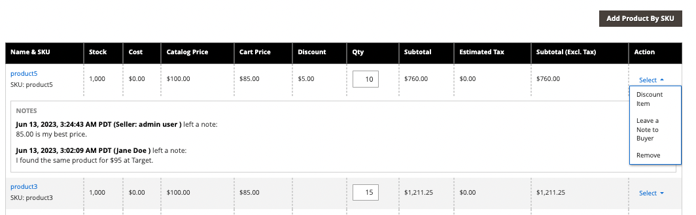

# 見積の交渉

次の場合 [B2B 見積が有効になっています](configure-quotes.md) この構成では、企業または営業担当者からの承認されたバイヤーが価格ネゴシエーションを開始できます。

バイヤーは、次の方法で価格交渉プロセスを開始します。 [見積の依頼](quote-request.md) 買い物かごから。 営業担当は、次の方法でネゴシエーションを開始できます [購買担当の見積草案の作成](sales-rep-initiates-quote.md)最初の注文品目と価格で見積もりを更新し、購入者に送信します。

価格交渉が開始されると、見積もりが [見積もり](quotes.md) グリッド。 購入者と販売者の間のすべての交渉は電子メールで行われ、見積もりの詳細表示から開始および追跡されます。

ネゴシエーション・プロセス中、セラーは管理者から次の操作を実行できます。

- 製品の追加または削除
- 数量の変更
- 行項目または合計価格に割引を適用
- 出荷方法を追加または変更します
- コメントを追加
- 更新した見積を購買担当に送信するか、下書きとして保存します

バイヤーは、次の方法でストアフロントから見積ネゴシエーション・プロセスを管理します [[!UICONTROL My Quotes]](account-dashboard-my-quotes.md). 見積がレビューのためにオープンされている間、購買担当アカウントでのステータスは次のように設定されます `Pending`. 購買担当は、見積が却下または失効した場合でも、見積を変更して再発行できます。

## 手順 1：リクエストを表示

1. 管理サイドバーで、に移動します。 **[!UICONTROL Sales]** > **[!UICONTROL Quotes]**.

   新しいリクエストがに表示されます。 _[!UICONTROL Quotes]_グリッド。

1. が含まれる _アクション_ 列、クリック **[!UICONTROL View]**.

   {width="700" zoomable="yes"}

## 手順 2：見積もりを変更

1. 次の下 _[!UICONTROL Quote & Account Information]_を選択し、_&#x200B;カレンダー&#x200B;_（） アイコンをクリックします。

   {width="575" zoomable="yes"}

1. を選択 **[!UICONTROL Expiration Date]** 見積もりに。

1. にスクロール ダウンします。 _[!UICONTROL Quote Totals]_「」セクションを選択して「」を更新&#x200B;**[!UICONTROL Negotiated Price]**必要に応じて。

   {width="600" zoomable="yes"}

   購買担当が見積の品目の数量を変更すると、その見積の上部に品目リストが変更されたことを示す通知が表示され、交渉価格を更新する必要があります。

   {width="600" zoomable="yes"}

### 見積もりに新製品を追加

1. クリック **[!UICONTROL Add Products by SKU]**.

1. を入力 **[!UICONTROL SKU]** および **[!UICONTROL Qty]** を追加する必要があります。

   {width="600" zoomable="yes"}

### 品目の更新を適用

で行項目の変更を適用 _[!UICONTROL Items Quoted]_必要に応じて、「」を選択します。

{width="600" zoomable="yes"}

- 変更： **[!UICONTROL Quantity]** それは提案価格で購入しなければなりません。

- を選択 **[!UICONTROL Configure]** 製品オプションを変更します。

  この [!UICONTROL Configure] 設定可能な商品の行項目でのみオプションを使用できます

- が含まれる **[!UICONTROL Action]** メニューで、項目を更新するアクションを選択します。
   - **割引品目** パーセンテージ、固定金額または優先価格で値引を適用する手順は、次のとおりです。
オプションで、割引額をロックして、それ以上の割引を防ぐことができます。 値引がロックされていない場合は、品目値引と見積依頼レベルの値引の両方が製品価格に適用されます。
   - **買い手にメモを残す** 買い手に品目に関する追加情報を提供する
   - **削除** 見積から品目を削除します。

### 変更を適用して更新

- 変更を適用するには、 **[!UICONTROL Add to Quote]**.

- 見積を更新するには、 **[!UICONTROL Recalculate the Quote]**.

- 変更を適用し、共有カタログおよび価格ルールに対して見積を更新するには、 **[!UICONTROL Update Prices]** 次に、をクリックします **[!UICONTROL Proceed]** 更新を確認します。

  {width="600" zoomable="yes"}

### 配送先情報の更新

1. 購入者が _出荷先_ 見積書内の住所をクリックします **[!UICONTROL Get shipping methods and rates]**.

1. 利用可能なオプションから配送方法を選択します。

1. を入力 **[!UICONTROL Proposed Shipping Price]**.

   この _[!UICONTROL Quote Totals]_が更新され、提案された配送価格が反映されます。

### サポートドキュメントの添付

1. の下 _コメントを追加_ ボックス、クリック **[!UICONTROL Attach file]**.

   デフォルトでは [添付ファイル](../configuration-reference/sales/quotes.md) 次のファイル形式のいずれかで最大 2 MB にすることができます：DOC、DOCX、XLS、XLSX、PDF、TXT、JPGまたはJPEG、PNG。

1. ディレクトリからファイルを選択します。

## 手順 3：見積レベル情報を更新し、返信を送信する

1. が含まれる _[!UICONTROL Negotiation]_に関する節_[!UICONTROL Comments]_ タブで、に返信を入力します **[!UICONTROL Add your comment]** セクション。

1. サポートされるドキュメントを含めるには、 **[!UICONTROL Attach file]** ディレクトリからファイルを選択します。

   添付ファイルの最大ファイルサイズは 2 MB です。

1. 見積書全体に値引を適用する手順は、次のとおりです。

   - 次の下 _[!UICONTROL Quote Totals]_が含まれる_[!UICONTROL Negotiated Price]_ セクションで、次のいずれかの割引タイプを選択します。

      - `Percentage Discount`
      - `Amount Discount`
      - `Proposed Price`

   - 金額をパーセンテージまたは定価で入力します。

     {width="600" zoomable="yes"}

1. 見積もりを送信または保存します。

   - 見積書を購入者に送り返す準備ができたら、 **[!UICONTROL Send]**.

   - 後で見積もりの作業を続けるには、 **[!UICONTROL Save as Draft]**.

## 手順 4：見積もりのフォローアップ

見積を送信すると、その会社のアカウントを管理する購買担当と営業担当者の両方に通知されます。 電子メールには、購入者アカウントの見積もりへのリンクと見積もりの有効期限が含まれています。 ネゴシエーションの任意の時点で、バイヤーは次のいずれかを実行できます。

- 交渉された見積を受け入れ、購入を完了します。
- カウンターオファー付きの返信を送信し、ネゴシエーションを続行します。
- ネゴシエーションを終了します。

ワークフロー内の位置を監視するには、メールとグリッド内の引用符のステータスを確認します。 必要に応じて、ネゴシエーション・プロセスを続行できます。

## ボタンバー

| ボタン | 説明 |
|----------------------------|---------------------------------------------------------------------------------------------------------------------------------------------------------------------------------------------------------------------------------------------------------------------------------------------------------------------------------------------------------------|
| [!UICONTROL Back] | に戻ります。 _[!UICONTROL Quotes]_変更を保存しないページ。 |
| [!UICONTROL Print] | 見積もりをプリンタに送るか、PDFファイルとして保存します。 |
| [!UICONTROL Create Copy] | [!BADGE 1.5.0 ベータ版機能]{type=Informative url=&quot;/help/b2b/release-notes.md&quot; tooltip=&quot;ベータ版プログラムの参加者のみが使用できます&quot;} 現在の引用符のコピーを作成し、次の文字列で開きます `(copy)` 元の名前にが追加されます。 を編集して、新しい引用符の名前を変更します。 [!UICONTROL Name] フィールド。 新しい見積もりをドラフトとして保存するか、お客様に送信して、処理します。 |
| [!UICONTROL Save as Draft] | 見積書に加えた変更を保存しますが、購入者には送り返さないでください。 |
| [!UICONTROL Decline] | 最初の問い合わせ時または進行中の交渉中に、価格の交渉要求を拒否します。 見積もりが却下された場合、売り手は決定を説明するためのコメントを追加する必要があります。 見積が却下されると、交渉されたすべての価格が元の値にリセットされます。 売り手が購入者からの返信を待っている間、このボタンは無効になります。 |
| [!UICONTROL Send] | 更新された見積を購入者の照会に対する応答として送信します。 売り手が買い手からの返信を待っている場合、このボタンは無効になります。 |

{style="table-layout:auto"}

## フィールドの説明

Quote の情報と Admin の機能は、次のセクションに分かれています。

### [!UICONTROL Quote & Account Information]

| フィールド | 説明 |
|-------------------------------------------------|------------------------------------------------------------------------------------------------------------------------------------------------------------------------------------------------------------------------------------------------------------------------------------------------------------------------------------------------------------------------------------------------------------------------------------------------------------------------------------------------------------------------------------------------------------------------------------------------------------------------------------------------------------------------------------------------------------------------------------------------------------------------------------------------------------------------------------------------------------------------------------------------------------------------------------------------------------------------------------------------------------------------------------------------------------------------------------------------------------|
| [!UICONTROL Name] | によって見積もり依頼に割り当てられた名前 [購入者](account-company-roles-permissions.md). |
| [!UICONTROL Status] | 見積もりの現在の状態を示します。 見積もりのステータスは、買い手または売り手の側の行動によってのみ変更できます。 関連トピック [ステータス設定](quotes.md) 管理者およびから [買主勘定](account-dashboard-my-quotes.md). |
| [!UICONTROL Created] | 購買担当が見積依頼を最初に送信した日時。 |
| [!UICONTROL Created By] | 見積もり依頼を送信した会社の購買担当の氏名。 |
| [!UICONTROL Expiration Date] | 現在の見積もりが有効である最終日を示します。 デフォルトの有効期限は、バイヤーが見積依頼を送信してから 30 日後に設定されます。   販売者は、別の日付（MMM DD YYYY）を入力するか、カレンダーから日付を選択することで、デフォルトの有効期限を上書きできます。 フィールドを空白のままにすると、引用符の有効期限が切れることはありません。   オープン引用符の場合、売り手は次のものを受け取ります [メール通知](../systems/email-templates.md) 見積もりの有効期限が切れる 48 時間前 購入者には、有効期限の 24 時間前までに通知が届きます。   Quote のステータスが「」に変わります。 _期限切れ_ また、購入者は見積もりに対してこれ以上の変更を加えることはできません。 見積の提案価格は、カタログの元の値に戻ります。   見積が有効期限切れに設定されている場合に販売者による確認のために開かれている場合、有効期限は設定で設定された範囲に従ってリセットされます。   の唯一のフィールドは「有効期限」です _見積りとアカウント_ レビュープロセス中に編集できるセクション |
| [!UICONTROL Company] | の正式名称 [会社](account-companies.md) 購入者が表すもの。 |
| [!UICONTROL Company Admin Email] | のメールアドレス [会社管理者](account-company-admin.md). |
| [!UICONTROL Sales Rep] | この [営業担当者](account-company-manage.md) 販売者のために働き、会社アカウントに割り当てられたプライマリ連絡先です。 |
| [!UICONTROL Shared Catalog (or Customer Group)] | この [共有カタログ](catalog-shared.md) または [顧客グループ](account-company-customer-group.md) 会社を割り当てる。 見積もりには、会社に割り当てられている共有カタログのカスタム価格が含まれている場合があります。 |

{style="table-layout:auto"}

### [!UICONTROL Add to Quote by SKU]

| フィールド | 説明 |
|---------------------------|-----------------------------------------------------------|
| [!UICONTROL Enter SKU] | 見積もりに追加される商品の SKU。 |
| [!UICONTROL Qty] | 見積もりに追加されるこの SKU のアイテム数です。 |
| [!UICONTROL Add to Quote] | 指定した商品の数量を見積もりに追加します。 |

{style="table-layout:auto"}

### [!UICONTROL Items Quoted]

| フィールド | 説明 |
|-----------------------------------------|---------------------------------------------------------------------------------------------------------------------------------------------------------------------------------------------------------------------------|
| [!UICONTROL Name & SKU] | リンクされた製品名と最小在庫管理単位（SKU）。 |
| [!UICONTROL Stock] | この SKU で現在販売可能な製品の数です。 |
| [!UICONTROL Cost] | 販売者が商品の購入に支払った金額。 |
| [!UICONTROL Catalog Price] | 購入者の会社に割り当てられた顧客グループまたは共有カタログに基づく、購入者のカタログ内の製品の価格。 |
| [!UICONTROL Cart Price] | 買い物かごに入っている商品の元の価格から、買い物かごから適用される割引を差し引いた値。 購入者の顧客グループに適用される割引または買い物かごルールがある場合、買い物かご価格はカタログ価格とは異なる場合があります。 |
| [!UICONTROL Discount] | 品目に適用される品目割引。 値は、パーセンテージ、固定金額、または提示された価格にすることができます。 |
| [!UICONTROL Qty] | この SKU での見積価格の根拠となる単位数です。 ゼロより大きい正の数のみを入力できます。 数量をゼロに変更する場合は、見積から明細品目を削除します。 |
| [!UICONTROL Subtotal] | 注文済み品目の数量で乗算された提案価格。 |
| [!UICONTROL Estimated Tax] | コンフィギュレーションに従ってこの品目に対して見積もられる税額。 税金計算設定に応じて、見積税金は次のいずれかを基準にすることができます。単価/行合計/合計 |
| [!UICONTROL Subtotal (Incl./Excl. Tax)] | 設定に応じて、この列には予測税の有無にかかわらず小計が表示されます。 |
| [!UICONTROL Action] | ライン・アイテムに適用できる操作の選択メニュー：<ul><li>**[!UICONTROL Discount item]**</li><li>**[!UICONTROL Leave a note to Buyer]**</li><li>**[!UICONTROL Remove an item from the quote]**</li></ul>。 |
| [!UICONTROL Configure] | 設定可能な製品の製品オプションを変更できます。 |
| [!UICONTROL Update Prices] | 共有カタログおよび価格ルールからの最新の変更で見積もりを更新します。 |
| [!UICONTROL Recalculate Quote] | すべての見積価格、買い物かごの価格ルール、税を再計算して、見積もりに変更を反映します。 |

{style="table-layout:auto"}

### [!UICONTROL Shipping Information]

| フィールド | 説明 |
|--------------------------------------|------------------------------------------------------------------------------------------------------------------------------------------------------------------------------|
| [!UICONTROL Shipping Address] | 購入者の口座で指定された配送先住所を表示します。 購入者がリクエストを送信する前に住所を指定しなかった場合、発送先住所は空白になります。 |
| [!UICONTROL Shipping Method & Price] | バイヤーに次の情報が含まれる場合は、「出荷方法およびレートの取得」リンクが表示されます。 _出荷先_ 見積書の住所です。 |

{style="table-layout:auto"}

### [!UICONTROL Negotiation]

| フィールド | 説明 |
|--------------------------|----------------------------------------------------------------------------------------------------------------------------------------------------------------------------------------------------------------------------------------------------------------------------------------------------------------------------------------------------------------------------------------------------------------------------------------------------------------------------------------------------------------------------------------------------------------------------------------------------------------------------------------------------------|
| [!UICONTROL Comments] | 「ネゴシエーション」セクションの「注釈」タブを使用して、見積に関する購買担当へのメッセージを入力します。  **[!UICONTROL Add your comment]**- コメントは、ネゴシエーション・プロセス中にバイヤーと通信するために使用されます。 コメントを使用して、見積で提供された割引や、見積もり依頼が却下された理由を説明します。 **[!UICONTROL Attach file]**  – 最大ファイルサイズとサポートされるファイルタイプ [添付ファイル](configure-quotes.md) 設定によって決まります。 デフォルトでは、添付ファイルは最大 2 MB で、DOC、DOCX、XLS、XLSX、PDF、TXT、JPGまたはJPEG、PNG のいずれかのファイルタイプになります。 |
| [!UICONTROL History Log] | このタブには、日付、見積もりステータス、コメントを含む、見積もりの完全な履歴が表示されます。 |

{style="table-layout:auto"}

### [!UICONTROL Quote Totals]

| フィールド | 説明 |
|-----------------------------------------------------|-----------------------------------------------------------------------------------------------------------------------------------------------------------------------------------------------------------------------------------------------------------------------------------------------------------------------------------------------------------------------------------------------------------------------------------------------------------------------------------------------------------------------------------------------------------------------------------------------------------------------------------------------------------------------|
| [!UICONTROL Total Cost] | 見積もりに含まれる品目の販売者に対する合計金額。 |
| [!UICONTROL Catalog Total Price  (Incl./Excl. Tax)] | 見積の基礎として使用される共有カタログまたは主カタログの価格に従った、見積の中の品目の合計価格（税金なし）。 「」セクションを展開すると、に応じて、計算で使用される値が表示されます [小計を表示](../configuration-reference/sales/tax.md) 設定でを指定します。 オプション：  **[!UICONTROL Subtotal (Excl. Tax)]**- カタログの見積税なしの合計価格。 **[!UICONTROL Subtotal (Incl. Tax)]** - カタログの見積税なしの合計価格。  **[!UICONTROL Estimated Tax]**- カタログの合計金額に適用されると推定される税額。 |
| 交渉価格 | バイヤーに提供される値引は、次のいずれかに基づいて設定できます。  **[!UICONTROL Percentage Discount]**- パーセンテージでの割引。 **[!UICONTROL Amount Discount]**  – 固定金額としての割引。  **[!UICONTROL Proposed Price]**– 販売者によって提案された価格。
見積のすべての品目にロックされた品目値引がある場合は、 [!UICONTROL Negotiated Price] これ以上の割引を適用できないため、セクションは無効になっています。

製品にロックされていない品目値引がある場合、品目値引と見積レベル値引の両方が製品価格に適用されます。
 |
| [!UICONTROL Quote Subtotal (Incl./Excl. Tax)] | 見積書の各品目の提案価格の合計（税の有無に応じて） [税計算](../configuration-reference/sales/tax.md) 設定で指定します。 |
| [!UICONTROL Shipping & Handling] | 見積もりの出荷情報セクションの [ 提示済み出荷価格 ] フィールドに販売者が入力した金額。 このフィールドが空の場合、金額は選択した発送方法に基づきます。 |
| [!UICONTROL Estimated Tax] | 構成で指定されている、納税が見込まれる税額 [ディスプレイ設定](../configuration-reference/sales/tax.md). |
| [!UICONTROL Quote Grand Total (Incl. Tax)] | 見積の下部にある最終合計。交渉価格、見積税、提案された出荷および処理が含まれます。 |

{style="table-layout:auto"}
