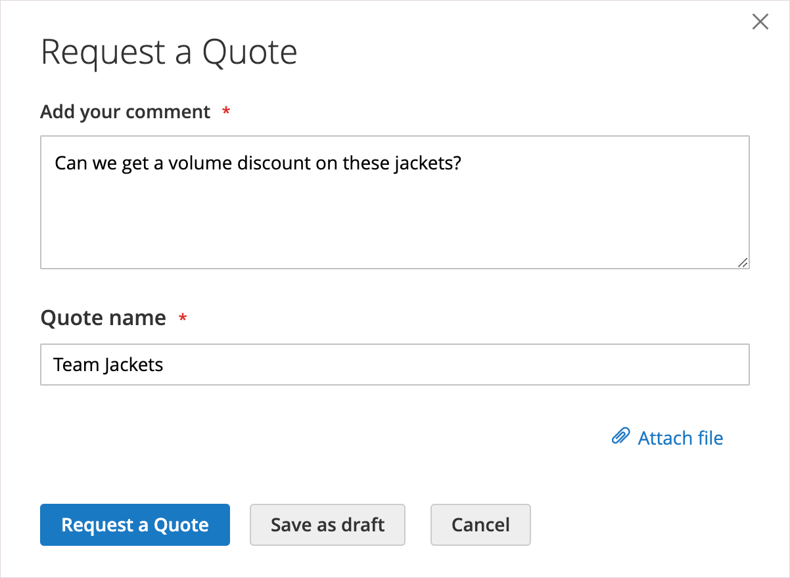

# 見積もり依頼

見積もりが [セールス機能の設定](configure-quotes.md)を使用すると、会社の承認済みの購入者は、買い物かごから見積をリクエストすることで、価格交渉プロセスを開始できます。 購買担当がネゴシエーション用に見積を発行する準備ができていない場合は、その見積を草案として保存できます。

>[!NOTE]
>
>見積もりのリクエストには、割引コードやギフトカードを含めることはできません。

## 顧客の見積もりリクエストエクスペリエンス

1. 顧客が、を使用してユーザーアカウントに購入者としてログインする。 [権限](account-company-roles-permissions.md) 見積もりをリクエストする

1. 見積もりに含める製品を買い物かごに追加します。

   >[!TIP]
   > 
   >注文する製品 SKU のリストがある場合は、 [クイックオーダー](quick-order.md).

1. 選択 **[!UICONTROL Request a Quote]**.

   {width="700" zoomable="yes"}

1. Adobe Analytics の **[!UICONTROL Add your comment]** ボックスに、リクエストを説明する簡単なメモを入力します。

1. 次の項目に入る **[!UICONTROL Quote Name]**.

   {width="400" zoomable="yes"}

1. 必要に応じて、引用符にサポートドキュメントまたはイメージを添付します。

   - 選択 **[!UICONTROL Attach file]**.
   - システムからファイルを選択します。

   デフォルトでは、 [添付ファイル](configure-quotes.md) は、DOC、DOCX、XLS、XLSX、PDF、TXT、JPGまたはJPEG、PNG のいずれかのファイル形式で、最大 2 MB まで設定できます。

1. 見積もりを作成し、処理します。

   - 「 」を選択して見積を販売者に送信します。 **[!UICONTROL Request a Quote]**.
   - [!BADGE 1.5.0 — ベータ版機能]{type=Informative url="/help/b2b/release-notes.md" tooltip="ベータ版プログラム参加者のみ利用可能"}**[!UICONTROL Save as Draft]**.

     購入者が見積書を下書きとして保存した場合、見積書は [!UICONTROL My Quotes] in `Draft` 状態。 Buyer が下書き見積もりを開いて送信するまで、売り手には表示されません。
