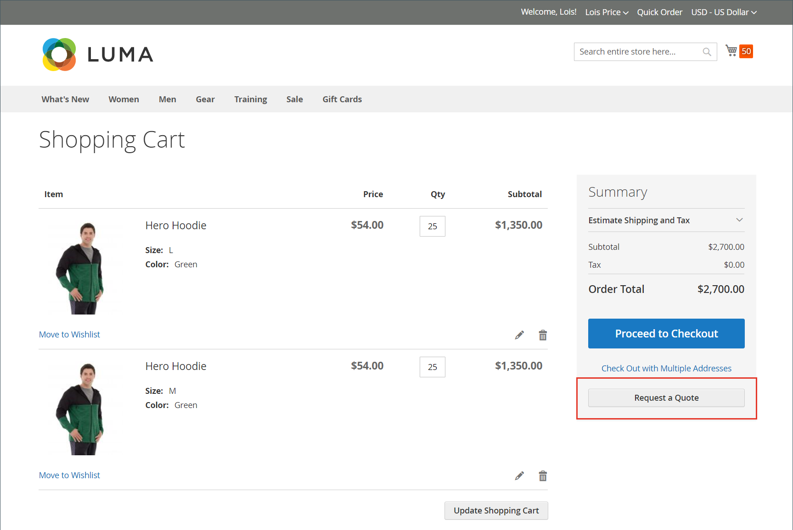

# 見積もり依頼

[販売機能の設定](configure-quotes.md)で見積もりが有効になっている場合、企業の許可された購入者は、ショッピングカートから見積もりをリクエストすることで、価格交渉プロセスを開始できます。 バイヤーが交渉のために見積もりを提出する準備ができていない場合は、それをドラフトとして保存できます。

>[!NOTE]
>
>見積もりのリクエストに割引コードやギフトカードを含めることはできません。

## 見積もり依頼

1. お客様は、[権限](account-company-roles-permissions.md)を持つ購入者としてユーザーアカウントにログインし、見積もりをリクエストします。

1. 見積もりに含める商品をショッピングカートに追加します。

   >[!TIP]
   > 
   >顧客は、[ クイックオーダー](quick-order.md)を使用することで、商品SKUのリストをカートに素早く追加できます。

1. **[!UICONTROL Request a Quote]**&#x200B;を選択します。

   {width="700" zoomable="yes"}

1. 「**[!UICONTROL Add your comment]**」ボックスに、お客様はリクエストを説明する簡単なメモを入力します。

1. **[!UICONTROL Quote Name]**&#x200B;を入力します。

   {width="400" zoomable="yes"}

1. 必要に応じて、サポート文書または画像を見積もりに添付します。

   - **[!UICONTROL Attach file]**&#x200B;を選択します。
   - システムからファイルを選択します。

   デフォルトでは、[添付ファイル ](configure-quotes.md)は、DOC、DOCX、XLS、XLSX、PDF、TXT、JPGまたはJPEG、PNGのいずれかのファイル形式で、最大2 MBです。

1. 見積を作成して処理します。

   - **[!UICONTROL Request a Quote]**&#x200B;を選択して、販売者に見積もりを送信します。
   - **[!UICONTROL Save as Draft]**&#x200B;を選択して、見積を下書きとして保存します。

     購入者が見積もりを下書きとして保存すると、見積は[!UICONTROL My Quotes]の`Draft`状態で利用できます。 ドラフト見積は、購入者がレビュー用に送信するまで、売り手には表示されません。
