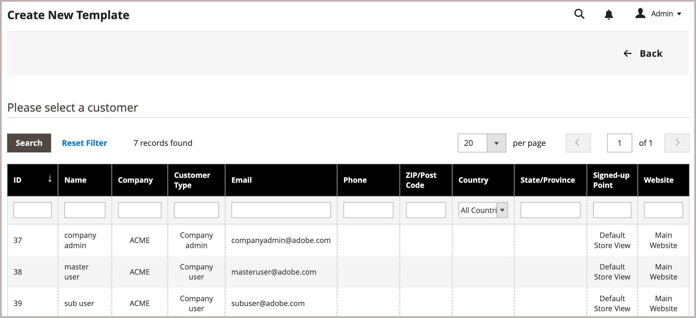

# 見積もりテンプレートのユースケースとワークフロー

見積もりテンプレート機能を使用すると、購入者と販売者は、再利用可能でカスタマイズ可能な見積もりテンプレートを作成することで、見積もりプロセスを合理化できます。

- **カスタマイズ可能な見積**：購入者は、事前承認済みのテンプレートからリンクされた見積もりを生成でき、行項目の数量や選択など、指定されたパラメーター内でカスタマイズできます。
- **注文しきい値** – 販売者は最小注文と最大注文の約定を設定でき、購入者が合意した購入量に確実に従うことができます。 バイヤーが見積テンプレートを受け入れると、リンクされた見積もりが生成されるたびに、注文しきい値数が増加します。 リンクされた見積が注文に変換されずにクローズされた場合、注文のしきい値カウントから注文が減算されます。 最大注文しきい値に達すると、見積テンプレートの有効期限が切れます。
- **有効期限** - テンプレートには有効期限（*[!UICONTROL Valid Until]*）を設定でき、条件が指定された時間枠内でのみ適用されるようにします。 有効期限が切れると、テンプレートが閉じられ、関連するすべてのリンクされた引用符が閉じられます。
- **割引と価格設定** – 販売者は、見積もりと同じ行項目、見積もりレベル、および配送価格の割引機能を使用して、定期的な注文の割引を設定し、交渉プロセスを簡素化できます。
- **トラッキングとレポート** - テンプレートから生成されたリンクされた見積もりの数を追跡し、正常に完了した注文を追跡して、合意された注文ノルマのフルフィルメントに関するインサイトを提供します。
- **参照ドキュメントリンク** – 購入者と販売者の両方が、見積テンプレートに外部ドキュメントリンク（DocuSign、Adobe Sign、その他のオンラインサービスなど）を追加、編集、管理できます。 これにより、見積もりテンプレートプロセス中に、関連する契約や契約に簡単にアクセスできます。

## ユースケース

企業のバイヤーは、見積もりテンプレートを使用して、特定の商品セットを一定期間にわたって注文できます。 バイヤーは、見積もりプロセスをより効率的で一貫性のあるものにし、戦略的な購入契約に沿ったものにするために、次の見積もりテンプレートオプションを設定します。

- 注文しきい値：交渉済み価格の対象となる注文の最小数と最大数を指定します。 これは、契約契約書で指定された注文クォータを適用および追跡するために使用できます。

- 数量しきい値（最小/最大数量） テンプレートでは、各注文に対して購入可能な最小数量と最大数量を設定するための数量しきい値を指定し、売り手が在庫レベルを効果的に管理できるようにしながら、買い手に必要に応じて数量を調整する柔軟性を提供します。

- ドキュメントのリンクを参照して、外部の契約や契約書との関係を維持し、見積もりプロセス中に関連ドキュメントに簡単にアクセスできるようにします。

## 見積もりテンプレートワークフロー

見積もりテンプレートは、購入者または販売者が開始できます。

**手順1：見積テンプレートの作成（新規）**

- **購入者が見積もりテンプレートを作成**

  既存の見積もりを確認する際、バイヤーは、自社が今後1年間に複数の注文を送信する必要があり、リピート購入に基づいて追加の割引をリクエストしたいと考えていると判断します。 見積書の&#x200B;*[!UICONTROL Create quote template]* アクションを使用して、見積テンプレートを作成します。 購入者は、「参照ドキュメント」セクションの&#x200B;*[!UICONTROL Add]* コントロールを使用して、外部契約または契約書に参照ドキュメントのリンクを追加できます。 そして、見積もりテンプレートを販売者に送信してレビューを依頼し、交渉を開始します。

  また、定期的に購入したい商品をショッピングカートに追加することで、見積もりテンプレートをリクエストすることができます。 そして、見積もりを依頼し、コメントで購入を繰り返す頻度をコメントに記載します。

- **営業担当者** – 営業担当者は、特定の企業バイヤーの代理として、管理者から見積もりテンプレートを作成できます。 営業担当者は、既存の見積もりまたは[!UICONTROL Quote Templates] グリッドから管理者に見積テンプレートを作成し、`draft`として保存するか、購入者に送信して交渉を開始できます。 ドラフト状態では、見積もりは売り手にのみ表示されます。 見積もりを送信すると、ステータスは`Submitted`になります。 買い手が買い手に送り返すまで、売り手は変更できません。

  {width="700" zoomable="yes"}

  販売者が見積もりテンプレートを作成すると、有効期限（[!UICONTROL Valid until]日付フィールド）はデフォルトで180日になります。 購入者がテンプレートを作成した場合、有効期限は空白になります。  購入者は、テンプレートをレビューのために購入者に送り返す前に、有効期限を設定する必要があります。

  販売者が見積もりテンプレートを作成すると、有効期限（*[!UICONTROL Valid until]*&#x200B;日付フィールド）はデフォルトで180日になります。 購入者がテンプレートを作成した場合、有効期限は空白になります。  購入者は、テンプレートをレビューのために購入者に送り返す前に、有効期限を設定する必要があります。

**手順2：見積のレビューと交渉（レビュー）**

見積テンプレートの確認または交渉には、数量の変更、品目の削除、行項目コメントの追加、行項目または見積もり割引（販売者）の適用、配送先住所（購入者）の追加、参照ドキュメントリンクの管理が含まれます。

- **販売者はリクエストを表示し、応答を送信します** – 管理者で、販売者は&#x200B;*[!UICONTROL Quote Templates]**グリッドから見積テンプレートを表示するか、メール通知のリンクから見積テンプレートを開きます。 ストアフロントでは、見積もりのステータスが`Pending`に変更され、購入者は変更を加えることができません。 [見積もり交渉](quote-price-negotiation.md)の同じプロセスに従って、販売者は価格割引を提供し、必要に応じて数量と品目を調整して応答し、コメントを入力し、見積もりテンプレートを購入者に送り返します。 また、このプロセス中に参照文書のリンクを追加、編集、削除することもできます。 購入者と営業担当者には、販売者が回答したことがメールで通知されます。

- **購入者は販売者から見積もりテンプレートを表示して応答を送信します** – 購入者はメール通知のリンクをクリックして見積もりテンプレートを開くか、アカウントダッシュボードの&#x200B;_マイ見積もりテンプレート_ ページから開きます。 顧客は行項目または見積レベルでメモを売り手に残したり、数量を変更したり、品目を削除したり、参照ドキュメントのリンクを管理したりできます。

バイヤーとセラーは、契約に達するか、セラーが見積もりテンプレートを辞退するまで、交渉プロセスを継続します。 購入者が見積もりテンプレートに変更を加えた場合（製品の追加または削除、製品数量の変更、参照ドキュメントリンクの変更）、レビューのために販売者に返品する必要があります。

- **購入者が配送先住所を追加します** – 購入者が見積書テンプレートを持っていない場合は、配送先住所を見積書テンプレートに追加する必要があります。 バイヤーが住所を追加した後、売り手は配送オプションと配達オプションを提供できます。 表示される配送方法は、ストアフロントの設定によって異なります。

購入者が配送先住所を追加した場合、交渉契約を確認する必要があります。また、購入者が契約に達するか、販売者が見積もりテンプレートを辞退するまで、交渉プロセスを継続できます。

**手順3：購入者が見積テンプレートを受け入れる**

購入者は、テンプレートで交渉された条件を受け入れます。 見積テンプレートが承認されると、購入者はそれを使用して[事前承認済みのリンクされた見積もりを生成](account-dashboard-my-quote-templates.md#generate-a-linked-quote)できます。この見積もりは、追加交渉なしで注文を送信するために使用できます。

配送オプションはチェックアウト時にロックされます。

見積テンプレートは、有効期限が切れるか、キャンセルまたはクローズされるか、有効な購入者が最大注文しきい値に達するまでアクティブのままになります。

### 見積もりテンプレートの表示

1. レコードの&#x200B;**[!UICONTROL Actions]**&#x200B;列で、**[!UICONTROL View]**&#x200B;をクリックします。

1. お客様からのリクエストに対応するには、指示に従い、見積もりの交渉に使用したのと同じ[価格交渉](quote-price-negotiation.md) プロセスを開始します。

### 見積テンプレート活動の表示

[!UICONTROL Comments]および[!UICONTROL History Log]の交渉タイムライン、通信、およびその他の見積もりテンプレート アクティビティを表示します。ステータスの変更、顧客および出荷情報の更新、品目および価格の更新、およびその他の重要な情報が含まれます。

1. 見積テンプレートを開きます。

1. **[!UICONTROL Negotiation]**&#x200B;までスクロールし、**[!UICONTROL Comments]**&#x200B;と&#x200B;**[!UICONTROL History Log]**&#x200B;を選択すると、見積もり交渉のコメントと履歴を表示できます。

   {width="400" zoomable="yes"}

1. 履歴は行項目レベルでも追跡されます。

   {width="400" zoomable="yes"}

### 見積テンプレートの辞退

辞退できるのは、ステータスが`In Review`の見積テンプレートのみです。

1. *[!UICONTROL Quote Templates]* グリッドから、辞退する見積もりテンプレートを開きます。

1. 見積もりテンプレートで、**[!UICONTROL Decline]**&#x200B;をクリックします。

1. プロンプトが表示されたら、見積が辞退された理由を入力し、**[!UICONTROL Confirm]**&#x200B;をクリックします。
