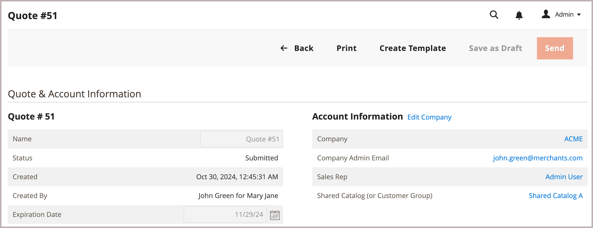

# 見積もりテンプレートの作成

既存の見積から見積テンプレートを作成して、定期受注の数量割引を交渉します。

{width="700" zoomable="yes"}

テンプレートを作成した後、販売者は、テンプレート・オプションを構成して、オーダーと数量のしきい値を設定し、ライン・アイテムと見積レベルの割引を調整してから、ネゴシエーション・プロセスを開始するために購入者に送信できます。

購入者と販売者が合意に達すると、購入者は見積もりテンプレートを受け入れます。 次に、購入者は、注文の準備が整ったら、見積テンプレートの条件に基づいて [ 事前承認済みのリンクされた見積もりを生成 ](account-dashboard-my-quote-templates.md) できます。 例えば、会社が業務運営を維持するための MRO （保守、修理、運用）注文を持っている場合、購入者または販売者は、見積もりテンプレートを使用して必要な品目を追加し、価格を交渉し、毎月の繰り返し注文の条件を設定できます。 その後、買い手は追加の交渉を必要とせずに注文を送信することができます。

詳細については、「[ 見積テンプレートの概要 ](quote-templates-overview.md)」を参照してください。
