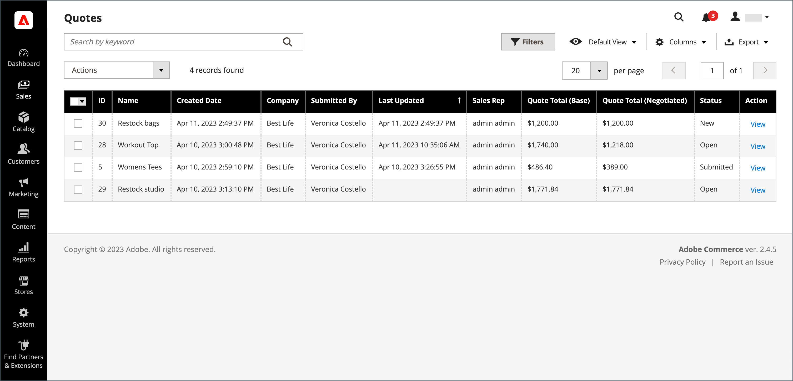

# 交渉可能な見積

バイヤーとセラーは、Quote を使用して、合意に達するまで受注追加品目、数量の更新、値引の要求と適用などのネゴシエーション・プロセスを管理します。 見積ネゴシエーション・プロセスは、承認済の会社バイヤーまたは会社の営業担当者が開始できます。

{width="700" zoomable="yes"}

見積が作成された後、バイヤーまたはセラーが見積をレビューのために発行すると、ネゴシエーション・プロセスが開始されます。 受け取った各見積もりを一覧表示し、購入者と販売者の間の通信の履歴を維持する _見積もり_ グリッド。 標準の [ ワークスペースコントロール ](../getting-started/admin-workspace.md) を使用して、リストのフィルタリング、列のレイアウトの変更、ビューの保存、データの書き出しを行います。

- ストアフロントでは、購入者は見積もりを [ 交渉リクエスト ](quote-price-negotiation.md) として買い物かごから送信します。 見積もり依頼を作成する際に、購入者は見積もりを下書きとして保存するか、直接販売者に送信できます。

- 管理者は、会社の購入者に代わって営業担当者が見積もりを作成できます。 見積を作成する際、売主は見積を草案として保存するか、または交渉プロセスを開始するために直接購買担当に発行できます。

ネゴシエーション・プロセス中に、見積を更新できるのは、その後のネゴシエーションの条件を検討および提案する担当者のみです。

## 前提条件

交渉可能な引用符は、Adobe Commerceに次の設定がある場合にのみ使用できます。

- [Adobe Commerce B2B 拡張機能がインストールされている](install.md)
- [構成済みの B2B 機能](enable-basic-features.md)
   - 会社アカウントを有効にする
   - B2B 見積もりを有効にする

## 見積もりワークフロー

見積もりは、買い手または売り手によって開始できます。

次の図は、見積を開始する際の様々なステップにおけるバイヤーおよびセラー（管理者）の見積ステータスを示しています。

{width="700" zoomable="yes"}

**手順 1：見積もりの作成（新規）**

- **購買担当が見積を要求** - ショッピング・カートから購買担当が [ 見積を要求 ](quote-request.md) します。 リクエストは購入者のアカウントダッシュボードの _My Quote_ リストに表示され、会社のアカウントに割り当てられている営業担当者にメール通知が送信されます。 管理者では、リクエストは _Quotes_ グリッドに表示され、ステータスは `New` になります。 見積の依頼は、販売者が開封するまで、購入者が変更できます。

  {width="700" zoomable="yes"}

- **営業担当者** – 営業担当者は、特定の会社の購入者に代わって管理者から [ 見積もりを作成 ](sales-rep-initiates-quote.md) できます。 営業担当は、製品および値引や手形などの情報を購買担当に追加するために、見積を更新する必要があります。 営業担当者は、見積を `draft` として保存するか、ネゴシエーションを開始するためにバイヤーに送信できます。 ドラフト状態では、見積もりは販売者にのみ表示されます。 Quote が送信されると、ステータスは `Submitted` になります。 買い手が送り返すまで、売り手は変更できません。

  {width="700" zoomable="yes"}

**ステップ 2：見積のレビューおよびネゴシエーション（レビュー）**

見積の検討または交渉には、数量の変更、品目の削除、明細品目の注釈の追加、明細品目または見積値引の適用（セラー）、出荷所在地の追加（バイヤー）が含まれます。

- **販売者がリクエストを表示し、応答を送信** – 管理者で、販売者が見積もりのリクエストを表示します。 ストアフロントでは、見積のステータスが `Pending` に変わり、購入者は変更できません。 [ 売り手 ](quote-price-negotiation.md) は、価格の割引を提供し、必要に応じて数量と品目を調整して、コメントを入力し、見積もりを買い手に送り返します。 購入者と営業担当者には、販売者が回答したことを電子メールで通知します。

- **購入者が販売者からの見積もりを表示して応答を送信** - メール通知のリンクをクリックして見積もりを開くか、アカウントダッシュボードの _My Quote_ ページから見積もりを開きます。 購入者は、ライン品目または見積レベルで販売者にメモを残したり、数量を変更したり、品目を削除したりできます。

買い手と売り手は、合意に達するまで、または売り手が見積もりを拒否するまで、交渉プロセスを続行できます。 買い手が見積を変更した場合（製品の追加または削除または製品数量の変更）、見積はレビューのために売り手に返却する必要があります。

- **買い手は配送先住所を追加** – 買い手は配送先住所を見積もりに追加できます。 買い手が住所を追加した後、売り手は出荷および配信オプションを提供できます。 表示される発送方法は、ストアフロントの設定によって異なります。

買主が配送先住所を追加した場合、ネゴシエーション契約を確認する必要があり、売主は合意に達するまで、または売主が見積を拒否するまでネゴシエーション処理を続行できます。

**手順 3：購入者が見積もりを承諾（チェックアウト）**

買い手は提案された価格を受け入れ、チェックアウトに進みます。 交渉済の見積には、追加の割引を追加できません。

配送オプションはチェックアウト時にロックされます。

## 見積もりステータス

見積もりステータスは、見積もりワークフローにおける見積もりの現在の状態に関する情報を提供します。 見積もりのステータスは、購入者または販売者が見積もりに対してアクションを実行した場合にのみ変更されます。 たとえば、購入者がアクティブな見積もりで [!UICONTROL Proceed to Checkout] を選択すると、ステータスが order に変わります。

- *[!UICONTROL New]** – 購入者が見積の依頼を送信しましたが、販売者によって閲覧されていません。 リクエストは、販売者によって開かれるまで、購入者によって更新されます。

- **[!UICONTROL Draft]** – 販売者が購入者の下書き見積もりを作成します。 売り手がオファーの詳細（品目、数量、割引など）を追加し、その見積もりを買い手に送信するまで、見積もりは買い手には表示されません。

- **[!UICONTROL Open]** – 販売者がリクエストを開き、それを確認して応答を準備する処理中です

- **[!UICONTROL Submitted]** – 売り手は買い手に応答を送信しました。 ネゴシエーション処理中に見積レコードを編集することはできません。

- **[!UICONTROL Client Reviewed]** – 買い手は売り手からの応答を見て、返信を準備している途中です。

- **[!UICONTROL Updated]** – 買い手が応答を送信しましたが、売り手によって表示されていません。

- **[!UICONTROL Ordered]**：購買担当が交渉された見積に基づいて受注を発行しました。

- **[!UICONTROL Closed]**：購買担当が見積依頼を取り消しました。

- **[!UICONTROL Declined]** – 販売者が見積もりの依頼を拒否しました。 カスタム価格は見積りから削除され、レコードはその後の編集からロックされます。

- **[!UICONTROL Expired]** – 購入者が指定された期間内に販売者の返信に返信せず、見積もりが無効になりました。

## ストア見積の B2B ロールリソース

引用符の設定オプションは、[ 役割リソース ](../systems/permissions-user-roles.md#role-resources) を使用して制御します。 これらのロール リソースは、ストア管理者に割り当てられた管理者ユーザーロールに対して設定する必要があります。

管理者で引用機能へのアクセス権を付与するには、**[!UICONTROL System]**/_[!UICONTROL Permissions]_/**[!UICONTROL User Roles]**&#x200B;に移動し、役割を選択して、_ 役割リソース _ツリーの [!UICONTROL Sales]/[!UICONTROL Operations]/[!UICONTROL Quotes] に移動します。

{width="700" zoomable="yes"}

## アクションの適用

管理者では、B2B 管理者とセラーは、[!UICONTROL Actions] メニューを使用して Quote Grid からの Quote を管理できます。

{width="700" zoomable="yes"}

1. _管理者_ サイドバーで、**[!UICONTROL Sales]**/**[!UICONTROL Quotes]** に移動します。

1. グリッドの最初の列で、アクションを適用する各レコードのチェックボックスを選択します。

1. **[!UICONTROL Actions]** で、適用するアクションを選択します。

### 見積もりを表示する

1. レコードの [**[!UICONTROL Actions]**] 列で、[**[!UICONTROL View]**] をクリックします。

1. 顧客の要求に応答するには、指示に従い、[ 価格交渉 ](quote-price-negotiation.md) プロセスを開始します。

### 見積もりアクティビティの表示

交渉のタイムライン、通信、その他の見積もりアクティビティを [!UICONTROL Comments] と [!UICONTROL History Log] から表示します。情報には、ステータスの変更、顧客および出荷情報の更新、品目および価格の更新、その他の重要な情報が含まれます。

1. 見積もりを開きます。

1. **[!UICONTROL Negotiation]** までスクロールし、**[!UICONTROL Comments]** と **[!UICONTROL History Log]** を選択して、見積ネゴシエーションのコメントと履歴を表示します。

   {width="400"}

1. 履歴は、明細品目レベルでも追跡されます。

   {width="400"}

### 見積もり依頼を拒否する

拒否できるのは、`Open` ステータスの見積もり要求のみです。

1. 拒否するオープン見積依頼をそれぞれ選択します。

1. _[!UICONTROL Actions]_&#x200B;コントロールを `Declined` に設定します。

1. プロンプトが表示されたら、見積が却下された理由を入力し、「**[!UICONTROL Confirm]**」をクリックします。

   {width="400"}
