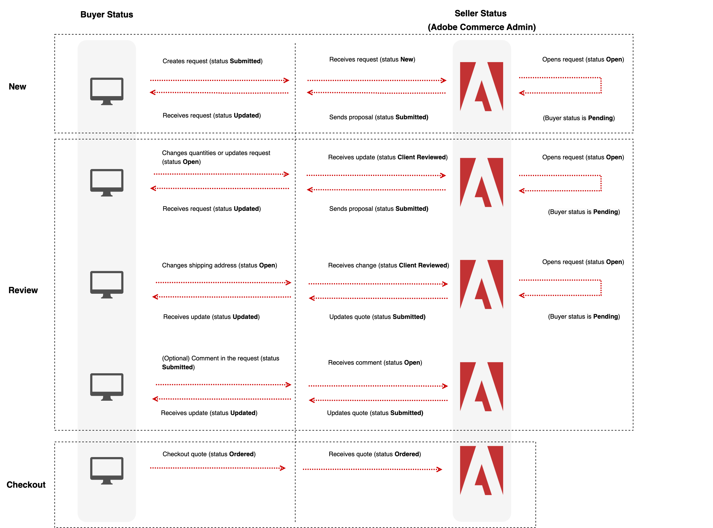
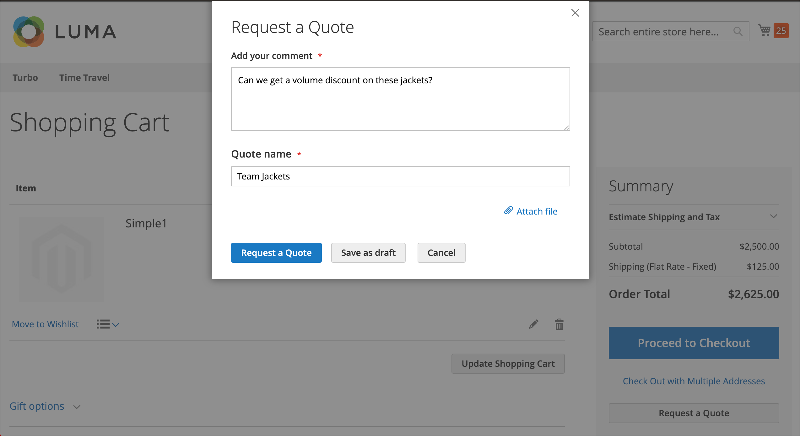
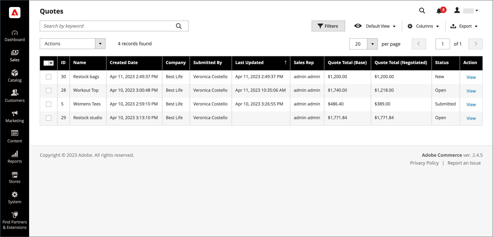

# 交渉可能な見積

購入者や販売者は、見積もり機能を使用して、注文品の追加、数量の更新、割引の要求や適用などの交渉プロセスを、契約書に達するまで管理します。 見積もり交渉プロセスは、許可された企業バイヤーまたは企業の営業担当者によって開始できます。

管理者{width="700" zoomable="yes"}の引用符リスト表示

見積もりが作成された後、交渉プロセスは、購入者または販売者が見積もりをレビュー用に送信するときに開始されます。 受信した各見積もりを一覧表示し、買い手と売り手のコミュニケーションの履歴を保持する&#x200B;_見積もり_ グリッド。 標準の[職場向けコントロール &#x200B;](../getting-started/admin-workspace.md)を使用して、リストのフィルター、列レイアウトの変更、ビューの保存、データの書き出しを行います。

- ストアフロントでは、購入者は見積もりを[&#x200B; リクエストとして送信し、ショッピングカートからの価格を](quote-price-negotiation.md)交渉します。 見積もり依頼を作成する際、購入者は見積もりを下書きとして保存したり、売り手に直接送信したりできます。

- 管理画面では、営業担当者が会社のバイヤーの代理で見積もりを作成できます。 見積もりを作成する際、売り手は見積もりをドラフトとして保存したり、購入者に直接送信して交渉プロセスを開始したりできます。

交渉プロセス中に、見積もりは、さらなる交渉のために条件を確認して提案する人によってのみ更新できます。

## 前提条件

交渉可能な引用符は、Adobe Commerceに次の設定がある場合にのみ使用できます。

- [Adobe Commerce B2B拡張機能がインストールされている](install.md)
- [構成されたB2B機能](enable-basic-features.md)
   - 会社アカウントを有効にする
   - B2B見積の有効化

## 見積もりワークフロー

見積もりは、買い手または売り手によって開始できます。

この図は、見積を開始する際の様々な手順における、購入者および販売者（管理者）の見積ステータスを示しています。

{width="700" zoomable="yes"}

**手順1：見積もり作成（新規）**

- **購入者が見積もりを要求** – 購入者[がショッピングカートから見積もりを要求](quote-request.md)します。 リクエストは、購入者のアカウントダッシュボードの&#x200B;_My Quotes_ リストに表示され、会社アカウントに割り当てられている営業担当者にメール通知が送信されます。 管理画面では、リクエストは&#x200B;_見積_ グリッドに表示され、ステータスは`New`です。 見積もり依頼は、売り手が開くまで、買い手が変更できます。

  {width="700" zoomable="yes"}

- **営業担当者** – 営業担当者は、特定の企業バイヤーの代理として、管理者から[見積もり](sales-rep-initiates-quote.md)を作成できます。 営業担当者は、見積もりを更新して、製品、および割引やメモなどの情報を購入者に追加する必要があります。 営業担当者は、見積を`draft`として保存するか、購入者に送信して交渉を開始できます。 ドラフト状態では、見積もりは売り手にのみ表示されます。 見積もりを送信すると、ステータスは`Submitted`になります。 買い手が買い手に送り返すまで、売り手は変更できません。

  {width="700" zoomable="yes"}

**手順2：見積のレビューと交渉（レビュー）**

見積の確認または交渉には、数量の変更、品目の削除、行項目コメントの追加、行項目または見積もり割引の適用（販売者）、配送先住所の追加（購入者）などが含まれます。

- **販売者はリクエストを表示し、応答を送信します** – 管理画面では、販売者は見積もりのリクエストを表示します。 ストアフロントでは、見積もりのステータスが`Pending`に変更され、購入者は変更を加えることができません。 [販売者は](quote-price-negotiation.md)に対して、価格割引を提供し、必要に応じて数量と品目を調整してコメントを入力し、見積もりを購入者に送り返します。 購入者と営業担当者には、販売者が回答したことがメールで通知されます。

- **購入者は販売者からの見積もりを表示して回答を送信します** – 購入者はメール通知のリンクをクリックして見積もりを開くか、アカウントダッシュボードの&#x200B;_マイ見積_ ページから見積もりを開きます。 買い手は、行項目または見積レベルで売り手にメモを残し、数量を変更し、項目を削除できます。

買い手と売り手は、合意に達するか、売り手が見積もりを辞退するまで、交渉プロセスを継続できます。 購入者が見積もりに変更を加えた場合（製品の追加または削除、製品数量の変更など）、見積もりはレビューのために販売者に返却する必要があります。

- **購入者が配送先住所を追加** – 購入者は見積もりに配送先住所を追加できます。 バイヤーが住所を追加した後、売り手は配送オプションと配達オプションを提供できます。 表示される配送方法は、ストアフロントの設定によって異なります。

購入者が配送先住所を追加した場合、交渉契約を確認する必要があり、購入者は契約に達するか、販売者が見積もりを辞退するまで交渉プロセスを継続できます。

**手順3：購入者が見積もりを受け入れる（チェックアウト）**

購入者は提案価格を受け入れ、決済に進みます。 交渉済みの見積もりに追加の割引を追加することはできません。

配送オプションはチェックアウト時にロックされます。

## 見積もりステータス

見積ステータスは、見積ワークフロー内の見積の現在の状態に関する情報を提供します。 見積のステータスは、購入者または販売者が見積に対してアクションを実行した場合にのみ変更されます。 例えば、購入者がアクティブな見積もりで[!UICONTROL Proceed to Checkout]を選択した場合、ステータスは注文に変わります。

- *[!UICONTROL New]** – 購入者が見積もり依頼を送信しましたが、販売者が閲覧していません。 リクエストは、売り手が開くまで、買い手が更新できます。

- **[!UICONTROL Draft]** – 売り手は買い手の見積もり草案を作成します。 見積もりは、販売者がオファーの詳細（項目、数量、割引など）を追加し、見積もりを購入者に送信するまで、購入者には表示されません。

- **[!UICONTROL Open]** – 売り手はリクエストを開き、それを確認して応答を準備しています

- **[!UICONTROL Submitted]** – 売り手が買い手に応答を送信しました。 交渉プロセス中に見積もりレコードを編集することはできません。

- **[!UICONTROL Client Reviewed]** – 購入者は販売者からの回答を閲覧し、返信の準備中です。

- **[!UICONTROL Updated]** – 購入者は回答を送信しましたが、販売者が閲覧していません。

- **[!UICONTROL Ordered]** – 購入者は、交渉済みの見積もりに基づいて注文を送信しました。

- **[!UICONTROL Closed]** – 購入者は見積もり要求をキャンセルしました。

- **[!UICONTROL Declined]** – 販売者は見積もり依頼を辞退しました。 カスタム価格設定はすべて見積もりから削除され、レコードはそれ以降の編集からロックされます。

- **[!UICONTROL Expired]** – 購入者は、指定された期間内に販売者の返信に応答しなかったため、見積もりは無効になりました。

## 店舗の見積もりに関するB2B ロールリソース

引用符の設定オプションは、[役割リソース &#x200B;](../systems/permissions-user-roles.md#role-resources)を使用して制御されます。 これらの役割リソースは、ストア管理者に割り当てられた管理者ユーザーの役割に設定する必要があります。

管理者の見積もり関数へのアクセス権を付与するには、**[!UICONTROL System]** > _[!UICONTROL Permissions]_>**[!UICONTROL User Roles]**&#x200B;に移動し、役割を選択して、_&#x200B;役割リソース _ツリーの[!UICONTROL Sales] > [!UICONTROL Operations] > [!UICONTROL Quotes]に移動します。

{width="700" zoomable="yes"}

## アクションの適用

管理者では、B2B管理者と販売者は、[!UICONTROL Actions] メニューを使用して、見積グリッドから見積を管理できます。

{width="700" zoomable="yes"}

1. _管理者_ サイドバーで、**[!UICONTROL Sales]** > **[!UICONTROL Quotes]**&#x200B;に移動します。

1. グリッドの最初の列で、アクションを適用する各レコードのチェックボックスを選択します。

1. **[!UICONTROL Actions]**&#x200B;で、適用するアクションを選択します。

### 見積の表示

1. レコードの&#x200B;**[!UICONTROL Actions]**&#x200B;列で、**[!UICONTROL View]**&#x200B;をクリックします。

1. お客様のリクエストに対応するには、指示に従い、[価格交渉](quote-price-negotiation.md) プロセスを開始します。

### 見積もり活動の表示

[!UICONTROL Comments]および[!UICONTROL History Log]の交渉タイムライン、通信、およびその他の見積もりアクティビティを表示します。情報には、ステータスの変更、顧客および出荷情報の更新、品目および価格の更新、およびその他の重要な情報が含まれます。

1. 見積を開きます。

1. **[!UICONTROL Negotiation]**&#x200B;までスクロールし、**[!UICONTROL Comments]**&#x200B;と&#x200B;**[!UICONTROL History Log]**&#x200B;を選択すると、見積もり交渉のコメントと履歴を表示できます。

   {width="400"}

1. 履歴は行項目レベルでも追跡されます。

   {width="400"}

### 見積の要求を辞退

`Open` ステータスの見積もり要求のみを拒否できます。

1. 辞退する各未処理の見積もり依頼を選択します。

1. _[!UICONTROL Actions]_&#x200B;コントロールを`Declined`に設定します。

1. プロンプトが表示されたら、見積が辞退された理由を入力し、**[!UICONTROL Confirm]**&#x200B;をクリックします。

   {width="400"}
