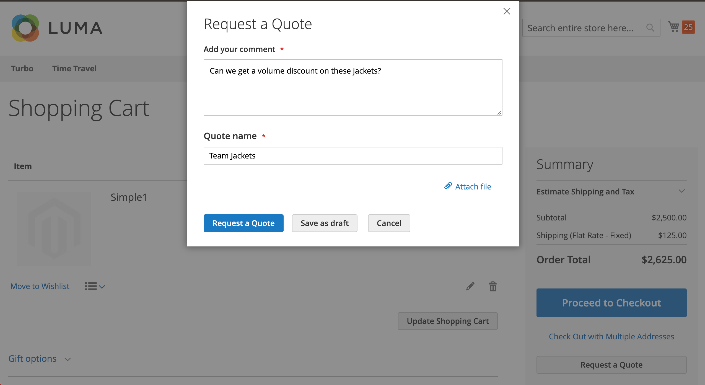

# 交渉可能な見積

バイヤーとセラーは、Quote を使用して、合意に達するまで受注追加品目、数量の更新、値引の要求と適用などのネゴシエーション・プロセスを管理します。 見積ネゴシエーション・プロセスは、承認済の会社バイヤーまたは会社の営業担当者が開始できます。

見積は、認定された会社のバイヤーまたは営業担当者が開始できます。 見積が作成された後、バイヤーまたはセラーが見積をレビューのために発行すると、ネゴシエーション・プロセスが開始されます。 受け取った各見積もりを一覧表示し、購入者と販売者の間の通信の履歴を維持する _見積もり_ グリッド。 標準の [ ワークスペースコントロール ](../getting-started/admin-workspace.md) を使用して、リストのフィルタリング、列のレイアウトの変更、ビューの保存、データの書き出しを行います。

- ストアフロントでは、購入者は見積もりを [ 交渉リクエスト ](quote-price-negotiation.md) として買い物かごから送信します。 見積もり依頼を作成する際に、購入者は見積もりを下書きとして保存するか、直接販売者に送信できます。

- 管理者は、会社の購入者に代わって営業担当者が見積もりを作成できます。 見積を作成する際、売主は見積を草案として保存するか、または交渉プロセスを開始するために直接購買担当に発行できます。

ネゴシエーション・プロセス中に、見積を更新できるのは、その後のネゴシエーションの条件を検討および提案する担当者のみです。

## 前提条件

交渉可能な引用符は、Adobe Commerceに次の設定がある場合にのみ使用できます。

- [Adobe Commerce B2B 拡張機能がインストールされている](install.md)
- [構成済みの B2B 機能](enable-basic-features.md)
   - 会社アカウントを有効にする
   - B2B 見積もりを有効にする

## 見積もりワークフロー

見積もりは、買い手または売り手によって開始できます。

**手順 1：見積もりの作成**

- **購買担当が見積を要求** - ショッピング・カートから購買担当が [ 見積を要求 ](quote-request.md) します。 リクエストは購入者のアカウントダッシュボードの _My Quote_ リストに表示され、会社のアカウントに割り当てられている営業担当者にメール通知が送信されます。 管理者では、リクエストは _Quotes_ グリッドに表示され、ステータスは `New` になります。 見積の依頼は、販売者が開封するまで、購入者が変更できます。

  {width="700" zoomable="yes"}

- **営業担当者** – 営業担当者は、特定の会社の購入者に代わって管理者から [ 見積もりを作成 ](sales-rep-initiates-quote.md) できます。 営業担当は、製品および値引や手形などの情報を購買担当に追加するために、見積を更新する必要があります。 営業担当者は、見積を `draft` として保存するか、ネゴシエーションを開始するためにバイヤーに送信できます。 ドラフト状態では、見積もりは販売者にのみ表示されます。 Quote が送信されると、ステータスは `Submitted` になります。 買い手が送り返すまで、売り手は変更できません。

  {width="700" zoomable="yes"}

**ステップ 2：見積のレビューおよびネゴシエーション**

**販売者がリクエストを表示し、応答を送信** – 管理者で、販売者が見積もりのリクエストを表示します。 見積のステータスが「`Pending`」に変わり、バイヤーは変更できません。 [ 売り手 ](quote-price-negotiation.md) は、見積もりに含まれる製品の割引価格を提供することで対応し、コメントを入力し、見積もりを購入者に送り返します。 購入者と営業担当者には、販売者が回答したことを電子メールで通知します。

**購入者が販売者からの見積もりを表示して応答を送信** - メール通知のリンクをクリックして見積もりを開くか、アカウントダッシュボードの _My Quote_ ページから見積もりを開きます。 買い手は、ライン項目または見積もりレベルで売り手にメモを残し、項目を削除することができます。

買い手と売り手は、合意に達するまで、または売り手が見積もりを拒否するまで、交渉プロセスを続行できます。 買い手が見積を変更した場合（製品の追加または削除または製品数量の変更）、見積はレビューのために売り手に返却する必要があります。

**ステップ 4：バイヤーは見積もりを受け入れます** - バイヤーは提案価格を受け入れ、チェックアウトを続行します。 交渉済の見積には、追加の割引を追加できません。

## ストア見積の B2B ロールリソース

引用符の設定オプションは、[ 役割リソース ](../systems/permissions-user-roles.md#role-resources) を使用して制御します。 これらのロール リソースは、ストア管理者に割り当てられた管理者ユーザーロールに対して設定する必要があります。

管理者で引用機能へのアクセス権を付与するには、**[!UICONTROL System]**/_[!UICONTROL Permissions]_/**[!UICONTROL User Roles]**に移動し、役割を選択して、_ 役割リソース _ツリーの [!UICONTROL Sales]/[!UICONTROL Operations]/[!UICONTROL Quotes] に移動します。

## アクションの適用

管理者では、B2B 管理者とセラーは、[!UICONTROL Actions] メニューを使用して Quote Grid からの Quote を管理できます。

{width="700" zoomable="yes"}

1. _管理者_ サイドバーで、**[!UICONTROL Sales]**/**[!UICONTROL Quotes]** に移動します。

1. グリッドの最初の列で、アクションを適用する各レコードのチェックボックスを選択します。

1. **[!UICONTROL Actions]** で、適用するアクションを選択します。

### 見積もりを表示する

1. レコードの [**[!UICONTROL Actions]**] 列で、[**[!UICONTROL View]**] をクリックします。

1. 顧客の要求に応答するには、指示に従い、[ 価格交渉 ](quote-price-negotiation.md) プロセスを開始します。

### 見積もりアクティビティの表示

交渉のタイムライン、通信、その他の見積もりアクティビティを [!UICONTROL Comments] と [!UICONTROL History Log] から表示します。情報には、ステータスの変更、顧客および出荷情報の更新、品目および価格の更新、その他の重要な情報が含まれます。

1. 見積もりを開きます。

1. **[!UICONTROL Negotiation]** までスクロールし、**[!UICONTROL Comments]** と **[!UICONTROL History Log]** を選択して、見積ネゴシエーションのコメントと履歴を表示します。

   {width="400"}

1. 履歴は、明細品目レベルでも追跡されます。

   {width="400"}

### 見積もり依頼を拒否する

拒否できるのは、`Open` ステータスの見積もり要求のみです。

1. 拒否するオープン見積依頼をそれぞれ選択します。

1. _[!UICONTROL Actions]_コントロールを `Declined` に設定します。

1. プロンプトが表示されたら、見積が却下された理由を入力し、「**[!UICONTROL Confirm]**」をクリックします。

   {width="400"}

## 列の説明

| 列 | 説明 |
|---------------------------------------|------------------------------------------------------------------------------------------------------------------------------------------------------------------------------------------------------------------------------------------------------------------------------------------------------------------------------------------------------------------------------------------------------------------------------------------------------------------------------------------------------------------------------------------------------------------------------------------------------------------------------------------------------------------------------------------------------------------------------------------------------------------------------------------------------------------------------------------------------------------------------------------------------------------------------------------------------------------------------------------------------------------------------------------------------------------------------------------------------------------------------------------------------------------------------------------------------------------------------------------------------------------------------------------------------------------------------------------------------------------------------------------------------------------------------------------------------------------------------------------------------------------------------------------------------------------------------------------------------------------------------------------------------------------------------------------------------------------------------------|
| [!UICONTROL Select] | アクションの対象となる引用符を選択するには、チェックボックスを選択するか、列ヘッダーの選択コントロールを使用します。 オプション：すべてを選択/すべてを選択解除 |
| [!UICONTROL ID] | 買い手の買い物かごから見積依頼が送信されるときに割り当てられる一意の数値識別子。 見積もりの詳細を表示すると、ページの上部に見積もり名ではなく ID が表示されます。 |
| [!UICONTROL Name] | 購買担当によって見積依頼に割り当てられた名前。 |
| [!UICONTROL Created Date] | 購買担当が見積依頼を最初に送信した日時。 |
| [!UICONTROL Company] | 購入者が見積依頼を送信する会社の名前。 |
| [!UICONTROL Submitted By] | 見積依頼を送信する会社の購買担当の姓と名。 |
| [!UICONTROL Last Updated] | 見積もりに関する買い手と売り手の間の最後の通信の日時。 |
| [!UICONTROL Sales Rep] | バイヤーの口座を管理する営業担当者の姓と名。 |
| [!UICONTROL Quote Total (Base)] | 元の見積もりに基づいて購入される製品の合計価格。 合計金額は、web サイトの基本通貨とストアフロントの通貨で表示されます。 |
| [!UICONTROL Quote Total (Negotiated)] | 交渉された見積もりに基づいて購入される製品の合計価格。 この合計はシステムによって自動的に計算され、販売者によって適用された品目または見積レベルの割引が含まれます。 合計金額は、web サイトの基本通貨とストアフロントの通貨で表示されます。 |
| [!UICONTROL Status] | 見積もり依頼の現在の状態を示します。 見積もりのステータスは、買い手または売り手の側の行動によってのみ変更できます。 [ 購入者のアカウント ](account-dashboard-my-quotes.md) のステータス設定も参照してください。<ul><li>**[!UICONTROL New]** – 購入者が見積もりの依頼を送信しましたが、販売者によって閲覧されていません。 リクエストは、販売者によって開かれるまで、購入者によって更新されます。</li><li>**[!UICONTROL Draft]** – 販売者が購入者の下書き見積もりを作成します。 売り手がオファーの詳細（品目、数量、割引など）を追加し、その見積もりを買い手に送信するまで、見積もりは買い手には表示されません。</li> <li>**[!UICONTROL Open]** – 販売者がリクエストを開き、それを確認して応答を準備する処理中です。 </li><li>**[!UICONTROL Submitted]** – 売り手は買い手に応答を送信しました。 ネゴシエーション処理中に見積レコードを編集することはできません。</li><li>**[!UICONTROL Client Reviewed]** – 買い手は売り手からの応答を見て、返信を準備している途中です。</li><li>**[!UICONTROL Updated]** – 買い手が応答を送信しましたが、売り手によって表示されていません。</li><li>**[!UICONTROL Ordered]**：購買担当が交渉された見積に基づいて受注を発行しました。</li><li>**[!UICONTROL Closed]**：購買担当が見積依頼を取り消しました。</li><li>**[!UICONTROL Declined]** – 販売者が見積もりの依頼を拒否しました。 カスタム価格は見積りから削除され、レコードはその後の編集からロックされます。</li><li>**[!UICONTROL Expired]** – 購入者が指定された期間内に販売者の返信に返信せず、見積もりが無効になりました。</li></ul> |
| [!UICONTROL Actions] | **[!UICONTROL View]** – 見積依頼をオープンし、バイヤーとセラー間のネゴシエーションの記録を保持します。 |

{style="table-layout:auto"}

## ボタンバー

| ボタン | 説明 |
|----------------------------|----------------------------------------------------------------------------------------------------------------------------------------------------------------------------------------------------------------------------------------------------------------------------------------------------------------------------------------------------------------------------------------------------|
| [!UICONTROL Send] | 更新された見積を購入者の照会に対する応答として送信します。 売り手が買い手からの返信を待っている場合、このボタンは無効になります。 |
| [!UICONTROL Back] | 変更を保存せずに _Quotes_ ページに戻ります。 |
| [!UICONTROL Create Copy] | [!BADGE 1.5.0 ベータ版の機能 ]{type=Informative url=&quot;/help/b2b/release-notes.md&quot; tooltip=&quot;Beta プログラムの参加者のみが使用できます&quot;} 現在の引用符をコピーして名前を変更し、現在の引用符から新しい引用符を作成します。 新しい引用符が開くと、デフォルト名は `<original quote name> (copy)` になります。 名前を変更するには、「[!UICONTROL Name]」フィールドの値を編集し、見積もりを下書きとして保存します。 |
| [!UICONTROL Print] | 見積もりをプリンタに送るか、PDFファイルとして保存します。 |
| [!UICONTROL Create a copy] | `<original quote name> (copy)` という名前の見積もりのコピーを作成し、開きます。 必要に応じて、新規見積の名前を変更および更新してから、下書きとして保存するか、購買担当に送信します。 |
| [!UICONTROL Save as Draft] | 見積もりに加えられた変更を保存しますが、購入者には送り返しません。 |
| [!UICONTROL Decline] | 最初の問い合わせ時または進行中の交渉中に、価格の交渉要求を拒否します。 見積もりが却下された場合、売り手は決定を説明するためのコメントを追加する必要があります。 見積が却下されると、交渉されたすべての価格が元の値にリセットされます。 売り手が購入者からの返信を待っている間、このボタンは無効になります。 |

{style="table-layout:auto"}

## 引用符の例

次の図は、いくつかの設定が構成された Admin の Quote の詳細表示の例を示しています。

{width="700" zoomable="yes"}

>[!NOTE]
>
>[!BADGE 1.5.0 ベータ版の機能 ]{type=Informative url="/help/b2b/release-notes.md" tooltip="Beta プログラム参加者のみ使用可能"}
