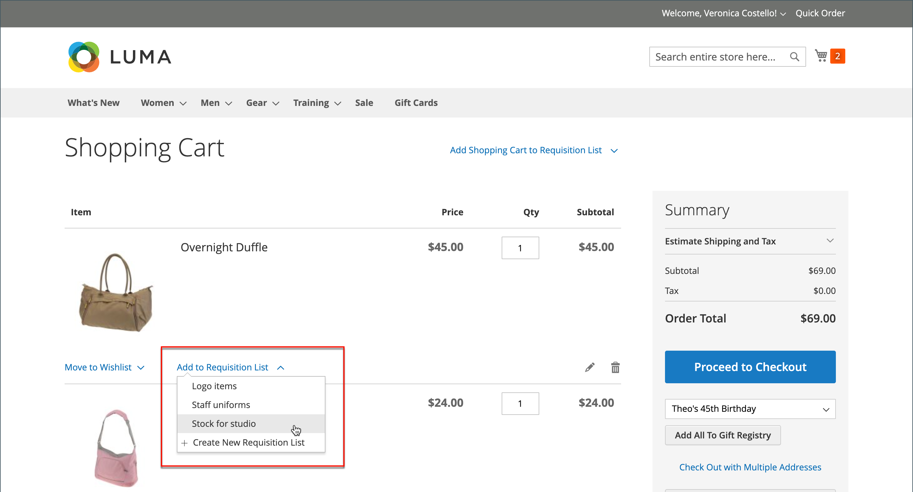

# 要求リスト

商品リストを利用すると、リストから直接ショッピングカートに商品が追加されるため、よく注文される商品を購入する際の時間を節約できます。 購入者は、様々なベンダー、購入者、チーム、キャンペーンなど、ワークフローを合理化するあらゆる製品に焦点を当てて、複数のリストを管理できます。 要件リスト機能は、ログインしたユーザーが使用できます。

>[!NOTE]
>
>ストアの購買リストを有効にするには、[B2B機能を有効にする](enable-basic-features.md)を参照してください。 [設定](configure-requisition-lists.md)に応じて、各購入者アカウントに対して最大999件の購買リストを維持できます。

リクエストリストの機能はウィッシュリストと似ていますが、次の違いがあります。

- 商品をショッピングカートに送った後、購買リストがクリアされない。 複数回使用できます。
- 購買リストのユーザーインターフェイスでは、コンパクトなビューを使用して多くのアイテムを表示します。

{width="600" zoomable="yes"}

## アカウントダッシュボードから購買グループを作成

会社アカウントに関連付けられたログイン済みバイヤーは、アカウントダッシュボードから購買リストを作成できます。

1. アカウントのサイドバーで、**[!UICONTROL My Requisition Lists]**&#x200B;を選択します。

1. _[!UICONTROL Requisition Lists]_&#x200B;ページで、**[!UICONTROL Create New Requisition List]**&#x200B;をクリックします。

1. **[!UICONTROL Requisition List Name]**&#x200B;と&#x200B;**[!UICONTROL Description]**&#x200B;を入力します。

   {width="300"}

1. 完了したら、**[!UICONTROL Save]**&#x200B;をクリックします。

## 製品ページからの購買リストの作成

会社アカウントに関連付けられたログイン済みバイヤーは、製品ページから購買リストを作成できます。 この方法は、リストを作成して製品を追加するための簡単なショートカットを提供します。

1. 購入者は商品詳細ページから「**[!UICONTROL Add to Requisition List]**」をクリックします。

1. **[!UICONTROL Create New Requisition List]**&#x200B;をクリックします。

1. **[!UICONTROL Requisition List Name]**&#x200B;と&#x200B;**[!UICONTROL Description]**&#x200B;を入力します。

1. 完了したら、**[!UICONTROL Save]**&#x200B;をクリックします。

## 商品を購買リストに追加

購入者は、次の場所から商品を購買リストに追加できます。

- 製品ページ
- カタログページ
- ショッピングカート
- 既存注文
- 既存の引用符

### 商品詳細ページから

1. ストアフロントから、購入者は商品リストに追加する商品の詳細ページに移動します。

1. **[!UICONTROL Add to Requisition List]**&#x200B;をクリックし、次のいずれかの操作を行います。

   - 既存の購買リストを選択します。
   - 購買リストを作成します。

   {width="700" zoomable="yes"}

### カタログページから

1. ストアフロントから、購入者は商品リストに追加する商品を含むカタログページに移動します。

1. 製品の上にカーソルを合わせます。

1. **[!UICONTROL Add to Requisition List]**&#x200B;をクリックし、次のいずれかの操作を行います。

   - 既存の購買リストを選択します。
   - 購買リストを作成します。

   {width="700" zoomable="yes"}

### 既存の注文から

1. アカウント ダッシュボードのサイドバーで、購入者は&#x200B;**[!UICONTROL My Orders]**&#x200B;を選択します。

1. 注文の上部で、**[!UICONTROL Add to Requisition List]**&#x200B;をクリックし、次のいずれかの操作を行います。

   - 既存の購買リストを選択します。
   - 購買リストを作成します。

   {width="700" zoomable="yes"}

### 既存の見積もりから

交渉可能な見積もりから、購入者は[!UICONTROL Move to Requisition List] オプションを使用して、見積もりから既存の購買リストに製品を移動できます。 購買リストがない場合、[!UICONTROL Move to Requisition List] オプションは使用できません。

1. アカウント ダッシュボードのサイドバーで、購入者は&#x200B;**[!UICONTROL My Quotes]**&#x200B;を選択します。

1. リスト内の目的の見積もりを検索してアクセスします。

1. 「[!UICONTROL Items Quoted]」タブで、移動する製品を選択します。

1. 製品品目の[!UICONTROL Actions]列の[!UICONTROL Select] ドロップダウンを使用して、**[!UICONTROL Move to Requisition list]**&#x200B;を選択します。

1. 選択した品目の購買依頼リストを選択します。

1. **[!UICONTROL Move item to Requisition List]**&#x200B;をクリックします。

B2B見積について詳しくは、[見積もり](account-dashboard-my-quotes.md)のトピックを参照してください。

### カートから

1. 購入者はアイテムの下の&#x200B;**[!UICONTROL Add to Requisition List]** メニューをクリックし、次のいずれかの操作を行います。

   - 既存の購買リストを選択します。
   - 購買リストを作成します。

   {width="700" zoomable="yes"}

## 更新された購買リストの表示

バイヤーは、アカウントにログインすると、次のいずれかの方法で購買リストを表示できます。

{width="700" zoomable="yes"}

### アカウントダッシュボードから

1. アカウント ダッシュボードのサイドバーで、**[!UICONTROL My Requisition Lists]**&#x200B;を選択します。

1. 購買リストのリストで、_アクション_&#x200B;列の&#x200B;**[!UICONTROL View]**&#x200B;をクリックします。

### 任意のストアフロントページから

1. ページ上部のクイックリンクバーで、ユーザー名をクリックします。

1. メニューで、**[!UICONTROL My Requisition Lists]**&#x200B;を選択します。
