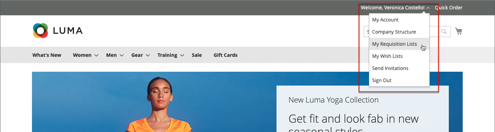

# 購買依頼リスト

購買依頼リストを使用すると、品目がリストから直接買い物かごに追加されるため、頻繁に発注される製品を購入する際の時間を節約できます。 顧客は、様々なベンダー、購入者、チーム、キャンペーンなど、ワークフローを効率化する要素からの製品に焦点を当てた複数のリストを維持できます。 ログインしているユーザーとゲストの両方が利用できます。

>[!NOTE]
>
>店舗の購買依頼リストを使用可能にする手順は、次を参照してください。 [B2B 機能の有効化](enable-basic-features.md). 顧客アカウントごとに最大 999 件の購買依頼リストを保守できます。この方法は、次の項目に応じて異なります [設定](configure-requisition-lists.md).

購買依頼リスト機能はウィッシュ・リストに似ていますが、次の違いがあります。

- 品目を買い物かごに送信した後、要求リストがクリアされません。 複数回使用できます。
- 購買依頼リストのユーザー・インタフェースでは、コンパクト・ビューを使用して多数の品目を表示します。

{width="600" zoomable="yes"}

## アカウントダッシュボードからの購買依頼リストの作成

会社アカウントに関連付けられているログイン顧客は、自分のアカウント・ダッシュボードから購買依頼リストを作成できます。

1. アカウントのサイドバーで、次を選択します **[!UICONTROL My Requisition Lists]**.

1. 日 _[!UICONTROL Requisition Lists]_ページ、クリック&#x200B;**[!UICONTROL Create New Requisition List]**.

1. エントリ数： **[!UICONTROL Requisition List Name]** および **[!UICONTROL Description]**.

   {width="300"}

1. 完了したら、をクリックします **[!UICONTROL Save]**.

## 製品ページからの購買依頼リストの作成

会社アカウントに関連付けられているログイン顧客は、製品ページから購買依頼リストを作成できます。 この方法を使用すると、リストを作成して製品を追加するための簡単なショートカットが提供されます。

1. 製品の詳細ページで、顧客は次のボタンをクリックします **[!UICONTROL Add to Requisition List]**.

1. クリック数 **[!UICONTROL Create New Requisition List]**.

1. エントリ数： **[!UICONTROL Requisition List Name]** および **[!UICONTROL Description]**.

1. 完了したら、をクリックします **[!UICONTROL Save]**.

## 要求リストへの製品の追加

顧客は、次の方法で購買依頼リストに製品を追加できます。

- 製品ページ
- カタログページ
- 買い物かご
- 既存の注文

### 製品詳細ページから

1. ストアフロントから、顧客は購買依頼リストに追加する製品の詳細ページに移動します。

1. クリック数 **[!UICONTROL Add to Requisition List]** 次のいずれかの操作を実行します。

   - 既存の購買依頼リストを選択します。
   - 購買依頼リストを作成します。

   {width="700" zoomable="yes"}

### カタログページから

1. ストアフロントから、顧客は購買依頼リストに追加する製品を含むカタログ・ページに移動します。

1. 製品にポインタを合わせます。

1. クリック数 **[!UICONTROL Add to Requisition List]** 次のいずれかの操作を実行します。

   - 既存の購買依頼リストを選択します。
   - 購買依頼リストを作成します。

   {width="700" zoomable="yes"}

### 既存の注文から

1. アカウントダッシュボードのサイドバーで、顧客は次を選択します **[!UICONTROL My Orders]**.

1. 注文の上部で、「」をクリックします **[!UICONTROL Add to Requisition List]** 次のいずれかの操作を実行します。

   - 既存の購買依頼リストを選択します。
   - 購買依頼リストを作成します。

   {width="700" zoomable="yes"}

### 買い物かごから

1. 顧客は項目の下の **[!UICONTROL Add to Requisition List]** メニューを使用して、次のいずれかの操作を実行します。

   - 既存の購買依頼リストを選択します。
   - 購買依頼リストを作成します。

   {width="700" zoomable="yes"}

## 更新された購買依頼リストの表示

アカウントにログインした顧客は、次のいずれかの方法を使用して購買依頼リストを表示できます。

{width="700" zoomable="yes"}

### アカウントダッシュボードから

1. アカウントダッシュボードのサイドバーで、次のいずれかを選択します **[!UICONTROL My Requisition Lists]**.

1. 購買依頼リストのリストで、次の項目をクリックします **[!UICONTROL View]** が含まれる _アクション_ 列。

### どのストアフロントページからも

1. ページ上部のクイックリンクバーで、ユーザー名をクリックします。

1. メニューで次を選択します **[!UICONTROL My Requisition Lists]**.
