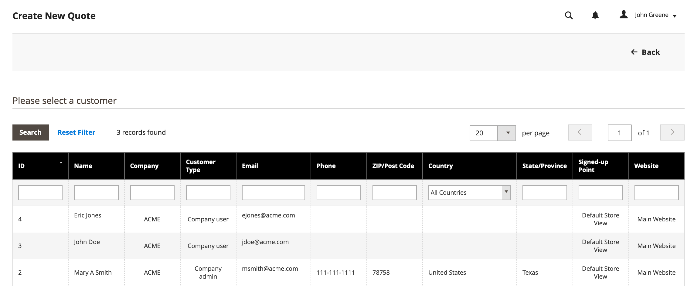
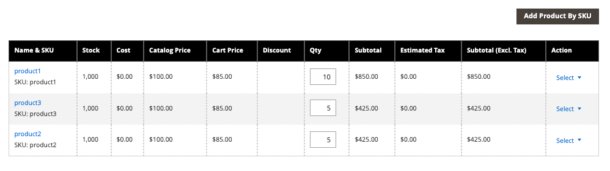
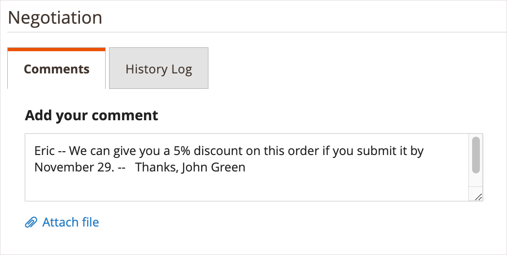
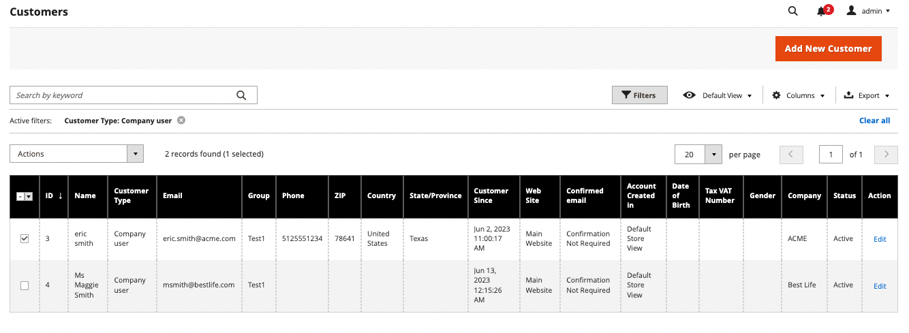
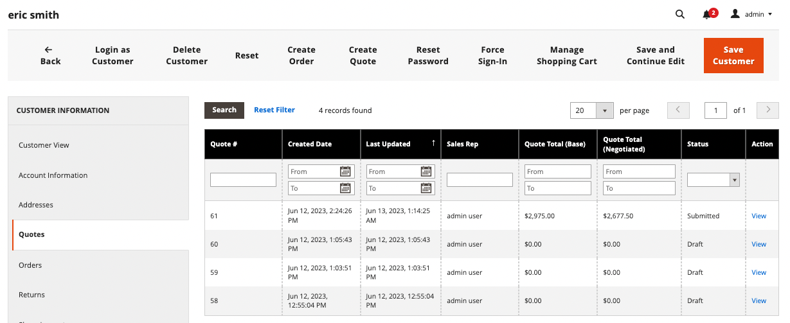

# 購買担当に対する見積の開始

[ 営業機能の構成 ](configure-quotes.md) で見積が使用可能になっている場合、営業担当者は管理者から見積を作成することで、会社の購買担当とのネゴシエーション・プロセスを開始できます。

- ドラフトの引用符は売り手にのみ表示されます。
- 見積の下書きは、販売担当者が品目、関連する割引、メモを追加して購入者に最初のオファーを作成するまで送信できません。
- 販売者は、Quote または Customer Grid から見積を作成できます。

営業担当が見積を購買担当に送付して、ネゴシエーション・プロセスを開始します。 [ 見積の交渉 ](quote-price-negotiation.md) を参照してください。

## 営業担当者の見積もりの作成エクスペリエンス

営業担当は、見積または顧客グリッドから見積を作成できます。

>[!NOTE]
>
>購入者の見積もりを作成する販売者のビデオデモについては、_CommerceのビデオとTutorials[ の ](https://experienceleague.adobe.com/docs/commerce-learn/tutorials/b2b/b2b-quote/sales-rep-initiates-quote.html) 営業担当者が見積もりを開始_ を参照してください。

### 見積もりグリッドからの見積もりの作成

1. 営業担当者は、見積りを管理するために [ 営業操作権限 ](../systems/permissions.md) を持つ管理者として管理者にログインします。

1. 管理者で、「**[!UICONTROL Sales]**」を選択して [!UICONTROL Quotes] グリッドに移動し、「**[!UICONTROL Quotes]**」を選択します。

1. 購買担当の見積を作成します。

   - 「引用符」グリッドから「**[!UICONTROL Create New Quote]**」を選択します。

     {width="700" zoomable="yes"}

   - [!UICONTROL Create New Quote] ページで、見積を作成する顧客（会社の購買担当）を選択します。

     {width="700" zoomable="yes"}

     新しい見積もりが `Draft` のステータスで表示されます。

     {width="700" zoomable="yes"}

   - 必要に応じて、見積書名を更新し、有効期限を変更します。

   - 見積もりを下書きとして保存します。

## 購買担当の見積を準備します

下書き見積もりを作成した後、商品品目を追加し、割引を適用し、見積もりにコメントや関連ファイルを追加して購入者と連絡を取ります。 次に、見積もりをレビュー用に購入者に送信するか、下書きとして保存します。

1. 「**[!UICONTROL Add Product By SKU]**」を選択して、見積に品目を追加します。 SKU 番号と数量を入力し、「**[!UICONTROL Add Product]**」を選択します。

   {width="675" zoomable="yes"}

1. 必要に応じて、品目の値引きを製品に適用します。

   - [!UICONTROL Select] のアクションメニューから「**[!UICONTROL Discount Item]**」を選択します。

   - [!UICONTROL Discount Line item] フォームで、**[!UICONTROL Discount Type]** を選択します。

     {width="675" zoomable="yes"}

   - 「[!UICONTROL Discount]」フィールドに、値引タイプの値を入力します。 たとえば、パーセンテージ割引を選択した場合、10 と入力して、明細品目に 10% 割引を適用します。

   - [!BADGE 1.5.0 ベータ版の機能 ]{type=Informative url="/help/b2b/release-notes.md" tooltip="Beta プログラム参加者のみ使用可能"}

     変更を確認すると、製品グリッドの行項目属性が更新され、適用された割引額が表示されます。 割引がロックされている場合は、ロックアイコンが表示されます。

1. 必要に応じて、見積レベルの値引きを適用します。

   - [[!UICONTROL Quote Totals - Negotiated Price]] セクションで、割引の種類を選択し、適用する値を入力します。

     {width="700" zoomable="yes"}

   商品グリッドが更新され、割引が表示されます。

1. 購買担当の追加情報を追加します。

   「**[!UICONTROL Negotiation - Comments]**」タブで、メモを追加し、バイヤーに必要なサポート・ファイルを添付します。

   {width="700" zoomable="yes"}

   デフォルトでは、[ 添付ファイル ](configure-quotes.md) は最大 2 MB で、次のファイル形式のいずれかで使用できます：DOC、DOCX、XLS、XLSX、PDF、TXT、JPGまたはJPEG、PNG。

1. 見積もりを処理します。

   見積を下書きとして保存するか、購入者に送信します。

   - 見積を下書きとして保存すると、ステータスが `Draft` に更新され、確認メッセージが表示されます。

   - 見積を購買担当に送付すると、ステータスが「`Submitted`」に変わります。 購入者は、見積を確認するためのメール通知を受け取ります。 見積は、バイヤーが以降の交渉のために戻すまでロックされます。 販売者は、Quote グリッドまたは Customer グリッドから見積を表示できます。

## 顧客グリッドからの見積の表示および作成

1. 管理者で、「**[!UICONTROL Customers]**」を選択して [!UICONTROL Customer] グリッドに移動し、「**[!UICONTROL All Customers]**」を選択します。

1. 会社バイヤーの顧客 ID を選択します。

   {width="700" zoomable="yes"}

1. 「**[!UICONTROL Edit]**」を選択すると、顧客情報が表示されます。

1. 見積もり草案を更新するプロセスに従って、**[!UICONTROL Create Quote]** を選択して作成し、顧客に送信します。

1. 「**[!UICONTROL Quotes]**」を選択して、顧客の既存の見積を表示します。

   {width="700" zoomable="yes"}

1. **[!UICONTROL View]** を選択して見積を開きます。

見積ネゴシエーション・プロセスの管理の詳細は、「[ 見積の交渉 ](quote-price-negotiation.md)」を参照してください。
