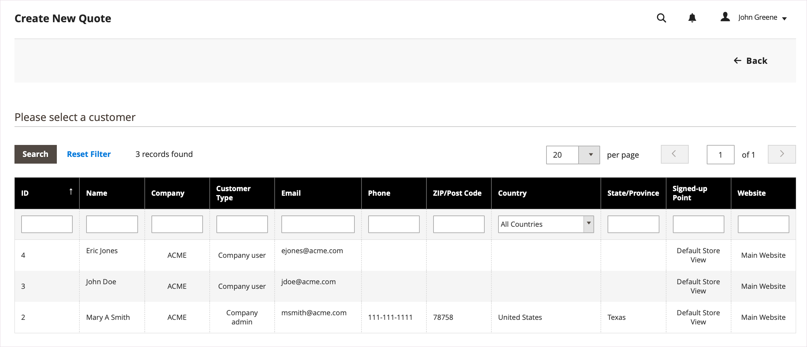
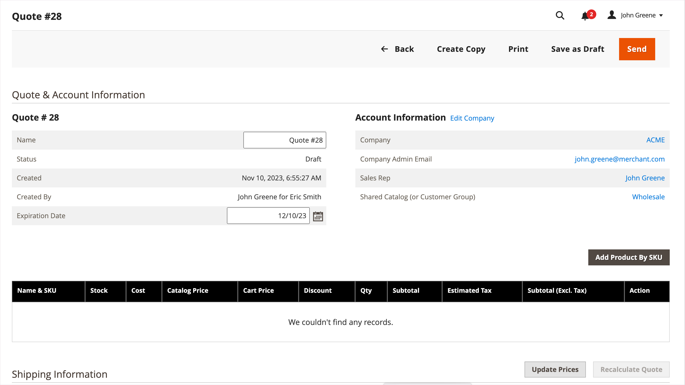
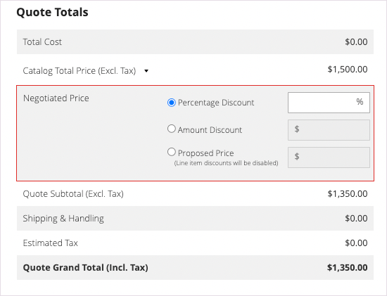

# 購入者に対する見積の開始

[販売機能の設定](configure-quotes.md)で見積もりが有効になっている場合、営業担当者は、管理者から見積もりを作成して、会社の購入者との交渉プロセスを開始できます。

- ドラフト見積は、販売者にのみ表示されます。
- 見積もりのドラフトは、営業担当者が購入者の最初のオファーを作成するために商品、関連する割引、メモを追加するまで送信できません。
- 販売者は、見積もりまたは顧客グリッドから見積もりを作成できます。

営業担当者は、見積を購入者に送信して、交渉プロセスを開始します。 [見積の交渉](quote-price-negotiation.md)を参照してください。

## 営業担当者の見積もり作成エクスペリエンス

営業担当者は、「見積」または「顧客グリッド」から見積を作成できます。

>[!NOTE]
>
>購入者の見積もりを作成する販売者のデモ動画については、[営業担当者が&#x200B;_Commerceのビデオとチュートリアル_&#x200B;で見積もりを開始](https://experienceleague.adobe.com/docs/commerce-learn/tutorials/b2b/b2b-quote/sales-rep-initiates-quote.html?lang=ja)するを参照してください。

### 見積グリッドから見積を作成する

1. 営業担当者は、[営業業務権限](../systems/permissions.md)を持つ管理者として管理者にログインして、見積もりを管理します。

1. 管理者で、**[!UICONTROL Sales]**&#x200B;を選択して[!UICONTROL Quotes] グリッドに移動し、**[!UICONTROL Quotes]**&#x200B;を選択します。

1. 購入者の見積もりを作成。

   - 見積グリッドから、**[!UICONTROL Create New Quote]**&#x200B;を選択します。

     {width="700" zoomable="yes"}

   - [!UICONTROL Create New Quote] ページで、見積もりを作成する顧客（会社バイヤー）を選択します。

     {width="700" zoomable="yes"}

     新しい見積もりが`Draft` ステータスで表示されます。

     {width="700" zoomable="yes"}

   - 必要に応じて、見積書名を更新し、有効期限を変更します。

   - 見積もりをドラフトとして保存します。

## バイヤーの見積もりの準備

見積もりを作成したら、商品アイテムを追加し、割引を適用し、コメントや関連ファイルを見積もりに追加して、購入者とコミュニケーションを取ります。 見積もりをレビュー用にバイヤーに送信するか、ドラフトとして保存します。

1. **[!UICONTROL Add Product By SKU]**&#x200B;を選択して、見積に項目を追加します。 SKU番号と数量を入力し、**[!UICONTROL Add Product]**&#x200B;を選択します。

   {width="675" zoomable="yes"}

1. 必要に応じて、商品に行項目の割引を適用します。

   - [!UICONTROL Select] アクションメニューから、**[!UICONTROL Discount Item]**&#x200B;を選択します。

   - [!UICONTROL Discount Line item] フォームで、**[!UICONTROL Discount Type]**&#x200B;を選択します。

     {width="675" zoomable="yes"}

   - [!UICONTROL Discount] フィールドに、割引タイプの値を入力します。 例えば、割引率を選択した場合は、「10」と入力して、行項目に10%の割引を適用します。

   - オプションで、見積レベルで適用される割引によって製品価格がさらに引き下げられないように、行項目の割引値をロックします。

     変更を確認すると、製品グリッドの行項目属性が更新され、適用された割引金額が表示されます。 割引がロックされている場合は、ロックアイコンが表示されます。

   営業担当者は、見積の特定の品目から割引を要求できます。

   >[!NOTE]
   >
   >行項目での割引の仕組みに関するデモ動画については、_Commerceのビデオとチュートリアル_&#x200B;の[営業担当者が見積もり行項目](https://experienceleague.adobe.com/docs/commerce-learn/tutorials/b2b/b2b-quote/quote-line-item-discount.html?lang=ja)に割引を適用するを参照してください。

1. 必要に応じて見積もりレベルの割引を適用します。

   - [!UICONTROL Quote Totals - Negotiated Price] セクションで、割引タイプを選択し、適用する値を入力します。

     {width="700" zoomable="yes"}

   商品グリッドが更新され、割引が表示されます。

1. 購入者の追加情報を追加します。

   「**[!UICONTROL Negotiation - Comments]**」タブで、メモを追加し、購入者に必要なサポートファイルを添付します。

   {width="700" zoomable="yes"}

   デフォルトでは、[添付ファイル &#x200B;](configure-quotes.md)は、DOC、DOCX、XLS、XLSX、PDF、TXT、JPGまたはJPEG、PNGのいずれかのファイル形式で、最大2 MBです。

1. 交渉中に配送先住所を追加します。

   購入者が見積もりに配送先住所を追加すると、営業担当者は配送と配送を選択できます。

   配送オプションはチェックアウト時にロックされます。

   詳細については、[引用符](account-dashboard-my-quotes.md#adding-a-shipping-address)を参照してください。

1. 見積もりを処理。

   見積もりを下書きとして保存するか、購入者に送信します。

   - 見積を下書きとして保存すると、ステータスが`Draft`に更新され、確認メッセージが表示されます。

   - 見積もりを購入者に送信すると、ステータスが`Submitted`に変わります。 バイヤーは、見積もりをレビューするための通知を電子メールで受信します。 見積もりは、購入者がそれ以上の交渉のために返品するまでロックされます。 販売者は、見積グリッドまたは顧客グリッドから見積を表示できます。

## 顧客グリッドからの見積の表示と作成

1. 管理者で、**[!UICONTROL Customers]**&#x200B;を選択して[!UICONTROL Customer] グリッドに移動し、**[!UICONTROL All Customers]**&#x200B;を選択します。

1. 会社バイヤーの顧客IDを選択します。

   {width="700" zoomable="yes"}

1. 顧客情報を表示するには、**[!UICONTROL Edit]**&#x200B;を選択します。

1. 「**[!UICONTROL Create Quote]**」を選択し、プロセスに従って顧客の見積もりを作成し、見積もりを更新して顧客に送信します。

1. **[!UICONTROL Quotes]**&#x200B;を選択して、既存の見積もりを顧客に表示します。

   {width="700" zoomable="yes"}

1. **[!UICONTROL View]**&#x200B;を選択して見積を開きます。

見積もり交渉プロセスの管理について詳しくは、[見積の交渉](quote-price-negotiation.md)を参照してください
