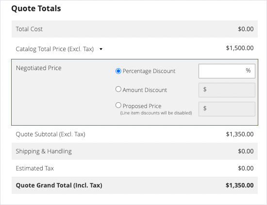

# 購入者の見積もりの開始

見積もりが [セールス機能の設定](configure-quotes.md)の場合、セールス担当者は、管理者から見積書を作成することで、会社の購入者とのネゴシエーションプロセスを開始できます。

- 下書き引用符は、販売者に対してのみ表示されます。
- 下書き見積もりは、販売担当者が商品、関連する割引、メモを追加して購入者に最初のオファーを作成するまで送信できません。
- 販売者は、見積もりまたは顧客グリッドから見積もりを作成できます。

営業担当が見積を購買担当に送信し、ネゴシエーション・プロセスを開始します。 詳しくは、 [見積もりの交渉](quote-price-negotiation.md).

## セールス担当者の見積もり作成エクスペリエンス

セールス担当者は、見積もりまたは顧客グリッドから見積もりを作成できます。

>[!NOTE]
>
>販売者が買い手の見積もりを作成するビデオデモについては、 [セールス担当者が見積もりを開始します](https://experienceleague.adobe.com/docs/commerce-learn/tutorials/b2b/b2b-quote/sales-rep-initiates-quote.html) in _コマースのビデオとTutorials_.

### 見積もりグリッドから見積もりを作成します

1. セールス担当者は、管理者として管理者にログインします。 [営業運営権限](../systems/permissions.md) をクリックして引用符を管理します。

1. 管理者で、 [!UICONTROL Quotes] 選択によるグリッド **[!UICONTROL Sales]**&#x200B;を選択し、 **[!UICONTROL Quotes]**.

1. 購入者の見積もりを作成します。

   - 「引用符」グリッドで、「 **[!UICONTROL Create New Quote]**.

     {width="700" zoomable="yes"}

   - 次の日： [!UICONTROL Create New Quote] 「 」ページで、顧客（会社の購入者）を選択して見積もりを作成します。

     {width="700" zoomable="yes"}

     新しい見積もりが `Draft` ステータス。

     {width="700" zoomable="yes"}

   - 見積もり名を更新し、必要に応じて有効期限を変更します。

   - 見積もりを下書きとして保存します。

## 購入者の見積もりを準備します

下書きの見積もりを作成した後、製品項目を追加し、割引を適用し、見積もりにコメントと関連ファイルを追加して、購入者と連絡を取ります。 次に、見積もりを購入者にレビュー用に送信するか、下書きとして保存します。

1. 「 」を選択して見積もりに品目を追加します **[!UICONTROL Add Product By SKU]**. SKU 番号と数量を入力し、「 」を選択します。 **[!UICONTROL Add Product]**.

   {width="675" zoomable="yes"}

1. 必要に応じて、製品に品目割引を適用します。

   - 次から： [!UICONTROL Select] アクションメニュー：選択 **[!UICONTROL Discount Item]**.

   - 次の日： [!UICONTROL Discount Line item] フォームで、 **[!UICONTROL Discount Type]**.

     {width="675" zoomable="yes"}

   - Adobe Analytics の [!UICONTROL Discount] 「 」フィールドで、割引タイプの値を入力します。 たとえば、割引率を選択した場合は、10 と入力して、行項目に 10%の割引を適用します。

   - [!BADGE 1.5.0 — ベータ版機能]{type=Informative url="/help/b2b/release-notes.md" tooltip="ベータ版プログラム参加者のみ利用可能"}

     変更を確認した後、製品グリッドの行項目属性が更新され、適用された割引額が表示されます。 割引がロックされている場合は、ロックアイコンが表示されます。

1. 必要に応じて、見積もりレベルの割引を適用します。

   - Adobe Analytics の [!UICONTROL Quote Totals - Negotiated Price] 「 」セクションで、割引タイプを選択し、適用する値を入力します。

     {width="700" zoomable="yes"}

   製品グリッドが更新され、割引が表示されます。

1. 購入者の追加情報を追加します。

   次の日： **[!UICONTROL Negotiation - Comments]** 「 」タブで、メモを追加し、購入者に必要なサポートファイルを添付します。

   {width="700" zoomable="yes"}

   デフォルトでは、 [添付ファイル](configure-quotes.md) は、DOC、DOCX、XLS、XLSX、PDF、TXT、JPGまたはJPEG、PNG のいずれかのファイル形式で、最大 2 MB まで設定できます。

1. 見積もりを処理します。

   見積もりを下書きとして保存するか、購入者に送信します。

   - 見積もりを下書きとして保存すると、ステータスは次のように更新されます： `Draft` と入力し、確認メッセージが表示されます。

   - 見積もりを購入者に送信すると、ステータスは「 」に変わります。 `Submitted`. 購入者は、見積もりを確認するための電子メール通知を受け取ります。 見積もりは、購入者が後でネゴシエーションを行うために返すまでロックされます。 販売者は、Quote グリッドまたは Customer グリッドから見積もりを表示できます。

## 顧客グリッドから見積もりを表示および作成

1. 管理者で、 [!UICONTROL Customer] 選択によるグリッド **[!UICONTROL Customers]**&#x200B;を選択し、 **[!UICONTROL All Customers]**.

1. 会社の購入者の顧客 ID を選択します。

   {width="700" zoomable="yes"}

1. 選択 **[!UICONTROL Edit]** 顧客情報を表示します。

1. 顧客の見積もりを作成するには、次を選択します。 **[!UICONTROL Create Quote]** 下書きの見積もりを更新し、顧客に送信するプロセスに従います。

1. 「 」を選択して、既存の見積もりを表示します **[!UICONTROL Quotes]**.

   {width="700" zoomable="yes"}

1. 「 」を選択して見積を開きます **[!UICONTROL View]**.

見積ネゴシエーション・プロセスの管理の詳細は、 [見積もりの交渉](quote-price-negotiation.md)
