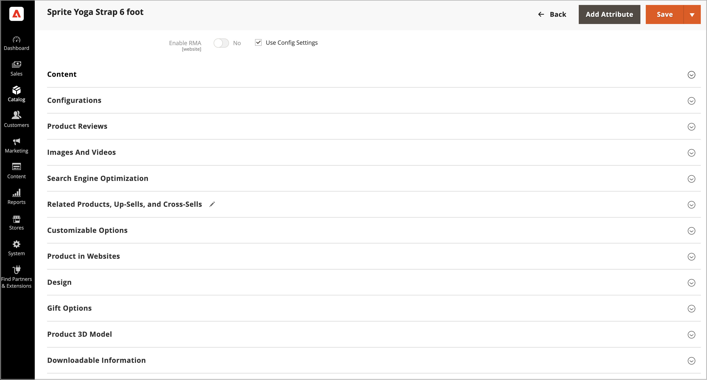

# Adobe Commerce用[!DNL AR Viewer]を使用した商品3D モデルの管理

製品ごとに、AR モデルと3D モデルを製品リストで使用できるように`.USDZ` ファイルをアップロードできます。

[!DNL AR Viewer]は`.USDZ`個のファイルのみをサポートしています。

## 拡張機能のインストール

[!DNL AR Viewer]は、[Adobe Commerce Marketplace](https://commercemarketplace.adobe.com/magento-module-arviewer.html){target=_blank}の拡張機能としてインストールされています。

拡張機能のインストールプロセスについて詳しくは、[_インストールガイド_](https://experienceleague.adobe.com/docs/commerce-operations/installation-guide/tutorials/extensions.html)を参照してください。

[!DNL AR Viewer]拡張機能をインストールして設定した後、管理者ユーザーは3D モデルを含めるように製品リストを設定、カスタマイズ、管理できます。

## 3D モデルを追加

1. 製品を編集モードで開きます。

1. 特定のストアビューで作業するには、**[!UICONTROL Store View]**&#x200B;選択範囲を該当するビューに設定します。

   >[!NOTE]
   >
   >新しい製品3D モデルは、`All Store Views` スコープがアップロードに使用されていない場合でも、_常に_ アップロードされ、_すべて_&#x200B;のストアビューに表示されます。   特定のストアビューから商品3D モデルを非表示にするには、そのストアビューに切り替え、3D モデルの&#x200B;**[!UICONTROL Hide from Product Page]** チェックボックスを選択して、**[!UICONTROL Save]**&#x200B;をクリックする必要があります。

1. 下にスクロールして、_[!UICONTROL Product 3D Model]_&#x200B;セクションを展開します。

   {width="700" zoomable="yes"}

1. 製品の3D モデル （`.USDZ` ファイル）を追加します。

1. **[!UICONTROL Save]**&#x200B;をクリックします。

### 3D モデルを削除

製品の詳細から3D モデルを削除するには：

1. **[!UICONTROL Delete]**&#x200B;をクリックします。

1. **[!UICONTROL Save]**&#x200B;をクリックします。

## 製品の3D モデルの表示

製品の詳細が3D モデルで更新された場合：

1. [!DNL AR Viewer]は、AR ファイルをエンコードする製品説明にQR コードを生成します。

1. 顧客は商品ページでこのQR コードを見ることができます。

1. 顧客がモバイルデバイスでQR コードをスキャンすると、AR体験がモバイルデバイスでレンダリングされます。

>[!NOTE]
>
> 3d モデルを製品に追加するユーザーの一連のデモ動画については、_Commerce ビデオとチュートリアル_&#x200B;の[AR Viewer for Adobe Commerce](https://experienceleague.adobe.com/docs/commerce-learn/tutorials/catalog/augmented-reality.html) ページを参照してください。

